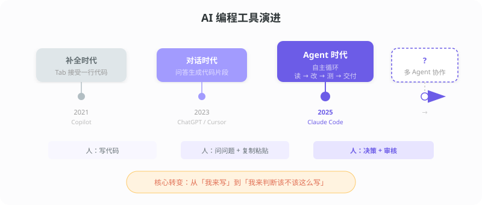
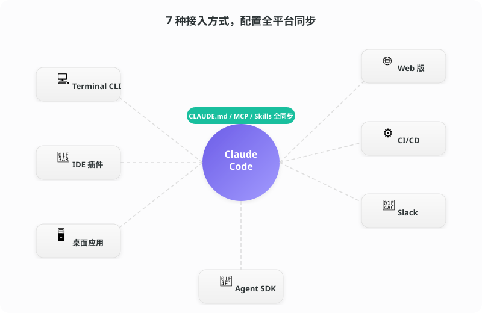
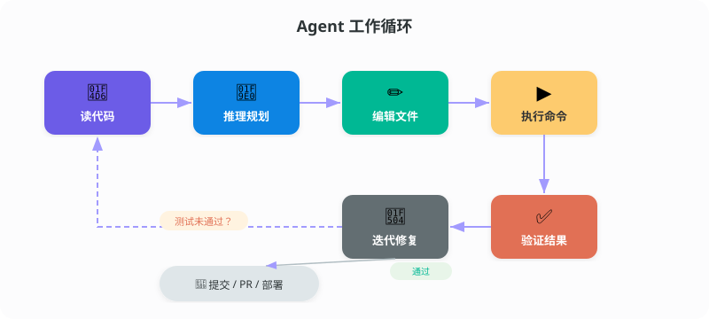
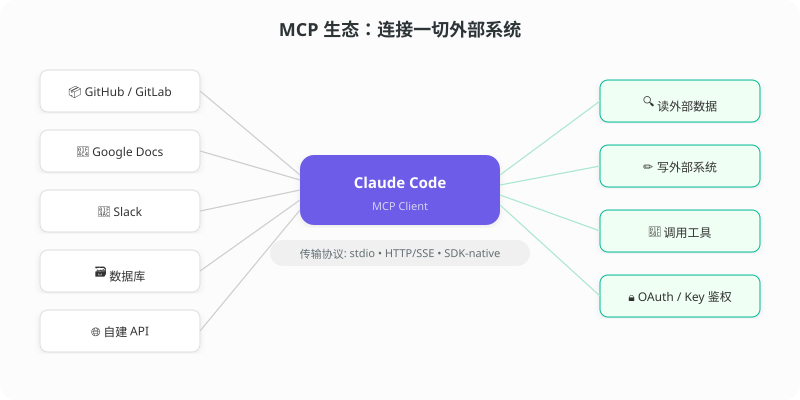
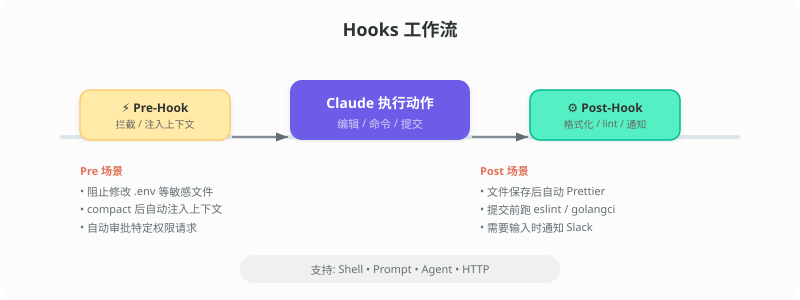
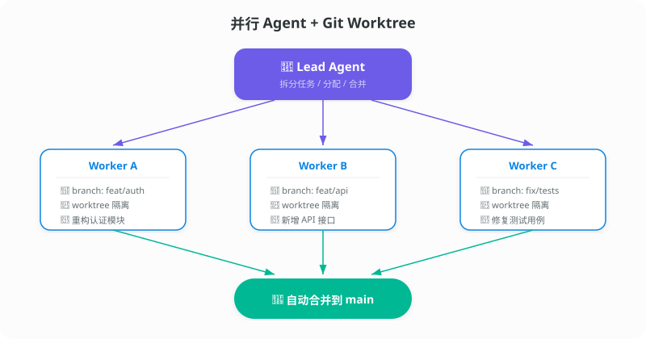
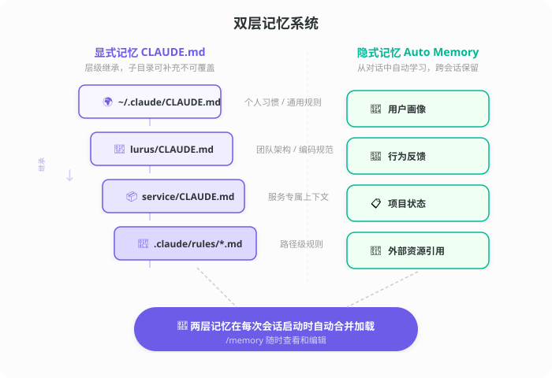
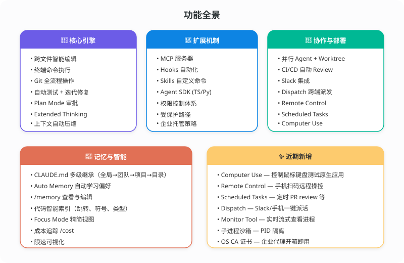
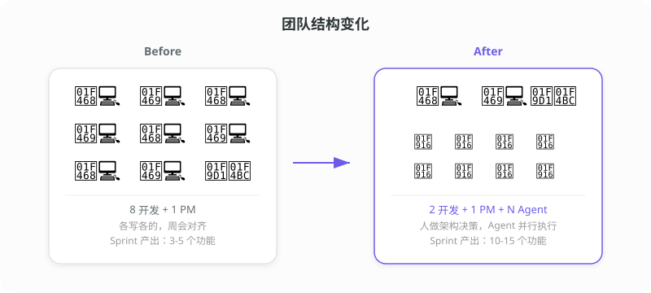

# Claude Code 功能全景

> 一个跑在终端里的 AI 工程师。读代码、改代码、跑测试、提 PR，一条龙。

---

## 先说一个场景

周五下午四点。产品经理在群里发了一张图："这个页面的筛选逻辑改一下，加三个维度，下周一用。"

你点开代码，涉及 6 个文件。前端过滤逻辑、后端接口、数据库查询、单元测试、API 文档、还有一个该死的 migration。

以前你会叹口气，开始一个个文件改。

现在你打开终端，把需求丢给 Claude Code。它读完相关代码，问了你两个边界问题，然后开始自己改。跑测试，有两个没过，自己修。十五分钟后给你一个 PR。

你 review 了一下，合并。

下班。

**你有过类似的时刻吗？或者你还在那个叹气的阶段？**

---

## 从补全到 Agent：我们走到哪了



2021 年，Copilot 教会了大家按 Tab。

2023 年，ChatGPT 和 Cursor 教会了大家把代码贴进去问。

2025 年，Agent 开始自己跑循环了。

三个阶段，人的角色在变：写代码 → 复制粘贴 → 做决策和审核。

这不是谁好谁差的问题。补全工具没有消失，对话工具也还在用。但你会发现，**你的时间越来越多花在"要不要这样做"上，而不是"这行代码怎么写"上**。

---

## 去哪儿用



七个入口，同一套配置。

| 入口 | 一句话 |
|------|--------|
| **Terminal CLI** | 功能最全，脚本自动化首选 |
| **VS Code / JetBrains** | 内联 diff，选中代码直接对话 |
| **桌面应用** | 多会话并排，可视化操作 |
| **Web 版** (claude.ai/code) | 浏览器打开就用，手机也行 |
| **CI/CD** | GitHub Actions 里自动 review、修 PR |
| **Slack** | 群里 @Claude，派任务收 PR |
| **Agent SDK** | TypeScript / Python，嵌入你自己的产品 |

你在终端设的 CLAUDE.md、MCP、Skills——桌面、Web、IDE 全部生效。

---

## 怎么干活



六步循环，测试不过就自己修，直到绿灯亮。

跨文件编辑、终端命令执行、Git 全流程——都在循环里。遇到复杂改动可以开 **Plan Mode**，它先出方案你审批，再动手。

---

## MCP：让它看到代码之外的世界



Model Context Protocol——标准化的外部系统连接协议。

官方开箱即用：GitHub、GitLab、Google Docs、Slack。自建也简单：写个 MCP Server，把内部 API、数据库、文档系统全接进来。

它读你的设计文档、查你的 Issue、翻你的 Slack 记录，然后综合上下文干活。

**说句题外话**——MCP 可能是今年最值得关注的协议之一。它在做的事情类似于 HTTP 之于网页：给 AI 和外部世界之间定义一种通用语言。现在已经有几百个社区 MCP Server 了。如果你是做基础设施或者平台的，这件事值得早布局。

---

## Hooks：给动作装触发器



在 Claude 执行动作的前后插入自定义逻辑。四种类型：Shell、Prompt、Agent、HTTP。

典型用法：
- 编辑文件 → 自动 Prettier
- 提交代码 → 自动 lint
- 碰 `.env` → 直接拦截

---

## Skills：团队命令库

把重复操作封装成斜杠命令，团队共享。

```
/review-pr     → Code Review
/deploy-stg    → 部署测试环境
/security      → 安全扫描
```

创建：`claude /skills add <name>`，支持参数和模板。

新人来了，跑一遍 Skills 列表就知道团队怎么干活。

---

## 并行 Agent：一个人当一个团队



基于 Git Worktree 的分支隔离。Lead Agent 拆任务，Worker Agent 各干各的，干完自动合并。

大规模重构、批量迁移、多模块改造——并发推进。

---

## 记忆系统：越用越懂你



两层记忆，各司其职。

**CLAUDE.md**（显式）——全局 → 团队 → 项目 → 目录，四级继承。写进去的规则每次启动自动加载。

**Auto Memory**（隐式）——从对话中自动提取偏好和上下文。跨会话保留，`/memory` 随时查看。

**一个体感**：用了一周之后，你会明显感觉它"更懂了"。你不用再重复说"我们项目用 Bun 不用 npm"、"测试要跑 race detector"。它记住了。

---

## 功能速查



---

## 近期新功能速览

| 功能 | 说明 |
|------|------|
| **Computer Use** | 控制鼠标键盘，测试桌面应用 |
| **Remote Control** | 扫码远程操控，手机指挥 AI |
| **Scheduled Tasks** | 定时任务，每天早上自动 review |
| **Dispatch** | Slack / 手机派活，桌面端接收执行 |
| **Focus Mode** `Ctrl+O` | 精简视图，只看关键信息 |
| **Monitor Tool** | 实时流式查看后台进程 |
| **子进程沙箱** | PID 级别隔离 |
| **限速可视化** | 触发了什么限制、何时恢复，一目了然 |

---

## 常用快捷操作

```
/cost          查看 token 用量和费用
/compact       压缩对话历史，释放上下文
/memory        查看和编辑记忆
Ctrl+O         Focus Mode 切换
```

管道组合：
```bash
tail -f app.log | claude "分析这些日志里的异常"
cat schema.sql  | claude "帮我写迁移脚本"
```

---

## 对团队意味着什么



这张图画得有点绝对，但方向是对的。

以前一个功能需要 3 个人写一周。现在 1 个人配几个 Agent 可能两天搞定。人数没变，产出翻了。或者反过来——产出没变，但团队从 8 个人缩到了 3 个。

**但更真实的变化在角色上。**

资深工程师的时间从"写代码"转向"定方向、审代码、做架构判断"。这本来就是他们最该花时间的地方，只是以前被大量实现细节占满了。

初级工程师呢？好消息是学习曲线变平了——有 AI 结对，上手快很多。但坏消息是，如果只会"照着需求写代码"这一件事，可替代性确实在增加。

**你觉得你的团队属于哪种状态？已经在用 Agent 了，还是还在观望？**

---

## 三个趋势判断

**1. Agent 能力的天花板是上下文，不是智力**

模型已经够聪明了。现在的瓶颈是：它能看到多少信息、记住多少东西、连接多少系统。MCP、记忆系统、并行 Agent——全是在解这个问题。

**2. "提示词工程师"会消失，"AI 系统工程师"会出现**

写 prompt 是过渡态。真正有壁垒的是：设计 Agent 工作流、编排多 Agent 协作、管理 AI 产出质量。这是系统工程，不是话术。

**3. 开发者工具赛道正在重新洗牌**

IDE、CI/CD、项目管理、代码审查——这些原本各自独立的品类正在被 Agent 打穿。一个 Agent 能同时完成编码、测试、review、发布。工具链的边界在模糊。

**你押注哪个方向？**

---

## 写在最后

工具在变，但有些东西没变。

好的工程判断力、对产品的理解、在复杂系统里做取舍的能力——这些 Agent 做不了。它能帮你把想法落地得更快，但"想什么"还是你的事。

如果你已经在用 Claude Code，欢迎在评论区聊聊你的工作流是怎么搭的。

如果还没用过，找一个周五下午，拿一个改了很久没改完的需求试一次。你会有感觉的。

---

*图片均为 SVG 矢量格式，位于 `article/images/` 目录。公众号发布时导出为 PNG 即可。*
