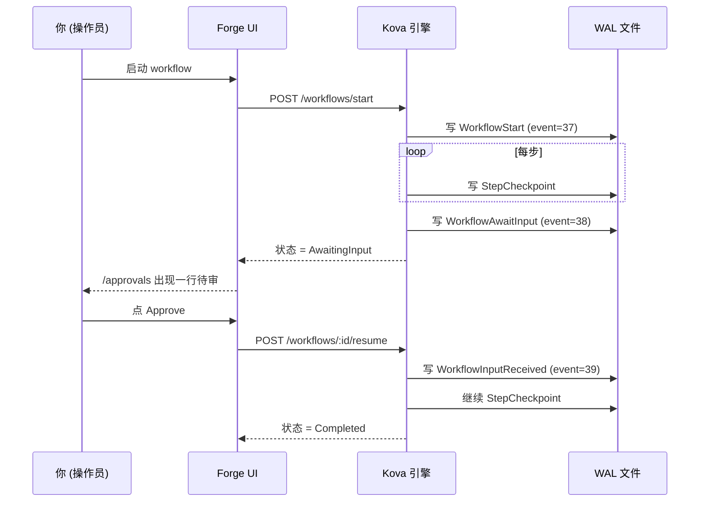

# Forge Getting Started <StatusBadge status="beta" />

Run your first AI Agent workflow in 5 minutes. This guide pairs with the Beta invite — registering grants you a sample dataset / rubric / workflow, so following these 5 steps gives you a feel for what Forge looks like.

  <Icon name="users" :size="18" />
  

    
Beta Scope

    
This is currently an invite-only private beta with 10-15 early users. For trial feedback, see <a href="#§5-遇到问题怎么办">§5 What to Do When You Hit a Problem</a> at the end of this guide.

  

---

## §1 Meet Forge in 30 Seconds

The AI Agent workbench: **draw / run / evaluate** Agent workflows in your browser, with **automatic crash resume that never re-spends LLM tokens**.

  

    <Icon name="history" :size="20" />
    
WAL-first durable execution

    
Powered by <a href="/en/kova/">Kova</a> (the Rust durable execution engine, crash recovery — not checkpointing, every LLM Directive is persisted to disk).

  

  

    <Icon name="package" :size="20" />
    
Zero external dependencies

    
A single runtime binary + a single WAL file, no Kafka / Redis / Cassandra required.

  

  

    <Icon name="shuffle" :size="20" />
    
OpenAI-compatible gateway

    
LLMs go through the <a href="https://newapi.lurus.cn">newapi gateway</a>, switchable across OpenAI / Anthropic / DeepSeek / Tongyi / GLM.

  

  

    <Icon name="shield-check" :size="20" />
    
Every step auditable

    
Every step and human approval signature is persisted to disk, meeting EU AI Act + GB/T compliance requirements.

  

---

## §2 Run Your First Workflow

::: tip Prerequisites
You have received a Beta invite and completed registration and login at `forge.lurus.cn`.
:::

<ol class="lurus-steps">
<li>

Open [`/workflows/runs`](https://forge.lurus.cn/workflows/runs) and click **"Start New Run"**.

</li>
<li>

Choose the seed `classify_then_route_v1`, type Chinese into the input box (e.g. `今天上海天气怎么样`), and click **Start**.

</li>
<li>

The page redirects to `/workflows/runs/[id]`, and the timeline cards refresh in real time (`passthrough → llm_call → branch → leaf`, four steps). **Expect &lt; 30 seconds** (when newapi.lurus.cn is online).

</li>
</ol>

  <Icon name="alert-circle" :size="18" />
  

    
LLM slow / failed

    
When the LLM times out / fails, the run status changes to <code>failed</code> and shows the error — this is Kova WAL crash recovery at work, and you can later resume without re-running the earlier steps.

  

---

## §3 Mid-Workflow Approval Node (HITL)

When a workflow contains an `await_input` step (such as the "request approval before high-risk operations" template):

<ol class="lurus-steps">
<li>

It pauses when it reaches that step, and the status changes to `AwaitingInput`.

</li>
<li>

[`/approvals`](https://forge.lurus.cn/approvals) shows a pending row (the title is that step's prompt).

</li>
<li>

Click **"Review"**, choose Approve / Reject / Edit and submit, and the workflow resumes automatically.

</li>
</ol>

The approval decision is written into the WAL and is **permanently traceable**; refreshing / closing the tab does not lose state.

---

## §4 Score (Eval) a Run

<ol class="lurus-steps">
<li>

Open [`/eval`](https://forge.lurus.cn/eval) → the **Rubrics** tab, and choose the seed `Sample rubric (PII)` or build your own.

</li>
<li>

Switch to **Runs** and associate the `workflow_id` you just finished running.

</li>
<li>

Click **Score**; the scorer runs in the background, and you see each criterion's score + explanation.

</li>
</ol>

**Available scorer types**

| Type | Purpose | Configuration |
|---|---|---|
| `pii_regex` | Detect whether the LLM output leaks ID numbers / phone numbers / emails | Write a regex pattern |
| `json_schema` | Check the output conforms to a JSON schema (structured generation scenarios) | Paste a JSON schema |
| `llm_as_judge` | Have another LLM score the main LLM's output | Write a judge prompt + pick a model + temperature |
| `semantic_similarity` | (WIP, not yet available — the embedding service is still being built) | — |

---

## §5 What to Do When You Hit a Problem

The workflow stays Running and never moves?

It's most likely an LLM gateway timeout (30 s). Check the last step on the `/workflows/runs/[id]` timeline cards; if it's `llm_call`, wait or cancel the run and retry.

403 You do not have permission?

You are trying to act on someone else's approval. Only the originator themselves or someone in the same `tenant_id` can decide — find the originator.

404 Approval not found?

The approval has been canceled or is in a terminal state. Confirm with the originator; terminal states cannot be changed.

<code>/workflows/runs</code> keeps loading?

`kova_proxy` can't reach kova-rest. Check [`/api/health`](https://forge.lurus.cn/api/health) and see whether the second segment, `kova_rest`, is ok.

Chinese shows as garbled text / not translated?

An i18n key is missing. Send feedback + a screenshot (see [§6 Feedback](#§6-反馈)).

---

## §6 Feedback {#§6-反馈}

Found a bug, want a new feature, or want a 30-minute chat with us about your use case:

  

    <Icon name="pen-tool" :size="20" />
    
Typeform form

    
Embedded at the bottom of the <code>/settings</code> page — fills out in 30 seconds, fastest for external users.

  

  

    <Icon name="messages-square" :size="20" />
    
Discord

    
Invite link is in the footer, the first choice for developer-facing users.

  

  

    <Icon name="mail" :size="20" />
    
Email

    
<code>forge-beta@lurus.cn</code>, with a reply SLA within 24h.

  

During the Beta, all feedback goes straight into the roadmap. We look forward to your use.

---

<NextSteps
  title="Next Steps"
  :steps="[
    { text: 'Forge intro page — its place within the Lurus platform', link: '/en/forge/', primary: true },
    { text: 'Kova engine docs — details of the underlying durable execution engine', link: '/en/kova/' },
    { text: 'Forge Roadmap — what we are building next', link: '/en/forge/roadmap' },
  ]"
/>

---

*Last updated: 2026-05-12 | Companion Beta invite playbook: `2b-bs-forge/docs/beta-invite-playbook.md`*

