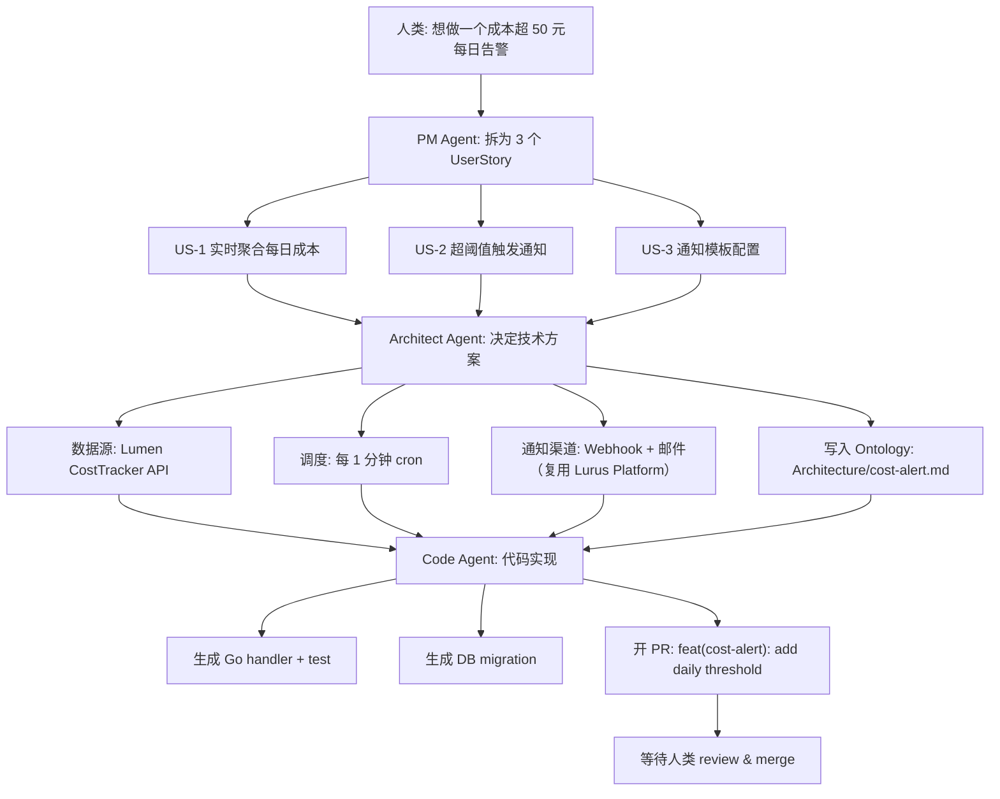

<div class="forge-sess-page">

# Session Workflow <StatusBadge status="beta" />

A Session is the second core data model in Forge. Every product discussion is captured in a Session, holding the full timeline of conversation, decisions, and Agent outputs.

<div class="lurus-callout lurus-callout--key">
  <span class="lurus-callout__icon"><Icon name="messages-square" :size="18" /></span>
  <div>
    <p class="lurus-callout__title">How Sessions relate to the Ontology</p>
    <div class="lurus-callout__body">A Session is the <strong>dynamic</strong> timeline; the <a href="/en/forge/ontology">Ontology</a> is the <strong>static</strong> structured knowledge. Decisions made in a Session are written into / modify Ontology nodes.</div>
  </div>
</div>

## Session Model

```
Session {
  id            // sess_...
  title         // "添加成本告警"
  participants  // [人类, PM Agent, Architect Agent, Code Agent]
  ontology      // 关联的 Ontology 节点列表
  turns         // 对话轮次
  artifacts     // 产出物：PRD、ADR、PR 链接
  status        // active / paused / shipped
}
```

---

<div class="lurus-section-head">
  <span class="lurus-section-head__eyebrow"><Icon name="bot" :size="14" /> Roles</span>
  <h2 class="lurus-section-head__title">Three Kinds of Agents</h2>
  <p class="lurus-section-head__lede">From a vague requirement to a merged PR, three kinds of Agents collaborate in a relay.</p>
</div>

<div class="lurus-cards lurus-cards--compact">
  <div class="lurus-card lurus-card--forge">
    <span class="lurus-card__icon"><Icon name="briefcase" :size="20" /></span>
    <div class="lurus-card__title">PM Agent</div>
    <p class="lurus-card__body">Breaks down vague requirements into user stories, acceptance criteria, and priorities.</p>
  </div>
  <div class="lurus-card lurus-card--forge">
    <span class="lurus-card__icon"><Icon name="network" :size="20" /></span>
    <div class="lurus-card__title">Architect Agent</div>
    <p class="lurus-card__body">Architecture modeling, technology selection, and risk identification; writes into the Ontology <code>Architecture</code> subtree.</p>
  </div>
  <div class="lurus-card lurus-card--forge">
    <span class="lurus-card__icon"><Icon name="code" :size="20" /></span>
    <div class="lurus-card__title">Code Agent</div>
    <p class="lurus-card__body">Writes code, runs tests, and opens a PR based on the outputs of the previous two.</p>
  </div>
</div>

---

<div class="lurus-section-head">
  <span class="lurus-section-head__eyebrow"><Icon name="workflow" :size="14" /> End-to-end</span>
  <h2 class="lurus-section-head__title">The Full Flow from 0 to PR</h2>
</div>



---

<div class="lurus-section-head">
  <span class="lurus-section-head__eyebrow"><Icon name="history" :size="14" /> Traceable</span>
  <h2 class="lurus-section-head__title">WAL Decision Traceability</h2>
</div>

Built on the WAL of the [Kova](/en/kova/) engine, every step of conversation and decision is persisted. At any time you can:

<div class="lurus-cards lurus-cards--compact">
  <div class="lurus-card lurus-card--forge">
    <span class="lurus-card__icon"><Icon name="search" :size="20" /></span>
    <p class="lurus-card__body">Trace back "why NATS was chosen over Redis Streams"</p>
  </div>
  <div class="lurus-card lurus-card--forge">
    <span class="lurus-card__icon"><Icon name="filter" :size="20" /></span>
    <p class="lurus-card__body">Pinpoint "which Session last wrote to <code>Architecture/auth.md</code>"</p>
  </div>
  <div class="lurus-card lurus-card--forge">
    <span class="lurus-card__icon"><Icon name="rewind" :size="20" /></span>
    <p class="lurus-card__body">Replay an entire Session for a retrospective</p>
  </div>
</div>

---

## Next Steps

<NextSteps :steps="[
  { text: 'Deep Dive into Ontology', link: '/en/forge/ontology', primary: true },
  { text: 'Roadmap', link: '/en/forge/roadmap' },
  { text: 'Kova Engine', link: '/en/kova/' },
]" />

</div>
