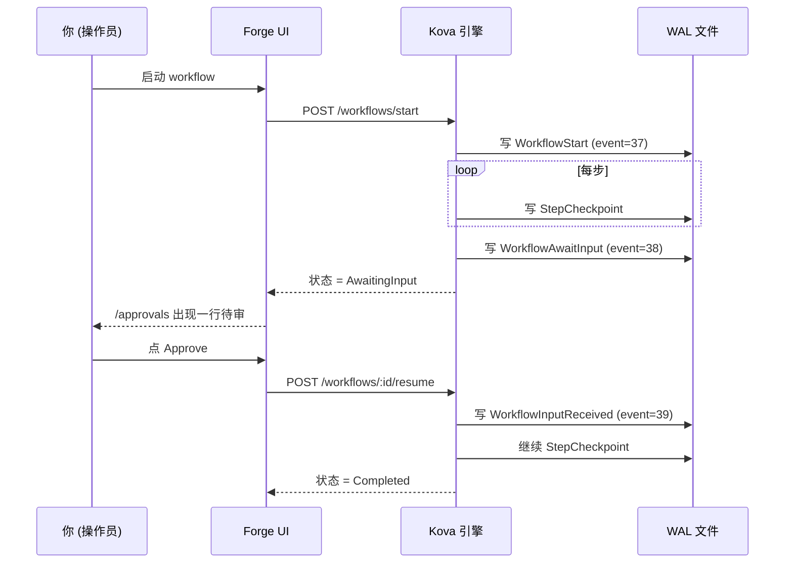

# Introducción rápida a Forge <StatusBadge status="beta" />

Ejecuta tu primer workflow de AI Agent en 5 minutos. Este artículo acompaña la invitación Beta: al registrarte recibes un dataset / rubric / workflow de ejemplo; sigue los 5 pasos de principio a fin y sabrás cómo es Forge.

  <Icon name="users" :size="18" />
  

    
Alcance de la Beta

    
Actualmente es una prueba interna por invitación, con 10-15 usuarios tempranos. Para enviar comentarios de la prueba, consulta al final de este artículo <a href="#§5-遇到问题怎么办">§5 Qué hacer si tienes problemas</a>.

  

---

## §1 Conoce Forge en 30 segundos

Banco de trabajo de AI Agent: **diseña / ejecuta / evalúa** workflows de Agent desde el navegador, **con reanudación automática tras fallos y sin gastar tokens de LLM por duplicado**.

  

    <Icon name="history" :size="20" />
    
Ejecución persistente WAL-first

    
En la base, <a href="/es/kova/">Kova</a> (motor de ejecución persistente en Rust, con recuperación ante fallos: no son checkpoints, cada LLM Directive se escribe en disco).

  

  

    <Icon name="package" :size="20" />
    
Cero dependencias externas

    
El runtime es un único binario + un único archivo WAL, sin necesidad de Kafka / Redis / Cassandra.

  

  

    <Icon name="shuffle" :size="20" />
    
Gateway compatible con OpenAI

    
El LLM pasa por el <a href="https://newapi.lurus.cn">gateway newapi</a> y puede cambiar entre OpenAI / Anthropic / DeepSeek / Tongyi / GLM.

  

  

    <Icon name="shield-check" :size="20" />
    
Auditable en cada paso

    
Cada paso y cada firma de aprobación manual se escriben en disco, cumpliendo con la EU AI Act + GB/T (innovación tecnológica autóctona).

  

---

## §2 Ejecuta tu primer workflow

::: tip Requisitos previos
Haber recibido la invitación Beta y haber completado el registro e inicio de sesión en `forge.lurus.cn`.
:::

<ol class="lurus-steps">
<li>

Abre [`/workflows/runs`](https://forge.lurus.cn/workflows/runs) y haz clic en **"Iniciar nuevo run"**.

</li>
<li>

Elige el seed `classify_then_route_v1`, escribe en chino en el campo de entrada (por ejemplo `今天上海天气怎么样`) y haz clic en **Start**.

</li>
<li>

La página redirige a `/workflows/runs/[id]` y las tarjetas del timeline se actualizan en tiempo real (los cuatro pasos `passthrough → llm_call → branch → leaf`). **Tiempo esperado &lt; 30 segundos** (cuando newapi.lurus.cn está en línea).

</li>
</ol>

  <Icon name="alert-circle" :size="18" />
  

    
El LLM es lento / falla

    
Cuando el LLM agota el tiempo de espera / falla, el run pasa al estado <code>failed</code> y muestra el error: esto es la recuperación ante fallos del WAL de Kova en acción; después puedes hacer resume sin repetir los pasos anteriores.

  

---

## §3 Nodo de aprobación intermedia (HITL)

Cuando el workflow incluye un step `await_input` (como la plantilla "solicitar aprobación antes de una operación de alto riesgo"):

<ol class="lurus-steps">
<li>

Al llegar a ese paso se pausa y el estado pasa a `AwaitingInput`.

</li>
<li>

En [`/approvals`](https://forge.lurus.cn/approvals) verás una fila pendiente de revisión (el título es el prompt de ese step).

</li>
<li>

Haz clic en **"Review"**, elige Approve / Reject / Edit y envía; el workflow se reanuda automáticamente.

</li>
</ol>

La decisión de aprobación se escribe en el WAL y es **trazable de forma permanente**; al refrescar / cerrar la pestaña no se pierde el estado.

---

## §4 Puntúa (Eval) un run

<ol class="lurus-steps">
<li>

Abre [`/eval`](https://forge.lurus.cn/eval) → pestaña **Rubrics**, elige el `Sample rubric (PII)` del seed o crea uno propio.

</li>
<li>

Cambia a **Runs** y asocia el `workflow_id` que acabas de ejecutar.

</li>
<li>

Haz clic en **Score**; el scorer se ejecuta en segundo plano y verás la puntuación + explicación de cada criterion.

</li>
</ol>

**Tipos de scorer disponibles**

| Tipo | Uso | Configuración |
|---|---|---|
| `pii_regex` | Detectar si la salida del LLM filtra DNI / número de teléfono / correo | Escribir un pattern de expresión regular |
| `json_schema` | Verificar que la salida cumple un JSON schema (escenarios de generación estructurada) | Pegar el JSON schema |
| `llm_as_judge` | Dejar que otro LLM puntúe la salida del LLM principal | Escribir el judge prompt + elegir model + temperature |
| `semantic_similarity` | (WIP, no disponible por ahora: el servicio de embedding aún se está montando) | — |

---

## §5 Qué hacer si tienes problemas

¿El workflow se queda en Running sin avanzar?

Lo más probable es que el gateway del LLM haya agotado el tiempo de espera (30 s). Mira cuál es el último paso de las tarjetas del timeline en `/workflows/runs/[id]`; si es `llm_call`, espera o cancela el run y vuelve a intentarlo.

¿403 You do not have permission?

Estás intentando operar la approval de otra persona. Solo la persona que la inició o alguien del mismo `tenant_id` puede decidir; contacta con quien la inició.

¿404 Approval not found?

La approval ya fue cancelada o está en estado final. Confírmalo con quien la inició; los estados finales no se pueden modificar.

¿<code>/workflows/runs</code> se queda en loading?

`kova_proxy` no puede conectarse a kova-rest. Revisa [`/api/health`](https://forge.lurus.cn/api/health) y comprueba si la segunda sección `kova_rest` está ok.

¿El chino se muestra con caracteres corruptos / sin traducir?

Falta una clave de i18n. Envía comentarios + captura de pantalla (consulta [§6 Comentarios](#§6-反馈)).

---

## §6 Comentarios {#§6-反馈}

Si encuentras un bug, quieres una nueva funcionalidad o deseas charlar 30 minutos con nosotros sobre tu caso de uso:

  

    <Icon name="pen-tool" :size="20" />
    
Formulario de Typeform

    
Incrustado al final de la página <code>/settings</code>: se completa en 30 segundos, lo más rápido para usuarios externos.

  

  

    <Icon name="messages-square" :size="20" />
    
Discord

    
El enlace de invitación está en el footer; es la opción preferida para usuarios con perfil de desarrollador.

  

  

    <Icon name="mail" :size="20" />
    
Correo

    
<code>forge-beta@lurus.cn</code>, con SLA de respuesta en 24 h.

  

Durante la Beta, todos los comentarios pasan directamente al roadmap. Esperamos que lo uses.

---

<NextSteps
  title="A continuación"
  :steps="[
    { text: 'Página de presentación de Forge — su posición en la plataforma Lurus', link: '/es/forge/', primary: true },
    { text: 'Documentación del motor Kova — detalles del motor de ejecución persistente subyacente', link: '/es/kova/' },
    { text: 'Forge Roadmap — lo que viene a continuación', link: '/es/forge/roadmap' },
  ]"
/>

---

*Última actualización: 2026-05-12 | Playbook complementario de invitación Beta: `2b-bs-forge/docs/beta-invite-playbook.md`*

