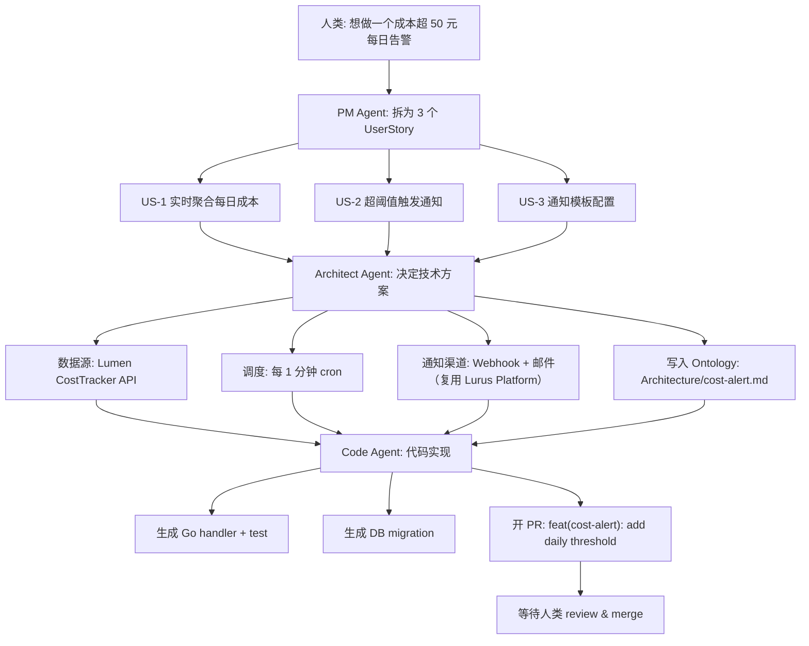

<div class="forge-sess-page">

# Flujo de trabajo de Session <StatusBadge status="beta" />

Session es el segundo modelo de datos central de Forge. Cada discusión de producto se almacena en una Session, que recoge la línea de tiempo completa de la conversación, las decisiones y los resultados producidos por los Agents.

<div class="lurus-callout lurus-callout--key">
  <span class="lurus-callout__icon"><Icon name="messages-square" :size="18" /></span>
  <div>
    <p class="lurus-callout__title">Relación entre Session y Ontology</p>
    <div class="lurus-callout__body">Session es la línea de tiempo <strong>dinámica</strong>; <a href="/es/forge/ontology">Ontology</a> es el conocimiento estructurado <strong>estático</strong>. Las decisiones de una Session → se escriben o modifican en los nodos de Ontology.</div>
  </div>
</div>

## Modelo de Session

```
Session {
  id            // sess_...
  title         // "添加成本告警"
  participants  // [人类, PM Agent, Architect Agent, Code Agent]
  ontology      // 关联的 Ontology 节点列表
  turns         // 对话轮次
  artifacts     // 产出物：PRD、ADR、PR 链接
  status        // active / paused / shipped
}
```

---

<div class="lurus-section-head">
  <span class="lurus-section-head__eyebrow"><Icon name="bot" :size="14" /> Roles</span>
  <h2 class="lurus-section-head__title">Tres tipos de Agent</h2>
  <p class="lurus-section-head__lede">Desde un requisito difuso hasta un PR fusionado, tres tipos de Agent colaboran por relevos.</p>
</div>

<div class="lurus-cards lurus-cards--compact">
  <div class="lurus-card lurus-card--forge">
    <span class="lurus-card__icon"><Icon name="briefcase" :size="20" /></span>
    <div class="lurus-card__title">PM Agent</div>
    <p class="lurus-card__body">Descompone requisitos difusos en historias de usuario, criterios de aceptación y prioridades.</p>
  </div>
  <div class="lurus-card lurus-card--forge">
    <span class="lurus-card__icon"><Icon name="network" :size="20" /></span>
    <div class="lurus-card__title">Architect Agent</div>
    <p class="lurus-card__body">Modelado de arquitectura, selección de tecnología e identificación de riesgos; escribe en el subárbol <code>Architecture</code> de Ontology.</p>
  </div>
  <div class="lurus-card lurus-card--forge">
    <span class="lurus-card__icon"><Icon name="code" :size="20" /></span>
    <div class="lurus-card__title">Code Agent</div>
    <p class="lurus-card__body">Escribe código, ejecuta pruebas y abre PR a partir de los resultados de los dos anteriores.</p>
  </div>
</div>

---

<div class="lurus-section-head">
  <span class="lurus-section-head__eyebrow"><Icon name="workflow" :size="14" /> De extremo a extremo</span>
  <h2 class="lurus-section-head__title">El flujo completo de 0 a PR</h2>
</div>



---

<div class="lurus-section-head">
  <span class="lurus-section-head__eyebrow"><Icon name="history" :size="14" /> Trazable</span>
  <h2 class="lurus-section-head__title">Trazabilidad de decisiones con WAL</h2>
</div>

Gracias al WAL del motor [Kova](/es/kova/), cada paso de conversación y cada decisión quedan persistidos. En cualquier momento puedes:

<div class="lurus-cards lurus-cards--compact">
  <div class="lurus-card lurus-card--forge">
    <span class="lurus-card__icon"><Icon name="search" :size="20" /></span>
    <p class="lurus-card__body">Rastrear "por qué se eligió NATS en lugar de Redis Streams"</p>
  </div>
  <div class="lurus-card lurus-card--forge">
    <span class="lurus-card__icon"><Icon name="filter" :size="20" /></span>
    <p class="lurus-card__body">Localizar "qué Session escribió por última vez en <code>Architecture/auth.md</code>"</p>
  </div>
  <div class="lurus-card lurus-card--forge">
    <span class="lurus-card__icon"><Icon name="rewind" :size="20" /></span>
    <p class="lurus-card__body">Reproducir (Replay) una Session completa, para realizar retrospectivas</p>
  </div>
</div>

---

## Próximos pasos

<NextSteps :steps="[
  { text: 'Profundizar en Ontology', link: '/es/forge/ontology', primary: true },
  { text: 'Hoja de ruta', link: '/es/forge/roadmap' },
  { text: 'Motor Kova', link: '/es/kova/' },
]" />

</div>
