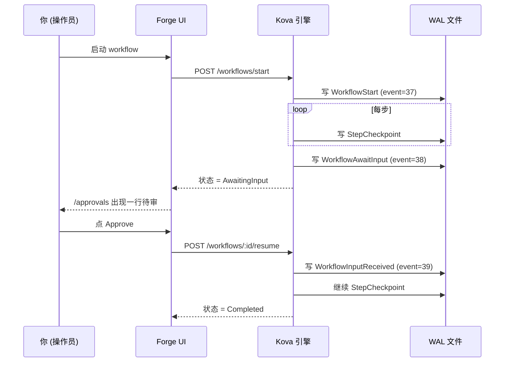

# Forge 快速入门

5 分钟跑通你的第一个 AI Agent workflow。本文配合 Beta 邀请使用 —— 注册即送示例 dataset / rubric / workflow，跟着 5 步走完一遍就知道 Forge 长什么样。

> **Beta 范围**：当前是受邀内测，10-15 个早期用户。试用反馈请见本文末 [#§5-遇到问题怎么办](#§5-遇到问题怎么办)。

---

## §1 30 秒认识 Forge

Forge 是一个 AI Agent 工作台。在浏览器里**画 / 跑 / 评估** Agent 工作流，**崩溃自动续跑，不重复花 LLM token**。

- **底层**: [Kova](/kova/) — Rust 写的持久执行引擎，WAL-first 崩溃恢复（不是 checkpoint，是每个 LLM Directive 都落盘）
- **运行时**: 单二进制 + 单 WAL 文件，无需 Kafka / Redis / Cassandra
- **LLM**: 国内 [newapi 网关](https://newapi.lurus.cn) 原生支持 (OpenAI 兼容)；可切 OpenAI / Anthropic / DeepSeek / 通义 / GLM
- **审计**: 每次 workflow 步骤、人工审批都签名落盘，满足 EU AI Act + GB/T 信创要求

下面 5 步带你跑完一遍。

---

## §2 跑第一个 workflow

::: tip 前置条件
你已收到 Beta 邀请邮件 / 链接，并且已经在 `forge.lurus.cn` 完成注册登录。
:::

1. 登录后，访问 [`/workflows/runs`](https://forge.lurus.cn/workflows/runs)
2. 点上方 **"启动新 run"** 按钮 → 选择 seed 自动生成的 `classify_then_route_v1` workflow
3. 输入框填一段中文 —— 比如 `今天上海天气怎么样`
4. 点 **Start** → 自动跳转 `/workflows/runs/[id]` 详情页
5. 看 timeline 卡片实时刷新（passthrough → llm_call → branch → leaf 四步）

**预期**: 完整跑完 < 30 秒（newapi.lurus.cn 在线时）。

::: warning LLM 慢/失败怎么办
如果 LLM 那头超时或失败，run 状态会变成 `failed` 并显示具体错误。这是 Kova 的 WAL 崩溃恢复在工作 —— 你后续可以 resume 不重新跑前面的步骤。
:::

---

## §3 中间审批节点（HITL）

如果 workflow 含 `await_input` step（比如"高风险操作前请审批"模板）：

1. workflow 跑到该步会暂停，状态变 `AwaitingInput`
2. 你在 [`/approvals`](https://forge.lurus.cn/approvals) 会看到一行待审，标题是该 step 的 prompt
3. 点 **"Review"** → 选 Approve / Reject / Edit → 提交
4. workflow 自动续跑到下一步

**关键点**: 你审批的决策被写进 WAL，**永久可追溯**；workflow 不会因为你刷新页面 / 关闭 tab 而丢状态。

---

## §4 评分（Eval）一个 run

1. workflow 跑完后，访问 [`/eval`](https://forge.lurus.cn/eval)
2. 选 **Rubrics** tab → 选 seed 的 `Sample rubric (PII)` 或自建
3. 选 **Runs** 关联到刚跑完的 workflow_id
4. 点 **Score** → 后台跑 scorer（PII regex / json-schema / llm-as-judge）
5. 看每条 criterion 的分数 + 解释

**可用的 scorer 类型**:

| 类型 | 用途 | 配置 |
|---|---|---|
| `pii_regex` | 检测 LLM 输出里有没有泄露身份证 / 手机号 / 邮箱 | 写正则 pattern |
| `json_schema` | 检查输出符合 JSON schema（结构化生成场景） | 贴 JSON schema |
| `llm_as_judge` | 让另一个 LLM 给主 LLM 输出打分 | 写 judge prompt + 选 model + temperature |
| `semantic_similarity` | （WIP，暂不可用 —— embedding service 还在搭） | — |

---

## §5 遇到问题怎么办

| 症状 | 可能原因 | 怎么办 |
|---|---|---|
| workflow 一直 Running 不动 | 多半是 LLM 网关超时 (30 s) | 看 `/workflows/runs/[id]` timeline 卡片最后一步是什么；如果是 `llm_call`，等或者 cancel run 后重试 |
| 403 You do not have permission | 你在试图操作别人的 approval | 只有发起人本人或同 tenant_id 才能决策 —— 找发起人 |
| 404 Approval not found | approval 已被 cancel 或终态 | 找发起人确认；终态不可改 |
| `/workflows/runs` 一直 loading | `kova_proxy` 连不上 kova-rest | 检查 [`/api/health`](https://forge.lurus.cn/api/health)，看第二段 `kova_rest` 是否 ok |
| 中文显示乱码 / 没翻译 | i18n key 缺 | 反馈 + 截图（[#反馈](#§6-反馈)） |

---

## §6 反馈 {#§6-反馈}

发现 bug、想要新功能、想跟我们 30 分钟聊聊使用场景：

- **Typeform 表单**（嵌入在 `/settings` 页底）—— 30 秒填完，对外部用户最快
- **Discord** —— 邀请链接见 footer，开发者向用户首选
- **邮件** —— `forge-beta@lurus.cn`，24h 内回复 SLA

Beta 期间所有反馈直接进 roadmap。期待你的使用。

---

## 接下来

- [Forge 介绍页](/forge/) — Forge 在 Lurus 平台中的定位
- [Kova 引擎文档](/kova/) — 底层持久执行引擎细节
- [Forge Roadmap](/forge/roadmap) — 接下来要做的事

---

*最后更新: 2026-05-12 | 配套 Beta 邀请 playbook: `2b-bs-forge/docs/beta-invite-playbook.md`*
