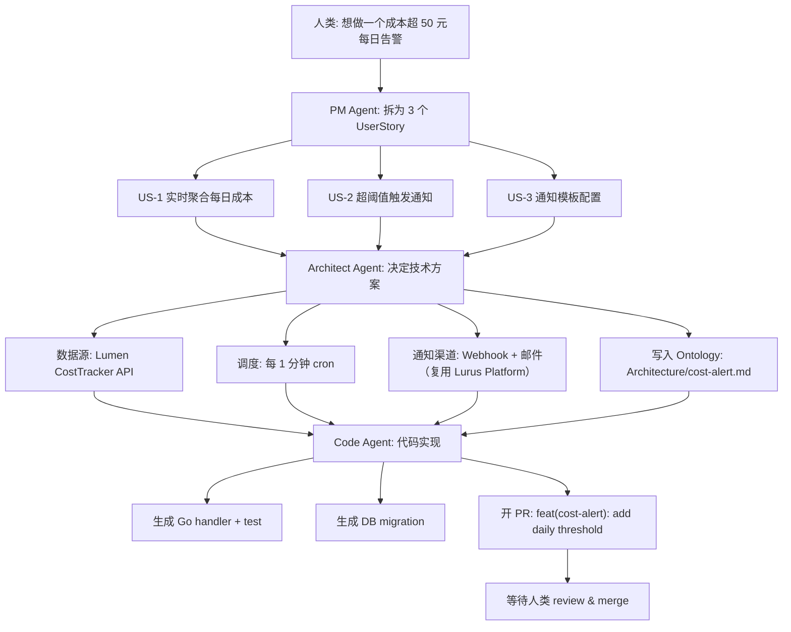

<div class="forge-sess-page">

# Session 工作流 <StatusBadge status="beta" />

Session 是 Forge 的第二核心数据模型。每一次产品讨论都装进一个 Session，承载对话、决策、Agent 产出的完整时间线。

<div class="lurus-callout lurus-callout--key">
  <span class="lurus-callout__icon"><Icon name="messages-square" :size="18" /></span>
  <div>
    <p class="lurus-callout__title">Session 与 Ontology 的关系</p>
    <div class="lurus-callout__body">Session 是<strong>动态</strong>的时间线；<a href="/forge/ontology">Ontology</a> 是<strong>静态</strong>的结构化知识。Session 中的决策 → 写入 / 修改 Ontology 节点。</div>
  </div>
</div>

## Session 模型

```
Session {
  id            // sess_...
  title         // "添加成本告警"
  participants  // [人类, PM Agent, Architect Agent, Code Agent]
  ontology      // 关联的 Ontology 节点列表
  turns         // 对话轮次
  artifacts     // 产出物：PRD、ADR、PR 链接
  status        // active / paused / shipped
}
```

---

<div class="lurus-section-head">
  <span class="lurus-section-head__eyebrow"><Icon name="bot" :size="14" /> 角色</span>
  <h2 class="lurus-section-head__title">三类 Agent</h2>
  <p class="lurus-section-head__lede">从模糊需求到合并 PR，三类 Agent 接力协作。</p>
</div>

<div class="lurus-cards lurus-cards--compact">
  <div class="lurus-card lurus-card--forge">
    <span class="lurus-card__icon"><Icon name="briefcase" :size="20" /></span>
    <div class="lurus-card__title">PM Agent</div>
    <p class="lurus-card__body">把模糊需求拆解为用户故事、验收标准、优先级。</p>
  </div>
  <div class="lurus-card lurus-card--forge">
    <span class="lurus-card__icon"><Icon name="network" :size="20" /></span>
    <div class="lurus-card__title">Architect Agent</div>
    <p class="lurus-card__body">架构建模、技术选型、风险识别；写入 Ontology <code>Architecture</code> 子树。</p>
  </div>
  <div class="lurus-card lurus-card--forge">
    <span class="lurus-card__icon"><Icon name="code" :size="20" /></span>
    <div class="lurus-card__title">Code Agent</div>
    <p class="lurus-card__body">基于前两者产物写代码、跑测试、开 PR。</p>
  </div>
</div>

---

<div class="lurus-section-head">
  <span class="lurus-section-head__eyebrow"><Icon name="workflow" :size="14" /> 端到端</span>
  <h2 class="lurus-section-head__title">从 0 到 PR 的完整流</h2>
</div>



---

<div class="lurus-section-head">
  <span class="lurus-section-head__eyebrow"><Icon name="history" :size="14" /> 可回溯</span>
  <h2 class="lurus-section-head__title">WAL 决策回溯</h2>
</div>

基于 [Kova](/kova/) 引擎的 WAL，每一步对话和决策都被持久化。任何时候可以：

<div class="lurus-cards lurus-cards--compact">
  <div class="lurus-card lurus-card--forge">
    <span class="lurus-card__icon"><Icon name="search" :size="20" /></span>
    <p class="lurus-card__body">回溯"为什么选了 NATS 而不是 Redis Streams"</p>
  </div>
  <div class="lurus-card lurus-card--forge">
    <span class="lurus-card__icon"><Icon name="filter" :size="20" /></span>
    <p class="lurus-card__body">定位"哪次 Session 最后写入了 <code>Architecture/auth.md</code>"</p>
  </div>
  <div class="lurus-card lurus-card--forge">
    <span class="lurus-card__icon"><Icon name="rewind" :size="20" /></span>
    <p class="lurus-card__body">Replay 重放一整个 Session，用于复盘</p>
  </div>
</div>

---

## 下一步

<NextSteps :steps="[
  { text: 'Ontology 深入', link: '/forge/ontology', primary: true },
  { text: '路线图', link: '/forge/roadmap' },
  { text: 'Kova 引擎', link: '/kova/' },
]" />

</div>
