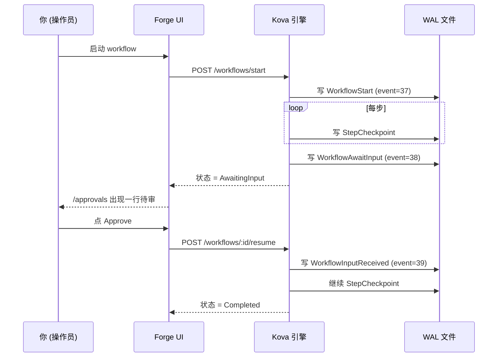

# Démarrage rapide avec Forge <StatusBadge status="beta" />

Lancez votre premier workflow d'agent IA en 5 minutes. Cet article accompagne l'invitation Beta — l'inscription offre un dataset / rubric / workflow d'exemple ; suivez les 5 étapes une fois et vous saurez à quoi ressemble Forge.

  <Icon name="users" :size="18" />
  

    
Périmètre Beta

    
Il s'agit actuellement d'une bêta privée sur invitation, 10 à 15 utilisateurs précoces. Pour les retours d'essai, voir <a href="#§5-遇到问题怎么办">§5 Que faire en cas de problème</a> en fin d'article.

  

---

## §1 Découvrir Forge en 30 secondes

Atelier d'agents IA : **dessinez / exécutez / évaluez** des workflows d'agents dans le navigateur, **reprise automatique après crash, sans regaspiller de tokens LLM**.

  

    <Icon name="history" :size="20" />
    
Exécution persistante WAL-first

    
Reposant sur <a href="/fr/kova/">Kova</a> (moteur d'exécution persistante en Rust, récupération après crash — ce n'est pas du checkpoint, chaque Directive LLM est écrite sur disque).

  

  

    <Icon name="package" :size="20" />
    
Zéro dépendance externe

    
Runtime : un binaire unique + un fichier WAL unique, sans Kafka / Redis / Cassandra.

  

  

    <Icon name="shuffle" :size="20" />
    
Passerelle compatible OpenAI

    
Le LLM passe par la <a href="https://newapi.lurus.cn">passerelle newapi</a>, commutable entre OpenAI / Anthropic / DeepSeek / Tongyi / GLM.

  

  

    <Icon name="shield-check" :size="20" />
    
Auditable à chaque étape

    
Chaque étape et chaque signature d'approbation humaine sont écrites sur disque, conformément à l'EU AI Act + aux normes GB/T (innovation souveraine).

  

---

## §2 Exécuter votre premier workflow

::: tip Prérequis
Vous avez reçu l'invitation Beta et finalisé votre inscription/connexion sur `forge.lurus.cn`.
:::

<ol class="lurus-steps">
<li>

Ouvrez [`/workflows/runs`](https://forge.lurus.cn/workflows/runs), cliquez sur **« Démarrer un nouveau run »**.

</li>
<li>

Sélectionnez le seed `classify_then_route_v1`, saisissez du texte dans le champ (par ex. `今天上海天气怎么样`), cliquez sur **Start**.

</li>
<li>

La page redirige vers `/workflows/runs/[id]`, les cartes de la timeline se rafraîchissent en temps réel (les quatre étapes `passthrough → llm_call → branch → leaf`). **Attendu : &lt; 30 secondes** (quand newapi.lurus.cn est en ligne).

</li>
</ol>

  <Icon name="alert-circle" :size="18" />
  

    
LLM lent / en échec

    
En cas de timeout / échec du LLM, l'état du run passe à <code>failed</code> et affiche l'erreur — c'est la récupération après crash du WAL Kova qui opère ; vous pourrez ensuite faire resume sans rejouer les étapes précédentes.

  

---

## §3 Nœud d'approbation intermédiaire (HITL)

Lorsqu'un workflow contient une étape `await_input` (comme le modèle « approbation requise avant une opération à haut risque ») :

<ol class="lurus-steps">
<li>

L'exécution s'interrompt à cette étape, l'état passe à `AwaitingInput`.

</li>
<li>

Sur [`/approvals`](https://forge.lurus.cn/approvals), une ligne en attente d'approbation apparaît (le titre est le prompt de cette étape).

</li>
<li>

Cliquez sur **« Review »**, choisissez Approve / Reject / Edit puis soumettez ; le workflow reprend automatiquement.

</li>
</ol>

La décision d'approbation est écrite dans le WAL, **traçable de façon permanente** ; un rafraîchissement / la fermeture de l'onglet ne perd pas l'état.

---

## §4 Évaluer (Eval) un run

<ol class="lurus-steps">
<li>

Ouvrez [`/eval`](https://forge.lurus.cn/eval) → onglet **Rubrics**, sélectionnez le seed `Sample rubric (PII)` ou créez le vôtre.

</li>
<li>

Passez à **Runs**, associez le `workflow_id` que vous venez d'exécuter.

</li>
<li>

Cliquez sur **Score** ; le scorer s'exécute en arrière-plan, consultez le score + l'explication de chaque criterion.

</li>
</ol>

**Types de scorer disponibles**

| Type | Usage | Configuration |
|---|---|---|
| `pii_regex` | Détecter si la sortie du LLM a divulgué un numéro de pièce d'identité / téléphone / e-mail | Écrire un pattern regex |
| `json_schema` | Vérifier que la sortie respecte un JSON schema (scénarios de génération structurée) | Coller un JSON schema |
| `llm_as_judge` | Faire noter la sortie du LLM principal par un autre LLM | Écrire le judge prompt + choisir model + temperature |
| `semantic_similarity` | (WIP, indisponible pour l'instant — le service d'embedding est encore en construction) | — |

---

## §5 Que faire en cas de problème

Le workflow reste bloqué en Running ?

C'est le plus souvent un timeout de la passerelle LLM (30 s). Regardez la dernière étape des cartes de la timeline sur `/workflows/runs/[id]` ; s'il s'agit de `llm_call`, attendez ou faites cancel du run puis réessayez.

403 You do not have permission ?

Vous tentez d'agir sur l'approval de quelqu'un d'autre. Seul l'initiateur lui-même ou un membre du même `tenant_id` peut décider — contactez l'initiateur.

404 Approval not found ?

L'approval a été annulé (cancel) ou est dans un état terminal. Contactez l'initiateur pour confirmer ; un état terminal n'est pas modifiable.

<code>/workflows/runs</code> reste en loading ?

`kova_proxy` n'arrive pas à se connecter à kova-rest. Vérifiez [`/api/health`](https://forge.lurus.cn/api/health), regardez si la deuxième section `kova_rest` est ok.

Affichage en charabia / non traduit ?

Une clé i18n manque. Faites un retour + capture d'écran (voir [§6 Retours](#§6-反馈)).

---

## §6 Retours {#§6-反馈}

Vous avez trouvé un bug, souhaitez une nouvelle fonctionnalité ou voulez échanger 30 minutes avec nous sur vos cas d'usage :

  

    <Icon name="pen-tool" :size="20" />
    
Formulaire Typeform

    
Intégré en bas de la page <code>/settings</code> — rempli en 30 secondes, le plus rapide pour les utilisateurs externes.

  

  

    <Icon name="messages-square" :size="20" />
    
Discord

    
Le lien d'invitation se trouve dans le footer, à privilégier pour les utilisateurs développeurs.

  

  

    <Icon name="mail" :size="20" />
    
E-mail

    
<code>forge-beta@lurus.cn</code>, SLA de réponse sous 24 h.

  

Pendant la Beta, tous les retours entrent directement dans la roadmap. Au plaisir de vous voir l'utiliser.

---

<NextSteps
  title="Et ensuite"
  :steps="[
    { text: 'Page de présentation de Forge — son positionnement dans la plateforme Lurus', link: '/fr/forge/', primary: true },
    { text: 'Documentation du moteur Kova — détails du moteur d’exécution persistante sous-jacent', link: '/fr/kova/' },
    { text: 'Roadmap Forge — ce qui arrive ensuite', link: '/fr/forge/roadmap' },
  ]"
/>

---

*Dernière mise à jour : 2026-05-12 | playbook d'invitation Beta associé : `2b-bs-forge/docs/beta-invite-playbook.md`*

