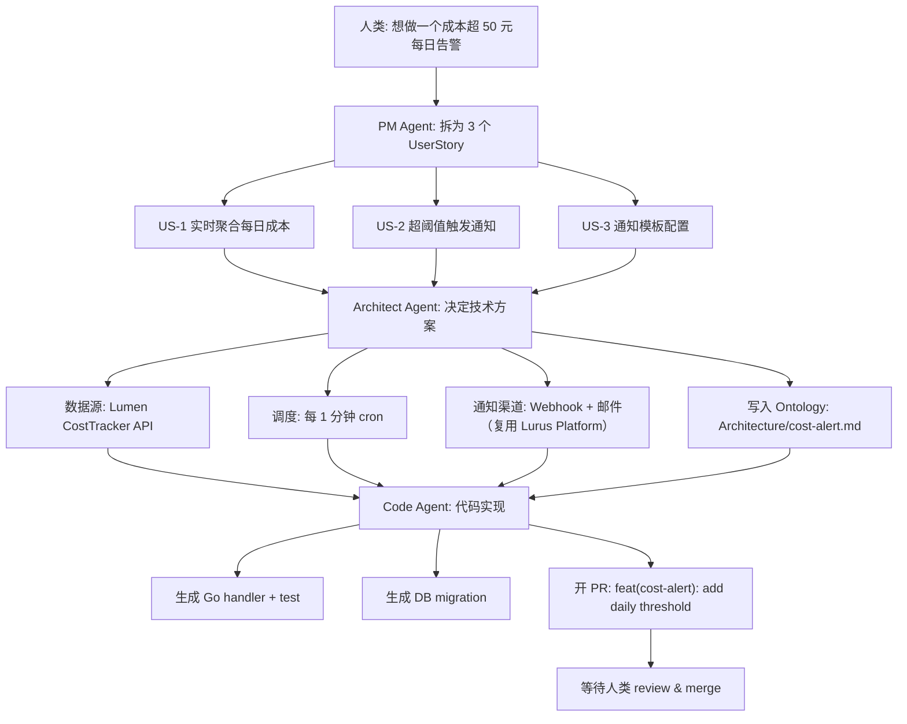

<div class="forge-sess-page">

# Flux de travail des sessions <StatusBadge status="beta" />

La session est le deuxième modèle de données central de Forge. Chaque discussion produit est encapsulée dans une session, qui porte la chronologie complète des conversations, des décisions et des productions des agents.

<div class="lurus-callout lurus-callout--key">
  <span class="lurus-callout__icon"><Icon name="messages-square" :size="18" /></span>
  <div>
    <p class="lurus-callout__title">Relation entre Session et Ontology</p>
    <div class="lurus-callout__body">La session est une chronologie <strong>dynamique</strong> ; l’<a href="/fr/forge/ontology">Ontology</a> est une connaissance structurée <strong>statique</strong>. Les décisions prises dans une session sont écrites dans les nœuds de l’Ontology ou les modifient.</div>
  </div>
</div>

## Modèle de session

```
Session {
  id            // sess_...
  title         // "添加成本告警"
  participants  // [人类, PM Agent, Architect Agent, Code Agent]
  ontology      // 关联的 Ontology 节点列表
  turns         // 对话轮次
  artifacts     // 产出物：PRD、ADR、PR 链接
  status        // active / paused / shipped
}
```

---

<div class="lurus-section-head">
  <span class="lurus-section-head__eyebrow"><Icon name="bot" :size="14" /> Rôles</span>
  <h2 class="lurus-section-head__title">Trois types d’agents</h2>
  <p class="lurus-section-head__lede">Du besoin flou à la PR fusionnée, trois types d’agents collaborent en relais.</p>
</div>

<div class="lurus-cards lurus-cards--compact">
  <div class="lurus-card lurus-card--forge">
    <span class="lurus-card__icon"><Icon name="briefcase" :size="20" /></span>
    <div class="lurus-card__title">PM Agent</div>
    <p class="lurus-card__body">Décompose un besoin flou en récits utilisateur, critères d’acceptation et priorités.</p>
  </div>
  <div class="lurus-card lurus-card--forge">
    <span class="lurus-card__icon"><Icon name="network" :size="20" /></span>
    <div class="lurus-card__title">Architect Agent</div>
    <p class="lurus-card__body">Modélisation d’architecture, choix techniques, identification des risques ; écriture dans le sous-arbre <code>Architecture</code> de l’Ontology.</p>
  </div>
  <div class="lurus-card lurus-card--forge">
    <span class="lurus-card__icon"><Icon name="code" :size="20" /></span>
    <div class="lurus-card__title">Code Agent</div>
    <p class="lurus-card__body">Écrit le code, lance les tests et ouvre la PR à partir des productions des deux premiers.</p>
  </div>
</div>

---

<div class="lurus-section-head">
  <span class="lurus-section-head__eyebrow"><Icon name="workflow" :size="14" /> De bout en bout</span>
  <h2 class="lurus-section-head__title">Le flux complet de 0 à la PR</h2>
</div>



---

<div class="lurus-section-head">
  <span class="lurus-section-head__eyebrow"><Icon name="history" :size="14" /> Traçable</span>
  <h2 class="lurus-section-head__title">Retour aux décisions via le WAL</h2>
</div>

Grâce au WAL du moteur [Kova](/fr/kova/), chaque conversation et chaque décision sont persistées. À tout moment, vous pouvez :

<div class="lurus-cards lurus-cards--compact">
  <div class="lurus-card lurus-card--forge">
    <span class="lurus-card__icon"><Icon name="search" :size="20" /></span>
    <p class="lurus-card__body">Retracer « pourquoi NATS a été choisi plutôt que Redis Streams »</p>
  </div>
  <div class="lurus-card lurus-card--forge">
    <span class="lurus-card__icon"><Icon name="filter" :size="20" /></span>
    <p class="lurus-card__body">Localiser « quelle session a écrit en dernier dans <code>Architecture/auth.md</code> »</p>
  </div>
  <div class="lurus-card lurus-card--forge">
    <span class="lurus-card__icon"><Icon name="rewind" :size="20" /></span>
    <p class="lurus-card__body">Rejouer une session entière à des fins de rétrospective</p>
  </div>
</div>

---

## Étapes suivantes

<NextSteps :steps="[
  { text: 'Approfondir l’Ontology', link: '/fr/forge/ontology', primary: true },
  { text: 'Feuille de route', link: '/fr/forge/roadmap' },
  { text: 'Moteur Kova', link: '/fr/kova/' },
]" />

</div>
