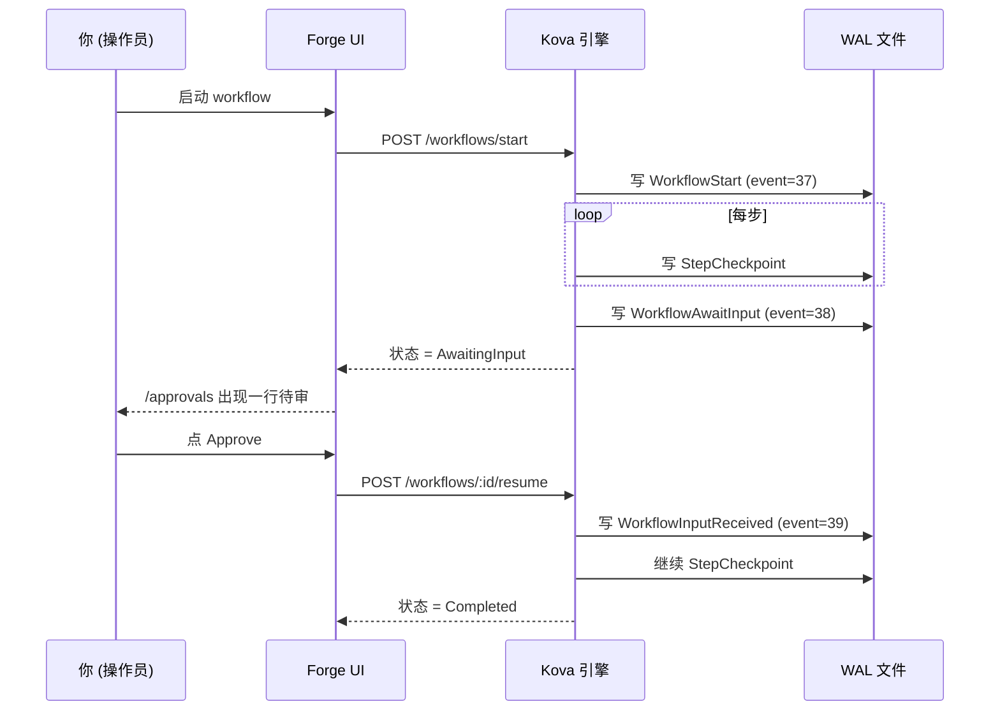

# Forge クイックスタート <StatusBadge status="beta" />

5 分で最初の AI Agent workflow を動かしましょう。本記事は Beta 招待と併せて利用します —— 登録するとサンプルの dataset / rubric / workflow がプレゼントされ、5 ステップを一通り進めれば Forge がどんなものか分かります。

  <Icon name="users" :size="18" />
  

    
Beta の範囲

    
現在は招待制のクローズドベータで、10〜15 名の早期ユーザーが対象です。試用フィードバックは本記事末尾の <a href="#§5-遇到问题怎么办">§5 困ったときは</a> をご覧ください。

  

---

## §1 30 秒で分かる Forge

AI Agent ワークベンチ：ブラウザの中で Agent ワークフローを**描く / 実行する / 評価する**、**クラッシュしても自動で続きから再開し、LLM token を二重に消費しない**。

  

    <Icon name="history" :size="20" />
    
WAL-first 永続実行

    
基盤は <a href="/ja/kova/">Kova</a>（Rust 製の永続実行エンジン、クラッシュ復旧——checkpoint ではなく、すべての LLM Directive をディスクに書き込みます）。

  

  

    <Icon name="package" :size="20" />
    
外部依存ゼロ

    
ランタイムは単一バイナリ + 単一の WAL ファイルで、Kafka / Redis / Cassandra は不要です。

  

  

    <Icon name="shuffle" :size="20" />
    
OpenAI 互換ゲートウェイ

    
LLM は <a href="https://newapi.lurus.cn">newapi ゲートウェイ</a> を経由し、OpenAI / Anthropic / DeepSeek / 通義 / GLM を切り替えられます。

  

  

    <Icon name="shield-check" :size="20" />
    
各ステップを監査可能

    
各ステップと人手の承認署名がディスクに書き込まれ、EU AI Act + GB/T 信創に対応します。

  

---

## §2 最初の workflow を実行する

::: tip 前提条件
Beta 招待を受け取り、`forge.lurus.cn` で登録・ログインを完了していること。
:::

<ol class="lurus-steps">
<li>

[`/workflows/runs`](https://forge.lurus.cn/workflows/runs) を開き、**「新しい run を起動」** をクリックします。

</li>
<li>

seed の `classify_then_route_v1` を選び、入力欄に日本語（例：`今日の上海の天気はどう`）を入力して **Start** をクリックします。

</li>
<li>

ページが `/workflows/runs/[id]` に遷移し、timeline カードがリアルタイムに更新されます（`passthrough → llm_call → branch → leaf` の 4 ステップ）。**想定は &lt; 30 秒**です（newapi.lurus.cn がオンラインの場合）。

</li>
</ol>

  <Icon name="alert-circle" :size="18" />
  

    
LLM が遅い / 失敗する

    
LLM がタイムアウト / 失敗すると run のステータスが <code>failed</code> になりエラーを表示します——これは Kova WAL のクラッシュ復旧が機能している証拠で、後で resume すれば前のステップを再実行せずに続けられます。

  

---

## §3 途中の承認ノード（HITL）

workflow に `await_input` step が含まれる場合（例：「高リスク操作の前に承認してください」テンプレート）：

<ol class="lurus-steps">
<li>

そのステップに到達すると一時停止し、ステータスが `AwaitingInput` になります。

</li>
<li>

[`/approvals`](https://forge.lurus.cn/approvals) に承認待ちの行が 1 件表示されます（タイトルはその step の prompt）。

</li>
<li>

**「Review」** をクリックし、Approve / Reject / Edit を選んで送信すると、workflow が自動で続きから再開します。

</li>
</ol>

承認の判断は WAL に書き込まれ **恒久的に追跡可能** で、リロードや tab を閉じても状態は失われません。

---

## §4 run を評価する（Eval）

<ol class="lurus-steps">
<li>

[`/eval`](https://forge.lurus.cn/eval) を開き → **Rubrics** tab で、seed の `Sample rubric (PII)` または自作のものを選びます。

</li>
<li>

**Runs** に切り替え、先ほど実行が完了した `workflow_id` を関連付けます。

</li>
<li>

**Score** をクリックすると、バックグラウンドで scorer が走り、各 criterion のスコア + 説明が表示されます。

</li>
</ol>

**利用できる scorer の種類**

| 種類 | 用途 | 設定 |
|---|---|---|
| `pii_regex` | LLM 出力に身分証 / 携帯番号 / メールアドレスの漏洩がないか検出 | 正規表現 pattern を記述 |
| `json_schema` | 出力が JSON schema に適合するか検査（構造化生成シーン） | JSON schema を貼り付け |
| `llm_as_judge` | 別の LLM にメイン LLM の出力を採点させる | judge prompt を記述 + model + temperature を選択 |
| `semantic_similarity` | （WIP、現在利用不可 —— embedding service を構築中） | — |

---

## §5 困ったときは

workflow がずっと Running のまま動かない？

多くの場合は LLM ゲートウェイのタイムアウト（30 s）です。`/workflows/runs/[id]` の timeline カードの最後のステップが何かを確認してください。`llm_call` の場合は、待つか run を cancel してから再試行します。

403 You do not have permission？

他人の approval を操作しようとしています。発起人本人または同じ `tenant_id` のみが判断できます —— 発起人に連絡してください。

404 Approval not found？

approval はすでに cancel されたか終了状態です。発起人に確認してください。終了状態は変更できません。

<code>/workflows/runs</code> がずっと loading？

`kova_proxy` が kova-rest に接続できていません。[`/api/health`](https://forge.lurus.cn/api/health) を確認し、2 番目のセクションの `kova_rest` が ok かどうかを見てください。

日本語表示が文字化け / 未翻訳？

i18n key が欠けています。フィードバック + スクリーンショットをお願いします（[§6 フィードバック](#§6-反馈) を参照）。

---

## §6 フィードバック {#§6-反馈}

bug を見つけた、新機能が欲しい、30 分ほど利用シーンについて話したい：

  

    <Icon name="pen-tool" :size="20" />
    
Typeform フォーム

    
<code>/settings</code> ページの最下部に埋め込み——30 秒で記入完了、外部ユーザーには最速です。

  

  

    <Icon name="messages-square" :size="20" />
    
Discord

    
招待リンクは footer を参照、開発者からユーザーへの推奨手段です。

  

  

    <Icon name="mail" :size="20" />
    
メール

    
<code>forge-beta@lurus.cn</code>、24h 以内の返信 SLA。

  

Beta 期間中のすべてのフィードバックは直接 roadmap に反映されます。ご利用をお待ちしています。

---

<NextSteps
  title="次のステップ"
  :steps="[
    { text: 'Forge 紹介ページ — Lurus プラットフォームにおける位置づけ', link: '/ja/forge/', primary: true },
    { text: 'Kova エンジンドキュメント — 基盤となる永続実行エンジンの詳細', link: '/ja/kova/' },
    { text: 'Forge Roadmap — これから取り組むこと', link: '/ja/forge/roadmap' },
  ]"
/>

---

*最終更新: 2026-05-12 | 付属の Beta 招待 playbook: `2b-bs-forge/docs/beta-invite-playbook.md`*

