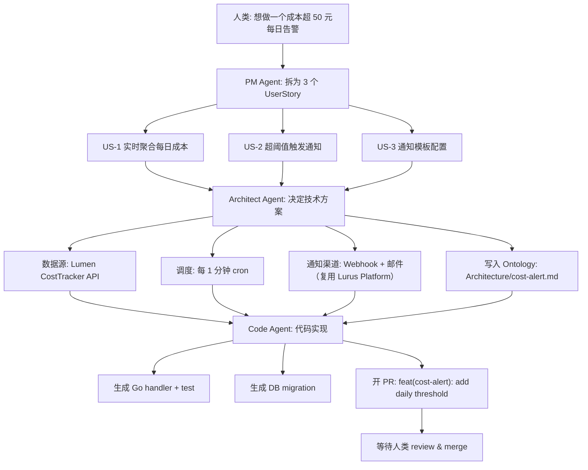

<div class="forge-sess-page">

# Session ワークフロー <StatusBadge status="beta" />

Session は Forge の 2 番目の中核データモデルです。プロダクトに関する各議論を 1 つの Session に収め、対話・意思決定・Agent の成果物からなる完全なタイムラインを保持します。

<div class="lurus-callout lurus-callout--key">
  <span class="lurus-callout__icon"><Icon name="messages-square" :size="18" /></span>
  <div>
    <p class="lurus-callout__title">Session と Ontology の関係</p>
    <div class="lurus-callout__body">Session は<strong>動的</strong>なタイムライン、<a href="/ja/forge/ontology">Ontology</a> は<strong>静的</strong>な構造化された知識です。Session 内の意思決定 → Ontology ノードへの書き込み / 修正につながります。</div>
  </div>
</div>

## Session モデル

```
Session {
  id            // sess_...
  title         // "添加成本告警"
  participants  // [人类, PM Agent, Architect Agent, Code Agent]
  ontology      // 关联的 Ontology 节点列表
  turns         // 对话轮次
  artifacts     // 产出物：PRD、ADR、PR 链接
  status        // active / paused / shipped
}
```

---

<div class="lurus-section-head">
  <span class="lurus-section-head__eyebrow"><Icon name="bot" :size="14" /> 役割</span>
  <h2 class="lurus-section-head__title">3 種類の Agent</h2>
  <p class="lurus-section-head__lede">曖昧な要件からマージされた PR まで、3 種類の Agent がリレーのように協働します。</p>
</div>

<div class="lurus-cards lurus-cards--compact">
  <div class="lurus-card lurus-card--forge">
    <span class="lurus-card__icon"><Icon name="briefcase" :size="20" /></span>
    <div class="lurus-card__title">PM Agent</div>
    <p class="lurus-card__body">曖昧な要件をユーザーストーリー・受け入れ基準・優先度へ分解します。</p>
  </div>
  <div class="lurus-card lurus-card--forge">
    <span class="lurus-card__icon"><Icon name="network" :size="20" /></span>
    <div class="lurus-card__title">Architect Agent</div>
    <p class="lurus-card__body">アーキテクチャのモデリング、技術選定、リスク識別を行い、Ontology の <code>Architecture</code> サブツリーへ書き込みます。</p>
  </div>
  <div class="lurus-card lurus-card--forge">
    <span class="lurus-card__icon"><Icon name="code" :size="20" /></span>
    <div class="lurus-card__title">Code Agent</div>
    <p class="lurus-card__body">前 2 者の成果物をもとにコードを書き、テストを実行し、PR を作成します。</p>
  </div>
</div>

---

<div class="lurus-section-head">
  <span class="lurus-section-head__eyebrow"><Icon name="workflow" :size="14" /> エンドツーエンド</span>
  <h2 class="lurus-section-head__title">0 から PR までの完全なフロー</h2>
</div>



---

<div class="lurus-section-head">
  <span class="lurus-section-head__eyebrow"><Icon name="history" :size="14" /> トレーサビリティ</span>
  <h2 class="lurus-section-head__title">WAL による意思決定の遡及</h2>
</div>

[Kova](/ja/kova/) エンジンの WAL を基盤として、対話と意思決定の一つひとつが永続化されます。いつでも次のことが可能です：

<div class="lurus-cards lurus-cards--compact">
  <div class="lurus-card lurus-card--forge">
    <span class="lurus-card__icon"><Icon name="search" :size="20" /></span>
    <p class="lurus-card__body">「なぜ Redis Streams ではなく NATS を選んだのか」を遡る</p>
  </div>
  <div class="lurus-card lurus-card--forge">
    <span class="lurus-card__icon"><Icon name="filter" :size="20" /></span>
    <p class="lurus-card__body">「どの Session が最後に <code>Architecture/auth.md</code> へ書き込んだか」を特定する</p>
  </div>
  <div class="lurus-card lurus-card--forge">
    <span class="lurus-card__icon"><Icon name="rewind" :size="20" /></span>
    <p class="lurus-card__body">Session 全体を Replay で再生し、振り返りに用いる</p>
  </div>
</div>

---

## 次のステップ

<NextSteps :steps="[
  { text: 'Ontology を深掘り', link: '/ja/forge/ontology', primary: true },
  { text: 'ロードマップ', link: '/ja/forge/roadmap' },
  { text: 'Kova エンジン', link: '/ja/kova/' },
]" />

</div>
