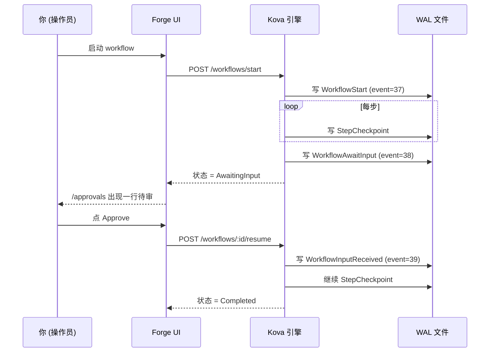

# Forge 빠른 시작 <StatusBadge status="beta" />

5분 만에 첫 AI Agent workflow를 끝까지 실행해 봅니다. 이 문서는 Beta 초대와 함께 사용합니다 —— 등록하면 예제 dataset / rubric / workflow가 제공되며, 5단계를 따라 한 번 완주하면 Forge가 어떤 모습인지 알 수 있습니다.

  <Icon name="users" :size="18" />
  

    
Beta 범위

    
현재는 초대 기반 비공개 테스트이며, 10-15명의 초기 사용자를 대상으로 합니다. 사용 피드백은 본문 끝 <a href="#§5-遇到问题怎么办">§5 문제가 생기면 어떻게 하나</a>를 참고하세요.

  

---

## §1 30초 만에 Forge 이해하기

AI Agent 워크벤치: 브라우저에서 Agent 워크플로를 **그리고 / 실행하고 / 평가**하며, **크래시가 나도 자동으로 이어서 실행하고 LLM token을 중복으로 소비하지 않습니다**.

  

    <Icon name="history" :size="20" />
    
WAL-first 지속 실행

    
기반은 <a href="/ko/kova/">Kova</a>(Rust 지속 실행 엔진, 크래시 복구 —— checkpoint 방식이 아니라 모든 LLM Directive를 디스크에 기록합니다).

  

  

    <Icon name="package" :size="20" />
    
외부 의존성 제로

    
런타임은 단일 바이너리 + 단일 WAL 파일이며, Kafka / Redis / Cassandra가 필요 없습니다.

  

  

    <Icon name="shuffle" :size="20" />
    
OpenAI 호환 게이트웨이

    
LLM은 <a href="https://newapi.lurus.cn">newapi 게이트웨이</a>를 거치며, OpenAI / Anthropic / DeepSeek / 通义 / GLM으로 전환할 수 있습니다.

  

  

    <Icon name="shield-check" :size="20" />
    
단계별 감사 가능

    
모든 단계와 사람의 승인 서명이 디스크에 기록되어 EU AI Act + GB/T 信创 요건을 충족합니다.

  

---

## §2 첫 workflow 실행하기

::: tip 전제 조건
이미 Beta 초대를 받았고 `forge.lurus.cn`에서 등록·로그인을 완료한 상태여야 합니다.
:::

<ol class="lurus-steps">
<li>

[`/workflows/runs`](https://forge.lurus.cn/workflows/runs)를 열고 **"새 run 시작"**을 클릭합니다.

</li>
<li>

seed로 제공되는 `classify_then_route_v1`을 선택하고, 입력란에 한국어(예: `오늘 상하이 날씨 어때`)를 입력한 뒤 **Start**를 클릭합니다.

</li>
<li>

페이지가 `/workflows/runs/[id]`로 이동하며 timeline 카드가 실시간으로 갱신됩니다(`passthrough → llm_call → branch → leaf` 4단계). **예상 소요 시간 &lt; 30초**(newapi.lurus.cn이 온라인일 때).

</li>
</ol>

  <Icon name="alert-circle" :size="18" />
  

    
LLM이 느리거나 실패할 때

    
LLM이 타임아웃되거나 실패하면 run 상태가 <code>failed</code>로 바뀌고 오류가 표시됩니다 —— 이는 Kova WAL 크래시 복구가 동작하는 것이며, 이후 앞선 단계를 다시 실행하지 않고 resume할 수 있습니다.

  

---

## §3 중간 승인 노드(HITL)

workflow에 `await_input` step이 포함된 경우(예: "고위험 작업 전 승인 요청" 템플릿):

<ol class="lurus-steps">
<li>

해당 단계까지 실행되면 일시 정지하고, 상태가 `AwaitingInput`으로 바뀝니다.

</li>
<li>

[`/approvals`](https://forge.lurus.cn/approvals)에서 승인 대기 항목 한 줄이 보입니다(제목은 해당 step의 prompt입니다).

</li>
<li>

**"Review"**를 클릭하고 Approve / Reject / Edit를 선택해 제출하면 workflow가 자동으로 이어서 실행됩니다.

</li>
</ol>

승인 결정은 WAL에 기록되어 **영구적으로 추적 가능**하며, 새로고침하거나 탭을 닫아도 상태가 사라지지 않습니다.

---

## §4 run 점수 매기기(Eval)

<ol class="lurus-steps">
<li>

[`/eval`](https://forge.lurus.cn/eval) → **Rubrics** tab을 열고, seed로 제공되는 `Sample rubric (PII)`를 선택하거나 직접 만듭니다.

</li>
<li>

**Runs**로 전환하고, 방금 실행을 마친 `workflow_id`를 연결합니다.

</li>
<li>

**Score**를 클릭하면 백그라운드에서 scorer가 실행되며, 각 criterion의 점수 + 설명을 확인합니다.

</li>
</ol>

**사용 가능한 scorer 유형**

| 유형 | 용도 | 설정 |
|---|---|---|
| `pii_regex` | LLM 출력에 주민등록번호 / 휴대폰 번호 / 이메일 유출이 있는지 검사 | 정규식 pattern 작성 |
| `json_schema` | 출력이 JSON schema를 따르는지 검사(구조화 생성 시나리오) | JSON schema 붙여넣기 |
| `llm_as_judge` | 다른 LLM이 주 LLM 출력에 점수를 매기도록 함 | judge prompt 작성 + model 선택 + temperature |
| `semantic_similarity` | (WIP, 현재 사용 불가 —— embedding service를 아직 구축 중) | — |

---

## §5 문제가 생기면 어떻게 하나

workflow가 계속 Running 상태로 멈춰 있나요?

대개 LLM 게이트웨이 타임아웃(30초)입니다. `/workflows/runs/[id]` timeline 카드의 마지막 단계가 무엇인지 확인하세요. `llm_call`이라면 기다리거나, run을 cancel한 뒤 다시 시도합니다.

403 You do not have permission이 뜨나요?

다른 사람의 approval을 조작하려는 경우입니다. 발기인 본인 또는 동일 `tenant_id`만 결정할 수 있으니 —— 발기인을 찾으세요.

404 Approval not found가 뜨나요?

approval이 이미 cancel되었거나 종료 상태입니다. 발기인에게 확인하세요. 종료 상태는 변경할 수 없습니다.

<code>/workflows/runs</code>가 계속 loading 상태인가요?

`kova_proxy`가 kova-rest에 연결되지 않은 것입니다. [`/api/health`](https://forge.lurus.cn/api/health)를 확인하고, 두 번째 섹션의 `kova_rest`가 ok인지 보세요.

한국어가 깨져 보이거나 번역되지 않나요?

i18n key가 누락된 것입니다. 피드백 + 스크린샷을 보내주세요(아래 [§6 피드백](#§6-反馈) 참고).

---

## §6 피드백 {#§6-反馈}

버그를 발견했거나, 새 기능을 원하거나, 사용 시나리오에 대해 30분간 이야기를 나누고 싶다면:

  

    <Icon name="pen-tool" :size="20" />
    
Typeform 양식

    
<code>/settings</code> 페이지 하단에 임베드되어 있습니다 —— 30초면 작성 완료, 외부 사용자에게 가장 빠릅니다.

  

  

    <Icon name="messages-square" :size="20" />
    
Discord

    
초대 링크는 footer를 참고하세요. 개발자가 사용자에게 가장 선호하는 방식입니다.

  

  

    <Icon name="mail" :size="20" />
    
이메일

    
<code>forge-beta@lurus.cn</code>, 24시간 이내 응답 SLA.

  

Beta 기간의 모든 피드백은 곧바로 roadmap에 반영됩니다. 사용해 주시길 기대합니다.

---

<NextSteps
  title="다음 단계"
  :steps="[
    { text: 'Forge 소개 페이지 — Lurus 플랫폼 내에서의 위치', link: '/ko/forge/', primary: true },
    { text: 'Kova 엔진 문서 — 기반 지속 실행 엔진 세부 사항', link: '/ko/kova/' },
    { text: 'Forge Roadmap — 앞으로 할 일', link: '/ko/forge/roadmap' },
  ]"
/>

---

*최종 업데이트: 2026-05-12 | 동봉 Beta 초대 playbook: `2b-bs-forge/docs/beta-invite-playbook.md`*

