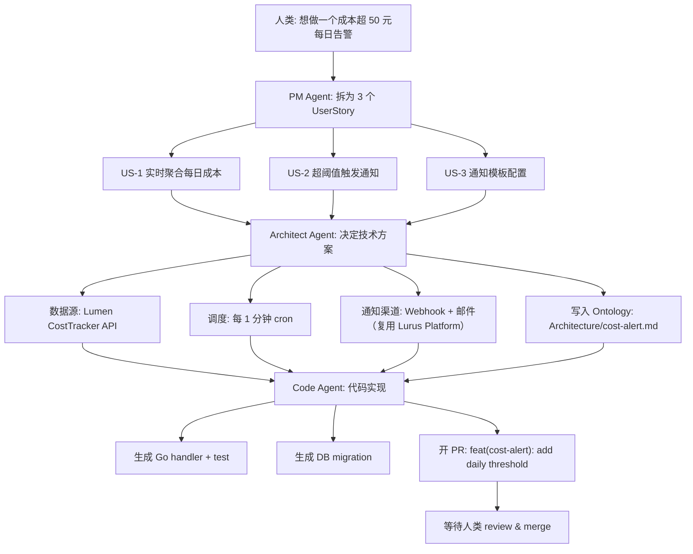

<div class="forge-sess-page">

# Session 워크플로 <StatusBadge status="beta" />

Session은 Forge의 두 번째 핵심 데이터 모델입니다. 모든 제품 논의는 하나의 Session에 담기며, 대화·결정·Agent 산출물의 완전한 타임라인을 담아냅니다.

<div class="lurus-callout lurus-callout--key">
  <span class="lurus-callout__icon"><Icon name="messages-square" :size="18" /></span>
  <div>
    <p class="lurus-callout__title">Session과 Ontology의 관계</p>
    <div class="lurus-callout__body">Session은 <strong>동적</strong> 타임라인이고, <a href="/ko/forge/ontology">Ontology</a>는 <strong>정적</strong> 구조화 지식입니다. Session 내의 결정 → Ontology 노드에 기록 / 수정됩니다.</div>
  </div>
</div>

## Session 모델

```
Session {
  id            // sess_...
  title         // "添加成本告警"
  participants  // [人类, PM Agent, Architect Agent, Code Agent]
  ontology      // 关联的 Ontology 节点列表
  turns         // 对话轮次
  artifacts     // 产出物：PRD、ADR、PR 链接
  status        // active / paused / shipped
}
```

---

<div class="lurus-section-head">
  <span class="lurus-section-head__eyebrow"><Icon name="bot" :size="14" /> 역할</span>
  <h2 class="lurus-section-head__title">세 종류의 Agent</h2>
  <p class="lurus-section-head__lede">모호한 요구사항부터 병합된 PR까지, 세 종류의 Agent가 이어달리며 협업합니다.</p>
</div>

<div class="lurus-cards lurus-cards--compact">
  <div class="lurus-card lurus-card--forge">
    <span class="lurus-card__icon"><Icon name="briefcase" :size="20" /></span>
    <div class="lurus-card__title">PM Agent</div>
    <p class="lurus-card__body">모호한 요구사항을 사용자 스토리, 인수 기준, 우선순위로 분해합니다.</p>
  </div>
  <div class="lurus-card lurus-card--forge">
    <span class="lurus-card__icon"><Icon name="network" :size="20" /></span>
    <div class="lurus-card__title">Architect Agent</div>
    <p class="lurus-card__body">아키텍처 모델링, 기술 선정, 리스크 식별을 수행하고 Ontology <code>Architecture</code> 하위 트리에 기록합니다.</p>
  </div>
  <div class="lurus-card lurus-card--forge">
    <span class="lurus-card__icon"><Icon name="code" :size="20" /></span>
    <div class="lurus-card__title">Code Agent</div>
    <p class="lurus-card__body">앞의 두 Agent 산출물을 바탕으로 코드를 작성하고, 테스트를 실행하고, PR을 엽니다.</p>
  </div>
</div>

---

<div class="lurus-section-head">
  <span class="lurus-section-head__eyebrow"><Icon name="workflow" :size="14" /> 엔드투엔드</span>
  <h2 class="lurus-section-head__title">0에서 PR까지의 전체 흐름</h2>
</div>



---

<div class="lurus-section-head">
  <span class="lurus-section-head__eyebrow"><Icon name="history" :size="14" /> 추적 가능</span>
  <h2 class="lurus-section-head__title">WAL 결정 추적</h2>
</div>

[Kova](/ko/kova/) 엔진의 WAL을 기반으로, 모든 대화와 결정이 영속화됩니다. 언제든 다음을 할 수 있습니다.

<div class="lurus-cards lurus-cards--compact">
  <div class="lurus-card lurus-card--forge">
    <span class="lurus-card__icon"><Icon name="search" :size="20" /></span>
    <p class="lurus-card__body">"왜 Redis Streams가 아니라 NATS를 선택했는지" 추적</p>
  </div>
  <div class="lurus-card lurus-card--forge">
    <span class="lurus-card__icon"><Icon name="filter" :size="20" /></span>
    <p class="lurus-card__body">"어느 Session이 마지막으로 <code>Architecture/auth.md</code>에 기록했는지" 식별</p>
  </div>
  <div class="lurus-card lurus-card--forge">
    <span class="lurus-card__icon"><Icon name="rewind" :size="20" /></span>
    <p class="lurus-card__body">하나의 Session 전체를 Replay 재생하여 회고에 활용</p>
  </div>
</div>

---

## 다음 단계

<NextSteps :steps="[
  { text: 'Ontology 자세히 보기', link: '/ko/forge/ontology', primary: true },
  { text: '로드맵', link: '/ko/forge/roadmap' },
  { text: 'Kova 엔진', link: '/ko/kova/' },
]" />

</div>
