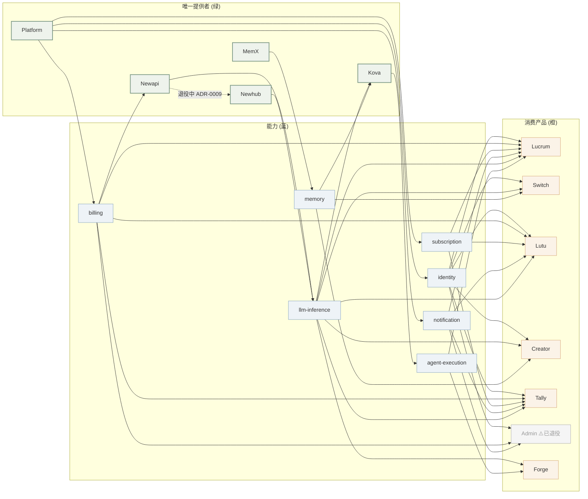

# 能力矩阵 — 15 产品 × 12 能力

横看产品，竖看能力。每个 ✓ 是该产品**现在**就具备的能力；🚧 是规划中；空白是不打算做。

> 不要用这张表当 marketing — 这是**给员工看自己产品差在哪**的诊断工具。

## 主能力矩阵

| 能力 ↓ / 产品 → | Platform | Newapi | Newhub¹ | MemX | Kova | Lumen | Forge | Lucrum | Tally | Switch | Creator | Lutu | Web | Admin² | MCP |
|---|:-:|:-:|:-:|:-:|:-:|:-:|:-:|:-:|:-:|:-:|:-:|:-:|:-:|:-:|:-:|
| **身份 (OIDC)** | ✓ | | ✓ | | | | | ✓ | 🚧 | ✓ | ✓ | ✓ | ✓ | ✓ | ✓ |
| **计费 / 钱包** | ✓ | | ✓ | | | | | ✓ | 🚧 | | | ✓ | | ✓ | |
| **订阅 / 权益** | ✓ | | | | | | | ✓ | 🚧 | | | ✓ | | ✓ | |
| **LLM 调用** | | ✓ | ✓ | | ✓ | ✓ | ✓ | ✓ | ✓ | ✓ | ✓ | | | | ✓ |
| **持久 Agent** | | | | | ✓ | 🚧 | ✓ | | | | | | | | |
| **长期记忆** | | | | ✓ | ✓ | | ✓ | ✓ | 🚧 | | ✓ | | | | |
| **MCP 协议** | | | | ✓ | ✓ | ✓ | | | | ✓ | | | | | ✓ |
| **桌面 GUI** | | | | | | | | | | ✓ | ✓ | | | | |
| **Web UI** | | ✓ | ✓ | | | | ✓ | ✓ | ✓ | | | | ✓ | ✓ | |
| **移动 APP** | | | | | | | | 🚧 | | | | ✓ | | | |
| **后台审计** | ✓ | ✓ | ✓ | | ✓ | | | ✓ | 🚧 | | | | | ✓ | ✓ |
| **多租户隔离** | ✓ | ✓ | ✓ | ✓ | ✓ | | 🚧 | ✓ | ✓ | | | ✓ | | ✓ | |

> ✓ 已具备 · 🚧 规划/dev 中 · 空白 不计划做
>
> ¹ **Newhub**：beta/stage（`test-newhub.lurus.cn`），ADR-0009 确定为 newapi 继任者；表中 ✓ 为已具备能力，整体非 prod-GA。
> ² **Admin**：已退役（ADR-0010）；列保留作历史对照，✓ **不代表当前可用**（`admin.lurus.cn` 实测 404）。

## 解读

- **平台底座是真的"底座"**：身份/计费/订阅 三项基础能力**只在 Platform 一家**。其余产品都是消费方。
- **LLM 调用扎堆走 Newapi**：14 个产品里 9 个有 LLM 能力，全部经过 Newapi。Newapi 挂 ⇒ 9 个产品 LLM 全瘫。这是已识别的最大单点。按 [ADR-0009](/adr/0009-newhub-replaces-newapi)，**newapi 退役中**，网关将切到 newhub（`hub.lurus.cn`）——单点随之迁移，但仍是单点。
- **Lucrum 现为 stage（公测）**：2026-04-30 从 prod 降级，表中 ✓ 是已具备能力，整体处于公测 / beta，非 prod-GA。
- **MCP 是新维度**：5 个产品已经支持 MCP（MemX/Kova/Lumen/Switch/MCP servers）。意味着内部"对话即操作"的入口是真在做。
- **移动是单点**：只有 Lutu。lucrum-app 已被 Lutu 吸收（[ADR-0007](/adr/0007-lutu-absorbs-lucrum-app)）。
- **Admin / Webgame 已下线**：见 [ADR-0010](/adr/0010-product-retirements)。本表保留两列作历史对照，其 ✓ **不代表当前可用**（`admin.lurus.cn` 实测 404；webgame auth 已死）。

## 反向：能力 → 提供方一览（lurus.yaml capabilities 摘录）

| 能力 (capability key) | 唯一/主要 provider | 消费方 |
|---|---|---|
| `identity` | platform | lucrum, switch, lutu, creator, tally, newapi, newhub, admin |
| `billing` | platform | lucrum, lutu, tally, newapi, newhub, admin |
| `subscription` | platform | lucrum, lutu, tally |
| `notification` | platform/notification | lucrum, lutu, admin, tally |
| `llm-inference` | newapi → newhub（ADR D1 过渡中） | switch, lucrum, lutu, forge, creator, kova, tally |
| `memory` | memx | kova, creator, switch, lucrum (规划) |
| `agent-execution` | kova | forge, lucrum (规划) |

## 能力依赖图

## 缺口检查（员工自检用）

下面这些组合**今天没人做**。如果你接到客户问"Lurus 有没有 X"，先来这表对一遍：

| 客户问 | 现状 | 临时绕行 |
|---|---|---|
| "你们的内容工厂能在企业云部署吗？" | ❌ Creator 是桌面 only | 用 Forge + 自己 schedule |
| "进销存能下到手机用吗？" | ❌ Tally 没有移动端 | Tally web (响应式) → Lutu 后续吸收 |
| "我能在 Lutu 里做量化吗？" | 🚧 lucrum-app 已吸收，但能力未全部移植 | Web 端用 Lucrum |
| "Forge 能给客户用吗？" | ❌ 内部 R&D，beta，非交付 | 暂不暴露 |
| "MemX 能跨用户共享公共记忆吗？" | ❌ 当前都按 user_id+agent_id 隔离 | 用 namespace 约定 |
| "Kova 支持人在环 (HITL) 审批吗？" | 🚧 路线图 | 当前用 step 暂停 + 外部触发 |

## 性能 / 容量基线（请季度更新）

| 维度 | Platform | Newapi | MemX | Kova |
|---|---|---|---|---|
| QPS 上限（实测） | ~2k/s | ~5k/s | ~500/s | ~50 任务/s |
| p95 延迟 | <50ms | <200ms（不含上游 LLM） | <300ms | 任务级 |
| 关键瓶颈 | postgres conn | 上游 LLM 限流 | embedding 速率 | postgres + checkpoint 写 |
| 扩容方式 | 加 replica + pg pool | 加 replica + 多上游 channel | 加 worker + 读副本 | 加 worker + 分片 |

> 数字按经验估，不是 SLA。生产观测用 grafana.lurus.cn / jaeger.lurus.cn。

## 维护建议

每季度复审本表（在 [roadmap](/roadmap/) 周期里一并做）：
- 新增产品 → 加列
- 能力升级 → 把 🚧 改 ✓
- 砍掉的能力 → 改空白 + 在 [postmortems](/postmortems/) 留痕
