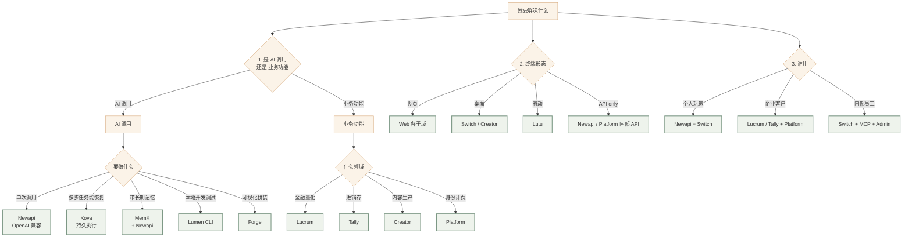
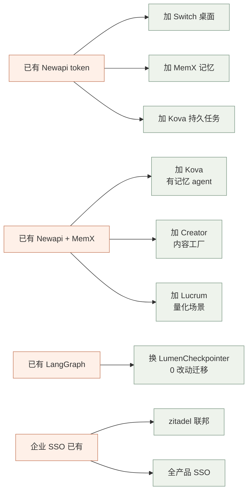
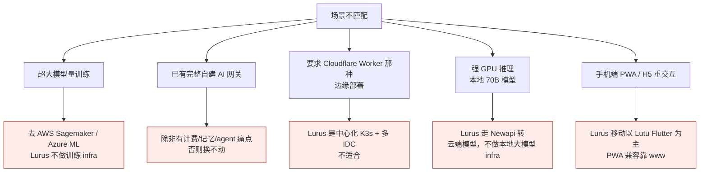

<Icon name="git-branch" :size="14"/> 横向视角<h2 class="lurus-section-head__title">决策路由 — "我有 X 需求，该用哪个 Lurus 产品？"</h2>
让你（员工 / 销售 / 客户）一句话问出需求，几步点到答案。

<Icon name="search" :size="18"/>

这不替代单产品手册

点到答案后，请去对应产品手册做精细决策。

## 一句话索引

| 我想... | 答案 |
|---|---|
| 调用大模型 / 多模型混用 | [Newapi](/products/newapi) |
| 让 AI 记住用户偏好 / 历史 | [MemX](/products/memx) |
| 跑长任务（>5 分钟）能中断恢复 | [Kova](/products/kova) |
| 在本地开发 agent，调试看 trace | [Lumen](/products/lumen) |
| 让 PM/非工程师也能拼 AI 流程 | [Forge](/products/forge) |
| 本地桌面 chat 多模型 / MCP 工具 | [Switch](/products/switch) |
| 批量做视频 / 文章 / 短视频 | [Creator](/products/creator) |
| 量化交易 / 策略生成回测实盘 | [Lucrum](/products/lucrum) |
| 中小商户进销存 / 自动开单 | [Tally](/products/tally) |
| 做 iOS/Android 端用户入口 | [Lutu](/products/lutu) |
| 用户身份 / 钱包 / 订阅 / 计费 | [Platform](/products/platform) |
| 内部 chat 化运维 zitadel/k8s/platform | [MCP servers](/products/mcp) |
| 内部业务后台管账 / 退款 / 审计 | [Admin](/products/admin) |
| 公网门面页 / 落地页 / 游戏 | [Web](/products/web) |

## 大决策树（按需求维度）

## 按"客户原话"反查

销售/CS 把客户原话扔进来，找最接近的那一行。

| 客户原话 | 推荐组合 | 关键考量 |
|---|---|---|
| "我们想用 ChatGPT，但要私有数据" | Newapi 私有化 + Platform | 数据本地，模型仍走云 |
| "想做客服 AI，要记得老客户" | Newapi + MemX + Kova | 配方 #1 |
| "做股票交易策略" | Lucrum 整套 | 配方 #3 |
| "我们卖货，账是手记的" | Tally | 还在规划，给 demo |
| "想给员工内部用 AI 工具" | Newapi + Switch + 3 MCP | 配方 #5 |
| "做短视频内容批量生产" | Creator + Newapi + MemX | 配方 #6 |
| "我们已经有 LangGraph 项目" | Lumen 替换 checkpointer | 配方 #7 |
| "我自己卖 AI 服务给客户，要计费" | Newapi + Platform | 配方 #8 |
| "客户公司用 Azure AD，能接吗" | Platform + zitadel 联邦 | 配方 #4 |
| "想做 AI app，最好 iOS / 安卓都有" | Lutu（Flutter）+ Platform | 单移动栈 |
| "中后台管理用什么" | Admin（内部用）/ 客户自建 | Admin 不开放 |

## 按"我已经有 X，怎么扩" 演进路径

## 我**不**该用 Lurus 哪些产品

<Icon name="alert-circle" :size="18"/>

诚实地说

下面几类用户我们暂时回应不好 —— 别硬塞，按下图指到更合适的方案。

## 按"决策者关心什么"反查

| 决策者关心 | 看哪个文档 |
|---|---|
| 自建 vs Lurus 总成本 (TCO) | [能力矩阵](/cross/capability-matrix) + [集成配方](/cross/integration-recipes) |
| 数据私有化合规 | [adr/0001-three-tier-envs](/adr/0001-three-tier-envs) |
| SSO 联邦 | 配方 #4 + [adr/0002-zitadel-as-oidc](/adr/0002-zitadel-as-oidc) |
| 24/7 可用性 | [ops/incident-response](/ops/incident-response) |
| 数据备份 | [ops/db-backup](/ops/db-backup) |
| 升级路径 / roadmap | [/roadmap/](/roadmap/) |
| 单点故障风险 | [/org/](/org/) bus factor |

## 当客户问"X vs 你们" 怎么答

| X | Lurus 等价物 | 关键差异（一句） |
|---|---|---|
| OpenAI 直连 | Newapi | 多模型聚合 + 计费聚合 + 私有化 |
| Mem0 / LangMem | MemX | 内嵌 ACE 合并 + Lurus 计费打通 |
| LangGraph + SqliteSaver | Kova + Lumen | 生产级中断恢复 + 部署托管 |
| Cursor / Aider | Switch | 桌面端 + 多模型 + MCP |
| Buffer / Zenscape | Creator | AI 原生 pipeline + 多平台 |
| 米筐 / 聚宽 | Lucrum | 自托管 + AI 原生策略生成 |
| 金蝶 / 管家婆 | Tally（规划） | AI-native + 拍照入库 |
| Auth0 / Keycloak | Platform Auth (zitadel) | 内嵌钱包/订阅，统一身份+计费 |
| Retool / Forest Admin | Admin（内部不开放） | 客户应自建 |

## 用法

<ol class="lurus-steps">
<li><strong>销售第一通电话</strong>：先问 3-5 个核心问题，把客户定位到"按客户原话"那张表的某行。</li>
<li><strong>客户深聊</strong>：跳到具体产品手册的核心数据流 + 数据契约章节。</li>
<li><strong>决策者要 PPT</strong>：拿这页 + <a href="/cross/capability-matrix">能力矩阵</a> + <a href="/cross/integration-recipes">集成配方</a> 三张图直接抄。</li>
</ol>
