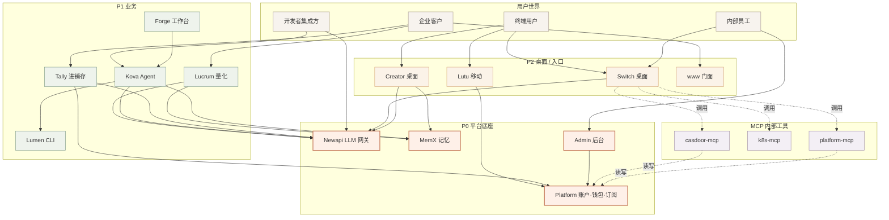
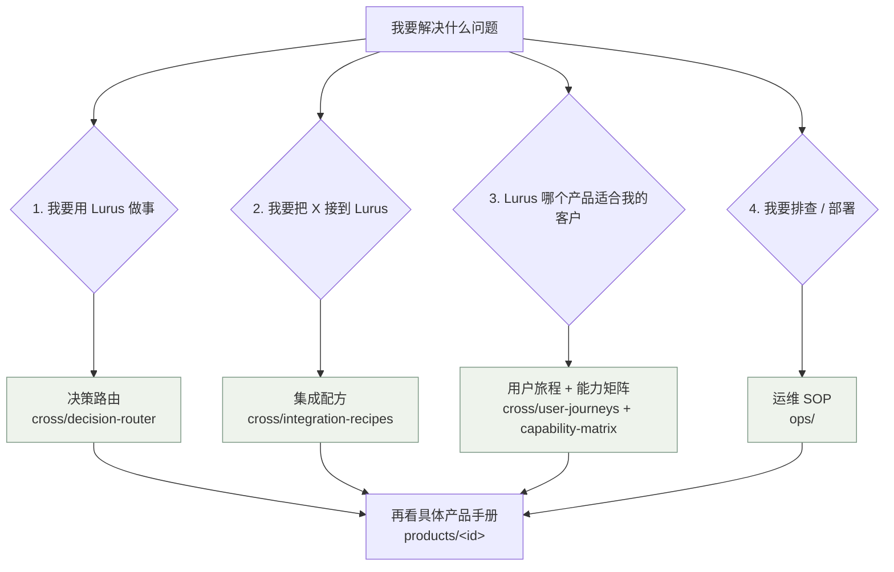

<Icon name="layers" :size="14"/> 横向视角<h2 class="lurus-section-head__title">跨产品速查</h2>
单产品手册回答 "这个产品怎么用"；这一组横向页面回答 "14 个产品凑一起怎么用"。

<Icon name="search" :size="18"/>

找单产品手册

单产品手册 → <code>/products/&lt;id&gt;</code>，索引在导航栏 <strong>产品手册</strong>。

## 四张总览

| 页面 | 适合谁 | 一句话 |
|---|---|---|
| <Icon name="layers" :size="15"/> [能力矩阵](/cross/capability-matrix) | 决策者 / PM | 14 产品 × 12 能力的勾选表，找重合与缺口 |
| <Icon name="users" :size="15"/> [用户旅程](/cross/user-journeys) | 客户成功 / 销售 / 决策者 | 4 类用户从注册到续费的全流程图 |
| <Icon name="workflow" :size="15"/> [集成配方](/cross/integration-recipes) | 开发者 / 架构师 | 真实跨产品组合的可复用 recipe |
| <Icon name="git-branch" :size="15"/> [决策路由](/cross/decision-router) | 任何人 | "我有 X 需求，该用 Lurus 哪个产品？" 决策树 |

## 系统全貌（一图速览）

<Icon name="eye" :size="18"/>

怎么读这张图

从你是谁（用户世界）出发，看你会进入哪个入口（P2），那个入口背后调用哪些业务（P1），所有业务最终都接平台底座（P0）。MCP 是把后台直接桌面化，让员工 chat 操作。

> 一句话产品速记见 [决策路由](/cross/decision-router) 的一句话索引表。

## 四类典型问题怎么找答案

## 阅读顺序建议

<strong><Icon name="users" :size="16"/> 新员工</strong>
先看 <a href="/onboarding/">七天入职 onboarding</a>，再读这页 → <a href="/cross/capability-matrix">能力矩阵</a>，挑 1 个产品深入。

<strong><Icon name="trending-up" :size="16"/> 新销售</strong>
<a href="/cross/user-journeys">用户旅程</a> → <a href="/cross/decision-router">决策路由</a>（学着回答客户"我该用哪个"）。

<strong><Icon name="check-circle" :size="16"/> 新客户成功 / PM</strong>
<a href="/cross/capability-matrix">能力矩阵</a> → <a href="/cross/user-journeys">用户旅程</a> → 读你负责产品的手册。

<strong><Icon name="hammer" :size="16"/> 新工程师</strong>
<a href="/cross/integration-recipes">集成配方</a> → 读你接手产品的手册 → <a href="/ops/">运维 SOP</a>。

