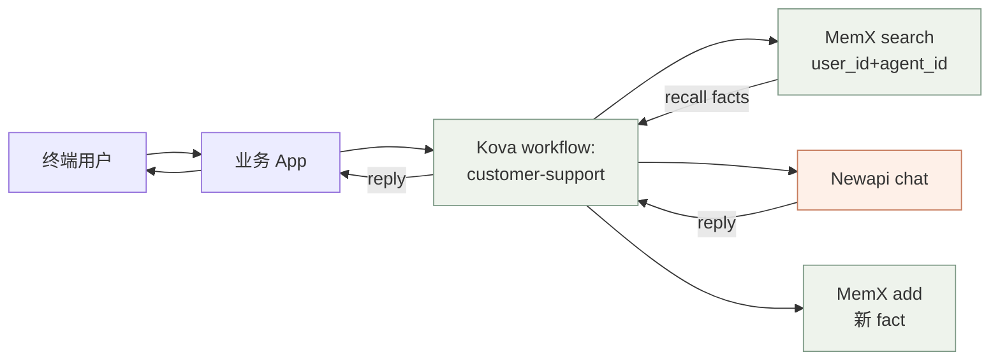
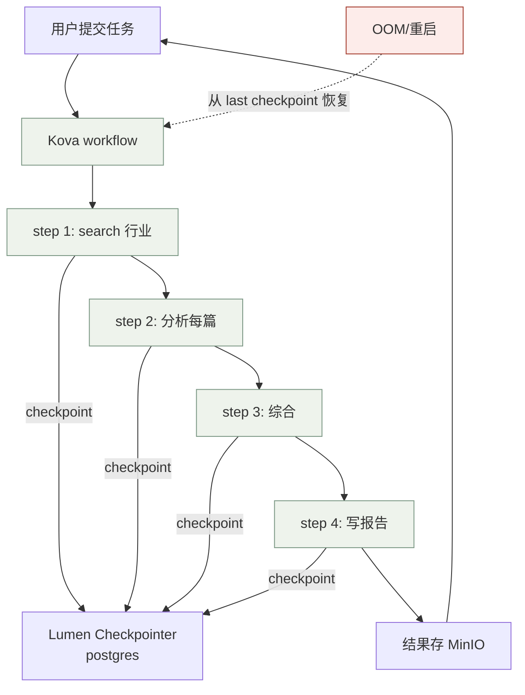
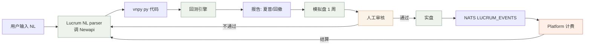
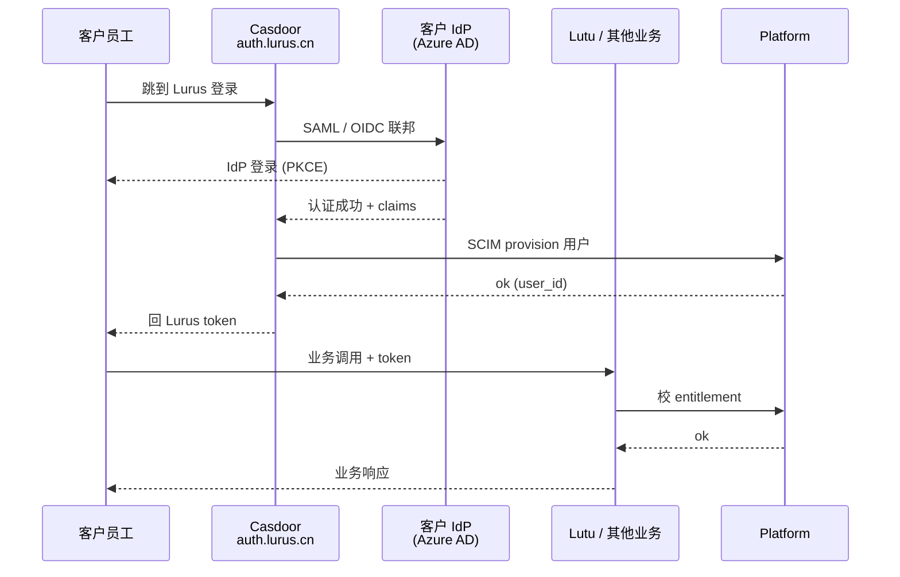
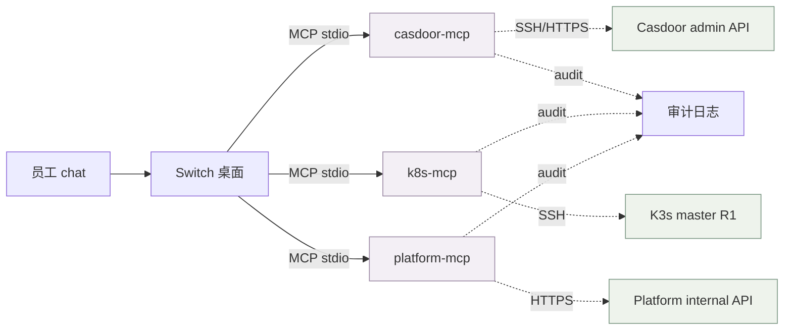
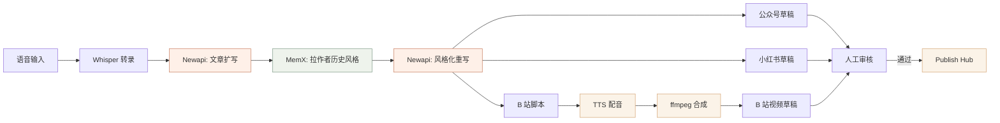
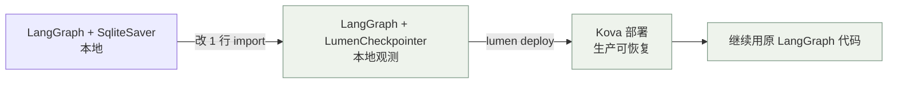
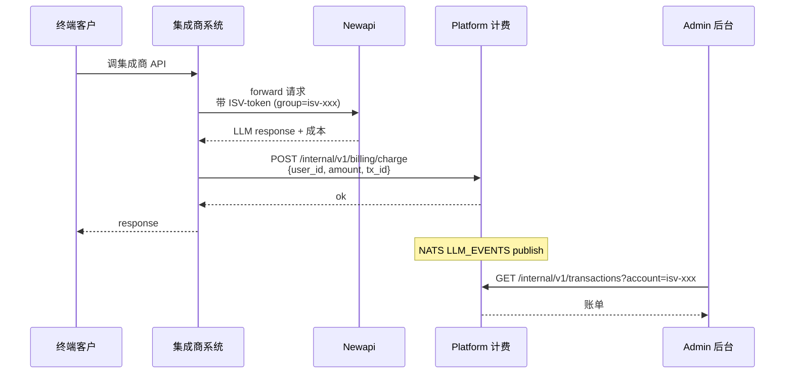

<div class="lurus-section-head"><span class="lurus-section-head__eyebrow"><Icon name="workflow" :size="14"/> 横向视角</span><h2 class="lurus-section-head__title">集成配方 — 跨产品组合的可复用方案</h2><p class="lurus-section-head__lede">把单产品手册末尾的跨产品集成场景横向汇总，加上更复杂的多端组合，按业务目标分类。</p></div>

<div class="lurus-callout lurus-callout--info"><span class="lurus-callout__icon"><Icon name="package" :size="18"/></span><div><p class="lurus-callout__title">每条配方的结构</p><div class="lurus-callout__body">业务目标 / 涉及产品 / 数据流图 / 关键代码 / 部署要点 / 常见坑。</div></div></div>

## 配方索引

| # | 配方 | 涉及产品 | 难度 | 适合场景 |
|---|---|---|:-:|---|
| 1 | [带长期记忆的 AI 客服](#配方-1-带长期记忆的-ai-客服) | Newapi + MemX + Kova | ★★ | SaaS 客服 / 教育答疑 |
| 2 | [可中断的多步研究 Agent](#配方-2-可中断的多步研究-agent) | Kova + Lumen + Newapi | ★★★ | 长 task / 行研报告 |
| 3 | [量化策略 NL → 实盘全链](#配方-3-量化策略-nl-实盘全链) | Lucrum + Newapi + Platform | ★★★ | 量化客户 |
| 4 | [企业 SSO 联邦 + 业务接入](#配方-4-企业-sso-联邦-业务接入) | Platform + casdoor + Lutu | ★★ | 企业私有化 |
| 5 | [chat 化运维（员工内部用）](#配方-5-chat-化运维) | Switch + 3 MCP servers + Tailscale | ★ | 内部运维 |
| 6 | [内容工厂多平台分发](#配方-6-内容工厂多平台分发) | Creator + Newapi + MemX | ★★ | KOL / 自媒体 |
| 7 | [LangGraph 项目零改动迁移到 Lurus](#配方-7-langgraph-迁移) | Lumen + Kova | ★ | 已有 LangGraph 用户 |
| 8 | [按用量计费的 LLM 转售](#配方-8-按用量计费的-llm-转售) | Newapi + Platform + Admin | ★★ | 集成开发商 |

---

## 配方 1: 带长期记忆的 AI 客服

**业务目标**：客户每次对话不需要重复说"我是 vip 8 级"、"我去年问过 X"，AI 能自然记住。



**关键代码（Python，伪 SDK）**：

```python
import lurus

kova = lurus.Kova(api_key=os.environ["KOVA_API_KEY"])
memx = lurus.MemX(base_url="https://memx.lurus.cn")
chat = lurus.NewAPI(base_url="https://newapi.lurus.cn", api_key=os.environ["NEWAPI_TOKEN"])

@kova.workflow("customer-support")
async def customer_support(ctx, user_id: str, message: str):
    # 1. 召回相关记忆
    facts = await memx.search(user_id=user_id, agent_id="cs", query=message, top_k=5)

    # 2. 拼 prompt
    system = f"你是客服。已知该用户档案：\n{facts.format()}"
    reply = await chat.complete(system=system, user=message, model="claude-sonnet-4")

    # 3. 抽取新 fact 写回（异步，不阻塞回复）
    ctx.spawn(memx.add_from_dialog(user_id=user_id, agent_id="cs", dialog=[message, reply]))

    return reply
```

**部署要点**：

<ol class="lurus-steps">
<li>Kova workflow 部署到 R1，配 LumenCheckpointer（中断也能恢复）。</li>
<li>MemX 调用走 lurus-system 内网 svc 名（不要走公网）。</li>
<li>Newapi token 用 group=customer-support 单独限流，避免抢配额。</li>
</ol>

**常见坑**：

| 坑 | 现象 | 修复 |
|---|---|---|
| user_id+agent_id 没分租户 | 跨用户串记忆 | 严格按 `user_id:agent_id` 命名 |
| memx 返回 5 条全塞 prompt | token 暴涨成本 | top_k=3 + 重排序 |
| 抽取新 fact 同步等 | 回复延迟翻倍 | 异步 spawn，回复优先 |

---

## 配方 2: 可中断的多步研究 Agent

**业务目标**：用户问"帮我研究 A 行业 2026 趋势"，agent 跑 5-10 分钟，OOM/重启都能继续。



**关键代码（Rust 风格 pseudo）**：

```rust
let workflow = kova::WorkflowBuilder::new("industry-research")
    .checkpointer(lumen::PostgresCheckpointer::new(&pg_url)?)
    .step("search", search_industry)
    .step("analyze", analyze_each)
    .step("synthesize", synthesize)
    .step("write", write_report)
    .max_duration(Duration::from_secs(900))
    .retry_policy(RetryPolicy::ExponentialBackoff { max: 3 })
    .build();

workflow.run(input).await?;  // 中断后再 run 同 task_id 自动续上
```

**部署要点**：

<ol class="lurus-steps">
<li>用 Lumen 的 PostgresCheckpointer，<strong>不要</strong> in-memory（<a href="/products/lumen">lumen 最佳实践</a>）。</li>
<li>每 step 必有明确 input/output schema。</li>
<li>max_duration 设上限，防失控。</li>
</ol>

---

## 配方 3: 量化策略 NL → 实盘全链

**业务目标**：客户输入"双均线策略"自然语言 → 生成 vnpy 代码 → 回测 → 模拟盘 → 实盘上架。



**关键代码（Go pseudo）**：

```go
func RunStrategy(ctx context.Context, nl string) error {
    code, err := lucrum.NLToVnpyCode(ctx, nl)  // 走 newapi multi-model
    if err != nil { return err }

    btResult, err := lucrum.Backtest(ctx, code, lucrum.YearAgo())
    if err != nil { return err }

    if btResult.Sharpe < 1.0 || btResult.MaxDrawdown < -0.20 {
        return ErrStrategyTooRisky  // 直接卡死，不走人工
    }

    if err := lucrum.SimulateRun(ctx, code, 7*24*time.Hour); err != nil { return err }

    if !lucrum.HumanApproval(ctx, code) { return ErrRejected }

    return lucrum.DeployLive(ctx, code)
}
```

**部署要点**：

<div class="lurus-callout lurus-callout--danger"><span class="lurus-callout__icon"><Icon name="alert-triangle" :size="18"/></span><div><p class="lurus-callout__title">回测和实盘必须分账户</p><div class="lurus-callout__body">见 <a href="/products/lucrum">lucrum 最佳实践</a>。混用账户会让回测污染实盘资金。</div></div></div>

<ol class="lurus-steps">
<li>风控参数（仓位/止损）独立配置文件，<strong>不写代码</strong>。</li>
<li>NL → 代码生成走 newapi 多模型对比（三家投票），降低单模型 bias。</li>
</ol>

---

## 配方 4: 企业 SSO 联邦 + 业务接入

**业务目标**：企业客户用自己的 IdP（Azure AD / OKTA / Keycloak），接 Lurus 全产品。



**关键步骤（runbook）**：

```bash
# 1. casdoor admin 加 SAML/OIDC IdP
casdoor-admin idp create --type saml --metadata-url $CUSTOMER_IDP_URL

# 2. 配 SCIM 自动 provision
casdoor-admin scim enable --provider azure-ad

# 3. 在客户 IdP 登记 Lurus SP
# entityID: https://auth.lurus.cn/saml/v2/metadata
# ACS:      https://auth.lurus.cn/saml/v2/acs

# 4. 测试登录
curl -L "https://auth.lurus.cn/oauth/v2/authorize?client_id=$CID&..."
```

**部署要点**：

<ol class="lurus-steps">
<li>走 casdoor-mcp 在 Switch 里 chat 操作（<a href="/products/mcp">mcp 手册</a>）。</li>
<li>SCIM 配置变更先在 R6 staging 验证 1 周。</li>
<li>提供 break-glass 本地账户（联邦失效兜底）。</li>
</ol>

---

## 配方 5: chat 化运维

**业务目标**：员工在 Switch 里 chat 直接操作 casdoor/k8s/platform，比手敲命令快。



**Switch 的 mcp.json 配置**：

```jsonc
{
  "mcpServers": {
    "casdoor": {
      "command": "/usr/local/bin/casdoor-mcp",
      "env": { "OIDC_PAT": "...", "READONLY": "false" }
    },
    "k8s": {
      "command": "/usr/local/bin/k8s-mcp",
      "env": { "KUBECONFIG": "~/.kube/config-r1", "READONLY": "true" }
    },
    "platform": {
      "command": "/usr/local/bin/platform-mcp",
      "env": { "INTERNAL_API_KEY": "...", "READONLY": "false" }
    }
  }
}
```

**chat 例子**：

```
员工: 把 user@x.com 的 MFA 重置一下
Switch: [casdoor.reset_mfa] 调用中...
        要确认对 user@x.com 操作吗？(y/n)
员工: y
Switch: ✓ 已重置，审计日志 audit-id=abc123
```

**部署要点**：

<div class="lurus-callout lurus-callout--danger"><span class="lurus-callout__icon"><Icon name="shield-check" :size="18"/></span><div><p class="lurus-callout__title">3 个 MCP server 全部只暴露给 Tailscale</p><div class="lurus-callout__body">公网封死。READONLY 模式建议默认开，写操作要手动切。审计日志走 platform-core，不依赖 chat 历史。</div></div></div>

---

## 配方 6: 内容工厂多平台分发

**业务目标**：录一段语音 → 自动生成视频 + 公众号文 + 小红书笔记。



**Creator pipeline DSL（YAML）**：

```yaml
name: voice-to-multi-platform
steps:
  - id: transcribe
    type: whisper
    input: voice.mp3
  - id: rewrite
    type: newapi
    model: claude-sonnet-4
    prompt_template: rewrite-with-style
    context:
      style: "{{ memx.search('author-style', user_id) }}"
  - id: split
    type: branch
    children: [wechat, xhs, bilibili]
  - id: bilibili
    type: pipeline
    sub:
      - { type: tts, voice: "xiaoyun" }
      - { type: ffmpeg, template: explain-talking-head }
  - id: review
    type: human-approval
    timeout: 24h
  - id: publish
    type: publish-hub
    targets: ["wechat", "xhs", "bilibili-draft"]
```

---

## 配方 7: LangGraph 迁移

**业务目标**：客户已经在用 LangGraph，零代码改造迁到 Lurus。



**核心改动（1 行）**：

```python
# 改前
from langgraph.checkpoint.sqlite import SqliteSaver
saver = SqliteSaver.from_conn_string("checkpoint.db")

# 改后
from lumen.checkpoint import LumenCheckpointer
saver = LumenCheckpointer(env="dev")  # dev 用本地 sqlite, prod 自动 postgres
```

**部署要点**：

<ol class="lurus-steps">
<li><code>lumen init</code> 一次，生成本地工作目录。</li>
<li><code>lumen deploy</code> 推到 Kova。</li>
<li>LangGraph 的 graph 定义、tool、prompt <strong>全保留</strong>。</li>
</ol>

---

## 配方 8: 按用量计费的 LLM 转售

**业务目标**：集成开发商把 Lurus Newapi 包装成自己的产品，按用量给终端客户计费。



**关键步骤**：

<ol class="lurus-steps">
<li>Admin 后台给集成商创建 group + 限流配额（<a href="/products/admin">admin 手册</a>）。</li>
<li>集成商业务系统：拿到 newapi 调用成本 → 加自己的 markup → 写到 platform 计费。</li>
<li>Admin 月度账单导出（<a href="/products/platform">platform 最佳实践</a> 中有月报 SQL）。</li>
</ol>

---

## 怎么用这些配方

<div class="lurus-grid--products">
<div class="lurus-card"><strong><Icon name="rocket" :size="16"/> 现成的</strong><p>直接 fork 代码片段开干，预期 1 天内跑通。</p></div>
<div class="lurus-card"><strong><Icon name="git-merge" :size="16"/> 自定义的</strong><p>参考数据流图作为基础，替换具体步骤。</p></div>
<div class="lurus-card"><strong><Icon name="workflow" :size="16"/> 新业务讨论</strong><p>用 mermaid 画类似的图，3 个图带来的对话效率比 30 句描述强。</p></div>
</div>

> 缺哪个配方？写到 [Roadmap](/roadmap/) 让其他员工接着做。
