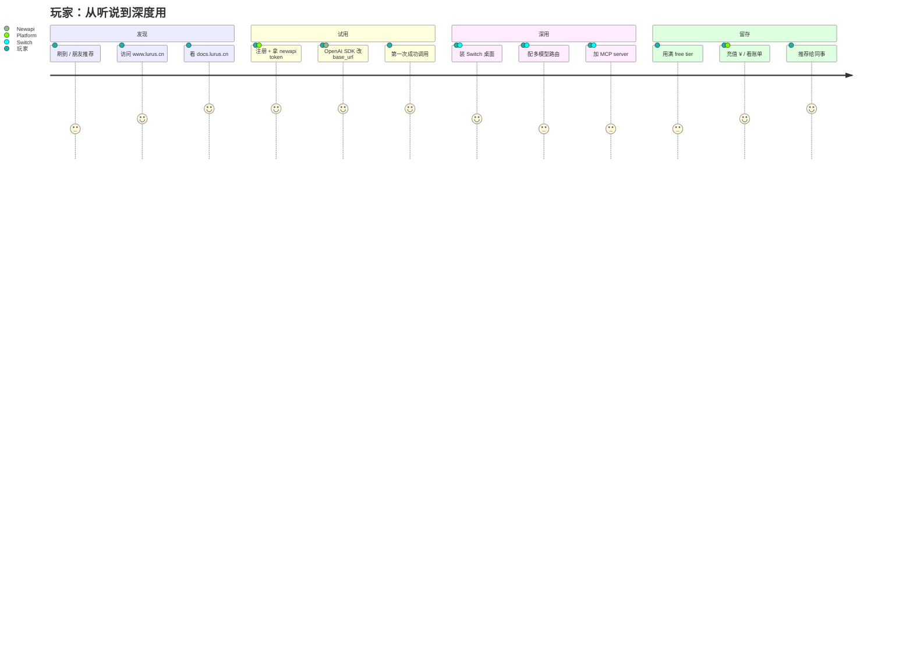
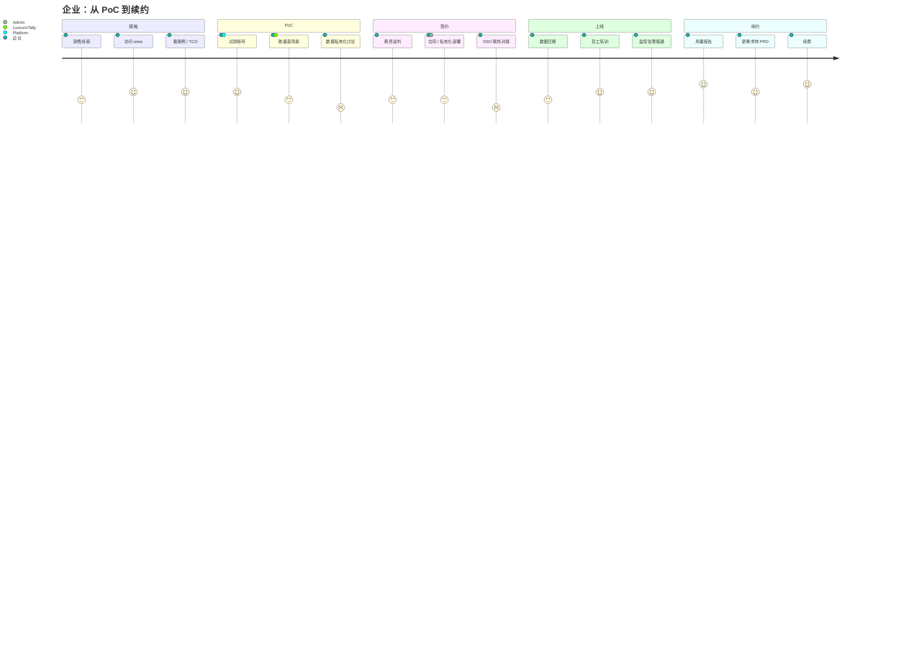
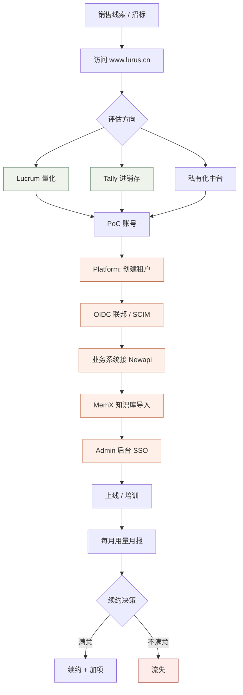
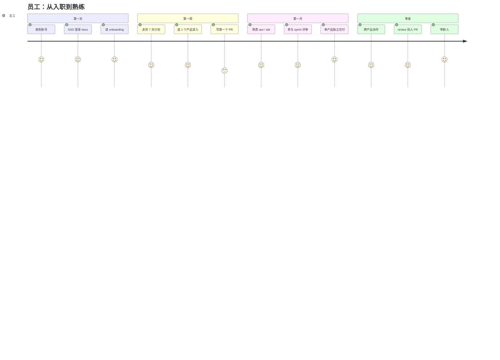
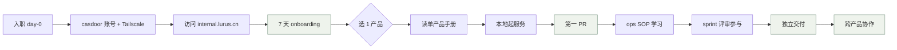
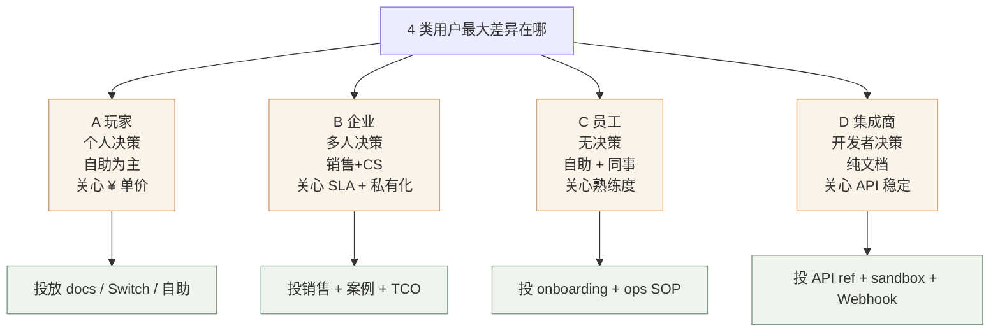

```mermaid
graph LR
  A1[听说 / 推荐] --> A2[访问 www.lurus.cn]
  A2 --> A3[读 docs / quickstart]
  A3 --> A4[casdoor 注册账户]
  A4 -->|Platform| A5[拿到 newapi token]
  A5 -->|Newapi| A6[OpenAI SDK 改 base_url 跑通]
  A6 --> A7{满意吗}
  A7 -->|是| A8[装 Switch 桌面]
  A7 -->|否| A99[流失]
  A8 -->|Switch| A9[配多模型路由]
  A9 --> A10[加 MCP server]
  A10 --> A11[免费额度耗尽]
  A11 -->|Platform 钱包| A12[充值]
  A12 --> A13[活跃用户]

  classDef p0 fill:#fef0e8,stroke:#C67B5C
  classDef p2 fill:#fbf3e8,stroke:#D4A373
  classDef bad fill:#fdecea,stroke:#a3392b
  class A4,A5,A11,A12 p0
  class A8,A9,A10 p2
  class A99 bad
```

<Icon name="users" :size="14"/> 横向视角<h2 class="lurus-section-head__title">用户旅程 — 4 类用户的全流程</h2>
把用户分成 4 类，从第一次接触 Lurus 到续费/流失全流程画出来；每条旅程标出涉及产品、关键卡点、已做好的部分、还差什么。

<Icon name="radar" :size="18"/>

用法

销售 / 客户成功带客户走流程时，对照旅程图找差距。

## 4 类用户速览

| 用户 | 典型画像 | 主入口 | 次要触点 | 主要价值产品 |
|---|---|---|---|---|
| <Icon name="terminal" :size="15"/> **A. 玩家 / 个人开发者** | 想用 AI 做点东西的程序员 | Switch / Newapi | docs / Creator | Newapi + Switch |
| <Icon name="users" :size="15"/> **B. 企业客户** | 中小公司 IT/业务负责人 | www / Tally / Lucrum | 销售 + Admin | Platform + Tally / Lucrum |
| <Icon name="shield" :size="15"/> **C. 内部员工** | Lurus 公司员工 | Admin / Switch + MCP | docs / 内部站 | 内部全套 |
| <Icon name="plug-zap" :size="15"/> **D. 集成开发商** | 把 Lurus 嵌进自己产品 | docs / API | Newapi / Platform | Newapi + Platform API |

<Icon name="terminal" :size="14"/> 旅程 A<h2 class="lurus-section-head__title">玩家 / 个人开发者</h2>
个人决策、自助为主、关心 ¥ 单价。

### 全流程图

### 关键卡点 + 现状

| 阶段 | 卡点 | 现在能给什么 | 缺什么 |
|---|---|---|---|
| 注册 | OIDC 跳转流不熟 | casdoor + PKCE quickstart | 中文上手视频 |
| 拿 token | 不知道哪个 model 选 | docs/api/overview 列了 50+ | 模型推荐表（按场景） |
| 跑通调用 | 限流 429 | newapi 默认 group + 限流 | 友好的限流报错文案 |
| 装 Switch | Win 杀软误报 | 暂无 | 代码签名 |
| 充值 | 不知道单价 | Platform 计费透明 | 一键预估对话费用 |

<Icon name="users" :size="14"/> 旅程 B<h2 class="lurus-section-head__title">企业客户</h2>
多人决策、销售 + CS 推动、关心 SLA + 私有化。

### 全流程图

### 关键卡点 + 现状

| 阶段 | 卡点 | 现在能给 | 缺什么 |
|---|---|---|---|
| 评估 | 客户问"你们对比 X 怎么样" | 销售有 [能力矩阵](/cross/capability-matrix) | TCO 计算器 |
| PoC | 数据导入费力 | 各产品手册核心数据流 + 数据契约章节（端到端示例待补充） | 数据迁移工具集 |
| 私有化 | 部署文档分散 | [ops/deploy-r6](/ops/deploy-r6) | 一键私有化脚本 |
| SSO 联邦 | 配联邦门槛高 | [adr/0002-zitadel-as-oidc](/adr/0002-zitadel-as-oidc) | 演示视频 + 模板 |
| 续约 | 无月用量报告自动化 | Platform 后台手查 | 自动月报推送 |

<Icon name="activity" :size="18"/>

"监控告警接通" 这一环

内部观测已统一到 <strong>Netdata 自托管 Agent</strong>；接入与查看入口见 <a href="/ops/observability">运维 · 可观测性</a>。

<Icon name="shield" :size="14"/> 旅程 C<h2 class="lurus-section-head__title">内部员工</h2>
无决策、自助 + 同事带、关心熟练度。

### 全流程图

### 关键卡点 + 现状

| 阶段 | 卡点 | 现在能给 | 缺什么 |
|---|---|---|---|
| Day-0 | 账号开通慢 | 手动 casdoor + Tailscale 邀请 | 自助开通流 |
| 7 天 | 不知道先看什么 | [/onboarding/](/onboarding/) 7 天计划 | 视频版 |
| 第一周 | 本地起服务卡 | 各产品 README + ops SOP | 一键 dev container |
| ops 学习 | SOP 散落 | [/ops/](/ops/) 12 篇集中 | 演练脚本 |

```mermaid
graph LR
  D1[GitHub / 找 Lurus API] --> D2[访问 docs.lurus.cn]
  D2 --> D3[读 api/overview]
  D3 --> D4[casdoor 注册 + 拿 PAT]
  D4 -->|Platform| D5[内嵌登录走 OIDC]
  D5 --> D6[业务调 Newapi]
  D6 --> D7[Webhook 接 NATS 事件]
  D7 -->|Platform/notification| D8[告警 / 通知]
  D8 --> D9[上 prod]
  D9 --> D10[月度对账]

  classDef p0 fill:#fef0e8,stroke:#C67B5C
  class D4,D5,D8,D10 p0
```

<Icon name="plug-zap" :size="14"/> 旅程 D<h2 class="lurus-section-head__title">集成开发商</h2>
开发者决策、纯文档驱动、关心 API 稳定。

| 阶段 | 卡点 | 现在能给 | 缺什么 |
|---|---|---|---|
| 找 API | 看不懂三套 token（casdoor / PAT / newapi token）的区别 | docs/api/authentication 有图 | 速查决策树 |
| 内嵌 OIDC | redirect_uri 配置错 | casdoor 客户端模板 | OAuth playground |
| Webhook | NATS 接入文档薄 | adr/0004-temporal | NATS 接入 quickstart |

## 横向对比：4 类用户的差异

## 怎么用这页

<strong><Icon name="trending-up" :size="16"/> 销售</strong>
跟客户讲方案前 5 分钟看 <strong>B 路径</strong>，自检是否有 PoC 卡点。

<strong><Icon name="check-circle" :size="16"/> CS</strong>
客户报问题，先定位它在路径哪一环，再决定升级到 PM / 工程。

<strong><Icon name="users" :size="16"/> 新员工</strong>
照 <strong>C 路径</strong>走一遍。

<strong><Icon name="plug-zap" :size="16"/> 集成开发商</strong>
<strong>D 路径</strong>整段贴给客户。

