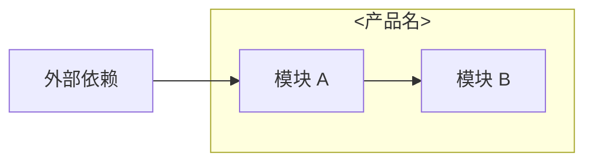
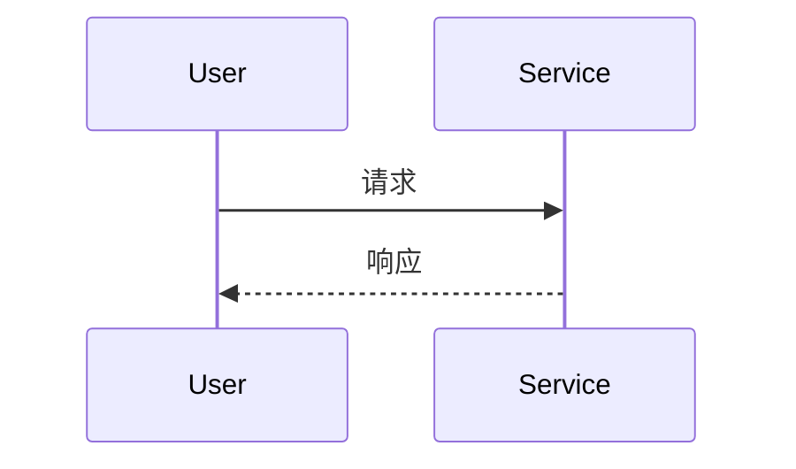

# &lt;产品名&gt; 内部手册

> ⚠️ 仅限内部员工查阅。包含运维细节、决策档案、未公开问题。

## 一句话定位

&lt;2-3 句话给新员工的解释，重点：是什么 + 为谁服务 + 与其他产品的关系&gt;

## 速查

| 项 | 值 |
|---|---|
| 仓库 | github.com/... |
| 镜像 | ghcr.io/... |
| 域名 | xxx.lurus.cn |
| 端口 | 8xxx |
| 命名空间 | lurus-xxx |
| 数据存储 | PG schema xxx + Redis db x + NATS stream xxx |
| 关键依赖 | Platform identity / Newapi / ... |
| 部署目标 | R1 / R6 / Desktop |

## 架构图



## 核心数据流



## 代码地图

| 路径 | 职责 |
|---|---|
| `cmd/server/main.go` | 入口 |
| `internal/app/` | 业务编排 |

## 部署

- 构建: `CGO_ENABLED=0 go build ...`
- CI: `.github/workflows/...`
- 镜像 tag: `main-<sha7>`
- ArgoCD app: `deploy/argocd/...`
- 配置: env / configmap / secret 各自来源

## 运行与运维

- 健康检查: `GET /healthz`
- 日志: `kubectl logs -n lurus-xxx deploy/...`
- 关键指标: QPS / p95 latency / error rate
- 重启: `kubectl rollout restart deployment/...`

## 数据契约

- **上游消费的 capabilities**: identity / billing / ...
- **下游消费者**: 哪些服务 / 客户端调用我
- **关键 API**: `POST /api/v1/...`
- **NATS event**: `XXX_EVENTS` 上发布 `event_type=...`
- **DB 表**: `schema.table` (主键/索引)

## 已知坑（内部专属，不写公网）

1. &lt;真实问题，例如 "init 时如果 PG 连不上会 panic 而不是 retry，重启依赖于 K8s liveness probe"&gt;
2. &lt;例如 "metric 没接 Prometheus，目前靠日志 grep 排障"&gt;

## 决策档案

| 时间 | 决策 | 理由 / 失败原因 |
|---|---|---|
| 2026-XX-XX | 选 X 而不是 Y | ... |

## TODO / Roadmap

- [ ] &lt;事项&gt; - 优先级 / 时间窗
- [ ] ...

## 应急 Runbook（10 分钟版）

### 服务挂了
```bash
ssh root@100.98.57.55 "kubectl get pods -n lurus-xxx"
ssh root@100.98.57.55 "kubectl logs -n lurus-xxx deploy/xxx --tail=200"
ssh root@100.98.57.55 "kubectl rollout restart deployment/xxx -n lurus-xxx"
```

### 数据写错了
- 备份位置: MinIO `pg-backups-v2`
- 恢复命令: `...`
- 联系: marvin

### 谁动了我的数据
- 审计日志: `&lt;位置&gt;`
- 关键查询: `<SQL>`

### 回滚
- ArgoCD: `argocd app rollback xxx`
- 镜像: 改 manifest tag 为上一个 `main-<sha7>`，commit + push 触发自动 sync
