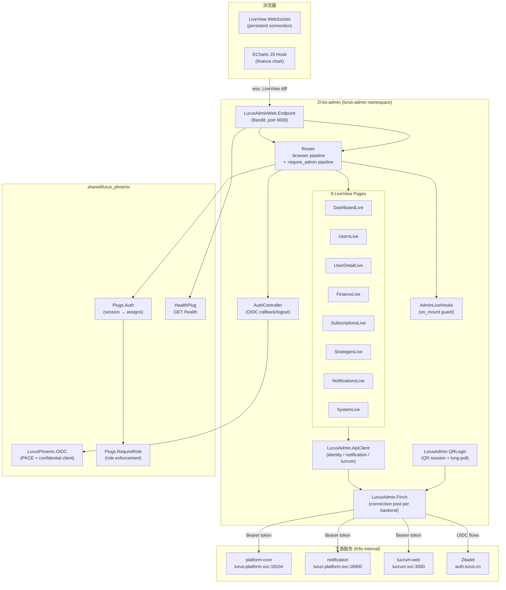
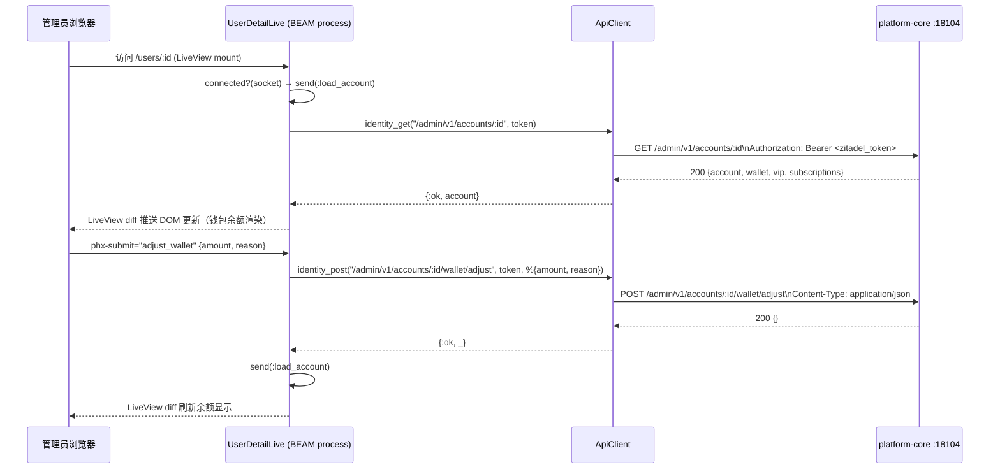
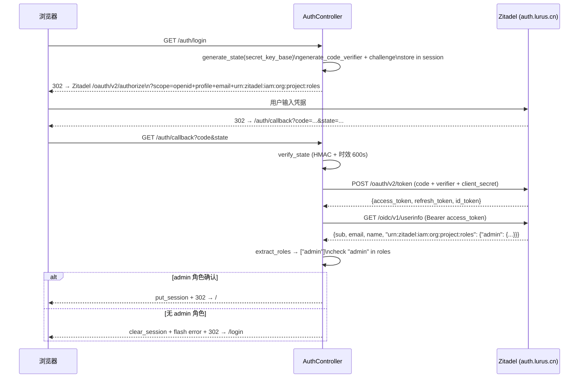

# Lurus Admin 内部手册

> 仅限内部员工查阅。包含运维细节、决策档案、未公开问题。

## 一句话定位

Lurus Admin 是面向**内部运营人员**的管理控制台，基于 Elixir/Phoenix LiveView 构建，**无数据库**——所有数据通过 Finch HTTP 客户端代理到 platform-core、notification、lucrum 三个后端服务。访问需持有 Zitadel `admin` 角色，通过 confidential OIDC 客户端（client_secret 模式）保障安全。

它是 Platform 产品组（P0）的运营操作面板，对应 `admin.lurus.cn`，让运营人员无需直接调 API 即可完成用户管理、钱包调整、发票查询、通知模板配置等日常操作。

## 速查

| 项 | 值 |
|---|---|
| 仓库 | github.com/hanmahong5-arch/lurus-admin |
| 镜像 | `ghcr.io/hanmahong5-arch/lurus-admin:main-<sha7>` |
| 域名 | admin.lurus.cn |
| 端口 | 4000 (dev: 4001) |
| 命名空间 | lurus-admin |
| 数据存储 | 无 DB / 无 Redis — 纯 API 聚合 |
| 关键依赖 | platform-core `:18104` / notification `:18900` / lucrum-web `:3000` / Zitadel `auth.lurus.cn` |
| 部署目标 | R1 (K3s control-plane node) |
| 资源限制 | requests: 50m CPU / 128Mi MEM；limits: 300m CPU / 256Mi MEM |
| 部署状态 | 待 Zitadel confidential client 注册后方可首次部署 |

## 技术栈

| 层 | 选型 |
|---|---|
| 运行时 | Elixir 1.17 + OTP 27 |
| Web 框架 | Phoenix 1.7 + LiveView 1.0 + Bandit |
| UI | Tailwind CSS 4，深色主题 |
| HTTP 客户端 | Finch 0.18（连接池化，按后端分池） |
| 图表 | ECharts（CDN，JS hook 推数据） |
| 共享库 | `lurus_phoenix`（`../shared/lurus_phoenix/`，path dependency） |
| QR 码生成 | `eqrcode` 0.2（inline SVG） |
| 构建工具 | esbuild + Tailwind CLI，`mix phx.digest` |
| 代码质量 | Credo 严格模式 |

## 架构图



## 核心数据流

### 管理员查看用户钱包并调整余额



### OIDC 登录流



## 代码地图

| 路径 | 职责 |
|---|---|
| `lib/lurus_admin/application.ex` | OTP Application，启动 Finch 连接池（按后端分池，identity×2 pool）、TaskSupervisor、PubSub |
| `lib/lurus_admin/api_client.ex` | 统一 HTTP 客户端，封装 identity/notification/lucrum 三个后端，Bearer token 认证，30s 超时 |
| `lib/lurus_admin/qr_login.ex` | QR 登录客户端，创建 Platform QR session + 长轮询状态，`eqrcode` 生成 inline SVG |
| `lib/lurus_admin_web/router.ex` | 路由：`/health`（无鉴权）/ `/auth/*`（OIDC）/ admin live_session（`:browser + :require_admin`） |
| `lib/lurus_admin_web/live/admin_live_hooks.ex` | `on_mount :default`：从 session 提取 `current_user` / `access_token`，校验 `"admin"` role，否则 redirect `/login` |
| `lib/lurus_admin_web/live/dashboard_live.ex` | 首页：stats 卡片（total_users / active_users / total_revenue / pending_invoices）+ 快速操作 + 服务状态 |
| `lib/lurus_admin_web/live/users_live.ex` | 用户列表：分页（20/页）+ 搜索（push_patch URL 参数化）→ `/admin/v1/accounts` |
| `lib/lurus_admin_web/live/user_detail_live.ex` | 用户详情：Account Info / VIP / Wallet（余额调整表单）/ 订阅列表 |
| `lib/lurus_admin_web/live/finance_live.ex` | 财务报表：日期区间 + group_by 筛选，ECharts 图表（`phx-hook="EChart"`），明细表格 |
| `lib/lurus_admin_web/live/subscriptions_live.ex` | 发票列表：分页 + account_id 过滤 → `/admin/v1/invoices` |
| `lib/lurus_admin_web/live/strategies_live.ex` | 策略市场审核：状态过滤 + 搜索 + Approve/Suspend 操作 → Lucrum API |
| `lib/lurus_admin_web/live/notifications_live.ex` | 通知模板 CRUD：列表 + 内联编辑表单（event_type / channel / priority / title / body） |
| `lib/lurus_admin_web/live/system_live.ex` | 系统监控：监控工具链接（Grafana / Prometheus / Jaeger / Loki / ArgoCD / Temporal）+ 嵌入 Grafana iframe |
| `lib/lurus_admin_web/live/login_live.ex` | 登录页：双 Tab（Zitadel OIDC + QR 扫码），QR 长轮询通过 `Task.Supervisor.async_nolink` 异步进行 |
| `lib/lurus_admin_web/controllers/auth_controller.ex` | OIDC callback 处理，confidential client 模式，提取 Zitadel role claims |
| `lib/lurus_admin_web/controllers/health_controller.ex` | `GET /health` → 200，供 K8s probe 使用 |
| `shared/lurus_phoenix/lib/lurus_phoenix/oidc.ex` | OIDC 通用库：PKCE、state HMAC 签名 + 时效校验、token exchange、userinfo fetch、end_session URL |
| `shared/lurus_phoenix/lib/lurus_phoenix/plugs/auth.ex` | 从 encrypted session cookie 加载 `current_user` / `access_token` 到 conn.assigns |
| `shared/lurus_phoenix/lib/lurus_phoenix/plugs/require_role.ex` | 角色守卫 Plug，支持单 role 或 role 列表，无 session → 401，缺角色 → 403 |
| `deploy/Dockerfile` | 二阶段构建：`elixir:1.17-otp-27-slim` 编译 + `debian:bookworm-slim` 运行时，user 65534，readonly rootfs |
| `deploy/k8s/deployment.yaml` | replicas:1，RollingUpdate（maxUnavailable:0），secretKeyRef 注入 SECRET_KEY_BASE / ZITADEL_CLIENT_ID / ZITADEL_CLIENT_SECRET |

## 部署

### 构建与 CI

```bash
# 本地开发
mix deps.get
mix phx.server                   # http://localhost:4001

# 生产构建（在 Dockerfile builder stage 执行）
MIX_ENV=prod mix assets.deploy   # tailwind --minify + esbuild --minify + phx.digest
MIX_ENV=prod mix compile --warnings-as-errors
MIX_ENV=prod mix release

# 本地构建镜像（从 lurus/ 根目录执行，因 Dockerfile COPY shared/）
docker build -f 2l-bs-admin/deploy/Dockerfile -t lurus-admin:local .
```

CI 触发：`push main` → GitHub Actions → `ghcr.io/hanmahong5-arch/lurus-admin:main-<sha7>` → ArgoCD auto-sync。

### K8s Secret 准备（首次部署必做）

```bash
kubectl create secret generic lurus-admin-secret \
  -n lurus-admin \
  --from-literal=secret-key-base="$(mix phx.gen.secret)" \
  --from-literal=zitadel-client-id="&lt;从 Zitadel 控制台复制&gt;" \
  --from-literal=zitadel-client-secret="&lt;从 Zitadel 控制台复制&gt;"
```

Zitadel 配置要点：
- Application 类型：**Web（confidential）**
- Grant types：Authorization Code
- Redirect URIs：`https://admin.lurus.cn/auth/callback`
- Post-logout URIs：`https://admin.lurus.cn/login`
- 勾选 "Roles" scope（使 userinfo 含 `urn:zitadel:iam:org:project:roles`）
- 在 Project roles 中创建 `admin` 角色，并授予运营人员账号

### 滚动更新

```bash
# 触发部署（推代码即可）
git push origin main

# 手动强制 sync（ArgoCD 通常自动）
ssh root@100.98.57.55 "argocd app sync lurus-admin"

# 检查状态
ssh root@100.98.57.55 "kubectl get pods -n lurus-admin"
ssh root@100.98.57.55 "kubectl rollout status deployment/lurus-admin -n lurus-admin"
```

### 环境变量完整列表

| 变量 | 来源 | 默认 / 必填 |
|---|---|---|
| `PHX_SERVER` | K8s env | `true`（固定） |
| `PHX_HOST` | K8s env | `admin.lurus.cn` |
| `PORT` | K8s env | `4000` |
| `SECRET_KEY_BASE` | Secret | **必填**，`mix phx.gen.secret` 生成 |
| `ZITADEL_ISSUER` | K8s env | `https://auth.lurus.cn` |
| `ZITADEL_CLIENT_ID` | Secret | **必填** |
| `ZITADEL_CLIENT_SECRET` | Secret | **必填** |
| `IDENTITY_URL` | K8s env | `http://platform-core.lurus-platform.svc:18104` |
| `NOTIFICATION_URL` | K8s env | `http://notification.lurus-platform.svc:18900` |
| `LUCRUM_URL` | K8s env | `http://lucrum-web.lucrum.svc:3000` |
| `PLATFORM_API_URL` | K8s env | `https://identity.lurus.cn`（QR login 用，需公网可达） |
| `DNS_CLUSTER_QUERY` | K8s env | 可选，BEAM 集群发现（单 replica 可不配） |
| `RELEASE_TMP` | K8s env | `/tmp`（readonly rootfs 下必须指定） |

## 运行与运维

### 健康检查

```bash
# 探针端点（无鉴权）
curl http://admin.lurus.cn/health  # → 200

# K8s 状态
ssh root@100.98.57.55 "kubectl get pods -n lurus-admin -o wide"
```

### 日志

```bash
# 实时日志
ssh root@100.98.57.55 "kubectl logs -n lurus-admin deploy/lurus-admin --tail=100 -f"

# 按时间段（Loki）
# 访问 https://loki.lurus.cn，query: {namespace="lurus-admin"}
```

BEAM 应用日志格式为结构化文本（`Logger` 默认），关键事件（OIDC callback、钱包调整失败）会出现在日志中。

### Finch 连接池配置

```
:default         → size: 10
identity_url     → size: 15, count: 2  (双池，平台核心流量大)
notification_url → size: 5
auth_url         → size: 5
```

### 重启与扩缩容

```bash
# 重启
ssh root@100.98.57.55 "kubectl rollout restart deployment/lurus-admin -n lurus-admin"

# 临时扩容（通常 1 replica 足够，LiveView session 无状态迁移）
ssh root@100.98.57.55 "kubectl scale deployment/lurus-admin --replicas=2 -n lurus-admin"
# 注意：扩容后 LiveView session affinity 问题，见"已知坑"

# 查看资源用量
ssh root@100.98.57.55 "kubectl top pod -n lurus-admin"
```

## 功能模块详解

### 1. Dashboard (`/`)

调用 `GET /admin/v1/stats`（platform-core），展示 total_users / active_users / total_revenue / pending_invoices 四张 KPI 卡片。后端 endpoint 暂未实现时优雅降级显示 `-`。

### 2. 用户管理 (`/users`, `/users/:id`)

- 列表：`GET /admin/v1/accounts`，分页 20 条/页，支持 `?q=<keyword>` 搜索（name/email/ID）
- 详情：`GET /admin/v1/accounts/:id` 返回账户信息 + wallet + vip + subscriptions
- 钱包调整：`POST /admin/v1/accounts/:id/wallet/adjust`，body `{amount: float, reason: string}`，amount 正数充值、负数扣减

### 3. 财务报表 (`/finance`)

调用 `GET /admin/v1/finance?from=&to=&group_by=day|month`，返回 total_revenue / total_refunds / net_revenue / transaction_count 汇总 + rows 明细。图表通过 `push_event("chart-data", series_data)` 向 ECharts JS hook 推送数据。

### 4. 发票管理 (`/subscriptions`)

调用 `GET /admin/v1/invoices`，支持 `?account_id=` 过滤，分页 20 条/页。模块名 SubscriptionsLive 但实际展示发票（invoice_number / amount / payment_method / status）。

### 5. 策略市场审核 (`/strategies`)

调用 Lucrum API：`GET /api/lurus/marketplace/strategies`，状态过滤（all / active / pending / suspended / rejected）。审核操作：`PATCH /api/lurus/marketplace/strategies/:id/status` body `{status: "active"|"suspended"}`。

### 6. 通知模板 (`/notifications`)

调用 notification 服务：`GET /admin/v1/templates`，支持新建/编辑（`POST`）/删除（`DELETE /admin/v1/templates/:id`）。字段：event_type（如 `user.created`）/ channel（in_app / email / fcm）/ priority（low/normal/high/urgent）/ title / body / enabled。

### 7. 系统监控 (`/system`)

纯静态链接 + 嵌入 Grafana iframe（`/d/slo-lurus-api/slo-lurus-api?theme=dark&kiosk`）。监控工具：Grafana / Prometheus / Jaeger / Loki / ArgoCD / Temporal，均为 `lurus.cn` 子域名外链。

### 8. QR 扫码登录（演示功能）

登录页 QR Tab：调 `POST /api/v2/qr/session`（identity.lurus.cn，无鉴权）创建 session，`eqrcode` 生成 inline SVG。通过 `Task.Supervisor.async_nolink` 长轮询 `GET /api/v2/qr/:id/status?timeout=25`，轮询结果：

| 状态码 | 含义 | 处理 |
|---|---|---|
| 200 `{status:"pending"}` | 未扫 | 继续轮询 |
| 200 `{status:"confirmed", token}` | 已扫确认 | redirect `/qr-demo#<token>`（fragment 不到日志）|
| 404 | 已过期 | 自动刷新 QR |
| 410 | 已消费 | 自动刷新 QR |

**当前限制**：QR 流程产生的是 Platform JWT，非 Zitadel session，无法建立 admin 会话，仅作演示用途（Track F2）。

## 数据契约

### 上游依赖

| 服务 | 端点前缀 | 认证方式 | 主要接口 |
|---|---|---|---|
| platform-core | `http://platform-core.lurus-platform.svc:18104` | Bearer Zitadel token | `/admin/v1/stats` / `/admin/v1/accounts` / `/admin/v1/accounts/:id` / `/admin/v1/accounts/:id/wallet/adjust` / `/admin/v1/finance` / `/admin/v1/invoices` |
| notification | `http://notification.lurus-platform.svc:18900` | Bearer Zitadel token | `/admin/v1/templates` (GET/POST/DELETE) |
| lucrum-web | `http://lucrum-web.lucrum.svc:3000` | Bearer Zitadel token | `/api/lurus/marketplace/strategies` (GET/PATCH) |
| Zitadel | `https://auth.lurus.cn` | confidential client | `/oauth/v2/authorize` / `/oauth/v2/token` / `/oidc/v1/userinfo` / `/oidc/v1/end_session` |
| identity.lurus.cn | `https://identity.lurus.cn` | 无鉴权 | `/api/v2/qr/session` / `/api/v2/qr/:id/status` |

### 下游消费者

Admin 本身不对外暴露 API，无下游消费者。Traefik IngressRoute 将 `admin.lurus.cn` 443 流量路由到 Service 80 口（内部 Service → Pod 4000）。

## 已知坑（内部专属）

1. **Zitadel confidential client 未注册**：`ZITADEL_CLIENT_SECRET` 缺失时 `runtime.exs` 在启动阶段抛出 `raise`，Pod 直接 CrashLoopBackOff。首次部署前必须先在 Zitadel 控制台创建 Web Application 并拿到 client_secret。

2. **LiveView 多副本 session 漂移**：LiveView WebSocket session 存储在 Phoenix encrypted cookie，理论上多副本无状态。但 `SECRET_KEY_BASE` 必须所有副本一致（已通过 Secret 保证）；`PHX_HOST` 不一致会导致 SameSite cookie 校验失败。扩到 >1 replica 前确认 K8s Service 无 sticky session，否则 WebSocket 重连可能被路由到不同 Pod 而状态丢失。

3. **access_token 不刷新**：session 中存储的是登录时的 access_token，Zitadel token 默认 1h 过期。当前无 token 刷新逻辑（`refresh_token` 存 session 但未使用）。管理员长时间（>1h）操作后 API 调用会返回 401，LiveView 页面会显示 "Failed to load..." 的错误卡片，需重新登录。

4. **ECharts 图表数据推送时序**：`FinanceLive` mount 返回后立即 `connected?` 触发 `:load_report`，数据就绪时通过 `push_event("chart-data", ...)` 推送。若用户在数据未到达前关闭页面，`push_event` 会被 LiveView 框架静默丢弃（无报错），但若 JS hook `mounted` 晚于 `push_event`，图表不会渲染。此为 Phoenix LiveView JS hook 时序问题，需在 hook `mounted` 里处理 `handleEvent` 并主动请求一次数据。

5. **readonly rootfs 下 Release tmp 目录**：生产容器 `readOnlyRootFilesystem: true`，Elixir Release 需要写 `/tmp`，通过 `RELEASE_TMP=/tmp` + emptyDir volume mount 解决。如果 manifest 中 tmp volume 被误删，Release 启动时会报 `eacces` 并 crash。

6. **shared/lurus_phoenix path dependency**：`mix.exs` 中 `{:lurus_phoenix, path: "../shared/lurus_phoenix"}`。Dockerfile 通过 `COPY shared/lurus_phoenix/ /shared/lurus_phoenix/` 在 builder stage 注入（build context 必须是 lurus/ 根目录）。本地如果在 `2l-bs-admin/` 目录内执行 `mix deps.get`，需确保 `../shared/lurus_phoenix/` 路径存在，否则会提示 dependency missing。

7. **Credo strict 模式**：`precommit` alias 包含 `compile --warnings-as-errors`，任何编译警告均阻断提交。修改 `lurus_phoenix` 共享库后必须同步更新 admin，否则类型不匹配导致 CI 失败。

## 决策档案

| 时间 | 决策 | 理由 |
|---|---|---|
| 2026-03 | 选 Phoenix LiveView 而非 React SPA | 服务端状态管理更简单，Admin 页面都是表格/表单型 UI，LiveView diff 推送足够，无需独立前端部署 |
| 2026-03 | 无数据库设计 | Admin 操作全部透传到下游权威服务，避免数据副本一致性问题，Admin 崩溃不影响数据 |
| 2026-03 | confidential OIDC 客户端（含 client_secret） | Admin 是内部后台，服务器端可安全存储 client_secret，比 public PKCE-only 更安全；同时 defense-in-depth 保留 PKCE |
| 2026-03 | Finch 替代 HTTPoison/Tesla | 连接池化、显式超时配置，适合聚合多个后端的场景；`LurusAdmin.Finch` 与 OIDC 共用，减少 HTTP 客户端数量 |
| 2026-03 | admin 仓库独立（分离自 www） | 2026-04 Phoenix 转型：www 改回 Next.js，admin 保留 Elixir/Phoenix；两者不同实例避免互相影响 |
| 2026-04 | QR 扫码登录为演示功能（非完整） | Platform QR token ≠ Zitadel session，短期内不打通；token 通过 URL fragment 传递避免服务端日志泄露，Track F2 跟踪后续完整实现 |

## TODO / Roadmap

- [ ] **Zitadel confidential client 注册** — 阻塞首次部署，优先级 P0
- [ ] **access_token 自动刷新** — 使用 session 中的 `refresh_token` 在 API 返回 401 时静默刷新，避免管理员被踢出
- [ ] **QR 扫码登录完整实现** — Track F2：QR 确认后走 Zitadel token exchange，建立真实 admin session
- [ ] **ECharts hook 时序修复** — `mounted` 里主动请求一次 chart-data，避免 push_event 丢失
- [ ] **API 分页统一** — 当前各 LiveView 对 pagination 响应结构兼容性处理有重复代码，提取到 ApiClient
- [ ] **Audit log 页面** — 显示管理员操作记录（钱包调整 / 策略审核），需 platform-core 提供 `/admin/v1/audit` 端点
- [ ] **通知模板 PUT 区分新建/编辑** — `NotificationsLive` 当前编辑和新建都走 `POST`，需接入 `PUT /admin/v1/templates/:id`

## 应急 Runbook

### Pod 挂了 / CrashLoopBackOff

```bash
# 查看 Pod 状态
ssh root@100.98.57.55 "kubectl get pods -n lurus-admin"
ssh root@100.98.57.55 "kubectl describe pod -n lurus-admin <pod-name>"

# 查看日志（启动失败通常在这里）
ssh root@100.98.57.55 "kubectl logs -n lurus-admin <pod-name> --previous"

# 常见原因：
# 1. SECRET_KEY_BASE / ZITADEL_CLIENT_ID / ZITADEL_CLIENT_SECRET 缺失 → 检查 secret
ssh root@100.98.57.55 "kubectl get secret lurus-admin-secret -n lurus-admin"

# 2. RELEASE_TMP volume 缺失 → 检查 deployment
ssh root@100.98.57.55 "kubectl get deployment lurus-admin -n lurus-admin -o yaml | grep -A5 volumes"

# 重启
ssh root@100.98.57.55 "kubectl rollout restart deployment/lurus-admin -n lurus-admin"
ssh root@100.98.57.55 "kubectl rollout status deployment/lurus-admin -n lurus-admin"
```

### LiveView WebSocket 断连（浏览器转圈 / 操作无响应）

症状：页面加载成功但数据不更新，浏览器控制台出现 WebSocket 断线重连日志。

```bash
# 1. 检查 Pod 是否正常
ssh root@100.98.57.55 "kubectl get pods -n lurus-admin"

# 2. 检查 Phoenix endpoint 是否接受 WebSocket
curl -I https://admin.lurus.cn/health

# 3. 检查 Traefik ingress
ssh root@100.98.57.55 "kubectl get ingressroute -n lurus-admin"

# 4. 检查 SECRET_KEY_BASE 一致性（多副本时）
# LiveView WebSocket 握手需要 secret 一致，否则 token 校验失败导致断线

# 5. 查看 Phoenix 连接日志
ssh root@100.98.57.55 "kubectl logs -n lurus-admin deploy/lurus-admin --tail=50 | grep -i 'websocket\|transport\|disconnect'"
```

浏览器端临时修复：强制刷新（Ctrl+F5）重建 WebSocket 连接。

### OIDC 跳转死循环（/auth/login → Zitadel → /auth/callback → /login 反复）

症状：登录后一直跳转，不能进入管理后台。

**排查步骤：**

1. **state 验证失败**：callback 日志出现 `{:error, :invalid_state}` 或 `{:error, :malformed_state}`
   - 原因：浏览器 session cookie 丢失（SameSite=Strict 被跨域丢弃）或 state 超时（>600s）
   - 修复：检查 `PHX_HOST` 与实际访问域名是否一致；确保通过 `https://admin.lurus.cn` 访问而非 IP

2. **admin 角色缺失**：callback 日志出现 `"Access denied: admin role required"`
   - 原因：Zitadel 用户未被授予 `admin` 角色
   - 修复：登录 `auth.lurus.cn` Zitadel 控制台 → Project → Roles → 给用户授 `admin` role

3. **client_secret 错误**：token exchange 返回 `401 unauthorized_client`
   - 原因：K8s secret 中的 `zitadel-client-secret` 与 Zitadel 不匹配
   - 修复：重新从 Zitadel 获取 secret，更新 K8s secret 后重启 Pod

```bash
# 查看 callback 详细错误
ssh root@100.98.57.55 "kubectl logs -n lurus-admin deploy/lurus-admin --tail=100 | grep -i 'oidc\|callback\|login\|role'"

# 更新 secret 后重启
kubectl patch secret lurus-admin-secret -n lurus-admin \
  --patch='{"stringData":{"zitadel-client-secret":"<new-secret>"}}'
kubectl rollout restart deployment/lurus-admin -n lurus-admin
```

### 回滚

```bash
# ArgoCD 回滚（界面操作或命令行）
ssh root@100.98.57.55 "argocd app rollback lurus-admin <revision>"

# 或：改 manifest tag 为上一个已知可用 sha7
# 1. 编辑 deploy/k8s/deployment.yaml 中 image tag
# 2. git commit && git push → ArgoCD auto-sync
```

### 平台 API 全部超时（admin 页面大量 "Failed to load"）

```bash
# 检查 platform-core
ssh root@100.98.57.55 "kubectl get pods -n lurus-platform | grep platform-core"
ssh root@100.98.57.55 "kubectl logs -n lurus-platform deploy/platform-core --tail=50"

# 检查 notification
ssh root@100.98.57.55 "kubectl get pods -n lurus-platform | grep notification"

# 检查 lucrum
ssh root@100.98.57.55 "kubectl get pods -n lucrum | grep lucrum-web"

# admin 本身无数据库，下游服务恢复后页面刷新即可正常，无需重启 admin
```
