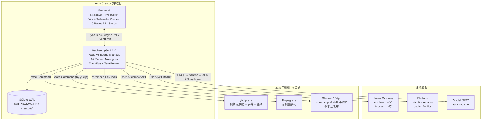
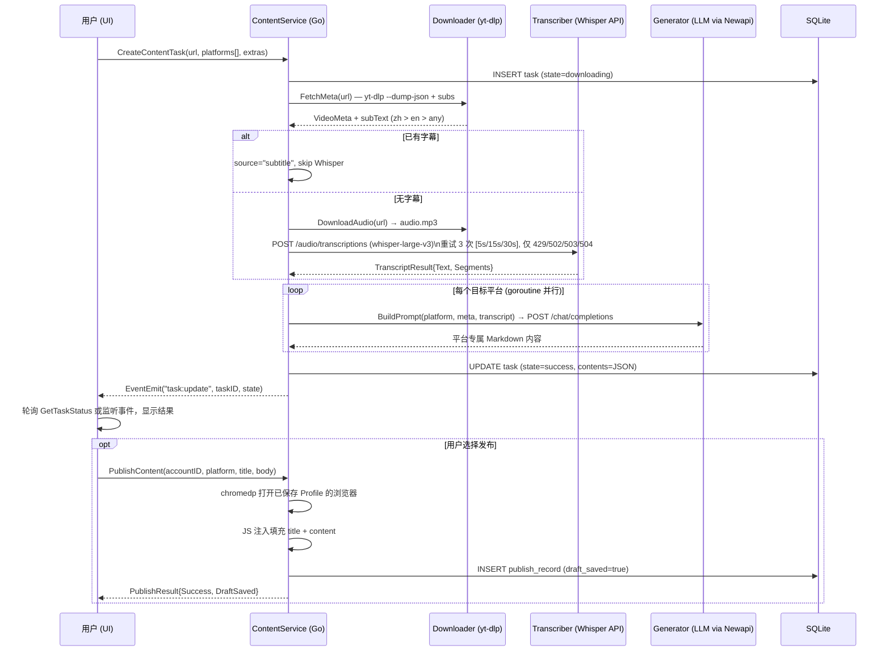
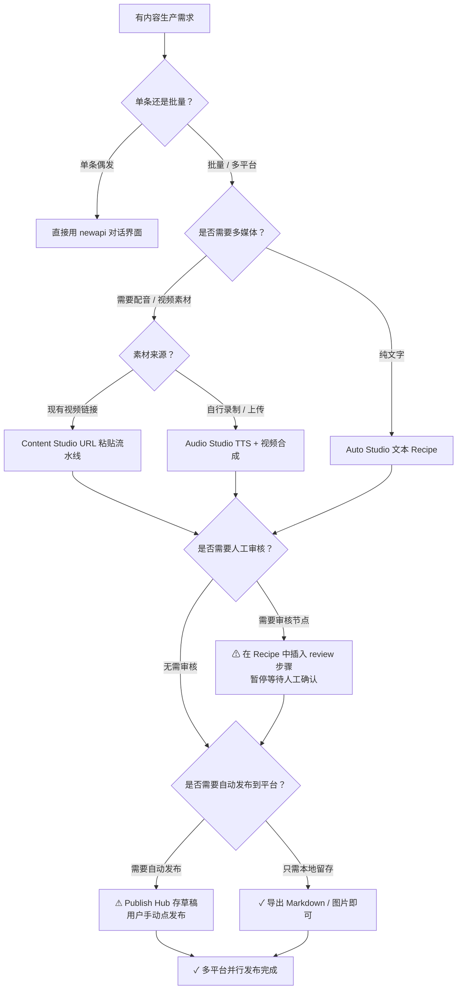
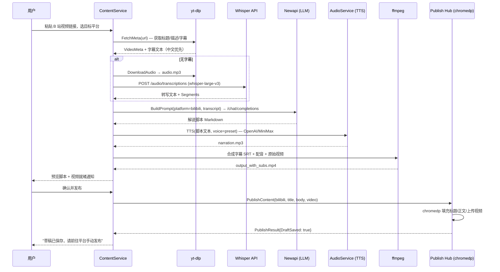
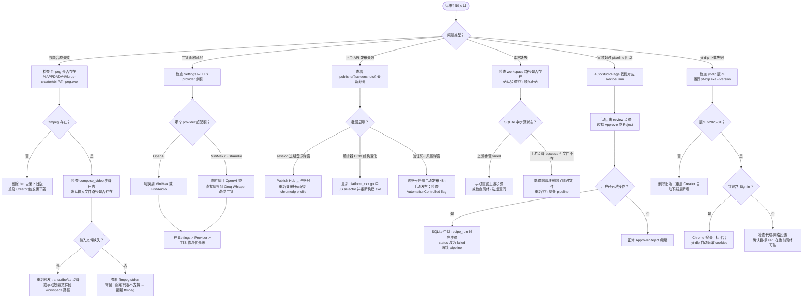

# Lurus Creator Studio 内部手册

> 仅限内部员工查阅。包含运维细节、决策档案、未公开问题。

## 一句话定位

桌面 AI 内容工厂，单 `.exe` 分发，零外部运行时依赖。用户粘贴一条视频链接，Creator 自动调用 yt-dlp 下载、Whisper 转写、接 Newapi（`api.lurus.cn/v1`）驱动 LLM 改写，最终通过 chromedp 将草稿投递到微信公众号、抖音、小红书等平台。不运行在 K8s，所有数据存本地 SQLite；平台计费通过 Zitadel JWT 调用 `identity.lurus.cn`。

## 速查

| 项 | 值 |
|---|---|
| 仓库 | github.com/hanmahong5-arch/lurus-creator (TBD) |
| 构建产物 | `build/bin/lurus-creator.exe` |
| 版本 | 0.3.0 (wails.json) |
| 数据目录 | `%APPDATA%\lurus-creator\` |
| LLM 网关 | `https://api.lurus.cn/v1`（默认，用户可覆盖） |
| 平台计费 | `https://identity.lurus.cn` (user JWT，`/api/v1/wallet`) |
| Auth | Zitadel OIDC PKCE → `auth.lurus.cn`，本地 callback `:31415` |
| 关键依赖 | yt-dlp, ffmpeg (懒下载至 `%APPDATA%\lurus-creator\bin\`)，chromedp，Chrome/Edge |
| 部署目标 | 桌面 Windows，无 K8s，无容器 |
| 命名空间 | 无（桌面进程） |

## 架构图



## 核心数据流（Content Studio 全流水线）



## 模块地图

| 包路径 | 职责 |
|---|---|
| `app.go` | Wails startup/shutdown，共享基础设施初始化（EventBus, Resolver, TaskRunner），跨模块依赖注入 |
| `main.go` | Wails Application 入口，绑定所有 `*svc.Service` |
| `internal/content/` | Content Studio 核心：`pipeline.go` 编排，`downloader.go` 调 yt-dlp，`transcriber.go` 调 Whisper API，`generator.go` 调 LLM，`binutil.go` 懒下载 yt-dlp/ffmpeg |
| `internal/publisher/` | Publish Hub：`browser.go` chromedp 基础设施，`platform_wechat.go / platform_douyin.go / platform_xiaohongshu.go` 各平台 JS 注入 |
| `internal/devfactory/` | Dev Factory：`statemachine.go` SQLite 状态机，`engine.go` 故事调度，`pipeline.go` 步骤执行，调用外部 `claude -p` / `gemini` / `gh` CLI |
| `internal/automation/` | Auto Studio：`engine.go` Recipe 流水线，支持 source / transform / gen_image / gen_audio / review / publish 步骤 |
| `internal/imagegen/` | AI Gallery：图片/视频生成，`fal_video_generator.go` 异步视频轮询 |
| `internal/audio/` | Audio Studio：多 provider TTS（OpenAI / MiniMax / FishAudio / Gemini），`srt.go` 字幕生成 |
| `internal/paper/` | Paper Workshop：arXiv 摘取 + LLM 文章合成 |
| `internal/drama/` | Drama Workshop：角色/场景/剧本管理，素材合成 |
| `internal/agentteams/` | Agent Teams：多 agent 协作引擎，注入 LLM genFunc |
| `internal/gateway/` | Provider 路由：`resolver.go` LurusProviderID `__lurus__` 短路到 `api.lurus.cn`，`health.go` circuit breaker + 余额轮询 |
| `internal/billing/` | 平台钱包客户端：user JWT，`/api/v1/wallet`，余额阈值 ¥2 critical / ¥10 warning |
| `internal/auth/` | OIDC PKCE，`session.go` AES-256 加密存储 `auth.enc`，网关 token 自动预配 |
| `internal/settings/` | 线程安全 JSON 配置文件，`%APPDATA%\lurus-creator\settings.json` |
| `internal/platform/provider/` | ChainResolver：按 text/image/video/audio/whisper 分类的多级 fallback provider 链 |
| `internal/platform/eventbus/` | 进程内 EventBus，用于 usage 追踪和跨模块解耦 |
| `internal/platform/taskrunner/` | 后台 TaskRunner，统一管理长耗时任务 |
| `frontend/src/` | React 18，`App.tsx` 路由，9 页面，11 Zustand stores |

## 前端页面一览

| 页面 | 功能 |
|---|---|
| ContentPage | 粘贴 URL → 触发流水线 → 多平台内容预览 |
| ImageGenPage | 图片 / 视频生成（OpenAI-compat image API） |
| AudioPage | TTS 多 provider，声音克隆 |
| PaperPage | arXiv 论文 → LLM 文章合成 |
| DramaPage | 剧本人物 / 场景 / 分发 |
| DevFactoryPage | AI Story 状态机看板（$5/story 预算上限，$50/天上限） |
| AutoStudioPage | Recipe 流水线可视化，支持 review checkpoint 暂停 |
| PublishHubPage | 平台账号管理 + 草稿推送（永远只存草稿，不自动发布） |
| AgentTeamsPage | 多 agent 协作任务管理 |

## 通信模式

| 模式 | 场景 | 示例 |
|---|---|---|
| Sync RPC | 轻量配置读写、状态查询 | `await GetSettings()` |
| Async Task Poll | 长耗时任务（下载/转写/生成） | `CreateTask()` → 每 2-5s 轮询 `GetTaskStatus(id)` |
| EventEmit Push | 实时进度、用量脉冲 | `wailsRuntime.EventsEmit(ctx, "model:pulse", data)` |

## 依赖二进制的懒下载策略

`EnsureBinaries()` 在第一次 content 任务触发时（非阻塞 goroutine）执行：

1. 先查 PATH，再查 `%APPDATA%\lurus-creator\bin\`
2. yt-dlp 缺失 → HTTP GET GitHub releases latest，约 10MB
3. ffmpeg 缺失 → 下载 BtbN ffmpeg-master-latest-win64-gpl.zip (~130MB)，zip slip 防护，仅解出 `ffmpeg.exe` + `ffprobe.exe`
4. 下载失败不 panic，记录日志，任务报错 "yt-dlp not found"

## 认证与网关预配

1. 登录：PKCE flow，本地临时 HTTP server `:31415/auth/callback` 接收 code
2. tokens 用 AES-256-GCM 加密存 `%APPDATA%\lurus-creator\auth.enc`
3. 首次登录后（或启动时 token 丢失），后台 goroutine 调 `gateway.Provision()`
   - 需要 `LURUS_CREATOR_INTERNAL_KEY` 环境变量（编译时或用户 env）
   - 成功后更新 `gateway_token`，启动余额轮询
4. Provider 解析优先级：`__lurus__` → 用户配置 provider → 空 ID 时自动 fallback 到 gateway
5. Circuit Breaker 开路时所有 LLM 调用立即返回错误，不打穿下游

## Provider 链配置

通过 `internal/platform/provider/chains.go` 将 settings 映射为 5 个 category 的 fallback 链：

| Category | Provider ID 优先顺序 |
|---|---|
| Text | `DefaultProviderID` |
| Image | `ImageProviderID` → `DefaultProviderID` |
| Video | `VideoProviderID` → `ImageProviderID` → `DefaultProviderID` |
| Audio (TTS) | `TTSProviderID` → `DefaultProviderID` |
| Whisper | `WhisperProviderID` → `DefaultProviderID` |

若所有 provider 都失败，返回结构化错误（不 panic）。Text 支持 `TextFallbackModels[0]` → `[1]` 兜底模型。

## Dev Factory 状态机

Dev Factory 是 Creator 内嵌的 AI 编码自动化引擎，调用系统已安装的 `claude -p`、`gemini`、`gh` CLI。

```
queued → planning → developing → reviewing ⇄ fixing
                                          ↓
                                     acceptance → done
                                     rejected  → planning (retry)
failed ← (任何步骤)  →  重新入队
```

预算硬上限：`$5/story`，`$50/day`（超出自动 fail）。SQLite 表 `budget_ledger` 追踪每步 cost_usd。

## 构建

```bash
# 开发热重载
wails dev

# 生产构建
wails build         # → build/bin/lurus-creator.exe

# 单独验证后端
go build ./... && go vet ./... && go test ./...

# 单独验证前端
cd frontend && bun install && bun run build && bunx tsc --noEmit
```

## 本地数据布局

```
%APPDATA%\lurus-creator\
├── settings.json          # 全局设置（线程安全 JSON store）
├── auth.enc               # AES-256 加密 Zitadel tokens + gateway_token
├── bin\                   # 懒下载二进制：yt-dlp.exe, ffmpeg.exe, ffprobe.exe
├── devfactory\
│   ├── devfactory.db      # 项目/Epic/Story/PipelineRun/BudgetLedger
│   ├── projects\          # 克隆的代码仓库
│   ├── workspaces\        # 工作区
│   └── logs\              # 步骤日志
├── automation\automation.db   # Recipe + RecipeRun
├── agentteams\agentteams.db
├── images\
│   ├── imagegen.db
│   ├── generated\
│   ├── thumbs\
│   └── videos\
├── publisher\
│   ├── publisher.db
│   ├── profiles\<accountID>\   # chromedp 持久化 user-data-dir（每账号独立）
│   └── screenshots\           # 操作截图（调试用）
├── paper\paper.db
├── drama\
│   ├── drama.db
│   ├── clips\ / frames\ / materials\
└── audio\
    ├── audio.db
    └── generated\
```

所有 SQLite 数据库统一：`journal_mode=WAL`、`busy_timeout=5000`、`foreign_keys=ON`。DDL on open + "duplicate column" catch 保证向后兼容。

## 已知坑（内部专属）

1. **yt-dlp 反爬绕过**：`runYtdlpWithCookies` 依次尝试 `--cookies-from-browser chrome`、`edge`，最后无 cookie 兜底。YouTube 在某些地区要求登录才能拉 bot-free 字幕，若两个浏览器都没有登录态，FetchMeta 会 fail。临时解法：用户用 Chrome 登录 YouTube，让 yt-dlp 读取本地 cookie。长期解法：支持手动上传 cookies.txt。

2. **Whisper 本地 vs API 选择**：当前 Transcriber 是纯 API 模式（调 `/audio/transcriptions`），推荐用 Groq free tier（`whisper-large-v3`）。不支持本地模型推理——如需本地 Whisper，需要额外引入 Python binding 或 whisper.cpp CGo；体积和启动时间都是问题。目前 CLAUDE.md 明确标注"Whisper 用云 API (Groq free tier 推荐)"。

3. **平台 UI 随时失效（chromedp JS 注入碎片化）**：WeChat/XHS/Douyin 编辑器 JS selector 硬编码，平台改版后注入失败。现有防护：`jsResult != "ok"` 时截图保留现场 + 返回友好错误（不 crash）。排障入口：查 `publisher\screenshots\` 下最新截图。

4. **单 exe 体积**：Go 静态链接 + React bundle 打进 Wails，加上 CGO-free SQLite（modernc），Release 约 20-30MB。ffmpeg（单独懒下载 ~50MB）和 yt-dlp（~10MB）不打入 exe。首次启动需要网络，离线机器无法使用 Content Studio。

5. **`LURUS_CREATOR_INTERNAL_KEY` 缺失**：缺失时网关预配静默跳过，UI 表现为"未登录但网关不可用"。须在开发机 / 打包脚本中注入，或用户手动在 Settings 中配置第三方 provider 绕过。

6. **Dev Factory 需要系统级 CLI**：`claude -p`、`gemini`、`gh`、`git` 必须在 PATH 中。若缺失，步骤执行直接 fail，不会降级。CLAUDE.md 记录为 "Optional CLI (Dev Factory only)"。

7. **Publish Hub 永不自动发布**：设计决策，只存草稿（`DraftSaved: true`）。用户须手动进平台点发布。防止误操作，但增加用户步骤。

8. **`/api/v1/preferences/me` 待实现**：`internal/services/imagegen/service.go:977` 有 TODO，目前 imagegen 部分偏好存本地 settings，等 platform 接口就绪后迁移。

9. **Breaking change 2026-03-21**：新增 `gateway_enabled` / `gateway_url` settings 字段。已有安装的 settings.json 无此字段，`defaultSettings()` 兜底（`GatewayEnabled=true, GatewayURL=""`），但 GatewayURL 空时 `startup()` 会 hardcode 用 `https://api.lurus.cn`，行为正常；升级无需迁移。

## 决策档案

| 时间 | 决策 | 理由 |
|---|---|---|
| 2026-Q1 | Wails v2 而非 Electron | Go 单二进制，内存占用低，WebView2 复用系统 Chromium，无需打包 Node 运行时 |
| 2026-Q1 | Whisper 云 API 而非本地 | 本地 Whisper.cpp 引入 CGo 依赖，破坏 CGO_ENABLED=0 零依赖目标；Groq free tier 足够 |
| 2026-Q1 | chromedp 发布而非官方 API | 微信/小红书/抖音无对个人开放的创作者发布 API；browser automation 是唯一通路 |
| 2026-Q1 | modernc/sqlite 替代 mattn/go-sqlite3 | 纯 Go，CGO_ENABLED=0，交叉编译无痛；性能对 Creator 场景足够 |
| 2026-Q1 | 只存草稿不自动发布 | 防止 LLM 幻觉内容绕过人工审核直接发布，规避平台封号风险 |
| 2026-Q1 | 懒下载 yt-dlp + ffmpeg | 保持 exe 小体积，下载频率极低（一次性），不值得打包 |

## TODO / Roadmap

- [ ] cookies.txt 手动导入支持（绕过 yt-dlp YouTube bot check）- P2
- [ ] 本地 Whisper.cpp 支持（离线转写，大文件）- P2
- [ ] Bilibili 发布平台（chromedp）- P2
- [ ] 余额充值 UI 对接 `/api/v1/wallet/topup` - P1（已有后端，缺前端）
- [ ] `/api/v1/preferences/me` 接口就绪后迁移 imagegen 偏好 - P2
- [ ] Windows 代码签名（减少 SmartScreen 拦截）- P1
- [ ] 自动更新机制（Wails updater 或自定义 HTTP check）- P2
- [ ] macOS / Linux 构建支持（目前 binutil.go 硬编码 `.exe`，需条件编译）- P3

## 应急 Runbook

Creator 是桌面应用，无 K8s 操作。所有 runbook 针对用户本地机器或内部分发场景。

### 下载失败（yt-dlp 报错）

```
症状: Content Studio 任务卡在 state=downloading，错误含 "yt-dlp failed"
```

1. 确认网络可达 YouTube/B站（检查代理设置）
2. 检查 yt-dlp 版本是否过旧（YouTube 反爬策略频繁更新）：
   ```
   %APPDATA%\lurus-creator\bin\yt-dlp.exe --version
   ```
3. 手动更新 yt-dlp：删除 `%APPDATA%\lurus-creator\bin\yt-dlp.exe`，Creator 重启后重新触发任务将自动下载最新版
4. 若错误含 "Sign in to confirm"：用 Chrome 登录 YouTube，yt-dlp 会自动读取 cookie
5. 若仍失败：用 `--cookies-from-browser` 手动测试，将错误截图报告给开发团队

### 转写超时（Whisper API 无响应）

```
症状: 任务卡在 state=transcribing 超过 5 分钟
```

1. 检查 Settings 中的 Whisper provider 配置（baseURL + apiKey）
2. 确认 Groq / Newapi 账号余额正常
3. Transcriber 最多重试 3 次（5s/15s/30s），超时 5 分钟，重试对象仅 429/502/503/504
4. 音频文件 >24MB 时需分段（当前代码未分段，直接 fail）—— 临时解法：提前用 ffmpeg 压缩音频：
   ```
   ffmpeg -i input.mp3 -b:a 32k output.mp3
   ```
5. 若 Whisper API 宕机，在 Settings 中切换到备用 provider（如直接 OpenAI）

### 发布被平台风控

```
症状: PublishResult.Success=false，错误含 "session expired" 或 "editor_not_found"
```

1. 打开 `%APPDATA%\lurus-creator\publisher\screenshots\` 查看最近截图定位失败步骤
2. **session expired**：平台 cookie 失效，在 Publish Hub 点击对应账号"重新登录"，扫码/手机验证后 chromedp 更新持久化 profile
3. **editor_not_found**：平台改版了编辑器 DOM，JS selector 失效。临时解法：手动复制生成的内容到平台；根本解法：更新 `platform_wechat.go` / `platform_xiaohongshu.go` 中的 selector 并重新构建
4. 多次被风控同一账号：停用自动发布 48 小时，改为手动发布；检查 `chromedp.Flag("disable-blink-features", "AutomationControlled")` 是否生效

### 流水线整体卡住（进程无响应）

```
症状: 界面无响应，任务长时间无进度更新
```

1. 强制退出 Creator，检查是否有残留的 `chrome.exe` / `yt-dlp.exe` 进程（任务管理器），手动结束
2. 重启 Creator，任务状态从 SQLite 恢复（已完成步骤不重跑）
3. 若重启后任务仍在 `downloading`/`transcribing`：手动在 SQLite 中将 task state 改为 `failed` 以解锁 UI：
   ```powershell
   # 在 PowerShell 中（需要 sqlite3.exe）
   sqlite3 "$env:APPDATA\lurus-creator\images\imagegen.db"
   # 按需查找对应 DB 和表
   ```
4. Dev Factory 流水线卡在某 story：
   - 检查 `%APPDATA%\lurus-creator\devfactory\logs\` 下对应 story 的日志
   - 在 Dev Factory 页面手动将 story 状态 Reject 或 Fail，重新入队

### 余额不足导致所有 LLM 调用失败

```
症状: 所有生成功能报错 "Insufficient balance"
```

1. 登录 `identity.lurus.cn` 充值，或在 Creator 设置的计费页面发起充值（`/api/v1/wallet/topup`）
2. 临时绕过：在 Settings 中添加用户自有的第三方 provider（OpenAI / Groq / Anthropic 等）并设为默认
3. 预警阈值：余额 <¥10 显示 warning，<¥2 显示 critical；两者均不阻止调用，仅提示

### 重新构建并分发给用户

```powershell
cd 2c-gui-creator

# 构建生产 exe
wails build

# 产物位置
build\bin\lurus-creator.exe

# 验证构建
.\build\bin\lurus-creator.exe
```

当前无自动更新机制，新版本须手动替换 exe 并通知用户。建议内部分发用企业 IT 推送脚本，避免用户手动操作。

## 多视角速览

**用户视角**
Creator 是一台桌面内容工厂：粘贴一条视频链接或输入主题，系统自动批量产出 B 站稿件、公众号排版文章、小红书图文和抖音脚本。用户无需分别打开多个 SaaS 工具，一次操作覆盖所有主流平台；审核通过后手动发布，全程本地运行，内容不经过第三方云端存储。

**开发者视角**
Creator 基于 Wails v2（Go 1.24 后端 + React 18 TypeScript 前端）构建，单进程单 exe，无 Node 运行时依赖。内容处理以 pipeline DSL 描述：每个步骤（source / transform / gen_text / gen_image / gen_audio / review / publish）是可独立重试的原子单元，步骤结果持久化到 SQLite。LLM 调用统一经 `internal/gateway/` 路由至 Newapi（`api.lurus.cn/v1`），支持多 provider fallback；Whisper 转写走云 API（推荐 Groq free tier），TTS 支持 OpenAI / MiniMax / FishAudio / Gemini 四个 provider。扩展新平台只需新增 `platform_xxx.go` 并实现 `PlatformPublisher` 接口。

**运维视角**
Creator 是纯桌面应用，不运行在 K8s，无 Pod/Service/Ingress 需要维护。运维关注点仅三处：① yt-dlp / ffmpeg 懒下载二进制的版本新鲜度（GitHub releases 自动拉取，版本过旧会触发平台反爬）；② `LURUS_CREATOR_INTERNAL_KEY` 注入（打包脚本中设置，缺失时网关预配静默失败）；③ chromedp 平台选择器随平台改版失效（截图现场 + 手动更新 selector 是唯一修复路径）。所有用户数据在 `%APPDATA%\lurus-creator\`，无需备份基础设施。

**决策者视角**
Creator 对标市场上的内容创作 SaaS 组合：剪映（视频脚本）+ 即梦（AI 图片）+ 通义听悟（转写）+ 秘塔写作（公众号改写）+ 蚁小二（小红书发布）——用户通常需要同时订阅 3-5 个工具，月费 ¥200-600。Creator 作为 Lurus 平台权益的一部分一次性交付，边际成本仅为平台 API 调用费用（按用量计费）。核心差异化：所有工具链在本地单进程中协同，中间数据不出境，适合对数据安全有要求的企业内容团队。

## 决策树：哪些场景适合用 Creator



## 典型时序图



## 端到端完整例子

**场景：B 站视频解说生成 pipeline（脚本生成 → 配音 → 字幕 → 视频拼接 → 上传草稿）**

假设需要将一条 B 站技术分享视频（BV1xxxx）改编为面向小白的解说视频，同时发布到 B 站（新稿件）和公众号（图文）。

**步骤一：触发 Content Studio**

在 ContentPage 粘贴 `https://www.bilibili.com/video/BV1xxxx`，选择目标平台 `bilibili` + `wechat`，填写额外指令：`目标受众：非技术用户；风格：轻松幽默；视频时长控制在原视频 60%`。

**步骤二：Auto Studio Recipe DSL 配置**

```yaml
# %APPDATA%\lurus-creator\automation\recipes\bilibili-explainer.yaml
name: "B站解说视频"
version: "1.0"
steps:
  - id: fetch
    type: source
    action: video_url
    params:
      url: "{{input.url}}"
      prefer_subtitle_lang: ["zh-Hans", "zh-Hant", "en"]

  - id: transcribe
    type: transform
    action: whisper_transcribe
    params:
      model: "whisper-large-v3"
      provider: "{{settings.whisper_provider}}"
    depends_on: [fetch]
    skip_if: "{{steps.fetch.output.has_subtitle}}"

  - id: gen_script_bilibili
    type: gen_text
    action: chat_completions
    params:
      model: "{{settings.text_model}}"
      system: "你是专业的 B 站内容创作者，擅长将技术内容改写为通俗易懂的解说脚本。"
      user: |
        原视频标题：{{steps.fetch.output.title}}
        转写内容：{{steps.transcribe.output.text}}
        要求：{{input.extras}}
        输出格式：Markdown，含分段标题、每段配音文字（[旁白]标注）
    depends_on: [transcribe]

  - id: gen_article_wechat
    type: gen_text
    action: chat_completions
    params:
      model: "{{settings.text_model}}"
      system: "将解说脚本改写为公众号图文，加摘要和小标题，结尾加互动引导语。"
      user: "{{steps.gen_script_bilibili.output.content}}"
    depends_on: [gen_script_bilibili]

  - id: tts_narration
    type: gen_audio
    action: tts
    params:
      provider: "{{settings.tts_provider}}"
      text: "{{steps.gen_script_bilibili.output.narration_segments}}"
      voice: "alloy"
      output_path: "{{workspace}}/narration.mp3"
    depends_on: [gen_script_bilibili]

  - id: compose_video
    type: transform
    action: ffmpeg_compose
    params:
      source_video: "{{steps.fetch.output.audio_path}}"
      narration: "{{steps.tts_narration.output.path}}"
      subtitle_srt: "{{steps.transcribe.output.srt_path}}"
      output: "{{workspace}}/output_final.mp4"
    depends_on: [tts_narration, transcribe]

  - id: review
    type: review
    action: manual_checkpoint
    message: "请审核脚本和视频预览，确认后继续发布"
    depends_on: [compose_video, gen_article_wechat]

  - id: publish_bilibili
    type: publish
    action: platform_draft
    params:
      platform: "bilibili"
      title: "{{steps.gen_script_bilibili.output.title}}"
      description: "{{steps.gen_script_bilibili.output.description}}"
      video_path: "{{workspace}}/output_final.mp4"
      tags: ["{{input.tags}}"]
    depends_on: [review]

  - id: publish_wechat
    type: publish
    action: platform_draft
    params:
      platform: "wechat"
      title: "{{steps.gen_article_wechat.output.title}}"
      content: "{{steps.gen_article_wechat.output.content}}"
    depends_on: [review]
```

**步骤三：执行与审核**

Recipe 运行到 `review` 步骤时自动暂停，AutoStudioPage 显示脚本预览和视频播放器。运营人员确认内容无误后点击"通过"，pipeline 继续执行 `publish_bilibili` 和 `publish_wechat`。

**步骤四：发布**

两个 publish 步骤通过 chromedp 并行（goroutine）执行：打开已保存登录态的 B 站创作中心和微信公众号后台，自动填充标题/正文/上传视频，保存为草稿。用户收到通知后前往平台手动点击发布。

**预期耗时**：视频 15 分钟，下载约 2 分钟，转写约 1 分钟，LLM 生成约 30 秒，TTS 约 1 分钟，视频合成约 3 分钟，总计约 8 分钟（不含人工审核时间）。

## 最佳实践 ✓/✗

| | 实践 | 说明 |
|---|---|---|
| ✓ | **模板复用** | 将调试好的 Recipe DSL 保存为模板，相同类型内容复用同一 pipeline，参数化输入。 |
| ✗ | **每次重写 prompt** | 每次手写 system prompt 导致风格不一致，且无法 A/B 对比历史效果。 |
| ✓ | **多模型 A/B 对比选最佳** | 在 gen_text 步骤配置 `models: [model_a, model_b]`，Creator 并行生成两版，人工选优后再进入下一步。 |
| ✗ | **死磕单一模型** | 不同内容类型有最适合的模型（短平快用 claude-haiku，长文深度用 claude-sonnet），一刀切降低质量。 |
| ✓ | **审核环节人工把关** | 在 Recipe 中插入 `review` 步骤，特别是涉及品牌声誉、事实准确性、合规性的内容。 |
| ✗ | **全自动无审核发布** | ⚠ Creator 设计上只存草稿，但若绕过 review 步骤直接 publish，LLM 幻觉内容可能直接到达草稿箱，增加失误风险。 |
| ✓ | **素材本地缓存** | yt-dlp 下载的音视频文件缓存在 `%APPDATA%\lurus-creator\`，同一 URL 二次处理直接复用，节省带宽和时间。 |
| ✗ | **每次重新下载** | 频繁重新下载同一视频会触发平台速率限制，且浪费时间。 |
| ✓ | **发布前 dry-run** | 在 Publish Hub 使用"预览模式"（不提交表单）验证 chromedp selector 是否仍然有效，再批量执行真实发布。 |
| ✗ | **直接 publish 不测试** | 平台随时可能改版 DOM，不测试直接发布会导致静默失败，草稿未保存但 UI 显示成功。 |
| ✓ | **跨平台二次裁剪** | 为各平台配置差异化的 prompt（B 站偏专业、小红书偏生活感、公众号偏深度），利用 Recipe 的多步骤并行 gen_text 实现。 |
| ✗ | **一份内容直接通投** | 同一段文字在不同平台风格格格不入，降低用户互动率，且部分平台（如小红书）会降权检测到的复制内容。 |

## 跨产品集成场景

**① Creator + Newapi（多模型生成对比）**

Creator 的 `internal/gateway/resolver.go` 统一路由所有 LLM 调用至 Newapi（`api.lurus.cn/v1`）。Newapi 支持多模型聚合，Creator 可在单次 Recipe 运行中对同一脚本需求并行调用 `claude-3-5-sonnet`、`gemini-2.0-flash`、`gpt-4o`，将三版结果返回 AutoStudioPage 供人工对比选优。配置方式：在 Recipe 的 `gen_text` 步骤中设置 `ab_models: ["claude-3-5-sonnet", "gemini-2.0-flash"]`，Creator 启动两个并行 goroutine，结果并排展示在 UI 中，用户选择后 pipeline 继续。这样既充分利用 Newapi 的多模型路由能力，又避免盲目指定单一模型。

**② Creator + MemX（用户语气/风格记忆）**

Creator 计划集成 `2b-svc-memorus`（MemX），在内容生成步骤前向 MemX 查询当前账号的历史风格偏好（常用词汇、句式长度、语气倾向、已发布内容摘要）。通过 `POST /v1/memory/search` 检索相关记忆片段，注入到 system prompt 的 `user_style` 字段，使生成内容在跨时间、跨会话的情况下保持一致的个人风格。写入端：每次用户"通过"审核的内容片段作为正向样本通过 `POST /v1/memory/add` 更新风格记忆，用户"拒绝"的片段可选择性作为负向样本。该集成尚在规划阶段（TODO roadmap P2），当前版本无 MemX 调用。

## 运维常见问题



