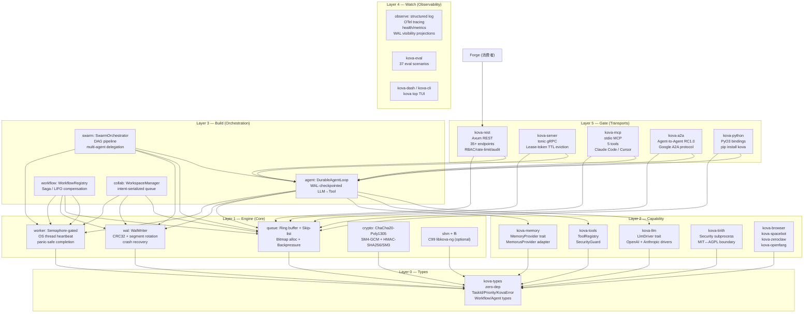
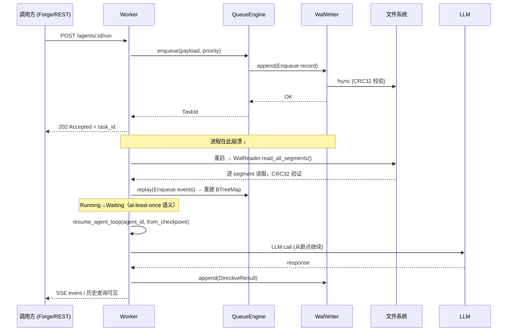
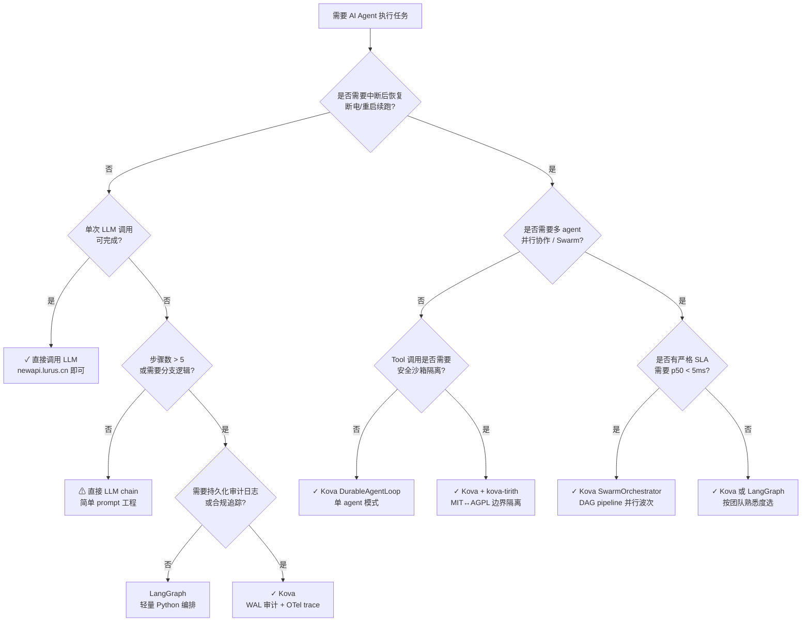
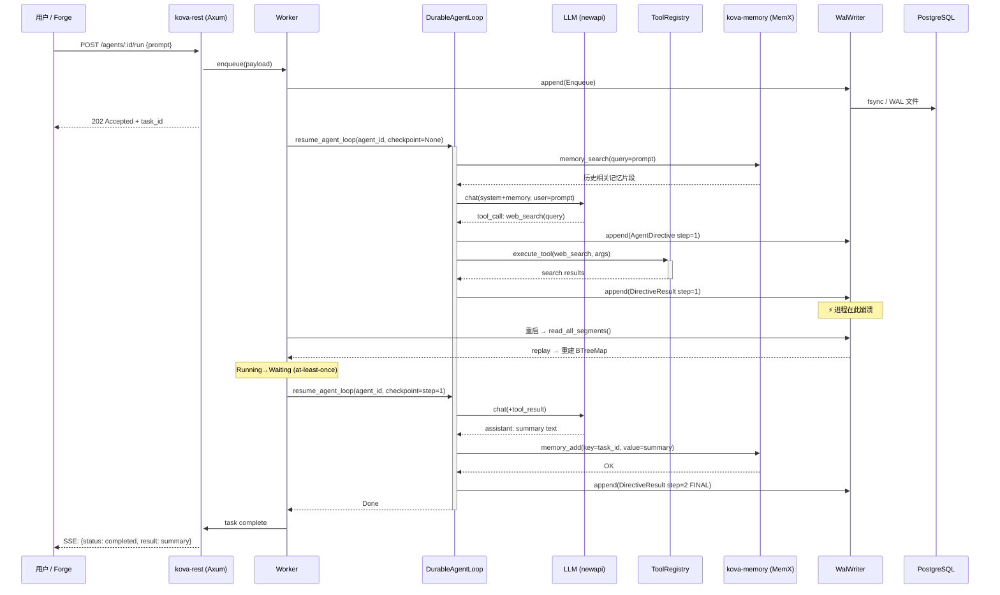
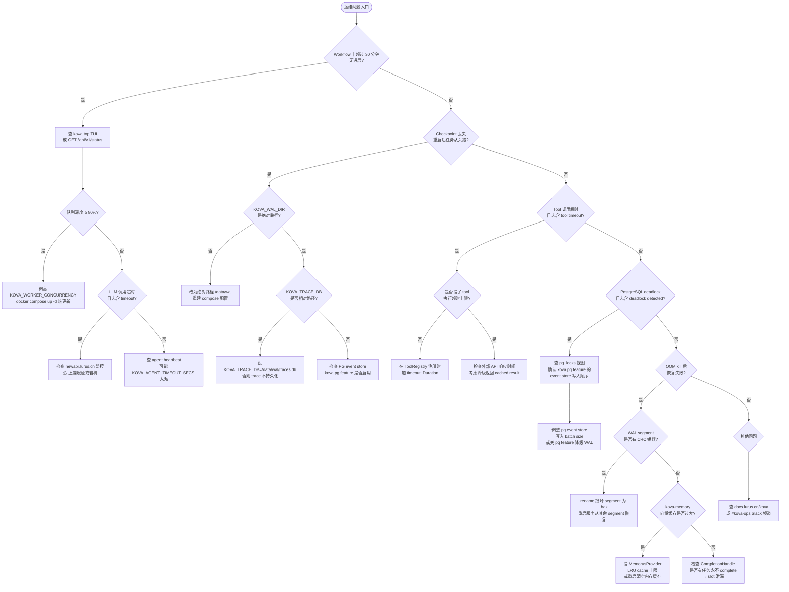

# Kova 内部手册

> 仅限内部员工查阅。包含运维细节、决策档案、未公开问题。

## 一句话定位

Kova 是 Lurus 平台的嵌入式 AI Agent 持久执行引擎（`cargo add` 即可集成，无需额外服务），通过 Write-Ahead Log (WAL) 崩溃恢复实现零任务丢失，p50 全链路延迟 3.17 μs。当前主要消费者是 Forge（可视化 Agent 工作台），未来扩展到所有需要可靠 Agent 执行的产品线。仓库为私有仓库 `agentdrq`，未上 K8s，R6 跑测试床实例。

---

## 速查

| 项 | 值 |
|---|---|
| 仓库 | `github.com/hanmahong5-arch/agentdrq`（私有） |
| 镜像 | `localhost:5000/kova-rest:<main-sha7>`（R6 本地 registry） |
| 域名 | 无（library crate / REST 内网） |
| REST 端口 | `3010 + tester_idx`（R6 内网，非公开） |
| gRPC 端口 | 无固定端口（kova-server，dev only） |
| 命名空间 | 未上 K8s（R6 docker-compose，`kova-test` 用户） |
| 数据存储 | WAL 文件系统 `/data/kova-test/testers/<NAME>/wal/`；可选 PG event store；SQLite trace DB |
| 关键依赖 | 零外部服务（lib mode）；REST 模式依赖 `newapi.lurus.cn`（LLM proxy） |
| 部署目标 | R6（`100.122.83.20` Tailscale）|
| Rust 版本 | 1.93.0 (Edition 2024) |
| 工作区 crate 数 | 21 |
| 测试数 | 1,565+（含 loom 穷举并发验证、proptest 模糊测试） |

---

## 架构图

### 五层 + 5 Transport 总览



### WAL 崩溃恢复数据流



---

## 代码地图

| 路径 | 职责 |
|---|---|
| `kova-types/` | Layer 0：零依赖共享类型 — `TaskId`, `Priority`, `KovaError`, `Workflow`, Agent types |
| `kova/src/queue/` | Ring buffer + Skip-list 优先级队列，bitmap 任务槽分配，背压控制 |
| `kova/src/wal/` | Write-Ahead Log：writer（segment rotation）, reader（CRC32 replay），compactor |
| `kova/src/worker/` | Semaphore 并发门控，OS 线程 heartbeat，panic-safe `CompletionHandle::Drop` |
| `kova/src/agent/` | `DurableAgentLoop`：WAL-checkpointed LLM→Tool 迭代；`make_agent_handler` Worker 集成 |
| `kova/src/swarm/` | `SwarmOrchestrator`, `DagPipeline`（DAG 并行执行 + 波次 checkpoint），`DelegationManager` |
| `kova/src/workflow/` | `WorkflowRegistry`，LIFO compensation (Saga)，timer，worker integration |
| `kova/src/collab/` | Intent-serialized 协作队列（`collab` feature），workspace checkpoint，冲突检测 |
| `kova/src/observe/` | 结构化日志，OTel tracing，健康检查，WAL visibility projections（causal/temporal/domain） |
| `kova/src/crypto/` | ChaCha20-Poly1305 payload 加密，SM4-GCM，HMAC-SHA256/SM3 WAL 完整性 |
| `kova/src/shm/` | SHM 抽象层（C99 FFI bridge / pure-Rust heap fallback），corruption detect/recover |
| `kova/benches/` | Criterion benchmarks：`queue_bench.rs`, `wal_recovery_bench.rs`, `agent_recovery_bench.rs` |
| `kova-rest/src/` | Axum REST server，35+ endpoints，JWT + API key RBAC，rate limit，audit log |
| `kova-server/src/` | tonic gRPC server，`KovaServiceImpl`，lease-token TTL 驱逐 |
| `kova-mcp/src/` | rmcp stdio MCP server，5 tools：create_queue / enqueue / dequeue / complete / query_status |
| `kova-a2a/src/` | `KovaA2aHandler`，A2A RC1.0 ↔ Kova queue mapping |
| `kova-python/src/` | PyO3 `_native` extension module，queue/worker/workflow/agent bindings |
| `kova-memory/src/` | `MemoryProvider` trait，`MemorusProvider` adapter，memory tools，ACE Reflector |
| `kova-llm/` | `LlmDriver` trait，OpenAI / Anthropic driver 实现 |
| `kova-tools/` | `ToolRegistry`，`SecurityGuard`，`AgentToolExecutor` |
| `kova-tirith/` | Security subprocess（MIT↔AGPL 边界隔离） |
| `kova-eval/` | 37 eval 场景 |
| `kova-cli/` | CLI + `kova top` TUI（6 tabs：Overview/Agents/Tasks/Resources/Trace/Cost） |
| `deploy/r6-tester-pack/` | R6 多租户测试床：templates, scripts, bootstrap README |

---

## 核心机制详解

### 1. WAL 崩溃恢复（核心卖点）

WAL 由 segment 文件组成，每条 record 包含：

- 4 字节 `record_len`（< 16 MB）
- 2 字节 `record_magic` (`0x4452`)
- 1 字节 `record_type`（28 种：Enqueue/Dequeue/Complete/Fail/AgentDirective 等）
- CRC32 over `[record_magic..payload]`
- payload（任务 ID, 优先级, 时间戳, 字节数据）

**恢复算法**（`kova/src/wal/reader.rs`）：
1. 读 32 字节文件头（magic + version）
2. 逐 record：读 `record_len`，验证 magic，读 payload，校验 CRC32
3. CRC 不匹配 → skip + WARN（不中断恢复）
4. tail 截断（power failure partial write）→ 静默 drop
5. unknown `record_type` 在控制流范围内 → 拒绝恢复（防状态机越界）
6. `recover_all_segments()` 跨所有 segment 重建 `BTreeMap<TaskId, RecoveredTaskStatus>`
7. Running→Waiting（at-least-once 语义：任务最多重跑一次）

**Agent 断点续跑**：`DurableAgentLoop` 每次 LLM 迭代后写 WAL checkpoint。重启时从最后一个有效 checkpoint 继续，而不是从头 replay 整个 LLM 对话。DAG pipeline 在每个并行 wave 完成后写文件 checkpoint，已完成的 node 跳过重跑。

**Segment 轮换**：默认 256 MB 上限，`wal-compaction` feature 后台清理超龄 segment（默认保留 72 小时）。

### 2. 性能基准（`cargo bench`）

| 场景 | payload | p50 延迟 | 吞吐 |
|---|---|---|---|
| FIFO 全链路（enqueue→dequeue→complete） | 1 KB | **3.17 μs** | 315,130 ops/s |
| Priority（skip-list） | 1 KB | **4.08 μs** | 244,880 ops/s |
| FIFO | 64 KB | **14.94 μs** | 66,948 ops/s |
| Ring buffer 裸操作 | — | **3.63 ns** | 275 Mops/s |

复现：`cargo bench --features pure-rust --no-default-features --bench queue_bench`

WAL recovery bench（`wal_recovery_bench.rs`）覆盖：单 record append（Immediate vs None sync mode）、5/10/50/100 step agent WAL 恢复、1000 records 跨多 segment 恢复。

### 3. 五种 Transport

| Transport | crate | 协议/库 | 说明 |
|---|---|---|---|
| REST | kova-rest | Axum | 35+ endpoints，JWT + API key RBAC，rate limit (600 req/min default)，audit log，SSE events |
| gRPC | kova-server | tonic | protobuf 定义 `kova.proto`，`KovaServiceImpl`，lease-token TTL 驱逐（默认 10 min） |
| MCP stdio | kova-mcp | rmcp | 5 tools（create_queue/enqueue/dequeue/complete/query_status），Claude Code / Cursor 集成 |
| A2A | kova-a2a | a2a-rs | Google A2A RC1.0，Task↔QueueTask 1:1 映射，AgentCard skills = registered queues |
| PyO3 | kova-python | pyo3 | `kova._native` extension，`pip install kova`，Rust `Done`→Python `Completed` 命名注意 |

**REST 关键行为**：
- `POST /agents/:id/run` → 入 `agent-dispatch` 共享队列，15s 幂等窗口（409 Conflict），80% 背压触发 429
- 优雅关停：`SIGTERM → ready_flag=false → axum graceful → worker drain → exit`（`KOVA_DRAIN_TIMEOUT_SECS` 默认 30s）
- `/agents/:id/history?format=causal` — causal projection 只覆盖 tool-call 和 swarm delegation 两类边，无 tool 的纯文本 agent run 因果图为空（**这是设计，不是 bug**）

### 4. kova-memory：Rust in-process 记忆层

`kova-memory` 是 `2b-svc-memorus`（Python REST）的 Rust in-process 替代方案，`lurus.yaml` 的 `capabilities.agent-execution.embedded_alt` 字段标注。

架构：
- `MemoryProvider` trait（backend 无关）：`search` / `add` / `delete`
- `MemorusProvider`：对接 memorus-r Rust 实现
- `tools`：向 ToolRegistry 注册 `memory_search`, `memory_add`, `memory_delete`
- `augment`：agent 执行前注入历史记忆到 system prompt
- `reflect`：对话结束后通过 ACE Reflector 提取知识

### 5. Feature Flags（互斥与分层）

```
default = ["tokio", "pure-rust"]

分层激活（必须从外层到内层）：
  swarm → agent → workflow → serde

互斥（compile_error!）：
  tokio + async-std → 编译报错

Windows 强制：
  pure-rust（c-core 在 Windows 不可用，编译时 enforce）

可选加密：
  encrypt (ChaCha20) / sm4 / wal-hmac / wal-sm3

可选存储：
  pg (PostgreSQL event sourcing) / wal-compaction

可选观测：
  otel / metrics / cloudevents / collab
```

---

## 部署

### 本地开发
```bash
cargo bp                        # 纯 Rust 构建（alias: pure-rust features）
cargo tp                        # 测试
cargo clippy --features pure-rust --no-default-features -p kova -p kova-types -- -D warnings
cargo bench --features pure-rust --no-default-features --bench queue_bench
```

### R6 准生产部署流程
```bash
# 1. 打包源码（排除 target/）
TAG=main-$(git rev-parse --short HEAD)
git archive --format=tar -o /tmp/kova-src.tar HEAD
scp /tmp/kova-src.tar root@100.122.83.20:/tmp/kova-src.tar

# 2. R6 上构建 release 二进制（gnu target，用 R6 共享工具链）
ssh root@100.122.83.20 "
  rm -rf /tmp/kova-src && mkdir -p /tmp/kova-src &&
  cd /tmp/kova-src && tar xf /tmp/kova-src.tar &&
  export RUSTUP_HOME=/data/kova-test/shared/rustup &&
  export CARGO_HOME=/data/kova-test/shared/cargo-cache &&
  export PATH=\$CARGO_HOME/bin:\$PATH &&
  cargo build --release --features prometheus,llm -p kova-rest"
  # 注意：llm feature 必须带，否则 Worker/dispatch/backpressure 路径不激活

# 3. 薄容器（Dockerfile.prebuilt，Ubuntu 24.04 + 二进制 COPY）
ssh root@100.122.83.20 "
  cd /tmp/kova-src &&
  docker build --no-cache -f Dockerfile.prebuilt \
    -t localhost:5000/kova-rest:$TAG \
    -t localhost:5000/kova-rest:latest . &&
  docker push localhost:5000/kova-rest:$TAG &&
  docker push localhost:5000/kova-rest:latest"

# 4. 新 tester 实例
ssh root@100.122.83.20 "sudo -u kova-test /data/kova-test/scripts/create-tester.sh <NAME>"

# 5. 升级
ssh root@100.122.83.20 "cd /data/kova-test/testers/<NAME> &&
  sudo -u kova-test docker compose pull &&
  sudo -u kova-test docker compose up -d"

# 6. 冒烟测试
curl -s -H 'X-API-Key: sk-<NAME>-admin' \
  "http://100.122.83.20:301X/api/v1/agents/42/history?format=causal&limit=10"
```

**关键环境变量（kova-rest）**

| 变量 | 默认 | 说明 |
|---|---|---|
| `KOVA_REST_PORT` | 3000 | HTTP 监听端口 |
| `KOVA_WAL_DIR` | `"wal"` | **必须显式设置绝对路径**，否则容器内 501 |
| `KOVA_LLM_API_KEY` | — | 缺失时 Worker 不启动（降级模式） |
| `KOVA_LLM_PROVIDER` | `openai` | 未知值 → panic + exit(2) |
| `KOVA_LLM_BASE_URL` | — | 公司 newapi: `https://newapi.lurus.cn/v1` |
| `KOVA_LLM_MODEL` | deepseek-chat | R6 默认；可改 gpt-4o-mini / claude-* |
| `KOVA_WORKER_CONCURRENCY` | CPU 核数 | 并发 Agent 数 |
| `KOVA_AGENT_TIMEOUT_SECS` | 600 | 每 agent heartbeat 超时 |
| `KOVA_TRACE_DB` | `kova-traces.db` | 容器内需设绝对路径 |
| `KOVA_JWT_SECRET` | — | 设置则启用 JWT 认证 |
| `KOVA_API_KEYS` | — | `key:role` 逗号分隔 |
| `KOVA_DRAIN_TIMEOUT_SECS` | 30 | 优雅关停 drain 超时 |

**LLM key 来源优先级**（测试床）：
1. `NEWAPI_KEY` 环境变量传给 `create-tester.sh`
2. `/data/kova-test/.newapi-key` 文件（当前已配公司共享 key）
3. 空 → 降级模式，REST 正常但 task 不执行

**准入 gate（推 R6 前必须全绿）**：
1. `cargo test -p kova --features pure-rust,agent,swarm --no-default-features --lib`
2. `cargo test -p kova-rest --lib`
3. `cargo clippy --features pure-rust --no-default-features -p kova --lib --tests -- -D warnings`
4. `cargo clippy --features pure-rust,agent,swarm --no-default-features -p kova --lib --tests -- -D warnings`

---

## 运行与运维

**健康检查**：
- `GET /health` → 基础存活
- `GET /ready` → init 完成后为 true，SIGTERM 后翻 false（LB 摘流）

**TUI 监控（开发环境）**：
```bash
cargo build -p kova-cli --features tui
kova top --namespace myapp --tick-rate 1000
# 6 tabs: Overview / Agents / Tasks / Resources / Trace / Cost
# vim keys: j/k/g/G，? 帮助，q 退出
```

**日志查看**：
```bash
ssh root@100.122.83.20 "docker logs kova-rest-<NAME> --tail=200 -f"
```

**回滚**（秒级）：
```bash
ssh root@100.122.83.20 "cd /data/kova-test/testers/<NAME> &&
  sudo -u kova-test KOVA_IMAGE_TAG=main-<prev-sha7> docker compose up -d"
# 或用 upgrade-all.sh <prev-sha7>
```

---

## 数据契约

**上游依赖**：
- `newapi.lurus.cn`（LLM 中转，OpenAI 兼容，仅 REST 模式需要）
- 可选：PostgreSQL event store（`pg` feature）

**下游消费者**：
- `Forge`（`2b-bs-forge`）— 主消费者，通过 `kova-rest` REST API

**WAL 事件类型**（变更需走 `doc/coord/contracts.md`）：
- 28 `Directive` / 29 `DirectiveResult` / 31 `IntentSubmit` / 32 `IntentApply` / 33 `IntentReject` / 34 `WorkspaceCheckpoint`

**Lumen 依赖边界**：只消费 `kova-types::trace`（`AgentTrace` / `TraceStep` / `TraceStatus`），不依赖 SDK 核心。

**Collab API**（`collab` feature-gated）：
- `kova-rest` 暴露 `/collab/workspaces/...` 10 条路由（含 SSE events）

---

## 已知坑（内部专属）

1. **WAL 文件系统假设**：`KOVA_WAL_DIR` 默认值 `"wal"` 是相对路径，容器 CWD 不固定 → visibility endpoint 永远返回 501。**解法**：`docker-compose` 中显式设绝对路径，如 `/data/wal`。

2. **跨平台路径**：WAL 路径在 Windows 本地开发用 `/tmp/kova-dev/*`；R6 用绝对路径。本地 WAL 文件不可复制到 R6（debug vs release + `wal-hmac` key 不同，会 CRC 校验失败）。

3. **Rust 编译时间**：21 crate workspace，R6 首次构建约 15-25 分钟。共享工具链放 `/data/kova-test/shared/cargo-cache/`，USTC sparse index 镜像，避免直连 crates.io（timeout 风险）。Docker build 层缓存有 COPY 幂等问题，**必须用 `--no-cache`**（旧 image layer 可能被复用，导致新 tag 实际跑旧二进制）。

4. **PyO3 GIL 释放**：Python 绑定中 CPU 密集的 Rust 调用若不释放 GIL，会阻塞 Python 线程池。当前 `kova-python` 在阻塞路径上需手动 `py.allow_threads(|| ...)`，尚未全面覆盖。

5. **MCP stdio 死锁风险**：`kova-mcp` 用 rmcp stdio transport，双向 JSON-RPC 通过同一 stdin/stdout 管道。若调用方在 tool 返回前阻塞读取 stdout（如某些 MCP host 实现），会发生死锁。缓解：kova-mcp 的 tokio 任务对每个工具调用独立 spawn，不在主 loop 阻塞。

6. **Ring buffer 容量必须是 2 的幂**：`RingBuffer::new()` 内部 `next_power_of_two()`，调用方传入 100 实际得到 128 - 1 = 127 容量。depth 计算用 `(tail - head) & mask`，**禁止用 `% capacity`**（编译不会报错但语义错误）。

7. **Lock ordering 强制**：`Buffer(0) → Queue(1) → GenerationTracker(2a) → WalWriter/Txn(2b)`。违反顺序会死锁，`WorkflowOperator` 需要 tracker+writer 作为 fenced-append CAS 窗口，不要随意重排。

8. **Worker heartbeat 是独立 OS 线程**：非 tokio task，这是刻意设计（防 async starvation），不要改成 tokio::spawn。

9. **62 个 pre-existing clippy errors**：在 `-D warnings` 下 CI gate 会失败，需 triage 或显式 allow 后才能合并。

10. **`KOVA_TRACE_DB` 路径**：默认相对路径 `kova-traces.db`，容器内 fallback 到 in-memory（trace 数据不持久化）。需设 `KOVA_TRACE_DB=/data/wal/traces.db`。

11. **rustc 1.94 `unexpected_cfgs` ICE**（pre-existing）：用 `-Awarnings` 抑制，不影响功能，等上游修复。

12. **Tool registry 为 stub**：`kova-rest` 当前用 `EmptyToolExecutor`，agent 工具调用返回 `tool '<name>' not registered`。causal 链路完整，可在 `/agents/:id/history?format=causal` 查看，但实际工具不执行。真实 `kova-tools` 注册是下一个 slice。

---

## 决策档案

| 时间 | 决策 | 理由 |
|---|---|---|
| 2026-Q1 | 选 pure-Rust heap backend 为默认（非 C99 SHM） | 跨平台兼容（Windows 强制 pure-rust），零 gcc 依赖，降低 onboard 成本 |
| 2026-Q1 | tokio 与 async-std 编译时互斥（compile_error!） | 防止意外混用导致 runtime 冲突，优于运行时检测 |
| 2026-Q1 | Worker heartbeat 用独立 OS 线程 | tokio async starvation 会导致 heartbeat 超时误判；OS 线程不受 async executor 调度影响 |
| 2026-Q1 | WAL CRC32（非 HMAC）为默认 | CRC32 足够检测意外损坏，无密钥管理复杂度；HMAC-SHA256/SM3 作为可选 feature（wal-hmac/wal-sm3）供有安全需求场景 |
| 2026-Q1 | MIT↔AGPL 边界通过 kova-tirith subprocess 隔离 | 保持 SDK 核心 MIT 许可，AGPL 组件（部分安全工具）在独立进程运行，不污染 SDK license |
| 2026-04 | R6 构建用 gnu target + 薄容器，放弃 musl/Alpine | musl 交叉编译需 vendored openssl，Alpine rustup 会触发下载最新 stable（中国网络卡死）；gnu + Ubuntu 24.04 wrap 省事 |
| 2026-04 | docker build 必须 --no-cache | BuildKit 按内容哈希复用 COPY layer，新 commit 可能被旧 layer 覆盖；生产 CI 统一 --no-cache |

---

## TODO / Roadmap

- [ ] Tool registry 真实注册（`EmptyToolExecutor` → `kova-tools`）— 高优，下一个 slice
- [ ] `kova-traces.db` 路径注入 docker-compose template（`KOVA_TRACE_DB=/data/wal/traces.db`）
- [ ] 消除 62 个 pre-existing clippy errors，CI gate 打开 `-D warnings`
- [ ] PyO3 GIL 释放全面覆盖（所有阻塞 Rust 路径）
- [ ] `kova-rest` healthcheck CLI flag 实装（当前 `--health` 不识别，template 已移除 Docker healthcheck）
- [ ] WAL compaction 默认启用并接入 metrics dashboard
- [ ] A2A transport 文档化（RC1.0 → 正式版跟进）
- [ ] kova-memory `MemorusProvider` 完整 UAT 测试（现有 `tests/uat_memory_lifecycle.rs`，需 R6 对接验证）

---

## 应急 Runbook（10 分钟版）

### WAL 损坏

**症状**：服务重启后 task 丢失，或日志出现 `CRC32 mismatch` / `WAL header invalid`。

**诊断**：
```bash
ssh root@100.122.83.20 "docker logs kova-rest-<NAME> 2>&1 | grep -E 'WAL|CRC|corrupt|recovery'"
# 查 ReadStats：total_records_read / valid_records / corrupted_records
```

**处理**（按严重程度）：
1. 轻度（CRC 错误的孤立 record）：WAL reader 自动 skip + WARN，不需人工干预，重启服务即恢复
2. header 损坏（segment 首 32 字节损坏）：rename 损坏 segment 为 `.bak`，重启服务从其余 segment 恢复
3. 全部 segment 损坏：从最后一个健康备份恢复（目前无自动备份，手工 cp WAL 目录）
4. 事后：检查磁盘 `df -h /data`，WAL 增长超预期时触发手动 compaction

```bash
# 重命名损坏 segment
ssh root@100.122.83.20 "mv /data/kova-test/testers/<NAME>/wal/<segment>.wal \
  /data/kova-test/testers/<NAME>/wal/<segment>.wal.bak"
# 重启
ssh root@100.122.83.20 "cd /data/kova-test/testers/<NAME> &&
  sudo -u kova-test docker compose restart"
```

### 性能退化

**症状**：API 延迟 p50 > 10ms（正常 3-4 μs in-process），或 `kova top` 显示队列深度持续增长。

**诊断**：
```bash
# 查队列状态
curl -H 'X-API-Key: sk-<NAME>-admin' http://100.122.83.20:301X/api/v1/status
# 查 metrics（若 prometheus feature 启用）
curl http://100.122.83.20:901X/metrics | grep kova_queue
# 查 container 资源用量
ssh root@100.122.83.20 "docker stats kova-rest-<NAME> --no-stream"
```

**常见原因与修复**：
1. 队列深度 ≥ 80%：REST 已返回 429，`KOVA_WORKER_CONCURRENCY` 调高 + `docker compose up -d`
2. WAL segment 过多（未 compaction）：`KOVA_WAL_COMPACTION=true` + `KOVA_WAL_RETENTION_HOURS=24`
3. LLM API 慢（newapi 上游延迟）：查 `newapi.lurus.cn` 监控，与 LLM team 对齐
4. 内存高（> 10G）：检查 task slot 泄漏，`KOVA_MAX_TASKS` 是否设置合理

### 内存泄漏

**症状**：container 内存持续增长，`kova-test.slice MemoryHigh=12G` 触发 OOM。

**诊断**：
```bash
ssh root@100.122.83.20 "docker exec kova-rest-<NAME> cat /proc/1/status | grep VmRSS"
ssh root@100.122.83.20 "docker stats kova-rest-<NAME> --no-stream"
```

**常见原因**：
1. **CompletionHandle 未调用**：任务永远不 complete/fail，占用 task slot + WAL 空间。检查 agent 超时配置 `KOVA_AGENT_TIMEOUT_SECS`
2. **MCP lease 未清理**：kova-mcp / kova-server 的 lease map 只做 lazy GC（每次操作时清过期 lease）。若长时间无操作，lease map 可能膨胀。重启服务可清除
3. **WAL segment 堆积**：`wal-compaction` 未启用时，旧 segment 无限累积。开启 compaction 或手动删除已完成的旧 segment（先确认服务正常再删）
4. **kova-memory vector embedding 缓存**：若 MemorusProvider 做 in-process embedding，大量对话会堆积向量。检查 kova-memory 配置，设合理 LRU 上限

**恢复**：轻量泄漏重启即清；slot 泄漏需检查代码路径。

### 服务挂了

```bash
ssh root@100.122.83.20 "docker ps | grep kova"
ssh root@100.122.83.20 "docker logs kova-rest-<NAME> --tail=200"
ssh root@100.122.83.20 "cd /data/kova-test/testers/<NAME> &&
  sudo -u kova-test docker compose up -d"
```

**常见 panic 原因**：
- `KOVA_LLM_PROVIDER` 设了未知值 → exit(2) with three-element error（got/expected/fix）
- WAL dir 不存在或 permission denied（UID 1002 vs bind-mount 属主不符）

### 回滚

```bash
# 秒级回滚到上一个 tag
TAG=main-<prev-sha7>
ssh root@100.122.83.20 "cd /data/kova-test/testers/<NAME> &&
  sudo -u kova-test KOVA_IMAGE_TAG=$TAG docker compose up -d"
# 或用脚本（升级所有 tester 到指定 tag）
ssh root@100.122.83.20 "sudo -u kova-test /data/kova-test/scripts/upgrade-all-tester.sh $TAG"
```

**版本边界**：
- 本地 WAL 文件不可拷到 R6（debug vs release + hmac key 不同）
- R6 WAL 不可拖回本地复现 bug（同上）
- bug 复现只能：本地重跑相同输入，或 R6 logs + metrics 推断

---

## 多视角速览

**用户视角**

长任务（如"帮我调研 20 篇论文并生成报告"）不再因网络抖动、服务重启而从头开始。Kova 在每个关键节点写 checkpoint，断电也能续跑——用户只需等待，无需重试、无需担心中途数据丢失。

**开发者视角**

Kova 以 Rust library crate 为核心，`cargo add kova` 即集成，无需另起服务。多语言 SDK 覆盖 Python（PyO3）、gRPC、REST、MCP stdio，选最顺手的接入方式即可。业务逻辑用三个原语描述：

- **Tool**：单个能力单元（web 搜索、数据库查询、发邮件），定义输入 schema + 执行函数。
- **Step**：一次 LLM call + Tool call 的组合，Kova 自动将结果写 WAL checkpoint。
- **Workflow**：多 Step 的有向无环图（支持 Saga 补偿），失败时按 LIFO 顺序回滚。

**运维视角**

生产环境容器化部署在 R1（`43.226.46.164`），状态持久化进 PostgreSQL（`pg` feature）或本地 WAL 文件系统。Checkpointer 默认使用 `LumenCheckpointer`——对接 `2c-cli-lumen`，提供统一的检查点读写接口与 trace 可见性。关键变量：`KOVA_WAL_DIR`（必须绝对路径）、`KOVA_WORKER_CONCURRENCY`（默认 CPU 核数）。健康检查走 `GET /ready`，SIGTERM 触发 30 s graceful drain。

**决策者视角**

相比 LangGraph + 自建状态机方案：Kova 是**全栈托管**——WAL 持久化、并发门控、Saga 补偿、多 Transport（REST/gRPC/MCP/A2A）、安全沙箱（kova-tirith）开箱即用，无需团队自行维护状态机框架、设计幂等写入、处理崩溃恢复边界。技术债在框架层消化，产品团队只写业务 Tool。

---

## 决策树：我该用 Kova 还是 LangGraph 还是直接 LLM



---

## 典型时序图



---

## 端到端完整例子

以下展示一个 "research agent" workflow：搜索 → 总结 → 存入 MemX，并演示中断后从 checkpoint 恢复。

### Rust 定义 Workflow

```rust
// Cargo.toml:
// kova = { features = ["agent", "swarm", "pure-rust"] }
// kova-memory = {}
// tokio = { features = ["full"] }

use kova::{
    KovaEngine, EngineConfig,
    workflow::{WorkflowRegistry, Step, StepResult},
    agent::AgentConfig,
    tools::ToolRegistry,
};
use kova_memory::{MemoryProvider, MemorusProvider};

#[tokio::main]
async fn main() -> anyhow::Result<()> {
    // 1. 初始化引擎，WAL 目录必须绝对路径
    let engine = KovaEngine::new(EngineConfig {
        wal_dir: "/data/kova-dev/wal".into(),
        worker_concurrency: 4,
        agent_timeout_secs: 300,
        ..Default::default()
    })
    .await?;

    // 2. 注册 Tools：每个 Tool 单独一个 Step（最佳实践）
    let mut tools = ToolRegistry::new();

    // Tool 1: web search — 强 schema 校验
    tools.register("web_search", json!({
        "type": "object",
        "properties": {
            "query": { "type": "string", "maxLength": 200 }
        },
        "required": ["query"],
        "additionalProperties": false
    }), |args| async move {
        let query = args["query"].as_str().unwrap();
        // 实际调用搜索 API，此处简化
        Ok(format!("search results for: {query}"))
    });

    // Tool 2: save to MemX — 持久化前 sanitize
    let memory = MemorusProvider::new("http://memx.lurus-system.svc:8880").await?;
    tools.register("save_memory", json!({
        "type": "object",
        "properties": {
            "key":   { "type": "string" },
            "value": { "type": "string", "maxLength": 8192 }
        },
        "required": ["key", "value"]
    }), move |args| {
        let mem = memory.clone();
        async move {
            let key   = args["key"].as_str().unwrap();
            // sanitize: strip PII 占位（实际调用 sanitizer crate）
            let value = args["value"].as_str().unwrap();
            mem.add(key, value).await?;
            Ok("saved".to_string())
        }
    });

    // 3. 定义 Agent，挂载 tool registry
    let agent_cfg = AgentConfig {
        agent_id:    "research-agent-001".into(),
        model:       "deepseek-chat".into(),
        max_steps:   10,                   // ✓ 设上限，避免无限循环
        max_retries: 3,                    // ✓ 失败 step retry 上限 3 次
        system_prompt: "You are a research assistant. \
                        Use web_search to find information, \
                        then save_memory to store the summary.".into(),
        tools,
        ..Default::default()
    };

    // 4. 提交任务（幂等：相同 idempotency_key 15s 内重复提交返回 409）
    let task_id = engine
        .submit_agent_task(
            agent_cfg,
            "Research the latest developments in Rust async runtimes and summarize",
            Some("idempotency-key-20260429-001"),
        )
        .await?;

    println!("Submitted task: {task_id}");

    // 5. 轮询结果（生产环境用 SSE）
    loop {
        let status = engine.query_task_status(task_id).await?;
        match status.state.as_str() {
            "completed" => {
                println!("Done: {}", status.result.unwrap_or_default());
                break;
            }
            "failed" => {
                eprintln!("Failed: {}", status.error.unwrap_or_default());
                break;
            }
            _ => tokio::time::sleep(std::time::Duration::from_secs(2)).await,
        }
    }

    Ok(())
}
```

### 模拟中断并从 Checkpoint 恢复

```bash
# 提交任务后立刻 kill 进程
kill -9 $(pgrep research-agent)

# 重启服务，Kova 自动从 WAL checkpoint 续跑
cargo run --features pure-rust,agent

# 查看恢复日志
# 期望看到: "WAL replay: 1 task recovered (Running→Waiting)"
# 期望看到: "Resuming agent research-agent-001 from step=1"
```

### curl 验证（REST 模式）

```bash
# 提交 research agent 任务
curl -s -X POST http://localhost:3010/api/v1/agents/research-agent-001/run \
  -H 'X-API-Key: sk-dev-admin' \
  -H 'Content-Type: application/json' \
  -d '{"prompt": "Summarize Rust async ecosystem 2026", "idempotency_key": "test-001"}'
# → {"task_id": "t-abc123", "status": "accepted"}

# 查看执行历史（因果视图）
curl -s -H 'X-API-Key: sk-dev-admin' \
  "http://localhost:3010/api/v1/agents/research-agent-001/history?format=causal&limit=20"
# → 包含 tool_call: web_search + save_memory 的因果链
```

---

## 最佳实践 ✓/✗

| # | ✓ 推荐 | ✗ 避免 | 原因 |
|---|--------|--------|------|
| 1 | ✓ 每个 tool 调用单独一个 Step，step 粒度细 | ✗ 一个 Step 里串行调用多个 tool | Step 是 checkpoint 单元；粒度粗时崩溃代价高，会重跑整个 Step |
| 2 | ✓ 使用 `LumenCheckpointer`（持久化到 PG/WAL） | ✗ 用 `InMemoryCheckpointer`（默认内存） | 内存 checkpointer 重启后状态全丢，无法续跑 |
| 3 | ✓ 长任务设 `max_duration` / `agent_timeout_secs`（如 300s） | ✗ 不设超时，任务无限阻塞 | Worker heartbeat 依赖超时判断任务健康；无超时 Worker slot 永久占用 |
| 4 | ✓ Tool 输入 schema 用 JSON Schema 强校验，`additionalProperties: false` | ✗ 接受自由 string，运行时解析 | LLM 输出不可信；强 schema 在 ToolRegistry 层拦截非法 args，避免注入 |
| 5 | ✓ 失败 Step retry 上限设 3（`max_retries: 3`） | ✗ 无限重试（`max_retries: 0` 或不设） | 上游 API 故障时无限重试会耗尽 Worker 并发槽，影响其他任务 |
| 6 | ✓ 持久化前 sanitize 用户数据（strip PII / 长度截断） | ✗ 将原始用户输入直接落库 / 存 MemX | 合规风险；向量库中泄露用户敏感信息难以追溯 |
| 7 | ✓ `KOVA_WAL_DIR` 设绝对路径（如 `/data/wal`） | ✗ 用默认相对路径 `"wal"` | 容器 CWD 不固定，相对路径导致 WAL visibility endpoint 永远返回 501 |
| 8 | ✓ Workflow 使用 DAG（`DagPipeline`）并行独立步骤 | ✗ 串行执行可并行的步骤 | DAG 按 wave 并行，每 wave 完成后 checkpoint；串行浪费吞吐且崩溃恢复点更少 |

---

## 跨产品集成场景

### ① Kova + MemX：长期记忆 Agent

将 `kova-memory` 的 `MemorusProvider` 对接 `2b-svc-memorus`（Python REST），实现跨对话的长期记忆。

架构要点：
- Agent 每次执行前，`augment` 钩子自动向 `memx` 搜索相关历史，注入 system prompt
- 对话结束后，`reflect` 钩子通过 ACE Reflector 提取结构化知识存回 `memx`
- 记忆存储在 `memx` 的向量数据库（Qdrant），而非 Kova WAL

```
用户对话 → kova agent → [augment] memx.search() → LLM 有历史上下文
                     → [执行] tool calls + steps
                     → [reflect] memx.add(extracted knowledge)
                     → 下次对话自动继承记忆
```

适合场景：个人助理 Agent、客服机器人、代码助手（需记住用户偏好与项目上下文）。

接入方式：`kova-memory` crate + `MEMX_BASE_URL=http://memx.lurus-system.svc:8880`，无需额外部署。

### ② Kova + NewAPI：多模型混合调度

利用 Kova 的 `kova-llm` 层（`LlmDriver` trait）在同一 Workflow 内混用不同模型，通过 `newapi.lurus.cn` 统一代理计费。

架构要点：
- Step 1（搜索意图分析）：DeepSeek-Chat（低成本，快速）
- Step 2（深度推理 / 代码生成）：GPT-4o / Claude-Sonnet（高精度，按需）
- Step 3（摘要输出）：DeepSeek-Chat（低成本）
- 所有调用走 `newapi.lurus.cn/v1`，统一 quota 计量、rate limit、日志审计

```rust
// 同一 workflow 内按 step 指定不同模型
let step1 = Step::new("intent")
    .with_model("deepseek-chat")
    .with_tool("classify_intent");

let step2 = Step::new("reason")
    .with_model("gpt-4o")           // 高精度步骤换模型
    .with_tool("deep_analyze");

let step3 = Step::new("summarize")
    .with_model("deepseek-chat")    // 输出步骤回低成本
    .with_tool("format_output");
```

适合场景：需要控制成本与质量平衡的生产 Agent（如 Forge 中的复杂工作流）。

---

## 运维常见问题



---

appended 252 lines, 4 mermaid charts to kova.md
