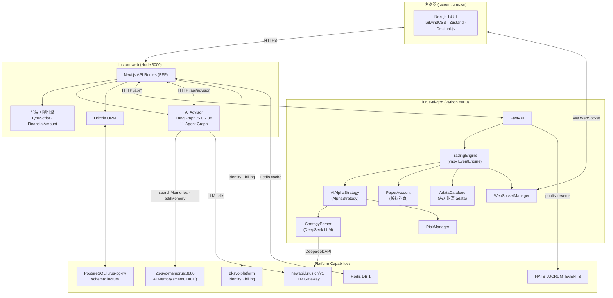
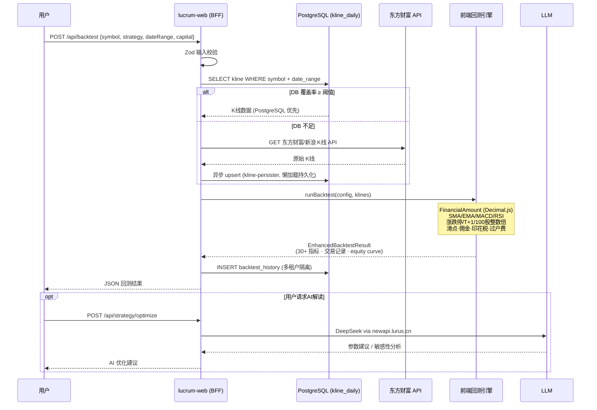
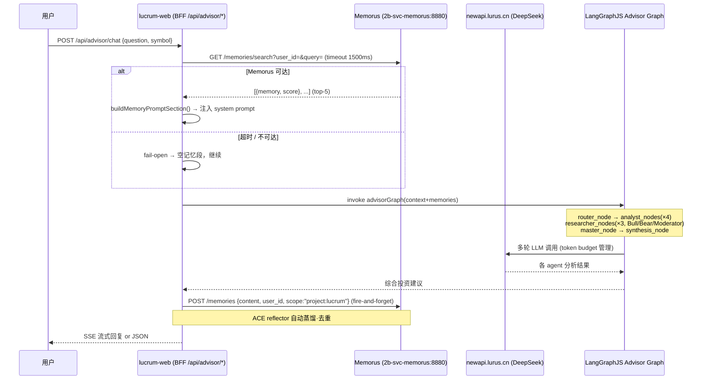

# Lucrum 内部手册

> 仅限内部员工查阅。包含运维细节、决策档案、未公开问题。

## 一句话定位

Lucrum 是 Lurus 面向 C 端用户的 AI 量化交易平台，覆盖 A 股策略编辑、历史回测、模拟/实盘交易和 AI 投资顾问四大场景。前端是 Next.js 14 BFF 架构，策略回测引擎跑在前端 TypeScript 层；量化计算后端是 Python FastAPI + vnpy 4.x，承接自然语言策略解析、AI Alpha 策略执行和行情数据服务。所有用户身份和计费能力由 Platform (2l-svc-platform) 统一提供，AI 顾问的长期记忆由 Memorus (2b-svc-memorus) 提供。

## 速查

| 项 | 值 |
|---|---|
| 仓库 | github.com/hanmahong5-arch/lurus-lucrum |
| 前端镜像 | ghcr.io/hanmahong5-arch/lucrum-web:main-\<sha7\> |
| 后端镜像 | ghcr.io/hanmahong5-arch/lurus-ai-qtrd:main-\<sha7\> |
| 域名 | lucrum.lurus.cn |
| 前端端口 | 3000 (NodePort 30300) |
| 后端端口 | 8000 (FastAPI) |
| 命名空间 | lucrum |
| 数据存储 | PG schema `lucrum` + Redis DB 1 + NATS stream `LUCRUM_EVENTS` |
| Platform 依赖 | identity · billing · llm-inference · memory · notification |
| 部署目标 | R6 (`100.122.83.20`，单节点 K3s，无 Traefik，nginx NodePort 反代) |
| ArgoCD 应用 | 监视 `deploy/k8s/` 和 `lurus-ai-qtrd/k8s/ai-qtrd/` |

## 架构图



## 核心数据流

### 1. 策略回测完整链路



### 2. AI Advisor 长期记忆调用链



## 代码地图

### lucrum-web (Next.js 14)

| 路径 | 职责 |
|---|---|
| `src/app/` | Next.js App Router 页面 |
| `src/app/api/advisor/` | AI 投资顾问 API routes |
| `src/app/api/backtest/` | 前端回测 API (JS 引擎) |
| `src/app/api/strategy/generate` | 自然语言 → vnpy 策略代码 |
| `src/app/api/agent-protocol/` | Agent Protocol API (/runs /threads /store) |
| `src/app/dashboard/` | 仪表盘页面群 |
| `src/lib/backtest/engine.ts` | 核心回测引擎 (SMA/EMA/MACD/RSI/布林带) |
| `src/lib/backtest/core/financial-math.ts` | FinancialAmount — Decimal.js 包装器 |
| `src/lib/backtest/core/errors.ts` | 错误代码体系 BT1XX–BT9XX (30+ 码) |
| `src/lib/backtest/db-kline-provider.ts` | DB 优先 K 线提供者 |
| `src/lib/backtest/kline-persister.ts` | 懒加载持久化 (批量 upsert) |
| `src/lib/advisor/` | AI 顾问全模块 |
| `src/lib/advisor/agent/analyst-agents.ts` | 4 个分析师 Agent (基本面/技术/情绪/宏观) |
| `src/lib/advisor/agent/researcher-agents.ts` | Bull/Bear 辩论 + 仲裁员 |
| `src/lib/advisor/agent/master-agents.ts` | 4 大师视角 (巴菲特/林奇/利弗莫尔/西蒙斯) |
| `src/lib/advisor/agent/agent-orchestrator.ts` | LangGraphJS 6 节点图 |
| `src/lib/memorus-client.ts` | Memorus REST 客户端 (fail-open) |
| `src/lib/platform/client.ts` | Platform identity/billing 客户端 |
| `src/lib/broker/interfaces.ts` | IBrokerAdapter 标准接口 |
| `src/lib/broker/adapters/` | Mock 券商 + 东方财富/富途/老虎/IB 预留 |
| `src/lib/risk/risk-manager.ts` | 前端实盘风控 (Two Sigma 设计风格) |
| `src/lib/db/schema.ts` | Drizzle schema (40+ 表) |
| `src/lib/repositories/` | Repository 接口 + Drizzle 实现 |

### lurus-ai-qtrd (Python FastAPI + vnpy)

| 路径 | 职责 |
|---|---|
| `vnpy_ai_trader/src/web/app.py` | FastAPI 入口，lifespan 初始化 |
| `vnpy_ai_trader/src/web/trading_engine.py` | TradingEngine：vnpy EventEngine 包装 |
| `vnpy_ai_trader/src/web/routers/strategy.py` | 策略 CRUD |
| `vnpy_ai_trader/src/web/routers/backtest.py` | 回测任务 (Job + WebSocket 进度) |
| `vnpy_ai_trader/src/web/routers/trading.py` | 订单提交 |
| `vnpy_ai_trader/src/web/routers/market.py` | 行情查询 |
| `vnpy_ai_trader/src/web/routers/data.py` | 数据采集 API |
| `vnpy_ai_trader/src/web/websocket_manager.py` | WS 连接池，symbol 订阅管理 |
| `vnpy_ai_trader/src/strategy/ai_alpha_strategy.py` | AIAlphaStrategy (vnpy AlphaStrategy 子类) |
| `vnpy_ai_trader/src/strategy/rule_engine.py` | JSON 规则引擎 |
| `vnpy_ai_trader/src/strategy/risk_manager.py` | 后端风控 (max_positions=30, max_drawdown=15%) |
| `vnpy_ai_trader/src/ai_core/deepseek_client.py` | DeepSeek SDK 包装 |
| `vnpy_ai_trader/src/ai_core/strategy_parser.py` | 自然语言 → JSON 策略配置 |
| `vnpy_ai_trader/src/ai_core/news_analyzer.py` | 新闻情绪分析 |
| `vnpy_ai_trader/src/datafeed/adata_datafeed.py` | adata 数据源适配 (东方财富 A 股) |
| `vnpy_ai_trader/src/gateway/paper_account.py` | 模拟账户实现 |
| `vnpy_ai_trader/src/gateway/qmt_gateway.py` | QMT 实盘接入 (预留) |

### K8s manifests

| 路径 | 职责 |
|---|---|
| `deploy/k8s/web-deployment.yaml` | lucrum-web Deployment + NodePort Service (30300) |
| `deploy/k8s/hpa.yaml` | HPA |
| `deploy/k8s/pdb.yaml` | PodDisruptionBudget |
| `lurus-ai-qtrd/k8s/ai-qtrd/03-api-deployment.yaml` | lucrum-api Deployment |
| `lurus-ai-qtrd/k8s/ai-qtrd/06-ingress-routes.yaml` | Traefik IngressRoute 路由规则 |
| `lurus-ai-qtrd/k8s/ai-qtrd/08-redis-statefulset.yaml` | Lucrum 专属 Redis (DB 0 in pod) |

## 关键数据库表（schema: lucrum）

| 表 | 行数量级 | 用途 |
|---|---|---|
| `stocks` | ~5,000 | A 股基本信息 |
| `kline_daily` | 数百万 | 日 K 线 (核心，DB 优先回测) |
| `strategy_history` | 用户级 | 策略版本 + 标签 + 收藏 |
| `backtest_history` | 用户级 | 回测结果 + 配置 (多租户) |
| `trading_history` | 用户级 | 完整交易记录 |
| `tenants` / `tenant_members` | 团队级 | owner/admin/member/viewer 角色体系 |
| `marketplace_strategies` | 公开 | 策略市场 (已建表，功能规划中) |
| `financial_facts_pit` | 财务级 | Point-in-Time 财务数据 (防前瞻偏差) |
| `pack_runs` / `pack_run_stages` | 任务级 | 策略包多阶段运行记录 |

## 路由分发规则（Traefik IngressRoute）

| 路径前缀 | 目标 | 说明 |
|---|---|---|
| `/api/strategy/generate` | lucrum-web:3000 | LLM 策略生成走 BFF |
| `/api/advisor/*` | lucrum-web:3000 | AI 顾问全走前端 |
| `/api/auth/*` | lucrum-web:3000 | NextAuth.js OIDC |
| `/api/backtest/*` | lucrum-web:3000 | 前端 JS 回测引擎 |
| `/api/market/{status,indices,quote,kline,flow}` | lucrum-web:3000 | 前端数据服务 |
| `/api/strategy/*` (非 generate) | lucrum-api:8000 | vnpy 策略 CRUD |
| `/api/trading/*` | lucrum-api:8000 | 订单提交 |
| `/api/account/*` | lucrum-api:8000 | 账户查询 |
| `/api/data/*` | lucrum-api:8000 | 数据采集 |
| `/ws` | lucrum-api:8000 | WebSocket 实时推送 |
| 其他 | lucrum-web:3000 | UI 页面 |

## 部署

### CI/CD 流程

```
push main (lucrum-web/** 或 lurus-ai-qtrd/**) → GitHub Actions
  → bun run build (lucrum-web)
  → docker build --no-cache -t ghcr.io/hanmahong5-arch/lucrum-web:main-<sha7>
  → docker push GHCR
  → ArgoCD auto-sync → R6 K3s (lucrum namespace)
```

### 环境变量（主要）

**lucrum-web**

| 变量 | 值 / 来源 |
|---|---|
| `DATABASE_URL` | Secret `lucrum-secrets.DATABASE_URL` |
| `LURUS_IDENTITY_URL` | `http://platform-core.lurus-platform.svc.cluster.local:18104` |
| `LURUS_IDENTITY_INTERNAL_KEY` | Secret |
| `LLM_API_BASE` | `https://newapi.lurus.cn/v1` |
| `LLM_API_KEY` | Secret |
| `MEMORUS_SERVICE_URL` | `http://memorus.lurus-system.svc.cluster.local:8880` |
| `MEMORUS_API_KEY` | Secret (optional: true，缺失时 fail-open) |
| `REDIS_HOST` | `redis-service.lucrum.svc.cluster.local` |
| `REDIS_DB` | `0` (pod 内独立 Redis，非集群共享 DB 1) |
| `NEXTAUTH_URL` | `https://lucrum.lurus.cn` |
| `ZITADEL_ISSUER` | `https://auth.lurus.cn` |
| `ZITADEL_CLIENT_SECRET` | `""` (PKCE 无 secret) |

**lurus-ai-qtrd**

| 变量 | 值 / 来源 |
|---|---|
| `DEEPSEEK_API_BASE` | `https://api.lurus.cn/v1` |
| `DEEPSEEK_MODEL` | `deepseek-chat` |
| `DEEPSEEK_API_KEY` | Secret |

### 镜像导入坑（R6 K3s 无 Traefik 节点）

R6 是单节点 K3s，没有多节点 overlay，但 containerd 镜像缓存问题依然存在。正确导入流程：

```bash
# 在 Master (R1) 构建
docker build --no-cache -t lucrum-web:vXX .
docker save lucrum-web:vXX -o /tmp/lucrum-web-vXX.tar

# 传到 R6
scp /tmp/lucrum-web-vXX.tar root@100.122.83.20:/tmp/

# R6 上操作
ssh root@100.122.83.20
crictl rmi docker.io/library/lucrum-web:vXX 2>/dev/null || true
k3s ctr images import /tmp/lucrum-web-vXX.tar
crictl images | grep lucrum-web:vXX

# 重启 Pod
kubectl delete pod -n lucrum -l app=lucrum-web --force --grace-period=0
kubectl rollout status deployment/lucrum-web -n lucrum
```

## 运行与运维

### 常用命令

```bash
# 查看 Pod 状态
ssh root@100.98.57.55 "kubectl get pods -n lucrum -o wide"

# 查看日志
ssh root@100.98.57.55 "kubectl logs -n lucrum deployment/lucrum-web --tail=200"
ssh root@100.98.57.55 "kubectl logs -n lucrum deployment/lucrum-api --tail=200"

# 重启
ssh root@100.98.57.55 "kubectl rollout restart deployment/lucrum-web -n lucrum"
ssh root@100.98.57.55 "kubectl rollout restart deployment/lucrum-api -n lucrum"

# 健康检查
curl -sI https://lucrum.lurus.cn/
curl -s https://lucrum.lurus.cn/health   # → lucrum-api /health

# 进入 Pod
ssh root@100.98.57.55 "kubectl exec -it -n lucrum deploy/lucrum-web -- sh"
```

### 本地开发

```bash
# 前端
cd 2c-svc-lucrum/lucrum-web
bun install
bun run dev                         # http://localhost:3000
bun run typecheck && bun run lint   # 提交前必须
bun run test                        # Vitest
bun run db:generate && bun run db:push

# 后端
cd 2c-svc-lucrum/lurus-ai-qtrd
pip install -r vnpy_ai_trader/requirements.txt
python -m uvicorn vnpy_ai_trader.src.web.app:app --host 0.0.0.0 --port 8000 --reload
```

## 数据契约

### 上游消费的 Capabilities

| Capability | 调用方式 | 关键 API |
|---|---|---|
| **identity** | HTTP Bearer内部密钥 | `GET /internal/v1/accounts/{sub}` — 账户概览 |
| **billing** | HTTP Bearer内部密钥 | `POST /internal/v1/subscriptions/checkout`，`GET /internal/v1/checkout/:no/status` |
| **llm-inference** | OpenAI 兼容 API | `POST /v1/chat/completions` via `newapi.lurus.cn/v1` |
| **memory** | X-API-Key REST | `GET /memories/search`，`POST /memories` (fail-open，1500ms 超时) |
| **notification** | NATS / `POST /internal/v1/notify` | 交易事件通知（规划中） |

权益计费三层：订阅计划上限 → Redis 计数器 (DB 1) → 钱包余额降级。

### NATS 事件

流: `LUCRUM_EVENTS`

| 事件 | 触发场景 |
|---|---|
| `backtest.completed` | 回测任务完成 |
| `trade.executed` | 实盘/模拟成交 |
| `advisor.session.created` | 顾问会话建立 |

### 下游消费者

- `2c-app-lutu`：曾经独立的 `lucrum-app (Expo RN)` 已合并到 lutu，lutu 通过 lucrum API 消费市场数据和策略。

## 已知坑（内部专属）

1. **vnpy GIL 阻塞**：`AIAlphaStrategy.on_bars()` 内 DeepSeek LLM 调用是同步阻塞的。当 `ai_call_interval` (默认 5 bars) 到期时，如果 LLM 响应慢会拖住整个 vnpy EventEngine 事件循环，导致后续 tick 堆积。已有 `_should_call_ai()` 节流，但根本解法需把 LLM 调用改为 `asyncio` 协程或独立线程。

2. **行情数据源不稳定**：`adata` (东方财富) 的接口没有官方 SLA，偶发 429 或数据断档。回测引擎的 DB 优先策略 (PostgreSQL → adata API → Mock) 是当前缓解方案，但 `kline_daily` 表缺乏完整性校验 cron，数据空洞不会主动告警。

3. **回测一致性**：前端 TypeScript 引擎与后端 vnpy 引擎存在两套独立实现，相同策略在两侧结果可能存在小数精度和交易费用计算差异。前端使用 `FinancialAmount` (Decimal.js) 保障精度；后端 vnpy 使用 float。已知但未统一。

4. **实盘风控单点**：`RiskManager`（前端和后端各一个实例）都只做内存级状态跟踪，不持久化到 Redis/DB。服务重启后 `peak_portfolio_value`、`daily_pnl` 清零，重启当日的风控限额实际上从零重新累计，存在日内重启绕过日亏损限制的风险。

5. **Memorus 命中率**：`searchMemories` 每次取 top-5，`scope` 固定为 `project:lucrum`。如果用户在多个产品（Switch、Creator）都产生了记忆，跨产品投资偏好不会自动迁移。ACE reflector 的去重质量依赖 mem0 配置，命中率低时顾问不会告知用户"我不记得你的偏好"，只是静默降级。

6. **lucrum-api 资源饱和**：当前资源限额 `cpu: 1000m / memory: 2Gi`，K8s 节点 cloud-ubuntu-2-4c8g 跑满时 vnpy 回测任务会 OOMKilled。遇到大范围回测（多 symbol × 长时间段）应主动监控 pod 内存。

7. **R6 部署路径变更**：2026-04-25 Lucrum 从 R1 迁移到 R6 单节点 K3s。R6 无 Traefik，通过主机 nginx (`/etc/nginx/sites-enabled/lurus-stage`) 反代 `NodePort 30300` 到 `lucrum.lurus.cn`。原先 R1 的 `hostAliases`（将 `auth.lurus.cn` 重写为内网 Traefik IP）已删除，pod 现在通过公网 DNS 解析 Zitadel。如迁回 R1，需在 Deployment 补回 `hostAliases`（见 git history）。

8. **Secret 缺失导致 CrashLoop**：`lucrum-secrets` 中 `LURUS_IDENTITY_INTERNAL_KEY` 如果缺失，pod 会 `CreateContainerConfigError`，无法启动。`MEMORUS_API_KEY` 声明了 `optional: true` 可缺失，其他所有 key 都是硬依赖。重新部署时先 `kubectl get secret lucrum-secrets -n lucrum` 确认所有 key 存在。

9. **策略市场 / leaderboard / PIT 数据未连通**：`marketplace_strategies`、`team_leaderboard_snapshots`、`financial_facts_pit` 等表已建，但对应的 API 端点和后端逻辑存在 `TODO` 占位，属于规划中功能，当前返回 mock 数据或空列表。

## 决策档案

| 时间 | 决策 | 理由 |
|---|---|---|
| 2026-01-20 | 前端回测引擎独立于 vnpy 后端 | 降低 Python 服务依赖，用户回测无需等待后端调度；vnpy 回测保留用于高精度场景 |
| 2026-01-20 | 统一使用 Bun 替代 npm | 依赖安装 12-20x 提速；Dockerfile 切 `oven/bun:1-alpine` |
| 2026-01-23 | 引入 LangGraphJS 0.2.38 | 原自定义 multi-agent loop 难以扩展；LangGraph 提供状态图原语 |
| 2026-01-23 | Drizzle ORM 接管 DB 层 | Prisma 构建体积过大；Drizzle 零运行时、type-safe、适合 Edge 部署 |
| 2026-01-23 | Broker 接口层预留四家券商 | 实盘接入计划东方财富 QMT；IBrokerAdapter 接口解耦，Mock 完整实现 A 股规则 |
| 2026-04-25 | Lucrum 从 R1 迁移到 R6 | R1 资源紧张（磁盘 96% 已用）；Lucrum 尚在 stage 阶段，符合 R6 准入条件 |
| 持续 | 不引入独立 users 表 | 用户身份全部由 Zitadel 管理，避免重复维护；代码里 `userId` 均为 Zitadel sub (snowflake string) |

## TODO / Roadmap

- [ ] vnpy LLM 调用改异步——解决 GIL 阻塞问题（影响：实盘稳定性）
- [ ] `kline_daily` 完整性检查 cron——自动发现并补全数据空洞
- [ ] 前后端回测结果对齐——统一精度标准，消除双引擎差异
- [ ] 实盘风控状态持久化——`RiskManager` 状态写 Redis，重启后继续累计
- [ ] 策略市场 API 连通——`marketplace_strategies` 后端逻辑实现
- [ ] leaderboard 真实接口——替换 `TODO: Replace with real API call`
- [ ] WebSocket 实时行情完善——`/ws` 目前仅支持 subscribe/ping，尚未推送 tick
- [ ] 多券商接入——QMT 实盘网关（`qmt_gateway.py` 已建文件）
- [ ] 端到端测试——Playwright 4 viewports 已配置，测试用例待补充
- [ ] Game 模块——Gamification 积分体系（`lurus-game` service，规划中，在 lurus.yaml product_groups.lucrum 已注册）

## 应急 Runbook（10 分钟版）

### 行情数据断流（K 线获取失败）

```bash
# 1. 确认是 adata 问题还是 DB 问题
curl -s "https://lucrum.lurus.cn/api/market/kline?symbol=000001.SZ&period=1d" | head -100

# 2. 检查 lucrum-web 日志中 adata 错误
ssh root@100.98.57.55 "kubectl logs -n lucrum deployment/lucrum-web --tail=200 | grep -i 'adata\|kline\|fetch'"

# 3. 如果 adata 429，手动触发数据采集（后备）
curl -X POST "https://lucrum.lurus.cn/api/data/fetch" \
  -H "Content-Type: application/json" \
  -d '{"symbol":"000001.SZ","start_date":"2024-01-01","end_date":"2026-04-28"}'

# 4. DB kline 覆盖率检查
ssh root@100.98.57.55 "kubectl exec -n lucrum deploy/lucrum-web -- \
  psql \$DATABASE_URL -c 'SELECT symbol, count(*), min(date), max(date) FROM lucrum.kline_daily GROUP BY symbol LIMIT 20'"
```

### 策略回测卡死 / 超时

```bash
# 1. 确认是前端引擎还是后端 vnpy 引擎
# 前端引擎: /api/backtest → lucrum-web
# 后端引擎: /api/backtest/run → lucrum-api

# 2. 检查 lucrum-api job 状态
curl -s "https://lucrum.lurus.cn/api/backtest/jobs" | python3 -m json.tool

# 3. 检查 vnpy 内存占用（防 OOM）
ssh root@100.98.57.55 "kubectl top pod -n lucrum"

# 4. 如果 lucrum-api OOMKilled，扩内存（临时 patch，改完需同步 manifest）
ssh root@100.98.57.55 "kubectl set resources deployment/lucrum-api \
  -n lucrum --limits=memory=3Gi"

# 5. 重启 api
ssh root@100.98.57.55 "kubectl rollout restart deployment/lucrum-api -n lucrum"
```

### AI Advisor 答非所问（记忆失效）

```bash
# 1. 验证 Memorus 连通性
ssh root@100.98.57.55 "kubectl exec -n lucrum deploy/lucrum-web -- \
  wget -qO- http://memorus.lurus-system.svc.cluster.local:8880/health"

# 2. 检查 MEMORUS_API_KEY 是否注入
ssh root@100.98.57.55 "kubectl get secret lucrum-secrets -n lucrum -o jsonpath='{.data.MEMORUS_API_KEY}' | base64 -d | wc -c"
# 输出 0 说明 key 缺失 → fail-open 模式，记忆段为空

# 3. 手动查询用户记忆（调试用）
ssh root@100.98.57.55 "kubectl exec -n lucrum deploy/lucrum-web -- \
  wget -qO- 'http://memorus.lurus-system.svc.cluster.local:8880/memories/search?user_id=<zitadel_sub>&query=投资风格&limit=5' \
  -H 'X-API-Key: <key>'"

# 4. 如果 Memorus pod 挂了
ssh root@100.98.57.55 "kubectl get pods -n lurus-system | grep memorus"
ssh root@100.98.57.55 "kubectl rollout restart deployment/memorus -n lurus-system"
# Advisor 在 Memorus 恢复前以 fail-open 模式运行，无功能中断
```

### DB Schema 锁死 / 死锁

```bash
# 1. 检查长事务
ssh root@100.98.57.55 "kubectl exec -n database deploy/lurus-pg-primary -- \
  psql -U postgres -c \"SELECT pid, now() - pg_stat_activity.query_start AS duration, query, state \
  FROM pg_stat_activity WHERE state != 'idle' AND query_start < now() - interval '30 seconds' \
  AND datname='lurus' ORDER BY duration DESC;\""

# 2. 检查锁等待
ssh root@100.98.57.55 "kubectl exec -n database deploy/lurus-pg-primary -- \
  psql -U postgres -c \"SELECT blocked_locks.pid AS blocked_pid, \
  blocking_locks.pid AS blocking_pid, blocked_activity.query AS blocked_query \
  FROM pg_catalog.pg_locks blocked_locks \
  JOIN pg_catalog.pg_stat_activity blocked_activity ON blocked_activity.pid = blocked_locks.pid \
  JOIN pg_catalog.pg_locks blocking_locks ON blocking_locks.locktype = blocked_locks.locktype \
    AND blocking_locks.pid != blocked_locks.pid \
    AND blocking_locks.granted \
  WHERE NOT blocked_locks.granted;\""

# 3. 终止阻塞事务（确认后执行）
ssh root@100.98.57.55 "kubectl exec -n database deploy/lurus-pg-primary -- \
  psql -U postgres -c 'SELECT pg_terminate_backend(<blocking_pid>);'"

# 4. 回滚方案
# ArgoCD: argocd app rollback lucrum <revision>
# 镜像回退: 改 deploy/k8s/web-deployment.yaml 的 image tag 为上一个 main-<sha7>，commit + push
```

### 服务完全挂了

```bash
# 全面诊断
ssh root@100.98.57.55 "kubectl get pods -n lucrum -o wide"
ssh root@100.98.57.55 "kubectl describe pod -n lucrum -l app=lucrum-web"
ssh root@100.98.57.55 "kubectl logs -n lucrum deployment/lucrum-web --tail=200 --previous"

# Secret 缺失检查（最常见原因）
ssh root@100.98.57.55 "kubectl get secret lucrum-secrets -n lucrum"

# 强制重启
ssh root@100.98.57.55 "kubectl rollout restart deployment/lucrum-web -n lucrum"
ssh root@100.98.57.55 "kubectl rollout restart deployment/lucrum-api -n lucrum"
ssh root@100.98.57.55 "kubectl rollout status deployment/lucrum-web -n lucrum"

# 验证
curl -sI https://lucrum.lurus.cn/
```
