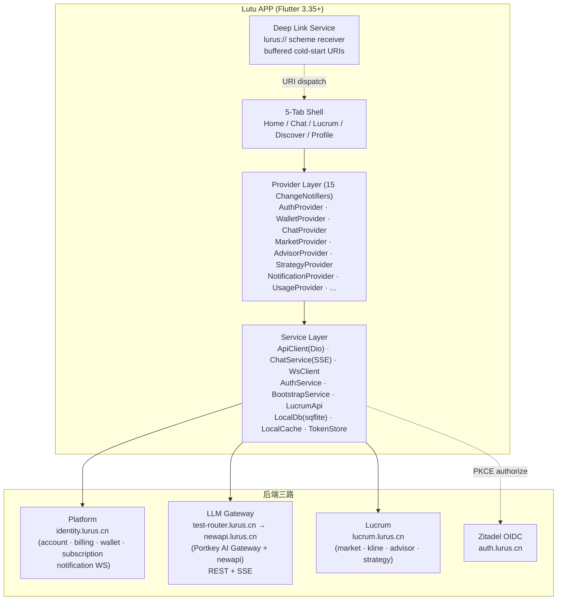
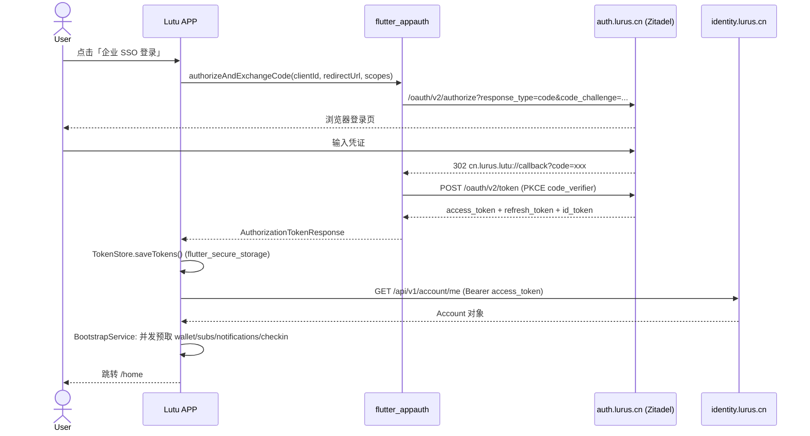
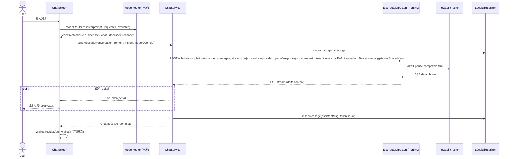

# 路途 Lutu — 内部员工手册

> 版本 0.2.3+4 · Flutter 3.35+ / Dart 3.9+ · 仅 Android（Windows 手机号降级）
> 最后更新 2026-04-28

---

## 1. 产品定位与三阶段战略

路途（Lutu）是 Lurus 平台唯一移动端入口，由两条历史线合并而来：

- **lutu**（原 Flutter 账户/计费客户端）
- **lucrum-app**（原 Expo React Native 量化 APP，已废弃并入）

当前在 `lurus.yaml` 中标注 `phase: internal-tool`，战略路线三阶段清晰：

| 阶段 | 标识 | 当前状态 | 目标用户 |
|------|------|--------|--------|
| **Phase 1** | internal-tool | **正在进行** | Lurus 内部员工，dogfooding 验证 |
| **Phase 2** | enterprise-demo | 待 Lucrum DNS / OIDC client 就位 | 企业客户演示与 POC |
| **Phase 3** | consumer | 待 iOS 证书 + 计费合规 | C 端消费者公开上线 |

三阶段共享同一代码库，通过功能开关（build-time defines）和后端部署环境区分，不分支。

---

## 2. 架构总览

### 2.1 Flutter 应用层次图



### 2.2 数据流：登录（OIDC PKCE）



### 2.3 数据流：AI 对话（SSE 流式）



---

## 3. 技术栈速查

| 层 | 选型 | 版本 / 说明 |
|----|------|------------|
| 运行时 | Flutter | 3.35+ |
| 语言 | Dart | 3.9+ (sdk ^3.9.2) |
| 状态管理 | Provider + ChangeNotifier | `^6.1.2`，ProxyProvider 实现 auth-aware 自动清空 |
| 路由 | go_router | `^14.8.1`，含认证守卫 redirect |
| HTTP | Dio | `^5.7.0`，AuthInterceptor + RetryInterceptor(指数退避+jitter) |
| 流式 | SSEClient (自实现) | 基于 Dio，1 次重试 2s 延迟 |
| 实时 | WsClient (自实现) | 基于 web_socket_channel，指数退避，最多 5 次重连，30s 心跳 |
| 认证 | flutter_appauth | `^8.0.1`，OIDC PKCE；Windows 降级为手机号 |
| 安全存储 | flutter_secure_storage | `^9.2.4`，tokens 加密存储 |
| 本地 DB | sqflite | `^2.4.1`，聊天历史持久化 |
| 图表 | fl_chart | `^0.70.2`，K 线 / 饼图 / 用量折线 |
| Markdown | flutter_markdown | `^0.7.6` |
| QR | mobile_scanner + qr_flutter | `^6.0.0` / `^4.1.0` |
| 崩溃上报 | sentry_flutter | `^9.19.0`，build-time `SENTRY_DSN` 控制，空时 no-op |
| 模型路由 | ModelRouter (本地, `lib/services/model_router.dart`) | 规则路由 4 tier，Phase 2 切 Portkey server-side |

---

## 4. 目录结构

```
2c-app-lutu/
├── lib/
│   ├── main.dart               # 启动入口：DI、Router、ErrorReporting
│   ├── constants.dart          # API URLs、OIDC config、VIP tiers、WS config
│   ├── core/
│   │   ├── auth_aware_mixin.dart   # ProxyProvider auto-clear on logout
│   │   ├── error_reporting.dart    # Sentry init + FlutterError.onError
│   │   ├── exceptions.dart         # AppError 类型体系 (Network/Auth/Server/Business)
│   │   ├── result.dart             # sealed Result<T, E>
│   │   ├── theme/
│   │   │   ├── tokens.dart
│   │   │   └── semantic_colors.dart  # ThemeExtension: context.semantic.*
│   │   └── l10n.dart               # 字符串常量 S.*
│   ├── models/                 # json_serializable 数据类 (build_runner 生成)
│   ├── providers/              # 15 ChangeNotifier (AuthProvider 为根)
│   ├── services/
│   │   ├── api_client.dart         # Dio 封装 + RetryInterceptor
│   │   ├── auth_service.dart       # OIDC / Direct / Phone 三路登录
│   │   ├── auth_interceptor.dart   # Bearer 注入 + token 刷新
│   │   ├── bootstrap_service.dart  # 启动时并发预取 4 接口
│   │   ├── chat_service.dart       # SSE 聊天 + sqflite 持久化
│   │   ├── gateway_api.dart        # GatewayApi (tokens/logs/usage)
│   │   ├── lucrum_api.dart         # LucrumApi (market/kline/advisor/strategy)
│   │   ├── model_router.dart       # 本地 4-tier prompt 分类路由
│   │   ├── notification_service.dart  # WS 连接管理
│   │   ├── platform_api.dart       # PlatformApi (account/wallet/sub/billing)
│   │   ├── sse_client.dart         # SSE 解析 + auto-retry
│   │   ├── token_store.dart        # flutter_secure_storage 封装
│   │   ├── credentials_store.dart
│   │   ├── connectivity_service.dart
│   │   ├── local_cache.dart        # 内存 5min 缓存
│   │   ├── local_db.dart           # sqflite schema + CRUD
│   │   ├── payment_service.dart
│   │   ├── deep_link_service.dart  # lurus:// 冷启动缓冲
│   │   └── streak_service.dart
│   ├── screens/
│   │   ├── home/                   # 仪表盘 + 快捷入口 4×2
│   │   ├── chat/                   # AI Chat (SSE, 历史, 设置)
│   │   ├── lucrum/                 # 市场 / K线 / 顾问 / 策略市场
│   │   ├── discover/               # Prompt / Strategy marketplace
│   │   ├── profile/                # 账户 / 通知 / 订阅 / 安全
│   │   ├── wallet/                 # 充值 / VIP / 用量分析 / 交易记录
│   │   ├── scanner/                # QR 扫描 (lurus:// deep link)
│   │   └── legal/                  # 用户协议 / 隐私政策
│   └── widgets/
│       ├── chat/                   # message_bubble, animated_message_item
│       ├── lucrum/                 # kline_chart, stock_card, index_card
│       ├── common/                 # shimmer_loading, streak_badge, section_header
│       └── offline_badge.dart
├── test/
│   └── contract/               # lucrum_contract_test + platform_contract_test
│                               # --tags contract，CI anti-drift
├── android/
├── ios/
├── pubspec.yaml                # version 0.2.3+4
└── CLAUDE.md
```

---

## 5. 后端三路详解

| 后端 | 域名 | 协议 | 主要用途 | 认证方式 |
|------|------|------|---------|---------|
| Platform | `identity.lurus.cn` | REST + WebSocket | 账户、钱包、计费、订阅、通知 | Bearer JWT (platform JWT) |
| LLM Gateway | `test-router.lurus.cn` (Stage) | REST + SSE | LLM 聊天、模型列表、用量统计 | Bearer `gatewaySharedKey` (sk-xxx) |
| Lucrum | `lucrum.lurus.cn` | REST + SSE | 市场数据、K线、11 AI 顾问、策略市场 | Bearer JWT |
| Zitadel OIDC | `auth.lurus.cn` | OIDC/OAuth2 | SSO 企业登录 PKCE 流程 | PKCE code_verifier |
| Notification WS | `wss://identity.lurus.cn/api/v1/notifications/ws` | WebSocket | 实时推送（未读计数、通知事件） | `?token=<access_token>` |

**重要：LLM 鉴权现状（临时方案）**

当前所有用户共享一个 newapi sk-xxx 令牌（`ApiConfig.gatewaySharedKey`，newapi user_id=1 root 账户）。这是因为 platform-core JWT 无法直接传入 newapi `/v1/*` 接口，SSO bridge 尚未实现。

- 轮换方式：登录 newapi (root / Lurus@ops) → Tokens → 撤销并重建 "lutu-app-shared" → 更新 `constants.dart::gatewaySharedKey` → 重新打包发布
- 长期方案：platform-core 新增 `/api/v1/account/llm-key` 端点，按用户 mint newapi token，计费绑定

---

## 6. 本地模型路由（ModelRouter）

`lib/services/model_router.dart` 在客户端本地执行 prompt 复杂度分类，对话请求前决策使用哪个具体 LLM，无需服务端往返。

**分类 4 个 Tier：**

| Tier | 触发条件 | 默认候选（首个命中 catalog 的） |
|------|---------|---------------------------|
| `fast` | 短 prompt，无代码/推理标记 | deepseek-chat → deepseek-v3 → gemini-2.5-flash |
| `balanced` | 中等长度(>1500 chars) 或单个推理词 | qwen/qwen3-32b → llama-3.3-70b → deepseek-chat |
| `code` | 含 ``` 代码块、栈帧形状、代码关键词 | deepseek-coder → qwen-coder-32b → deepseek-chat |
| `heavy` | >8000 chars 或 2+ 推理词 | deepseek-reasoner → deepseek-r1 → glm-4-plus |

用户在 Model Picker 中选择 `lurus-auto` 伪模型时，触发自动路由；选择具体模型时直接使用。

**Phase 2 迁移路径**：当 `router.lurus.cn` (Portkey server-side gateway) 上线后，APP 直接发送 `model: "lurus-auto"`，Portkey 条件路由接管，本地 ModelRouter 退化为 offline/gateway 不可达时的降级备用。

---

## 7. Provider 状态机与 Auth 依赖链

所有 15 个 Provider 均通过 `ChangeNotifierProxyProvider` 挂载，依赖 `AuthProvider` 作为根节点。`AuthAwareMixin` 确保登出时自动清空本地状态，防止用户切换时数据泄漏。

```
AuthProvider (root)
├── AccountProvider    → PlatformApi
├── WalletProvider     → PlatformApi (ChatProvider 消息发送后刷新余额)
├── SubscriptionProvider → PlatformApi
├── ProductProvider    → PlatformApi
├── CheckinProvider    → PlatformApi
├── NotificationProvider → PlatformApi + NotificationService(WS)
├── UsageProvider      → GatewayApi
├── TokenProvider      → GatewayApi
├── ChatProvider       → ChatService(SSE) + WalletProvider.fetchWallet()
├── ChatHistoryProvider → ChatService
├── MarketProvider     → LucrumApi (后台自动刷新，App 前台恢复时 force=true)
├── AdvisorProvider    → LucrumApi
└── StrategyProvider   → LucrumApi
```

关键设计点：
- **加载保护**：所有 Provider 设 `_loading` 标志，防止重复 in-flight 请求
- **离线降级**：MarketProvider / StrategyProvider 持有 5min 内存缓存，断网时 OfflineBadge 显示
- **App 生命周期**：`MainShell` 注册 `WidgetsBindingObserver`，App 切入后台停止 MarketProvider 自动刷新，恢复前台强制刷新

---

## 8. QR 与 Deep Link

应用注册 `lurus://` custom scheme，支持以下 URI：

| URI 模式 | 用途 | 实现路由 |
|---------|------|---------|
| `lurus://qr-login/<sessionId>` | QR 码扫描登录确认 (v1) | `/scanner/confirm-login/:sessionId` |
| `lurus://qr?v=1&id=<hex>&a=<action>&h=<sig>` | QR v2 通用动作确认 | `/scanner/confirm-qr/:id` |
| `lurus://redeem/<code>` | 礼品码自动填充 | `/redeem` |

**冷启动处理**：`DeepLinkService` 在 `main()` 最早处初始化，缓冲冷启动 URI；待 `GoRouter` 就绪后 `attachRouter()` 触发派发，确保进程启动前的 URI 不丢失。

---

## 9. 构建与发布

### 9.1 环境准备

```bash
export PATH="/d/flutter/bin:$PATH"
flutter pub get
# 首次 / model 类变更时：
flutter pub run build_runner build --delete-conflicting-outputs
```

### 9.2 日常命令

```bash
# 静态分析 (CI gate: must be 0 issues)
flutter analyze --fatal-infos

# 单元 + Widget 测试 (当前 1135 PASS)
flutter test

# Contract 测试 (需 R6 stage 后端可达)
flutter test --tags contract

# Debug APK
flutter build apk --debug

# Release APK (多 ABI，混淆，split symbols)
flutter build apk --release \
  --obfuscate \
  --split-debug-info=build/symbols \
  --split-per-abi \
  --dart-define=SENTRY_DSN=<dsn> \
  --dart-define=APP_ENV=prod \
  --dart-define=APP_VERSION=0.2.3+4
```

Release APK 尺寸（arm64 24.2 MB / armeabi-v7a 20.2 MB / x86_64 26.3 MB）。

### 9.3 CI/CD

| 触发 | 动作 |
|------|------|
| 每次 push | analyze + test (exclude contract) + debug APK |
| `v*` tag | Release APK (arm64/v7a/x86_64，混淆，上传 build symbols，Sentry release) |
| 每夜 | Contract drift 测试（对 live R6 stage 后端） |

**Android 签名**：Release APK 目前未配置签名 keystore（Known Blocker #4）。发布 Play Store 前必须完成 `android/key.properties` + gradle signing config。

### 9.4 Sentry 崩溃上报

- 编译时传入 `--dart-define=SENTRY_DSN=...` 激活
- DSN 为空时完全静默，不产生网络请求，不影响启动时间
- GitHub Actions Release job 通过 `secrets.SENTRY_DSN` 注入
- 只上报 errors（`tracesSampleRate=0.0`），不发送 PII

---

## 10. 已知坑与注意事项

### 10.1 当前 Known Blockers

| 编号 | 问题 | 影响范围 | 解决路径 |
|------|------|---------|---------|
| KB-1 | `lucrum.lurus.cn` DNS / IngressRoute + cert pending | Lucrum Tab 暂用 mock 数据 | 配置 K8s IngressRoute + 申请 wildcard cert |
| KB-2 | `flutter_appauth` 不支持 Windows desktop | Windows 上 OIDC 登录不可用 | Windows 仅用手机号登录，不修复（非优先平台） |
| KB-3 | Lutu Zitadel OIDC clientId 未创建 | OIDC 登录流程无法真实测试 | 在 Zitadel admin 控制台创建 `cn.lurus.lutu` Native OIDC App，填入 `constants.dart::OidcConfig.clientId` |
| KB-4 | Android release 签名未配置 | 无法上传 Play Store / 企业分发 | 生成 keystore，配置 `android/key.properties` |
| KB-5 | gatewaySharedKey 硬编码共享 | 所有用户共享单一 sk-xxx 额度，计费不透明 | platform-core 实现 `/api/v1/account/llm-key` 端点 |
| KB-6 | Security Screen OAuth binding 管理 TODO | Profile > Security 有 `// TODO: OAuth binding management` | 实现第三方 OAuth 绑定/解绑 UI |

### 10.2 iOS 构建

- 当前无 iOS provisioning profile / distribution certificate
- `ios/` 目录存在，基础 Flutter 配置完整，但未测试
- 上线前需：Apple Developer 账号 + App ID `cn.lurus.lutu` + provisioning profile
- `flutter_appauth` iOS 需在 `Info.plist` 配置 `CFBundleURLTypes`（redirect scheme）

### 10.3 FCM 推送

- 当前通知完全通过 **WebSocket** (`wss://identity.lurus.cn/.../ws`) 实现
- FCM / APNs 推送**未集成**（已移除 `flutter_local_notifications`）
- App 切入后台后 WS 连接会断开（OS 资源回收），后台消息推送能力为零
- Phase 2 / 3 需接入 FCM：补充 `google-services.json`、重新添加 `firebase_messaging` 依赖、在 platform-core 通知模块增加 FCM dispatch path

### 10.4 VIP 体系

| Tier | 中文名 | 最低消费 | 折扣 |
|------|-------|---------|------|
| none | 无 | 0 | 无折扣 |
| silver | 白银 | ¥100 | 5% |
| gold | 黄金 | ¥500 | 10% |
| diamond | 钻石 | ¥2000 | 15% |

LB (Lubi) 积分规则：注册赠 5、首充赠 10、首订赠 30，续费月返 5%（上限 6 个月）。

---

## 11. 已知坑：详细说明

### iOS 证书问题

**症状**：`flutter build ios` 报 `No signing certificate` 或 `Provisioning profile doesn't include...`

**根因**：未配置 Xcode automatic signing / 未在 Apple Developer Portal 创建 App ID `cn.lurus.lutu`

**处置步骤**：
1. 在 Apple Developer Portal 创建 Bundle ID `cn.lurus.lutu`
2. 生成 Distribution Certificate（或使用 Automatic Signing with Team ID）
3. `ios/Runner.xcodeproj` 中设置 `DEVELOPMENT_TEAM`
4. 测试设备需添加到 Ad Hoc profile

### Android 签名

**症状**：Release APK 报 `jarsigner: key ... not found` 或 Play Store 拒绝未签名包

**处置步骤**：
```bash
# 生成 keystore（一次性操作，保存在安全位置）
keytool -genkey -v -keystore lutu-release.jks \
  -alias lutu -keyalg RSA -keysize 2048 -validity 10000

# android/key.properties
storePassword=<password>
keyPassword=<password>
keyAlias=lutu
storeFile=../../lutu-release.jks
```

在 `android/app/build.gradle` 中引入 `key.properties`（参考 Flutter 官方文档）。

### FCM Token 失效

**背景**：当前未集成 FCM，以下为 Phase 2 接入后的预期问题。

**症状**：推送送达率低，后台通知不达

**根因**：FCM token 在 App 重装或清除数据后更换，platform-core 持有的旧 token 失效

**处置**：
- App 每次启动后向 `identity.lurus.cn/api/v1/account/push-token` 上报最新 FCM token
- 平台侧收到 `messaging/registration-token-not-registered` 错误时自动清除过期 token

### OIDC PKCE 适配

**背景**：Zitadel clientId `364750761252358023` 已在 `constants.dart` 中，但 Zitadel 控制台尚未创建对应 Native App。

**症状**：`flutter_appauth` 报 `invalid_client` 或 `redirect_uri_mismatch`

**处置**：
1. 登录 `https://auth.lurus.cn` Zitadel admin
2. Projects → 创建 Native App，Bundle ID 填 `cn.lurus.lutu`
3. Redirect URI 填 `cn.lurus.lutu://callback`
4. Post-Logout URI 填 `cn.lurus.lutu://logout`
5. 启用 PKCE，禁用 client_secret（Native App）
6. 将生成的 Client ID 更新到 `lib/constants.dart::OidcConfig.clientId`

---

## 12. 应急 Runbook

### 12.1 App 启动崩溃

**症状**：安装后立即闪退，无任何界面

**排查步骤**：
1. 连接设备，`flutter logs` 或 `adb logcat | grep -i lutu` 查看栈帧
2. 若为 `MissingPluginException`：`flutter clean && flutter pub get && flutter run`（plugin native 代码未重建）
3. 若为 `FlutterError: Unable to load assets`：检查 `pubspec.yaml` assets 声明与 `assets/images/` 文件是否一致
4. 若为 Dart 初始化异常：检查 `ErrorReporting.run()` 中 `WidgetsFlutterBinding.ensureInitialized()` 是否在 `runApp` 前执行（main.dart 已正确实现）
5. 若 Sentry 已集成，查看 Sentry 控制台对应 DSN 的 Issues

### 12.2 后端 503 / 所有接口失败

**症状**：登录成功但 Home 页数据全部加载失败，或直接登录报错

**排查步骤**：
```bash
# 检查 Platform
curl -s https://identity.lurus.cn/healthz

# 检查 Gateway
curl -s https://test-router.lurus.cn/health

# 检查 Lucrum
curl -s https://lucrum.lurus.cn/api/health

# 检查 K3s Pod 状态（在服务器上）
ssh root@100.98.57.55 "kubectl get pods -A | grep -E 'platform|newapi|lucrum'"

# 查看 platform-core 日志
ssh root@100.98.57.55 "kubectl logs -n lurus-platform deploy/platform-core --tail=50"
```

**处置**：
- 若 platform Pod CrashLoopBackOff → `kubectl describe pod` 查 OOM / 配置错误
- 若 Gateway 503 → 检查 `test-router.lurus.cn` Portkey deployment 在 R6；`docker ps | grep portkey`（R6 compose 部署）
- 若 DNS 解析失败 → 检查阿里云 DNS，`lucrum.lurus.cn` A 记录指向 R6 公网 IP

### 12.3 推送收不到

**当前状态**：推送仅通过 WebSocket，App 在**前台**时有效。后台推送目前**不支持**。

**前台推送排查**：
1. 检查 `NotificationProvider` 的 `isConnected` 状态（Profile 页 debug 模式可见）
2. `adb logcat | grep "\[WS\]"` 查看 WS 连接日志
3. WS 断开原因常见：token 过期（AuthInterceptor 刷新失败后跳 login）、后端重启、网络切换
4. 手动触发重连：重新进入前台（WidgetsBindingObserver resume 不会重连 WS，需检查 NotificationProvider 的 reconnect 逻辑）

**后台推送（Phase 2 Todo）**：接入 FCM 后，当 WS 不可达时 platform-core notification 模块通过 FCM dispatch。

### 12.4 Token 认证循环（登录死循环）

**症状**：App 反复跳转到登录页，登录后立即再次跳转

**根因**：
- `TokenStore` 中存储的 access_token 已过期且 refresh 失败（OIDC clientId 未配置时 refresh 必然失败）
- `AuthInterceptor` 调用 `onTokenExpired` → `router.go('/login')` → 用户重新登录后 token 写入成功，但某个 Provider 的 in-flight 请求未被取消仍触发 expired 回调

**处置**：
1. 强制清除 Token：`adb shell pm clear cn.lurus.lutu`（清除 App 数据）或调试菜单 Profile > Settings > 退出登录
2. 若 OIDC refresh 失败（Windows 平台 / clientId 未配置），手机号登录不依赖 OIDC refresh，建议切换

---

## 附录：关键文件路径速查

| 内容 | 路径 |
|------|------|
| API URLs / OIDC / VIP config | `lib/constants.dart` |
| 启动序列 / DI | `lib/main.dart` |
| 登录三路实现 | `lib/services/auth_service.dart` |
| LLM 聊天 + SSE + sqflite | `lib/services/chat_service.dart` |
| 本地模型路由 4-tier | `lib/services/model_router.dart` |
| Lucrum 市场 + Advisor SSE | `lib/services/lucrum_api.dart` |
| Platform REST client | `lib/services/platform_api.dart` |
| Gateway REST client | `lib/services/gateway_api.dart` |
| WS 实时通知 | `lib/services/ws_client.dart` + `notification_service.dart` |
| 崩溃上报 Sentry | `lib/core/error_reporting.dart` |
| 5-Tab Shell + 生命周期 | `lib/screens/main_shell.dart` |
| Contract anti-drift 测试 | `test/contract/` |
| BMAD PRD | `./_bmad-output/planning-artifacts/prd.md` |
| Sprint Status | `./_bmad-output/implementation-artifacts/sprint-status.yaml` |
