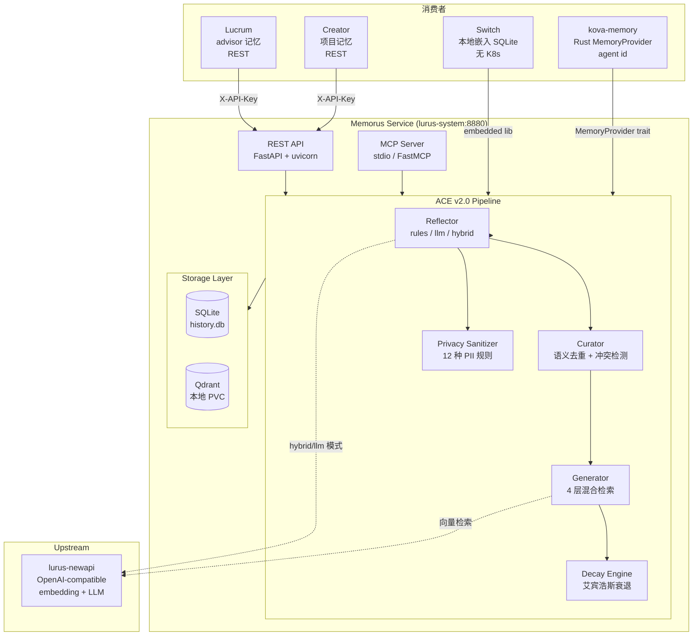
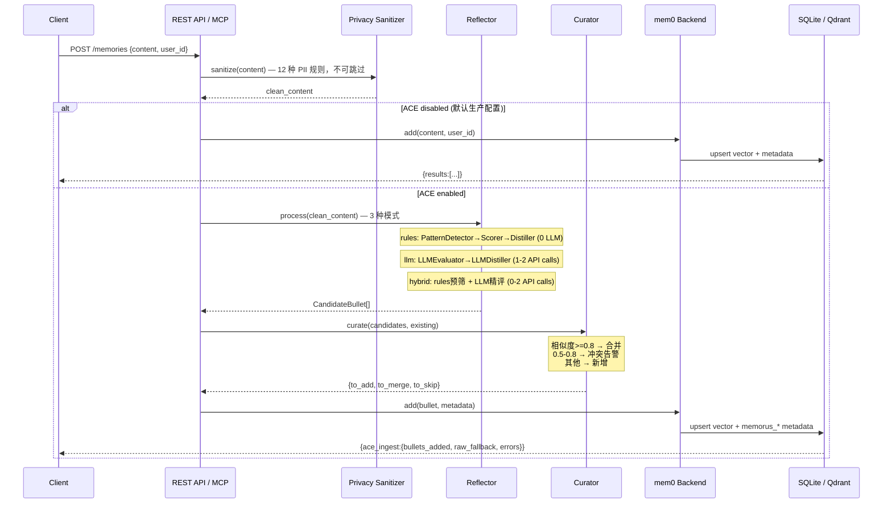
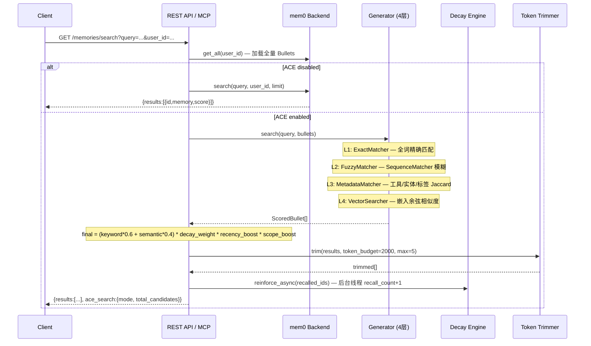
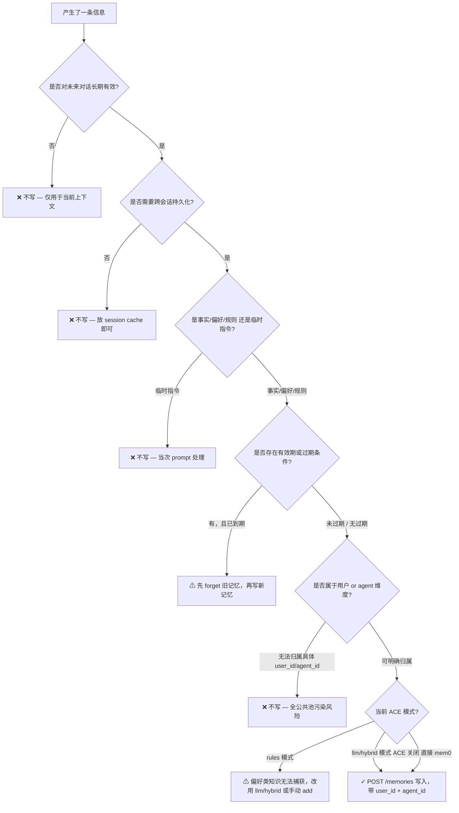
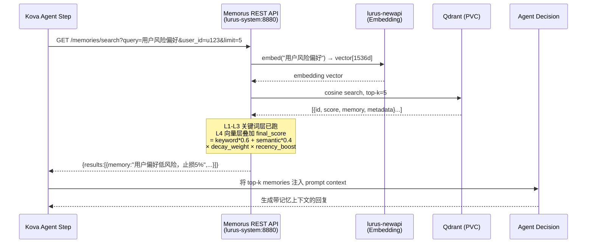

# MemX / Memorus 内部手册

> 🔴 **2026-05-28 状态更新**：现处 stage（R6），同事改造中，状态存疑；勿当 prod 强依赖。

> 仅限内部员工查阅。包含运维细节、决策档案、未公开问题。

## 一句话定位

Memorus 是 Lurus 平台的 AI 持久记忆引擎，基于 mem0 fork + ACE v2.0（自适应上下文引擎）构建。它让任意 AI 应用从无状态对话升级为具备长期记忆的个性化助手——自动蒸馏知识、语义去重、时间衰退、隐私脱敏。对外以 REST API 和 MCP Server 双通道暴露，是 Lucrum、Creator、Switch 等产品线的共享记忆基础设施（Platform P0）。与 Kova 组的 kova-memory（Rust 嵌入式备选）形成互补：Memorus 是有 K8s 的中心化服务，kova-memory 是进程内嵌入式替代。

## 速查

| 项 | 值 |
|---|---|
| 仓库 | github.com/hanmahong5-arch/lurus-memorus (private) |
| 镜像 | ghcr.io/hanmahong5-arch/lurus-memorus:main |
| 端口 | 8880（集群内）；NodePort 30880（集群外/dev，**端口待对 live Service 复核**） |
| 命名空间 | lurus-system |
| 数据存储 | SQLite + Qdrant (PVC 5Gi, `/data`) |
| 部署目标 | R1 (生产，lurus-system) |
| OpenAPI spec | `2b-svc-memorus/api/openapi.yaml` |
| 内部服务地址 | `http://memorus.lurus-system.svc:8880` |
| Embedding 后端 | lurus-newapi (OpenAI-compatible, `text-embedding-v1`, 1536d) |
| LLM 后端 | lurus-newapi (`deepseek-chat`) |
| 认证 | `X-API-Key` header (Secret: `lurus-memorus-secrets/api_key`) |
| ArgoCD | AppSet 条目存在，但显示 Unknown（不影响运行，见已知坑） |

**MCP Server 工具列表**（`memorus-mcp` 暴露的 5 个工具）：

| Tool | 参数 | 说明 |
|---|---|---|
| `search_memory` | `query`, `user_id?`, `limit?` | 语义检索，返回 scored 结果列表 |
| `add_memory` | `content`, `user_id?` | 写入新记忆，ACE 开启时经蒸馏管道 |
| `list_memories` | `user_id?`, `limit?` | 列出所有记忆（不语义排序） |
| `forget_memory` | `memory_id` | 按 ID 删除单条记忆 |
| `memory_status` | `user_id?` | KB 统计：total / sections / decay 均值 |

## 架构图



## 核心数据流

### 数据流一：添加记忆 (`POST /memories` / `add_memory` MCP)



### 数据流二：检索记忆 (`GET /memories/search` / `search_memory` MCP)



## 代码地图

| 路径 | 职责 |
|---|---|
| `memorus/core/memory.py` | 顶层 `Memory` 类，ACE 开关路由，公开 API（add/search/get/delete/status 等） |
| `memorus/core/config.py` | Pydantic v2 配置模型：`MemorusConfig`, `ReflectorConfig`, `CuratorConfig`, `DecayConfig`, `RetrievalConfig` |
| `memorus/core/types.py` | 核心数据类型：`CandidateBullet`, `BulletMetadata`, `KnowledgeType`, `BulletSection`, `InteractionEvent` |
| `memorus/core/pipeline/ingest.py` | `IngestPipeline`：Raw→Sanitize→Reflector→Curator→mem0.add，任何阶段失败自动降级 |
| `memorus/core/pipeline/retrieval.py` | `RetrievalPipeline`：加载 Bullets→Generator→Trimmer→[异步] DecayReinforcer |
| `memorus/core/engines/reflector/engine.py` | `ReflectorEngine`：4 阶段蒸馏（PatternDetector→Scorer→Sanitizer→Distiller），支持 rules/llm/hybrid 模式切换 |
| `memorus/core/engines/reflector/detector.py` | `PatternDetector`：5 条内置规则（error_fix/retry_success/config_change/new_tool/repetitive_op） |
| `memorus/core/engines/reflector/llm_evaluator.py` | LLM 语义评估（litellm 调用，判断 should_record + 分类 + 评分） |
| `memorus/core/engines/reflector/llm_distiller.py` | LLM 蒸馏（生成 "When [条件], [动作], because [原因]" 格式规则） |
| `memorus/core/engines/curator/engine.py` | `CuratorEngine`：余弦相似度去重，`ExistingBullet` vs `CandidateBullet` 比对 |
| `memorus/core/engines/curator/conflict.py` | `ConflictDetector`：相似度 0.5-0.8 窗口内检测矛盾记忆 |
| `memorus/core/engines/decay/engine.py` | `DecayEngine`：sweep() 批量衰退扫描，reinforce() recall 加权 |
| `memorus/core/engines/decay/formulas.py` | 纯函数：`exponential_decay(age, half_life)`, `boosted_weight(base, boost, recall)` |
| `memorus/core/engines/generator/engine.py` | `GeneratorEngine`：4 层 L1-L4 搜索结果合并，`BulletForSearch` 结构 |
| `memorus/core/engines/generator/vector_searcher.py` | `VectorSearcher`：嵌入余弦相似度（委托 ONNX 或 newapi） |
| `memorus/core/engines/generator/score_merger.py` | `ScoredBullet`：final_score 加权公式 |
| `memorus/core/privacy/sanitizer.py` | `PrivacySanitizer`：12 种内置正则 + 自定义 patterns，所有处理前强制执行 |
| `memorus/core/embeddings/` | ONNX 本地嵌入（all-MiniLM-L6-v2, 384d），缓存 `~/.memorus/models/` |
| `memorus/core/daemon/` | 守护进程模式：多 Agent IPC 共享内存，`DaemonFallbackManager` 管理降级 |
| `memorus/ext/rest_api.py` | FastAPI app factory，`create_app(config)`，5 个 HTTP 端点，`_build_mem0_config_from_env()` |
| `memorus/ext/mcp_server.py` | `FastMCP` server，5 个 MCP tools，stdio 传输，Memory 单例懒初始化 |
| `memorus/ext/agent_tools.py` | OpenAI Agents SDK (`get_openai_tools`) + LangChain (`get_langchain_tools`) 工厂 |
| `memorus/team/` | 团队联邦层（Git Fallback + Federation Mode），`SyncManager`, `Nominator`, `Redactor` |
| `deploy/deployment.yaml` | K8s Deployment + PVC (5Gi)，liveness/readiness/startup probe，non-root (uid 65534) |
| `deploy/configmap.yaml` | `ace_enabled=false`, `reflector_mode=hybrid`, `llm_model=deepseek-chat` |
| `api/openapi.yaml` | REST API 完整规范，OpenAPI 3.1.0 |

## ACE 引擎详解

### Reflector（知识蒸馏器）

三种模式的处理链：

```
rules 模式:    消息 → PatternDetector(5条规则) → KnowledgeScorer → PrivacySanitizer → BulletDistiller
               0 LLM 调用 / <1ms / 适合高频写入

llm 模式:      消息 → LLMEvaluator(should_record+分类) → PrivacySanitizer → LLMDistiller(结构化规则)
               1-2 次 API 调用 / ~10-20s / 低频高价值场景

hybrid 模式:   消息 → PatternDetector(预筛) → [规则命中] → LLMDistiller
               (默认推荐)          ↓ [规则漏掉] → LLMEvaluator → LLMDistiller
               0-2 次 API 调用 / 质量/成本最优
```

5 条内置检测规则：`error_fix`（报错修复）/ `retry_success`（重试成功）/ `config_change`（配置变更）/ `new_tool`（新工具发现）/ `repetitive_op`（重复操作）。

生成的 Bullet 格式："When [触发条件], [推荐动作], because [原因]"，附带 `section` + `knowledge_type` + `instructivity_score`。

Reflector **漏掉的场景**：用户偏好（如"Python 用单引号"）在 rules 模式无法捕获，必须启用 llm 或 hybrid 模式。

### Curator（去重 + 冲突检测）

- 余弦相似度 >= 0.8 → `keep_best` 或 `merge_content`（可配）
- 相似度 0.5-0.8 → 进入 ConflictDetector，标记矛盾记忆对（`conflict_detection=False` 默认关闭）
- Supersede 机制：用户说"那是错的，用 X"时，Reflector 标记 `is_correction`，Curator 将旧 Bullet 内容替换为新内容，ID 不变（知识进化）

### Decay Engine（时间衰退）

```
base_weight = 2^(-age_days / half_life_days)        # half_life_days=30（生产默认）
boosted     = base_weight * (1 + boost_factor * recall_count)  # boost_factor=0.1
final       = clamp(boosted, 0.0, 1.0)

特殊规则：
  recall_count >= 15  → weight = 1.0（永久保留）
  age <= 7 天         → weight = 1.0（保护期）
  weight < 0.02       → 归档候选，sweep 时删除
```

衰退扫描通过 `memorus sweep` CLI 或 `run_decay_sweep()` 触发。`sweep_on_session_end=True` 时会话结束自动执行。

### Generator（4 层混合检索）

```
L1: ExactMatcher    — 全词精确匹配
L2: FuzzyMatcher    — SequenceMatcher 模糊匹配
L3: MetadataMatcher — 工具名/实体名/标签 Jaccard 相似
L4: VectorSearcher  — ONNX 或 newapi 嵌入余弦相似度

final_score = (keyword_weight * 0.6 + semantic_weight * 0.4)
            * decay_weight
            * recency_boost (近7天 * 1.2)
            * scope_boost (作用域匹配 * 1.3)
```

若 ONNX 不可用（未安装 `memorus[onnx]`），L4 降级跳过，L1-L3 仍正常工作（"degraded" 模式）。

## 部署

- **构建**: `docker build -t ghcr.io/hanmahong5-arch/lurus-memorus:main .`
- **CI**: push main → GHA → GHCR → `kubectl apply -f deploy/`（ArgoCD AppSet 条目存在但状态 Unknown，见已知坑）
- **镜像 tag**: `main-<sha7>`（生产）/ `main`（当前 deploy.yaml 写法，注意核实）
- **apply 方式**: `kubectl apply -f 2b-svc-memorus/deploy/` — 直接 apply，不走 ArgoCD sync
- **Secret 依赖**:
  - `lurus-memorus-secrets/api_key` — REST auth key
  - `lurus-memorus-secrets/openai_api_key` — newapi key（embedding + LLM）
- **ConfigMap**: `lurus-memorus-config`（ace_enabled / reflector_mode / llm_model / decay 参数）
- **PVC**: `lurus-memorus-data` 5Gi ReadWriteOnce，挂 `/data`（Qdrant + SQLite + mem0 history.db）

### 环境变量完整表

| 变量 | 来源 | 默认值 | 说明 |
|---|---|---|---|
| `MEMORUS_API_KEY` | Secret | — | REST 认证，必填 |
| `OPENAI_API_KEY` | Secret | — | newapi key，embedding + LLM 调用 |
| `OPENAI_BASE_URL` | Deployment | `http://lurus-newapi.lurus-system.svc.cluster.local:3000/v1` | OpenAI-compatible endpoint |
| `MEMORUS_EMBEDDING_MODEL` | Deployment | `text-embedding-v1` | 嵌入模型名 |
| `MEMORUS_EMBEDDING_DIMS` | Deployment | `1536` | 向量维度 |
| `MEMORUS_LLM_MODEL` | ConfigMap | `deepseek-chat` | mem0 记忆提取 LLM |
| `MEMORUS_DATA_DIR` | Deployment | `/data` | 数据目录（PVC 挂载点） |
| `HOME` | Deployment | `/data` | 防止 mem0/chroma 写 `/nonexistent` |
| `MEMORUS_ACE_ENABLED` | ConfigMap | `false` | ACE 总开关（生产默认关） |

## 运行与运维

- **健康检查**: `GET /health`（无需认证，readiness probe 15s 后开始，每 10s 一次）
- **日志**:
  ```bash
  ssh root@100.98.57.55 "kubectl logs -n lurus-system deploy/lurus-memorus --tail=200"
  ```
- **重启**:
  ```bash
  ssh root@100.98.57.55 "kubectl rollout restart deployment/lurus-memorus -n lurus-system"
  ```
- **进入容器**:
  ```bash
  ssh root@100.98.57.55 "kubectl exec -it -n lurus-system deploy/lurus-memorus -- sh"
  ```
- **CLI 操作**（容器内）:
  ```bash
  MEMORUS_API_KEY=<key> memorus status
  MEMORUS_API_KEY=<key> memorus search "trading strategy" --limit 5
  MEMORUS_API_KEY=<key> memorus sweep
  MEMORUS_API_KEY=<key> memorus conflicts
  ```
- **资源限制**: requests: 100m CPU / 256Mi MEM；limits: 500m CPU / 512Mi MEM

## 消费者接入指南

### Lucrum（advisor 持久记忆）

```
user_id = Zitadel sub (UUID 格式)
接入方式: REST API，X-API-Key 在平台内部共享 Secret
用途: AI advisor 记住用户的交易偏好、止损策略、过往对话摘要
```

### Creator（项目记忆）

```
user_id = local project ID (scope: "project:{id}")
接入方式: REST API
用途: 内容生成项目的上下文记忆（风格偏好、已写内容、避免重复）
```

### Switch（本地嵌入）

```
接入方式: embedded lib (Python package，直接 import memorus)，无 K8s，本地 SQLite
user_id = device user
注意: Switch 不经过 REST API，直接使用 Memory() 对象，数据存本机
```

### kova-memory（Rust MemoryProvider）

```
接入方式: MemoryProvider trait 实现，参数 agent_id
功能对齐: add(content,user_id) / search(query,limit,user_id) / delete(id)
场景: Kova agent 在进程内使用，不依赖 K8s 网络
```

## 数据契约

- **上游**: lurus-newapi (OpenAI-compatible, embedding + LLM)
- **下游消费者**: lucrum / creator / switch / kova-memory
- **REST API**（完整）:
  - `POST   /memories` — 写入，ACE 开启时返回 `ace_ingest` 信封
  - `GET    /memories/search?query=&user_id=&limit=` — 语义检索
  - `GET    /memories?user_id=&limit=` — 列表
  - `GET    /memories/{id}` — 按 ID 取单条
  - `DELETE /memories/{id}` — 删除
  - `GET    /status?user_id=` — KB 统计
  - `GET    /health` — 健康检查（无认证）
- **MCP tools**: 见速查表（5 个工具）
- **OpenAPI spec**: `2b-svc-memorus/api/openapi.yaml`
- **存储格式**: mem0 vector store（Qdrant collection: `memorus`）+ SQLite history（`/data/.mem0/history.db`）；Bullet 元数据以 `memorus_*` 前缀写入 mem0 metadata 字段

## 已知坑（内部专属）

1. **ArgoCD 显示 Unknown**：Memorus 用 `kubectl apply` 直接部署而非 ArgoCD GitOps。ArgoCD AppSet 条目存在但 sync 状态为 Unknown，**不影响服务运行**，但意味着 ArgoCD 无法自动 rollback，需手动 `kubectl apply` 或改 image tag。

2. **ACE 生产默认关闭**：`configmap.yaml` 中 `ace_enabled=false`，生产走的是纯 mem0 代理模式（零 ACE 开销）。`rules` 模式偏好知识（如"Python 用单引号"）无法捕获。如需 ACE，改 ConfigMap 后重启 Pod。

3. **Python 性能瓶颈**：uvicorn 单进程处理所有请求；hybrid 模式每次 add() 最高 ~21s（LLM 调用）。高并发写入场景下需控制并发数或改为异步队列模式。资源 limit 仅 512Mi / 500m CPU，ONNX 模型加载首次会触发下载（~80MB），可能超过 startup probe 的容忍时间（10s * 18 = 3min，够用但要注意）。

4. **Qdrant 切换成本**：默认存储是本地 Qdrant（PVC embedded）而非独立 Qdrant 服务。切换到独立 Qdrant 需：① 改 `deployment.yaml` 的 `OPENAI_BASE_URL` + 添加 `QDRANT_URL` 环境变量；② 数据无自动迁移工具，需 `memorus export` → 重新 `import`（可能丢失向量精度）。

5. **`/status` 无 user_id 时返回空**：mem0ai 1.0.x 的 `get_all()` 要求至少传 `user_id`/`agent_id`/`run_id` 之一。调用 `GET /status` 不传 `user_id` 时返回 `{total:0, note:"Provide user_id query param..."}`，而非全量统计，这是有意的 API 设计但容易让调用方误解服务为空库。

6. **PVC ReadWriteOnce 限制**：`lurus-memorus-data` 是 RWO，无法同时被两个 Pod 挂载。副本数固定为 1，水平扩展受限。如需多副本，Qdrant 需改为独立服务 + SQLite 换 PostgreSQL。

7. **kova-memory 替代方案触发条件**：当以下场景出现时应优先考虑 kova-memory 而非 Memorus REST：① Kova agent 运行在无 K8s 网络的环境（如 Switch 本地）；② 要求 μs 级延迟（Rust in-process vs Python REST ~10ms 起）；③ 对 Python GIL 下的并发性能有严格要求。kova-memory 实现同样的 `MemoryProvider` trait（add/search/delete），接口兼容。

8. **Decay sweep 副作用**：`mem0.update(id, content)` 只更新文本，不更新 metadata（mem0 1.0.x 限制）。`run_decay_sweep()` 中的权重更新实现了先 get 再 update 的变通，但 metadata 中的 `memorus_decay_weight` 字段写入路径依赖 mem0 内部行为，未来 mem0 升级可能破坏。

## 决策档案

| 时间 | 决策 | 理由 |
|---|---|---|
| 2026-02 | 选 Python 而非 Go | mem0 / ONNX 生态深度依赖 Python，Go 无等效替代；以 REST/MCP 边界隔离语言差异 |
| 2026-02 | ACE 生产默认关闭 | ACE hybrid 模式写入延迟 ~21s，不适合高频场景；稳定后再按服务开启 |
| 2026-03 | kubectl apply 而非 ArgoCD | 首次部署时 ArgoCD AppSet 配置未完成，用 kubectl apply 临时过渡，至今未迁回 GitOps |
| 2026-03 | 本地 Qdrant (embedded) 而非独立服务 | 简化部署（单 Pod + PVC），初期规模小，未来可迁移 |
| 2026-03 | ACE v2.0 Team Memory 架构设计完成 | Federation Mode + Git Fallback 双模式，本地记忆和团队记忆充分解耦（0 侵入本地路径） |
| 2026-04 | Memorus 移入 Platform 产品组 | 记忆能力是平台级基础设施，lucrum/creator/switch 均依赖，统一归 Platform 管理 |

## 多视角速览

**用户**：聊天不再"失忆"——上次说的偏好、踩过的坑，下次对话自动带入，无需重复交代。

**开发者**：两条接入路径——REST `POST /memories` 直写，或挂载 MCP server 让 agent 自主读写；`X-API-Key` 鉴权，OpenAPI spec 在 `2b-svc-memorus/api/openapi.yaml`。

**运维**：部署在 R1 lurus-system 命名空间，端口 8880，单副本（PVC RWO 限制），数据落 SQLite + Qdrant PVC（`/data`，5Gi）；`GET /health` 无认证探活。

**决策者**：复用平台统一 embedding 基础设施（lurus-newapi），无需自建向量数据库；多产品线共享记忆层，TCO 显著低于各自维护独立 vector store。

---

## 决策树：什么时候该写记忆



---

## 典型时序图



---

## 端到端完整例子

Python 完整示例，涵盖安装、配置、CRUD 和 ACE 合并机制。

```python
# 安装
# pip install requests  # 或 pip install mem0ai httpx

import requests
import json

BASE_URL = "http://memorus.lurus-system.svc:8880"  # 集群内
# 集群外测试：BASE_URL = "http://100.98.57.55:30880"（需 NodePort 或 port-forward）
HEADERS = {"X-API-Key": "your-memorus-api-key", "Content-Type": "application/json"}
USER_ID = "user-abc123"

# --- 1. 写入记忆 ---
resp = requests.post(f"{BASE_URL}/memories", headers=HEADERS, json={
    "content": "用户偏好低风险策略，止损不超过 5%，不碰杠杆产品",
    "user_id": USER_ID,
    "metadata": {"source": "lucrum_advisor", "category": "trading_preference"}
})
result = resp.json()
print(json.dumps(result, indent=2, ensure_ascii=False))
# ACE 关闭时输出（生产默认）:
# {
#   "results": [
#     {"id": "mem_7f3a...", "memory": "用户偏好低风险策略，止损不超过 5%，不碰杠杆产品", "event": "ADD"}
#   ]
# }
#
# ACE hybrid 模式开启时输出:
# {
#   "results": [...],
#   "ace_ingest": {
#     "bullets_added": 1,
#     "bullets_merged": 0,
#     "raw_fallback": false,
#     "errors": []
#   }
# }

# --- 2. 语义检索 ---
resp = requests.get(f"{BASE_URL}/memories/search", headers=HEADERS, params={
    "query": "这个用户能接受多大亏损",
    "user_id": USER_ID,
    "limit": 3
})
results = resp.json()["results"]
print(json.dumps(results, indent=2, ensure_ascii=False))
# [
#   {
#     "id": "mem_7f3a...",
#     "memory": "用户偏好低风险策略，止损不超过 5%，不碰杠杆产品",
#     "score": 0.87,
#     "metadata": {"source": "lucrum_advisor", "category": "trading_preference"}
#   }
# ]

memory_id = results[0]["id"]

# --- 3. 更新记忆（用户偏好变化） ---
# ⚠ mem0 update 只改文本，不更新 metadata；ACE Curator 会检测冲突
# 推荐方式：forget 旧记忆 + add 新记忆（附带 is_correction 标记让 ACE 识别）
requests.delete(f"{BASE_URL}/memories/{memory_id}", headers=HEADERS)

resp = requests.post(f"{BASE_URL}/memories", headers=HEADERS, json={
    "content": "用户调整策略：接受中等风险，止损上限提升至 10%，可考虑 1x 杠杆 ETF",
    "user_id": USER_ID,
    "metadata": {"source": "lucrum_advisor", "is_correction": True}
})
print(resp.json()["results"][0]["event"])  # "ADD"

# --- 4. ACE 合并机制演示（需 ace_enabled=true + reflector_mode=hybrid）---
# 同一用户连续写入相似内容时，Curator 触发去重：
# 相似度 >= 0.8 → 合并为一条（keep_best 或 merge_content）
# 相似度 0.5-0.8 → ConflictDetector 标记矛盾对（默认关闭告警）
# 查看 KB 状态
resp = requests.get(f"{BASE_URL}/status", headers=HEADERS, params={"user_id": USER_ID})
print(json.dumps(resp.json(), indent=2, ensure_ascii=False))
# {
#   "total": 1,
#   "sections": {"trading_preference": 1},
#   "avg_decay_weight": 1.0,
#   "user_id": "user-abc123"
# }

# --- 5. 主动删除（GDPR / TTL 到期）---
# 先 search 找到要删除的 ID，再 forget
resp = requests.get(f"{BASE_URL}/memories", headers=HEADERS, params={"user_id": USER_ID})
for mem in resp.json().get("results", []):
    requests.delete(f"{BASE_URL}/memories/{mem['id']}", headers=HEADERS)
print("所有记忆已清除")
```

---

## 最佳实践

| 分类 | 实践 |
|---|---|
| ✓ | 写入 memory 时同时带 `user_id` **和** `agent_id`（双维度索引，检索更精准） |
| ✗ | 所有记忆写入公共池（不传 user_id），导致跨用户数据污染 |
| ✓ | 短期上下文（当次会话）走 Redis cache（db=0 api 通道），仅长期知识进 Memorus |
| ✗ | 每轮对话的中间推理步骤全部打入 Memorus（低价值噪音堆积，检索质量下降） |
| ✓ | 生产固定 `MEMORUS_EMBEDDING_MODEL=text-embedding-v1`（1536d），不随意更换 |
| ✗ | 频繁切换 embedding 模型（旧向量与新向量空间不兼容，导致召回精度崩溃） |
| ✓ | 定期触发 `memorus sweep` 或配置 `sweep_on_session_end=true`，主动清理低权重记忆 |
| ✗ | 永远不 forget / 不 sweep，任由记忆无限堆积（PVC 写满 + 检索延迟上升） |
| ✓ | memory provider 注册在 `lurus.yaml capabilities.memory` 中，与 Memorus 端点保持一致 |
| ✗ | 业务层自己造独立 vector store 或 embedding 服务，与平台 memory 层割裂 |
| ✓ | 需要 μs 级延迟或无 K8s 网络的场景，切换到 kova-memory（Rust `MemoryProvider` trait，接口兼容） |
| ✗ | 强求 Memorus REST 在 Rust 进程内嵌入使用（网络跳转 + Python GIL 是不可避免的开销） |

---

## 跨产品集成场景

### ① Kova Agent 持久记忆

Kova 执行长任务时，每个 agent step 完成后将关键发现写入 Memorus（`agent_id=kova_{task_id}`）；下一轮任务启动前，先 `search_memory` 召回历史经验注入 system prompt。

- 接入方式：kova-memory（Rust `MemoryProvider` trait）→ 委托 Memorus REST（有 K8s 时）或进程内 SQLite（无 K8s 时）
- `user_id`：Zitadel sub；`agent_id`：`kova_{task_type}`
- 典型写入：工具调用结果、错误修复路径、用户纠正行为（ACE Reflector `error_fix` / `retry_success` 规则自动捕获）
- ⚠ ACE hybrid 写入延迟 ~21s，建议 Kova step 异步写入（fire-and-forget），不阻塞主流程

### ② Lucrum 用户风险偏好记忆

Lucrum AI advisor 在用户明确表达风险偏好时（如"我只做低风险"、"止损改成 8%"），调用 `POST /memories` 写入偏好记忆。

- `user_id`：Zitadel sub；`metadata.category`：`trading_preference`
- 后续每次对话：`GET /memories/search?query=风险偏好&user_id=...` 召回，注入 advisor prompt
- 偏好变更：先 `DELETE` 旧记忆，再写入新记忆（带 `is_correction: true`），ACE Curator 不会残留冲突条目
- 合规要求：用户注销时调用 `GET /memories?user_id=...` 列举后批量 `DELETE`（GDPR right to erasure）

---

## 运维常见问题

```mermaid
flowchart TD
    START([运维告警 / 异常]) --> Q1{服务是否可达\nGET /health 返回 200?}

    Q1 -- 否 --> Q2{Pod 状态?}
    Q2 -- CrashLoopBackOff --> A1[查日志: kubectl logs --tail=200\n常见原因: Secret 缺失 / PVC 挂载失败]
    Q2 -- OOMKilled --> A2[临时扩容 memory limit 至 1Gi\nkubectl set resources ...\n排查: ONNX 首次加载 ~200MB\nhybrid 模式 LLM 缓存]
    Q2 -- ImagePullBackOff --> A3[确认 GHCR token 有效\n检查 imagePullSecret]
    Q2 -- Pending --> A4[PVC 未绑定? kubectl describe pvc\nNode 资源不足? kubectl describe node]
    Q1 -- 是 --> Q3{搜索返回质量差\n相关记忆找不到?}

    Q3 -- 是 --> Q4{ace_search.mode 是否为 degraded?}
    Q4 -- 是 降级模式 --> A5[L4 向量层跳过\n确认 ONNX 已安装: pip show memorus-onnx\n或 newapi embedding 是否正常]
    Q4 -- 否 正常模式 --> A6[embedding 模型是否被替换?\nMEMORUS_EMBEDDING_MODEL 与写入时一致?\n不一致则向量空间错位]

    Q3 -- 否 --> Q5{embedding 延迟高\n>500ms / call?}
    Q5 -- 是 --> A7[确认 lurus-newapi 健康\nkubectl logs -n lurus-system deploy/lurus-newapi\n考虑启用 ONNX 本地嵌入替代远程调用]

    Q5 -- 否 --> Q6{SQLite 写入报错\ndatabase is locked?}
    Q6 -- 是 --> A8[memorus 是单副本 + RWO PVC\n并发写入可能触发 SQLite 锁\n短期: 重启 Pod 释放锁\n长期: 迁移 SQLite → PostgreSQL]

    Q6 -- 否 --> Q7{PVC 使用率 > 80%?}
    Q7 -- 是 --> A9[运行 memorus sweep 清理低权重记忆\n清理 /data/qdrant/snapshots/ 旧快照\n长期: patch PVC storage 扩容至 10Gi]

    Q7 -- 否 --> Q8{MCP server 无响应\ntool call timeout?}
    Q8 -- 是 --> A10[MCP 走 stdio 传输\n确认 mcp_server.py 进程存活\nkubectl exec -- ps aux | grep mcp\n重启 Pod 重建 stdio 连接]
    Q8 -- 否 --> END([正常 / 未知问题\n升级到人工排查])
```

---

## TODO / Roadmap

- [ ] 将部署迁回 ArgoCD GitOps（改 deploy.yaml image tag 格式为 `main-<sha7>`）— 高优
- [ ] 生产环境启用 ACE（至少 rules 模式）— 需压测写入延迟
- [ ] Prometheus metrics 接入（目前靠日志排障，无 QPS/latency 指标）
- [ ] 多副本支持：Qdrant 独立服务 + SQLite → PG — 需 PVC RWX 或重构存储层
- [ ] Team Memory Federation Mode 实现（当前仅架构设计，`memorus/team/` 有 Git Fallback 骨架）
- [ ] ACE hybrid 模式写入延迟优化（异步 Reflector + 后台蒸馏队列）

## 应急 Runbook（10 分钟版）

### 服务挂了 / Pod 未就绪

```bash
# 查 Pod 状态
ssh root@100.98.57.55 "kubectl get pods -n lurus-system -l app=lurus-memorus"

# 查日志（最近 200 行）
ssh root@100.98.57.55 "kubectl logs -n lurus-system deploy/lurus-memorus --tail=200"

# 查 describe（OOMKilled / ImagePullBackOff 等）
ssh root@100.98.57.55 "kubectl describe pod -n lurus-system -l app=lurus-memorus"

# 重启
ssh root@100.98.57.55 "kubectl rollout restart deployment/lurus-memorus -n lurus-system"
```

### 内存爆（OOMKilled，limit 512Mi）

症状：`kubectl describe pod` 中 `OOMKilled: true`，或 `Reason: OOMKilled`。

```bash
# 确认 OOM
ssh root@100.98.57.55 "kubectl describe pod -n lurus-system <pod-name> | grep -A5 OOM"

# 临时扩容 memory limit（改 deployment.yaml 后 apply）
# 修改 deploy/deployment.yaml:  limits.memory: 1Gi
ssh root@100.98.57.55 "kubectl set resources deployment/lurus-memorus -n lurus-system --limits=memory=1Gi"

# 排查根因：ONNX 模型首次加载 ~200MB，hybrid 模式 LLM 响应缓存
# 进入容器确认占用
ssh root@100.98.57.55 "kubectl exec -it -n lurus-system deploy/lurus-memorus -- sh -c 'cat /proc/meminfo | head -5'"
```

### PVC 满（/data 写满）

症状：`No space left on device`，日志报写入失败。

```bash
# 查 PVC 使用量
ssh root@100.98.57.55 "kubectl exec -it -n lurus-system deploy/lurus-memorus -- df -h /data"

# 查哪个目录最大
ssh root@100.98.57.55 "kubectl exec -it -n lurus-system deploy/lurus-memorus -- du -sh /data/*"

# 清理 Qdrant 快照（如有）
# /data/qdrant/snapshots/ 是 Qdrant 自动快照，可安全删除旧版本

# 紧急：触发 decay sweep 删除低权重 bullets（容器内）
ssh root@100.98.57.55 "kubectl exec -it -n lurus-system deploy/lurus-memorus -- memorus sweep"

# 长期：扩容 PVC（K3s longhorn 支持在线扩容）
# 1. 改 deploy/deployment.yaml PVC storage: 5Gi -> 10Gi
# 2. kubectl apply -f deploy/deployment.yaml
# 3. kubectl patch pvc lurus-memorus-data -n lurus-system -p '{"spec":{"resources":{"requests":{"storage":"10Gi"}}}}'
```

### 向量库失联（Qdrant 无响应 / 降级模式）

症状：`ace_search.mode = "degraded"` 或 `"fallback"`，搜索结果质量下降（无向量层）。

```bash
# 确认降级模式（调用 status 接口）
curl -H "X-API-Key: <key>" http://memorus.lurus-system.svc:8880/status

# 由于是本地 Qdrant（embedded PVC），失联通常意味着进程崩溃或 PVC 损坏
# 查 Qdrant 相关日志
ssh root@100.98.57.55 "kubectl logs -n lurus-system deploy/lurus-memorus --tail=100 | grep -i qdrant"

# 尝试重启（Qdrant embedded 随 memorus 进程启动，重启 Pod 即可）
ssh root@100.98.57.55 "kubectl rollout restart deployment/lurus-memorus -n lurus-system"

# 若 /data/qdrant/ 数据损坏（极端情况）：
# 1. 先备份 /data/qdrant/ 到 MinIO（如可能）
# 2. 清空 /data/qdrant/，重启 Pod
# 3. 用 memorus import 从 JSON 备份恢复（会丢失向量，mem0 重新 embedding）
```

### 认证失败（所有请求返回 401）

```bash
# 检查 Secret 是否存在
ssh root@100.98.57.55 "kubectl get secret lurus-memorus-secrets -n lurus-system"

# 更新 API Key
ssh root@100.98.57.55 "kubectl create secret generic lurus-memorus-secrets -n lurus-system \
  --from-literal=api_key=<new-key> \
  --from-literal=openai_api_key=<openai-key> \
  --dry-run=client -o yaml | kubectl apply -f -"

# 重启生效
ssh root@100.98.57.55 "kubectl rollout restart deployment/lurus-memorus -n lurus-system"
```

### 回滚

```bash
# 方法一：改 deploy/deployment.yaml 的 image tag 为上一个 main-<sha7>，commit + push，再 apply
# （因为不走 ArgoCD auto-sync，必须手动 apply）
ssh root@100.98.57.55 "kubectl set image deployment/lurus-memorus -n lurus-system \
  memorus=ghcr.io/hanmahong5-arch/lurus-memorus:main-<previous-sha7>"

# 验证回滚状态
ssh root@100.98.57.55 "kubectl rollout status deployment/lurus-memorus -n lurus-system"
```
