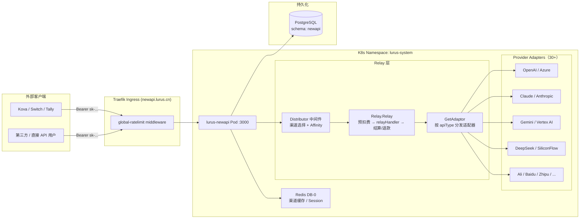
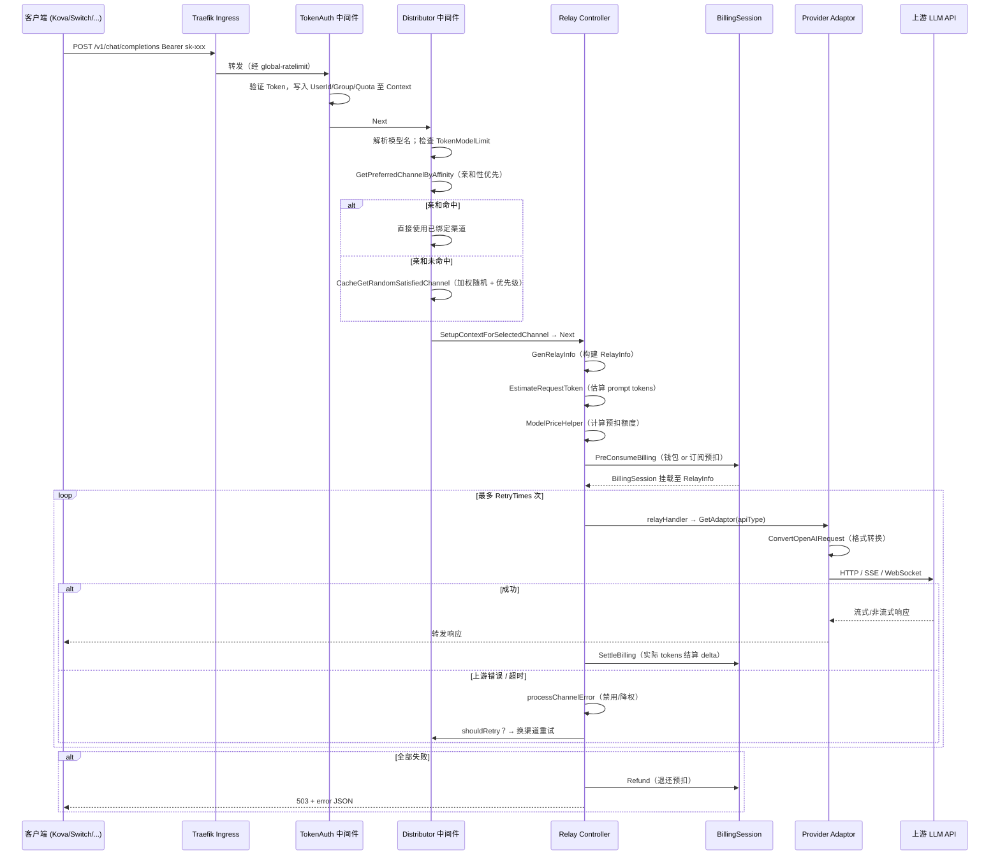

# Lurus Newapi 内部手册

> 仅限内部员工查阅。包含运维细节、决策档案、未公开问题。

## 一句话定位

Lurus Newapi 是公司全部 LLM 流量的统一网关，基于 QuantumNous/new-api fork 维护，承担模型路由、密钥池、负载均衡、failover、计费预扣、用量统计等核心职责。原 2b-svc-api（Lurus Hub）于 2026-04-23 下线后，newapi 成为平台组唯一的对外 LLM 中转站，所有产品（Kova、Lucrum、Switch、Tally 等）的 LLM 调用均经此服务路由。

## 速查

| 项 | 值 |
|---|---|
| 仓库 | github.com/hanmahong5-arch/lurus-newapi |
| 上游 | github.com/QuantumNous/new-api |
| 镜像 | ghcr.io/hanmahong5-arch/lurus-newapi:main-\<sha7\> |
| 域名 | newapi.lurus.cn |
| 端口 | pod:3000 / svc:3000 |
| 命名空间 | lurus-system |
| 数据存储 | PG schema `newapi` + Redis DB 0 (redis.lurus-system.svc:6379) |
| 关键依赖 | PostgreSQL lurus-pg-rw.database.svc:5432 / Redis lurus-system |
| 部署目标 | R1 PROD（cloud-ubuntu-1-16c32g，已对外商业交付） |
| 节点选择器 | `lurus.cn/vpn: "true"`（需要代理访问 Gemini 等境外 API）|

## 架构图



## 模型调用链 sequenceDiagram



## 代码地图

| 路径 | 职责 |
|---|---|
| `main.go` | 程序入口：加载 env / 初始化 DB+Redis / 启动 goroutine / Gin 服务器 |
| `common/` | env 初始化、Redis 客户端、HMAC 加密、JSON 包装、pprof 监控、rate-limit |
| `middleware/auth.go` | Token 鉴权（session / Bearer）、UserId/Group 注入 Context |
| `middleware/distributor.go` | 核心路由选择：亲和缓存 → 加权随机；MJ/Suno/Video 特殊路由 |
| `controller/relay.go` | `Relay()` 主流程：GenRelayInfo → token 估算 → 预扣费 → retry 循环 → 结算/退款 |
| `relay/relay_adaptor.go` | `GetAdaptor(apiType)` — 按渠道类型返回对应 Adaptor 实例 |
| `relay/channel/adapter.go` | `Adaptor` / `TaskAdaptor` 接口定义 |
| `relay/common/relay_info.go` | `RelayInfo` 结构体（请求全生命周期上下文）；`ChannelMeta`、计费字段 |
| `relay/common/billing.go` | `BillingSettler` 接口 |
| `service/billing.go` | `PreConsumeBilling` / `SettleBilling` 入口函数 |
| `service/billing_session.go` | `BillingSession`：预扣 → Settle → Refund，线程安全 |
| `service/funding_source.go` | `WalletFunding` / SubscriptionFunding 实现 |
| `service/channel_select.go` | `CacheGetRandomSatisfiedChannel`：跨分组 auto retry 策略 |
| `service/channel_affinity.go` | 亲和性路由：HybridCache（内存+Redis），基于 request fingerprint |
| `relay/channel/<provider>/` | 各 provider adaptor：格式转换 + DoRequest + DoResponse |
| `model/` | GORM 模型：Channel、Token、User、Log、Subscription 等 |
| `router/relay-router.go` | 路由注册：`/v1/*`、`/v1beta/*`、`/pg/*`（Playground）|
| `deploy/k8s.yaml` | Deployment + Service + IngressRoute + Secret + PVC |

## 部署

- **构建**: `go build -ldflags "-s -w" -o new-api .` + `cd web && bun install && bun run build`
- **CI**: `.github/workflows/docker-main.yml` — push to main → amd64 构建 → GHCR
- **镜像 tag 格式**: `main-<sha7>`（例如 `main-da3cb48`）
- **升级流程**: 修改 `deploy/k8s.yaml` 中镜像 tag → commit + push → ArgoCD auto-sync
- **当前镜像**: `ghcr.io/hanmahong5-arch/lurus-newapi:main-da3cb48`
- **节点**: 必须调度到 `lurus.cn/vpn=true` 节点（否则 Gemini 等境外 API 不可达）
- **外发代理**: `HTTP_PROXY=http://10.42.1.1:10808`（不走代理的内网段已在 `NO_PROXY` 中排除）
- **PVC**: `lurus-newapi-data` 5Gi local-path（日志 + 临时文件）
- **Secret**: `lurus-newapi-secret`（SQL_DSN / REDIS_CONN_STRING / SESSION_SECRET）
- **资源限制**: requests 256Mi/100m，limits 1Gi/1000m

## 运行与运维

```bash
# 查看 pod 状态
ssh root@100.98.57.55 "kubectl get pods -n lurus-system"

# 实时日志（含 SSE 流错误）
ssh root@100.98.57.55 "kubectl logs -n lurus-system deploy/lurus-newapi --tail=200 -f"

# 健康检查
ssh root@100.98.57.55 "kubectl exec -n lurus-system deploy/lurus-newapi -- wget -qO- http://localhost:3000/api/status"

# 重启（滚动）
ssh root@100.98.57.55 "kubectl rollout restart deployment/lurus-newapi -n lurus-system"

# 查看渠道状态（Web Admin 后台 /channel 页面，或直接查 DB）
ssh root@100.98.57.55 "kubectl exec -n database deploy/pg-primary -- psql -U lurus -d newapi -c \"SELECT id,name,type,status FROM channels ORDER BY id;\""
```

**关键指标（目前靠日志 grep，Prometheus 未接入）**：
- SSE 超时：`STREAMING_TIMEOUT=300s`（无数据则断流）
- Relay 超时：`RELAY_TIMEOUT=300s`
- 渠道缓存同步：`MEMORY_CACHE_ENABLED=true`，与 DB 定期同步
- Batch update：`BATCH_UPDATE_ENABLED=true`（日志批量写入，降低 DB 写压力）

## 上游同步策略

### Fork 关系

```
QuantumNous/new-api (upstream)
       │
       │ monthly merge / security patches immediately
       ▼
hanmahong5-arch/lurus-newapi (our fork, branch: main)
```

上游仓库：`https://github.com/QuantumNous/new-api`
同步频率：**每月常规 merge + 安全补丁即时合并**（来自 `lurus.yaml`）

### 同步步骤

```bash
# 1. 添加 upstream remote（首次）
git remote add upstream https://github.com/QuantumNous/new-api.git

# 2. 查看上游有多少新提交
git fetch upstream
git log HEAD..upstream/main --oneline | wc -l

# 3. 看具体 diff（评估冲突面积）
git log HEAD..upstream/main --oneline | head -30
git diff HEAD..upstream/main --stat | tail -20

# 4. 创建 merge 分支，不直接在 main 上操作
git checkout -b sync/upstream-$(date +%Y%m%d)
git merge upstream/main --no-ff

# 5. 解决冲突（见下方冲突热点）
# 6. 回归测试通过后 PR 合并到 main
```

### 当前状态（2026-04-24 记录）

本地 fork 落后上游约 **5650 commits**，版本号 v0.13.0。这是一个大型 merge 工程（48K 行 diff），需要专项排期：

- 预估冲突：至少 Gemini TTS/image2image 定制、timing-safe auth、pprof 守护、session cookie 名（`lurus-session`）、`NO_PROXY` 环境变量注入
- **建议策略**：不做一次性 merge，改为分批 cherry-pick 安全补丁 + 季度性 merge 功能更新

### Lurus 定制点（不可被上游覆盖）

| 定制点 | 位置 | 说明 |
|---|---|---|
| Session cookie 名 | `main.go:204` | `lurus-session`（避免与历史 cookie 冲突） |
| pprof 守护 | `main.go:139-145` / `common/pprof.go` | CPU 超阈值自动写 pprof 文件 |
| Gemini TTS/image2image | `relay/gemini_handler.go` | 上游可能无此扩展 |
| CI 配置 | `.github/workflows/docker-main.yml` | 自建 GHCR，上游用 Docker Hub |
| 代理环境变量 | `deploy/k8s.yaml:159-170` | HTTP_PROXY / NO_PROXY |
| DB 方言兼容注释 | `model/main.go` | 上游可能修改列名处理逻辑 |
| `BillingSession` | `service/billing_session.go` / `service/funding_source.go` | 钱包+订阅双资金来源——上游无此功能 |

**Rebase 注意**：每次 merge upstream 后，用 `git diff HEAD~1..HEAD -- service/billing*.go service/funding_source.go main.go` 确认计费定制代码未被覆盖。

## 渠道（Channel）与密钥池

### 渠道概念

渠道（Channel）是 newapi 中连接上游 LLM 提供商的配置单元，包含：
- `type`：提供商类型（OpenAI=1、Anthropic=14、Gemini=24、DeepSeek=43 等，共 30+ 种）
- `key`：API 密钥（支持多密钥池，以 `\n` 分隔）
- `models`：该渠道支持的模型列表
- `group`：访问分组（default / vip / auto 等）
- `priority`：同组内负载均衡优先级（越高越优先）
- `weight`：同优先级内加权随机比例
- `status`：enabled=1 / 手动禁用=2 / 自动禁用=3

### 密钥池（Multi-Key）

当 `key` 字段包含多行时，渠道自动启用多密钥轮转模式（`IsMultiKey=true`）：
- 请求时从密钥池中轮询选取（`ChannelMultiKeyIndex`）
- 某个 key 被上游封禁/限速后，系统可单独禁用该 key（`MultiKeyDisabledReason` / `MultiKeyDisabledTime`）而不影响整个渠道
- 密钥禁用信息存储在 `ChannelInfo` JSON 字段中

### 负载均衡与选择策略

`service/channel_select.go` → `CacheGetRandomSatisfiedChannel`：

1. **亲和性优先**（`service/channel_affinity.go`）：基于请求指纹（IP / User-Agent / 自定义字段）绑定渠道，保证 stateful 任务（如视频生成轮询）打到同一渠道
2. **优先级排序**：同分组内按 `priority` 降序，先用高优先级渠道
3. **加权随机**：同优先级内按 `weight` 随机选取
4. **跨分组 auto retry**：`tokenGroup=auto` 时，会依次尝试用户可用的所有分组，耗尽一个分组所有优先级再切换到下一分组

### Failover 机制

`controller/relay.go` Relay 函数中的 retry 循环：

```
for retry := 0; retry <= RetryTimes; retry++ {
  channel = getChannel(c, relayInfo, retryParam)
  err = relayHandler(c, channel)
  if err == nil { return }
  processChannelError(c, channel, err)  // 可能自动禁用渠道
  if !shouldRetry(c, err, remaining) { break }
  // 换渠道重试
}
```

- `shouldRetry` 判断条件：非 4xx 客户端错误 + 剩余重试次数 > 0 + 错误非 SkipRetry
- 自动禁用：连续失败达阈值后，渠道 status 置为 3（AutoDisabled）
- 禁用后：`AutomaticallyTestChannels()` goroutine 定期探活，恢复正常后重新 enable

## 计费 Hook

### 计费流程

```
请求到达 → ModelPriceHelper（查价格表）→ PreConsumeBilling（预扣）
                                                    ↓
                               BillingSession.funding.PreConsume()
                               → WalletFunding or SubscriptionFunding

请求完成 → SettleBilling(actualTokens)
         → delta = actual - preConsumed
         → funding.Settle(delta)     // 补扣或退还差额
         → 更新 Token 额度

请求失败 → BillingSession.Refund()  // 全额退还预扣，幂等
```

### 双资金来源

用户计费偏好（`billing_preference`）决定从哪里扣款：

| 偏好值 | 行为 |
|---|---|
| `subscription_first` | 优先订阅计划，耗尽后转钱包 |
| `wallet_first` | 优先钱包余额，不足时转订阅 |
| `subscription_only` | 仅订阅，订阅不足直接拒绝 |
| `wallet_only` | 仅钱包，余额不足直接拒绝 |

异步任务（视频/音乐生成）设置 `ForcePreConsume=true`，在提交时就预扣全额，因为 HTTP 返回后任务仍在运行。

### NATS 集成

当前版本 **未接入 NATS LLM_EVENTS 流**（`grep NATS` 无结果）。计费通知走内部 DB 写入 + `checkAndSendQuotaNotify`（邮件/站内通知）。`lurus.yaml` 中记录的 `LLM_EVENTS` 是规划阶段目标，待实现。

## 如何新增模型

### 新增已有渠道类型的模型（常见操作）

1. 登录 newapi 后台 `newapi.lurus.cn`（管理员账号）
2. 进入「渠道」页 → 找到目标渠道 → 编辑
3. 在「模型」字段添加新模型名称
4. 若需要模型映射（对外暴露名 ≠ 上游实际名），在「模型重定向」字段配置 `外部名:内部名`
5. 保存后渠道缓存会在下次 sync 周期（`SyncFrequency`）自动刷新，或点「测试」强制刷新

### 新增全新渠道类型（需要改代码）

以新增 `MyProvider` 为例：

1. **定义常量** (`constant/channel.go`)：
   ```go
   ChannelTypeMyProvider = 999
   ```
   并在 `ChannelTypeNames` map 中加条目。

2. **定义 API 类型** (`common/api_type.go`)：
   ```go
   const APITypeMyProvider = 999
   ```
   在 `ChannelType2APIType` 中添加映射。

3. **实现 Adaptor** (`relay/channel/myprovider/adaptor.go`)：
   实现 `channel.Adaptor` 接口的全部方法：`Init`, `GetRequestURL`, `SetupRequestHeader`, `ConvertOpenAIRequest`, `DoRequest`, `DoResponse`, `GetModelList`, `GetChannelName` 等。

4. **注册 Adaptor** (`relay/relay_adaptor.go`)：
   在 `GetAdaptor()` switch 中加 case。

5. **（可选）加入流式支持** (`relay/common/relay_info.go`)：
   在 `streamSupportedChannels` map 中添加 `ChannelTypeMyProvider: true`。

6. 本地测试：`go run main.go` → 新增渠道 → 发送测试请求。

> 注意：上游 TODO 注释显示，许多 provider（Ali、Baidu、AWS、Claude 等）的 `ConvertRerankRequest` / `ConvertEmbeddingRequest` 等接口方法是 `//TODO implement me` 占位，实际会 panic 或返回空，新增同类方法时须实现完整。

## 已知坑（内部专属）

1. **上游落后 5650 commits**：大型 merge 是独立工程（48K 行 diff），已知存在 rebase 风险。做 sync 前必须列出所有 Lurus 定制点，逐一比对冲突，不能直接 `git merge upstream/main`。
2. **circuit-breaker 已移除**：`deploy/k8s.yaml` 注释说明，Traefik circuit-breaker 曾导致上游 5xx → 熔断 → 视频下载等正常请求全部 503 级联失败。已移除，目前无熔断保护，依赖 newapi 内部 retry 逻辑。
3. **NATS LLM_EVENTS 未实现**：`lurus.yaml` 中配置了 `LLM_EVENTS` NATS stream，但 newapi 代码中无任何 NATS 客户端或事件发布逻辑。下游如有依赖此事件的服务，目前无数据。
4. **多 key 禁用信息存 JSON**：`MultiKeyDisabledReason` / `MultiKeyDisabledTime` 存储在 Channel 的 `ChannelInfo` JSON 字段，运维排查时无法直接 SQL 查询，需要应用层读取。
5. **SSE 不兼容 gzip**：代码注释 `// This will cause SSE not to work!!!` 已禁用 gzip 中间件，切勿在 router 层开启 gzip，否则 SSE 流式响应失效。
6. **api_version 未统一**：`middleware/distributor.go:377` 有 `// TODO: api_version统一`，Azure 渠道的 api_version 处理逻辑与其他渠道不一致，多渠道并存时可能出现版本漂移。
7. **SQLite 降级时序问题**：本地无 Redis 时回退 cookie session，但 K8s 部署缺 Redis 时仍会 fatal 退出（`common.FatalLog`），不会静默降级。Redis 必须可达。
8. **Redis DB 0 与 memorus 共享**：`lurus-system` 命名空间的 Redis 实例是 newapi 自带的 `redis:7-alpine`（`deploy/k8s.yaml`），不是 platform Redis。但 `lurus.yaml` 标注的 `redis: redis.lurus-system.svc:6379/0` 需确认没有其他服务写入 DB-0 造成键冲突。
9. **pprof 端口仅本地监听**：`ENABLE_PPROF=true` 时 pprof 监听 `127.0.0.1:8005`，需要 `kubectl port-forward` 才能访问，无法从集群外直接抓取 profile。
10. **Gemini 依赖 VPN 节点**：Pod 必须调度到 `lurus.cn/vpn=true` 节点，节点迁移或扩容时务必保留此 nodeSelector，否则 Gemini 系列模型请求全部超时。

## 决策档案

| 时间 | 决策 | 理由 |
|---|---|---|
| 2026-04-23 | 关闭 2b-svc-api（Lurus Hub），newapi 承接全部 LLM gateway 职责 | Hub 功能与 newapi 重叠，维护两套成本高，newapi 功能更完善 |
| 2026-04 | 移除 Traefik circuit-breaker | 上游 5xx 属正常（多 provider 可用性差异），熔断导致视频下载等正常请求级联失败 |
| 2026-04 | 上游 sync 策略改为 config-only 定制 | 减少 fork 侵入性改动，降低 merge 冲突面积；重量级定制走独立分支 |
| 2026-04-24 | 记录上游落后 5650 commits，暂不做大版本 merge | 时间成本过高（48K diff），安全补丁单独 cherry-pick 应对 |
| 初始 | Session cookie 命名为 `lurus-session` | 避免与历史部署的 `session` cookie（格式不兼容）冲突导致登录失效 |

## TODO / Roadmap

- [ ] 接入 NATS `LLM_EVENTS` 流，发布每次模型调用事件（model/tokens/latency/user） — 高优
- [ ] Prometheus metrics 端点（当前仅靠日志排障，无 QPS / p95 / error_rate 指标）— 高优
- [ ] 上游大版本 sync（v0.13.0 → latest）— 需专项排期，评估 48K diff 冲突
- [ ] Azure 渠道 api_version 统一（消除 `distributor.go:377` TODO）
- [ ] 完善 Ali / Baidu / AWS / Claude adaptor 的 Rerank / Embedding 接口（目前 `//TODO implement me`）
- [ ] HPA 验证：`deploy/hpa.yaml` 已存在，确认 CPU/Memory 阈值配置合理

## 应急 Runbook（10 分钟版）

### 模型挂了（单个模型无法使用）

**症状**：特定模型返回 503 或 "no available channel"

```bash
# 1. 查看哪些渠道支持该模型，当前状态
ssh root@100.98.57.55 "kubectl exec -n database deploy/pg-primary -- psql -U lurus -d newapi -c \"
  SELECT c.id, c.name, c.type, c.status, c.response_time
  FROM channels c
  WHERE c.models LIKE '%gpt-4o%'
  ORDER BY c.status, c.priority DESC;
\""

# 2. 如果渠道被自动禁用（status=3），查看原因
ssh root@100.98.57.55 "kubectl exec -n database deploy/pg-primary -- psql -U lurus -d newapi -c \"
  SELECT id, name, status, last_tested_time
  FROM channels WHERE status = 3;
\""

# 3. 在 Web Admin 后台手动 enable 渠道并测试
# 进入 newapi.lurus.cn → 渠道 → 找到禁用渠道 → 手动启用 → 点击「测试」

# 4. 查看近期错误日志确认是否是上游 API 问题
ssh root@100.98.57.55 "kubectl logs -n lurus-system deploy/lurus-newapi --tail=500 | grep 'relay error'"
```

### 渠道全挂（所有渠道不可用）

**症状**：所有请求返回 503，日志大量 "no available channel"

```bash
# 1. 快速诊断：检查渠道缓存是否正常
ssh root@100.98.57.55 "kubectl logs -n lurus-system deploy/lurus-newapi --tail=100 | grep -E 'cache|channel'"

# 2. 检查 Redis 是否可达
ssh root@100.98.57.55 "kubectl exec -n lurus-system deploy/lurus-newapi -- wget -qO- http://localhost:3000/api/status"

# 3. 强制重建渠道缓存：重启 Pod（触发 InitChannelCache）
ssh root@100.98.57.55 "kubectl rollout restart deployment/lurus-newapi -n lurus-system"

# 4. 等待 Pod 就绪（startupProbe 最多 5min）
ssh root@100.98.57.55 "kubectl rollout status deployment/lurus-newapi -n lurus-system"

# 5. 如果是上游 API 全面故障，在后台批量禁用故障渠道，保留可用渠道
```

### 密钥池耗尽 / API Key 封禁

**症状**：特定渠道大量 429 或 401，多 key 渠道逐一失效

```bash
# 1. 查看多密钥渠道的禁用情况（JSON 字段需应用层读，此处查整个渠道状态）
ssh root@100.98.57.55 "kubectl exec -n database deploy/pg-primary -- psql -U lurus -d newapi -c \"
  SELECT id, name, type, status, other_info
  FROM channels
  WHERE other_info::text LIKE '%MultiKeyDisabled%'
     OR status = 3;
\""

# 2. 在 Web Admin 后台 → 渠道详情 → 查看各个 Key 的禁用状态并手动恢复或替换
# 路径：newapi.lurus.cn → 渠道 → 编辑 → Key 管理

# 3. 添加新 key（追加到 key 字段，换行分隔），保存后立即生效（无需重启）

# 4. 临时应急：新建备用渠道（同类型不同账号），priority 设高，先顶上
```

### 上游 sync 冲突（merge upstream 时）

**症状**：`git merge upstream/main` 产生大量冲突

```bash
# 1. 终止当前 merge，回到安全状态
git merge --abort

# 2. 列出 Lurus 定制文件（高冲突风险）
git diff main..upstream/main -- \
  main.go \
  service/billing.go service/billing_session.go service/funding_source.go \
  middleware/auth.go \
  deploy/k8s.yaml \
  .github/workflows/docker-main.yml \
  | head -100

# 3. 分批 cherry-pick（推荐：先只摘安全补丁）
git log upstream/main --oneline | grep -i "security\|fix\|cve" | head -10
# 逐个 cherry-pick 安全修复
git cherry-pick <sha>

# 4. 大版本 merge 时：创建专用分支，解决冲突后充分测试再 PR
git checkout -b sync/upstream-$(date +%Y%m%d)
git merge upstream/main
# 解决冲突 → 优先保留 service/billing*.go 中的 BillingSession 实现
# → go test ./... → bun run build → Docker build 验证 → PR

# 5. 合并后必须验证的定制点
grep -n "lurus-session" main.go                    # session cookie 名
grep -n "BillingSession" service/billing_session.go  # 计费会话
grep -n "ENABLE_PPROF" main.go                     # pprof 守护
```

### 服务整体挂了

```bash
# 1. 查 Pod 状态
ssh root@100.98.57.55 "kubectl get pods -n lurus-system"

# 2. 查启动日志（InitChannelCache panic 会在这里出现）
ssh root@100.98.57.55 "kubectl logs -n lurus-system deploy/lurus-newapi --tail=200"

# 3. 查 describe（OOM / 探针失败 / 镜像拉取失败）
ssh root@100.98.57.55 "kubectl describe pod -n lurus-system -l app=lurus-newapi"

# 4. 重启
ssh root@100.98.57.55 "kubectl rollout restart deployment/lurus-newapi -n lurus-system"

# 5. 回滚（改 manifest 镜像 tag 为上一个 sha7）
# 编辑 deploy/k8s.yaml，将 image tag 改回上一版本
# git add deploy/k8s.yaml && git commit -m "rollback: revert to main-<prev-sha>"
# git push → ArgoCD auto-sync

# 6. 检查 PostgreSQL 连通性（newapi 启动时 InitDB 若失败会 fatal）
ssh root@100.98.57.55 "kubectl exec -n database deploy/pg-primary -- psql -U lurus -d newapi -c 'SELECT 1;'"

# 7. 检查 Redis 连通性
ssh root@100.98.57.55 "kubectl exec -n lurus-system deploy/redis -- redis-cli ping"
```
