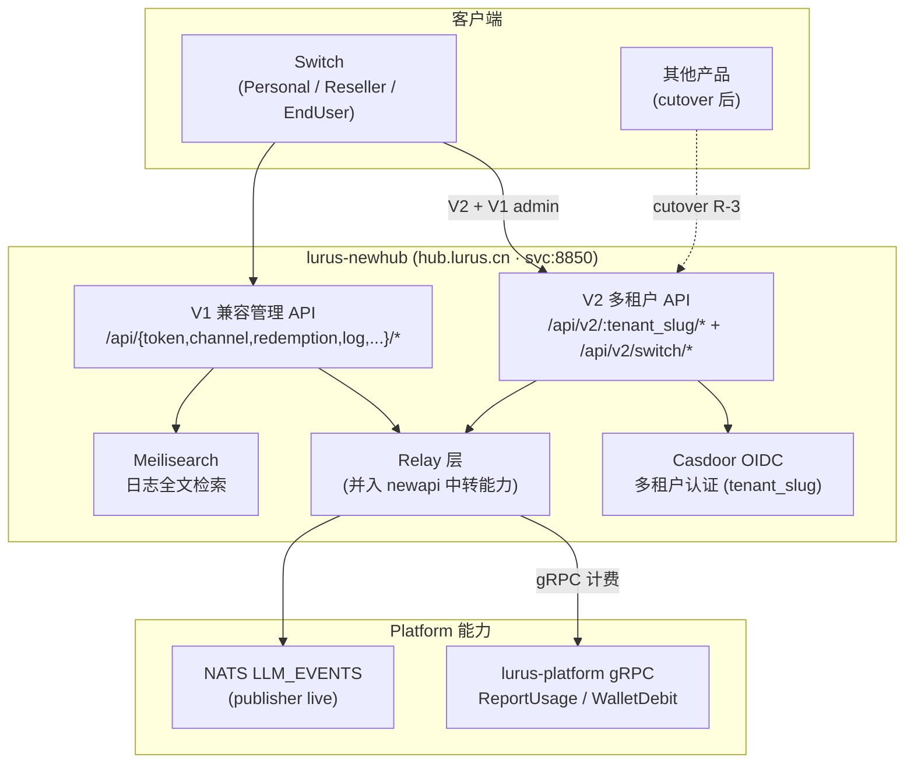

# Lurus Newhub 内部手册

<div class="lurus-callout lurus-callout--info"><span class="lurus-callout__icon"><Icon name="lock" :size="18"/></span><div><p class="lurus-callout__title">仅限内部</p><div class="lurus-callout__body">仅限内部员工查阅。包含运维细节、决策档案、未公开问题。</div></div></div>

<div class="lurus-callout lurus-callout--warn"><span class="lurus-callout__icon"><Icon name="alert-triangle" :size="18"/></span><div><p class="lurus-callout__title">2026-05-28 状态</p><div class="lurus-callout__body">stage on R6（<code>test-newhub.lurus.cn</code>），NATS publisher 已 live。按 <strong>ADR D1（2026-05-27）</strong> 承接 newapi 退役整合，<code>hub.lurus.cn</code> 将成为公司唯一 LLM 网关（见 <a href="/adr/0009-newhub-replaces-newapi">ADR-0009</a>）。DNS A 记录待配（现走 <code>test-newhub.lurus.cn</code>）。</div></div></div>

<p><span class="lurus-tag">P0</span> <span class="lurus-tag lurus-tag--muted">beta</span> <RiskBadge flag="wip" /> <RiskBadge flag="no-monitor" /></p>

<div class="lurus-stat-strip">
  <div class="lurus-stat"><span class="lurus-stat__value">8850</span><span class="lurus-stat__label">svc 端口</span></div>
  <div class="lurus-stat"><span class="lurus-stat__value">R6</span><span class="lurus-stat__label">stage 落点</span></div>
  <div class="lurus-stat"><span class="lurus-stat__value">live</span><span class="lurus-stat__label">NATS publisher</span></div>
  <div class="lurus-stat"><span class="lurus-stat__value">R-1~R-5</span><span class="lurus-stat__label">整合阶段</span></div>
</div>

## 一句话定位

Newhub 是 Lurus 新一代**多租户 LLM 网关 / AI 数据处理枢纽**，叠在 newapi 的中转能力之上，补齐了 newapi 缺失的多租户能力：Casdoor OIDC 租户认证（`tenant_slug`）、Platform gRPC 计费集成（`ReportUsage` / `WalletDebit`）、Meilisearch 日志全文检索、可观测性。它是 **Switch 三模式（Personal / Reseller / EndUser）的远端后端**，也是 newapi（ADR D1）退役后的归宿——`hub.lurus.cn` 将取代 `newapi.lurus.cn` 成为唯一对外网关。

<div class="lurus-callout lurus-callout--info"><span class="lurus-callout__icon"><Icon name="gauge" :size="18"/></span><div><p class="lurus-callout__title">监控</p><div class="lurus-callout__body">平台监控统一走 <strong>Netdata 自托管 Agent</strong>（服务侧继续以 prometheus-format <code>/metrics</code> 暴露 OTel 指标，由 Netdata go.d 主动抓取），详见 <a href="/ops/observability">/ops/observability</a>。</div></div></div>

## 速查

| 项 | 值 |
|---|---|
| 仓库 | github.com/hanmahong5-arch/lurus-newhub |
| 目录 | `2b-svc-newhub` |
| 镜像 | `ghcr.io/hanmahong5-arch/lurus-newhub:main` |
| 域名 | `hub.lurus.cn`（DNS 待配 → R6 `43.226.38.244`；现 `test-newhub.lurus.cn`）|
| 端口 | pod:3000 / svc:8850 |
| 命名空间 | lurus-system |
| 数据存储 | PG schema `lurus_api`（GORM auto-migrate）+ Redis DB 0（`redis.lurus-system.svc:6379/0`）|
| 关键依赖 | Platform gRPC（`IDENTITY_GRPC_ADDR`）· Casdoor（`identity.lurus.cn`）· Meilisearch（日志检索）· newapi（整合并入中）|
| 部署目标 | **R6 stage**（`100.122.83.20` Tailscale）|
| 角色 | `multi-tenant-hub-layer` |

## 架构图



## API 面

| 面 | 路由 | 用途 |
|---|---|---|
| **V2 多租户** | `/api/v2/:tenant_slug/*` | 按租户隔离的 LLM 调用 / 管理 |
| **V2 Switch 专用** | `/api/v2/switch/*` | Switch presets、tools manifest |
| **V2 计费/治理** | `/api/v2/{user/billing, admin/{tenants,mappings,governance}}/*` | 多租户计费、租户/映射/治理管理 |
| **V1 兼容管理** | `/api/{token,channel,redemption,log,data,wallet,user,openrouter-sync}/*` | 单租户兼容层，Switch 管理页对接 |

激活码用 newapi 原生 `POST /api/user/topup` 兑换 quota（EndUser 模式）。

## 数据契约

- **上游能力**：Platform gRPC（`ReportUsage` 计量 / `WalletDebit` 扣款，经 `IDENTITY_GRPC_ADDR`）；Casdoor OIDC（`tenant_slug` 解析）。
- **整合对象**：newapi —— ADR D1 退役并入，**非长期 fork 同步**。
- **下游消费者**：Switch（三模式消费 V2 + V1 admin endpoints）。
- **NATS**：在 `LLM_EVENTS` 上发布调用事件（publisher 已 live——这是 newapi 长期缺失的能力）。

## 与 newapi 整合路线（R-1~R-5，ADR D1）

> 阶段定义直接取自 **ADR D1**（`lurus/doc/decisions/2026-05-27-d1-newapi-retire.md` §Retire Roadmap）。截至 2026-05-28 全部 R 阶段尚未开跑（newhub 自身已 stage on R6），按 12-month Horizon Plan 排期推进。

| 阶段 | 内容 | 排期 / 状态 |
|---|---|---|
| **R-1** | 移植 newapi 近 90 天 Lurus 原创 commit 到 newhub（cost-spike per-user 5-min 窗口、`llm.image.generated` image_url backfill、Gemini native image patch 等）| Plan W3-4 · ⏳ 待执行 |
| **R-2** | Provider Parity 审计：对比 newapi vs newhub 的 provider / model 常量 / route，补齐缺失或显式标 deferred | Plan W3-4 · ⏳ 待执行 |
| **R-3** | 切流方案设计：nginx 流量镜像 1 周（响应 diff < 0.1%）+ 灰度 5→25→50→100% + DNS TTL 60s 切换；回滚 ≤15min | Plan W7-8 · ⏳ 待执行 |
| **R-4** | PROD 切流（gated on SCIM / HA / Reliability hard floor），5% 灰度 24h 0 SLO 退化 | Plan W9-10 · ⏳ 待执行 |
| **R-5** | newapi GitHub repo 归档（read-only + 90d 数据保留）+ 修订 `lurus.yaml` / `lurus/CLAUDE.md` 错误表述 | Plan W11+ · ⏳ 待执行 |

> 上游同步：整合后 newhub 接 `QuantumNous/new-api` upstream，**仅安全 CVE / critical fix**（24h 内 cherry-pick），不再 monthly cherry-pick。已放弃 Option B（newhub 重写为 newapi HTTP 客户端）与 Option C（双仓并存）。

## 部署

<div class="lurus-callout lurus-callout--danger"><span class="lurus-callout__icon"><Icon name="hard-drive" :size="18"/></span><div><p class="lurus-callout__title">R6 磁盘 HARD RULE</p><div class="lurus-callout__body">当前落点 R6 stage（docker / K3s on <code>100.122.83.20</code>），写盘<strong>只走 <code>/data</code></strong>，根盘留系统。</div></div></div>

- 构建/CI：push main → GHCR `ghcr.io/hanmahong5-arch/lurus-newhub:main`。
- 当前落点：**R6 stage**（docker / K3s on `100.122.83.20`），写盘只走 `/data`（R6 HARD RULE）。
- DB：PG schema `lurus_api`，GORM auto-migrate（首次启动建表）。
- 升 prod 门槛：stage 稳定 + DNS cutover（R-2）+ 切流验证（R-3）后再评估上 PROD。

## 已知坑（内部专属）

<div class="lurus-callout lurus-callout--warn"><span class="lurus-callout__icon"><Icon name="alert-triangle" :size="18"/></span><div><p class="lurus-callout__title">DNS 未 cutover</p><div class="lurus-callout__body"><code>hub.lurus.cn</code> A 记录尚未指向 R6，对外仍走 <code>test-newhub.lurus.cn</code>；任何写"hub.lurus.cn 已是唯一网关"的文案都为时过早（cutover 在 R-3/R-4）。</div></div></div>

1. **DNS 未 cutover**：`hub.lurus.cn` A 记录尚未指向 R6，对外仍走 `test-newhub.lurus.cn`；任何写"hub.lurus.cn 已是唯一网关"的文案都为时过早（cutover 在 R-3/R-4）。
2. **与 newapi 并存期**：R-3 切流完成前，newapi 与 newhub 同时在线，计费口径需对齐（Platform gRPC 为准），避免双计。
3. **GORM auto-migrate**：schema `lurus_api` 由 GORM 自动迁移，无独立 migration ledger 条目，升级时注意列变更不可逆风险。

## 决策档案

| 时间 | 决策 | 理由 |
|---|---|---|
| 2026-05-27 | **ADR D1**：newapi 退役 → 整合并入 newhub（Option A）| newhub 多租户能力是 newapi 无法低成本补齐的；统一到 `hub.lurus.cn` 单网关，详见 [ADR-0009](/adr/0009-newhub-replaces-newapi) |

## 应急 Runbook（10 分钟版）

<ol class="lurus-steps">
<li>

定位容器并看日志（stage 在 R6，走 Tailscale）：

```bash
ssh root@100.122.83.20 "docker ps | grep newhub"      # 或 kubectl -n lurus-system get pods | grep newhub
ssh root@100.122.83.20 "docker logs --tail=200 <newhub-container>"
```

</li>
<li>

健康检查：

```bash
curl -sI https://test-newhub.lurus.cn/
```

</li>
<li>

计费链路：Platform gRPC 不可达时 LLM 调用会拒绝/降级，确认 `IDENTITY_GRPC_ADDR` 指向 platform-core gRPC `:18105`。

</li>
</ol>

<div class="lurus-callout lurus-callout--info"><span class="lurus-callout__icon"><Icon name="gauge" :size="18"/></span><div><p class="lurus-callout__title">监控</p><div class="lurus-callout__body">服务健康与指标看 <strong>Netdata 自托管 Agent</strong>，详见 <a href="/ops/observability">/ops/observability</a>。</div></div></div>
