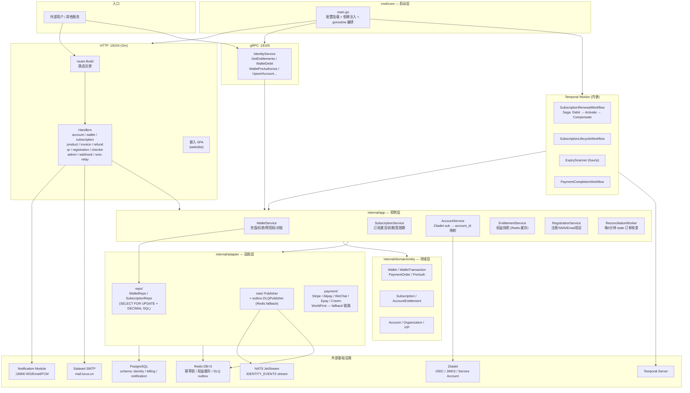
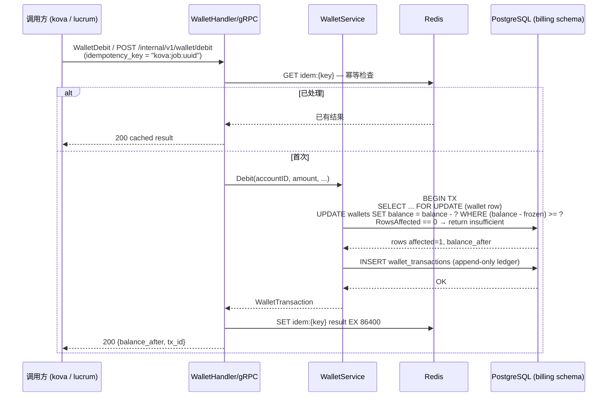
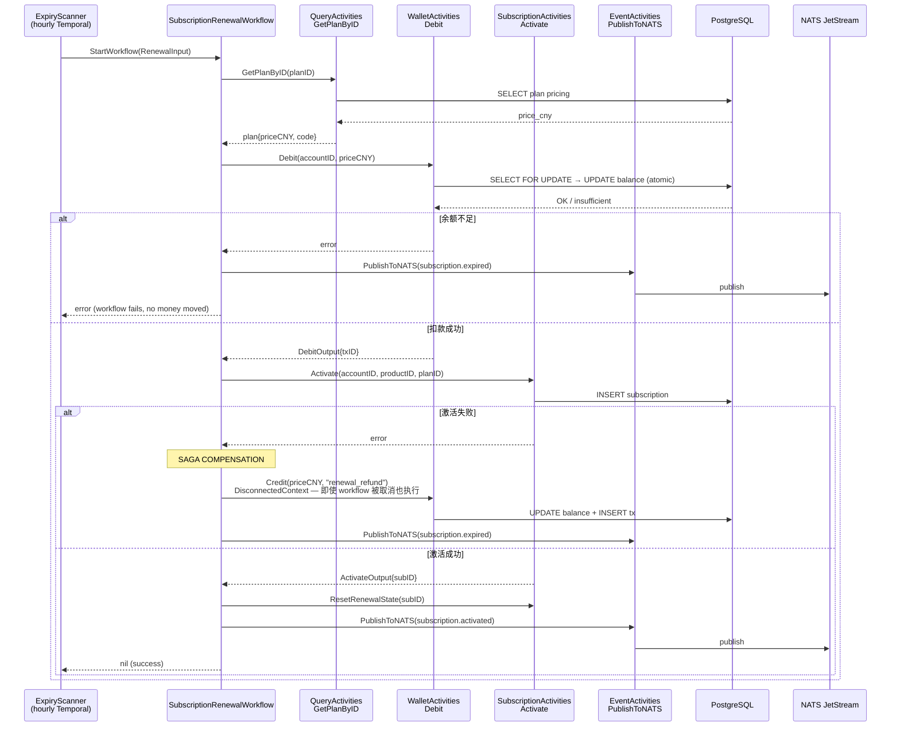
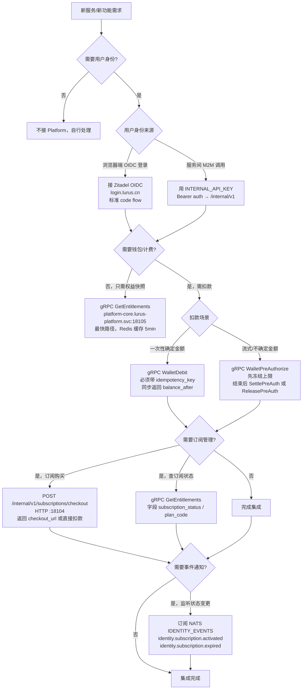
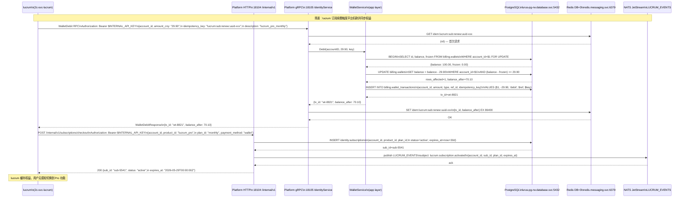
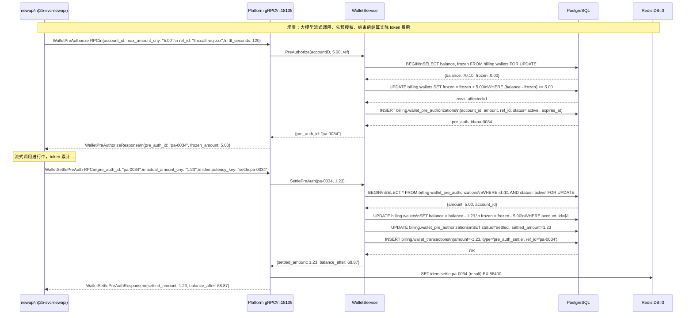
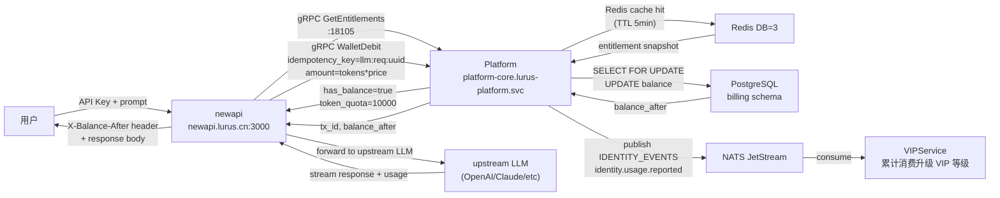
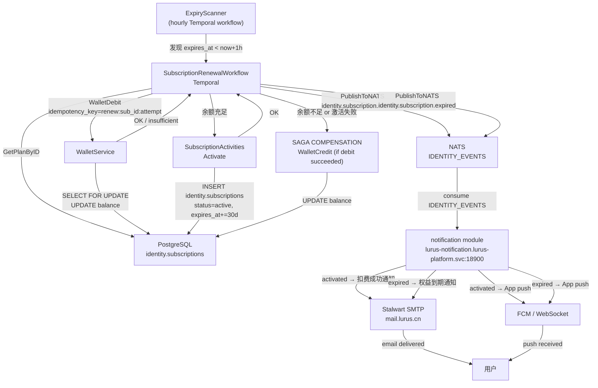
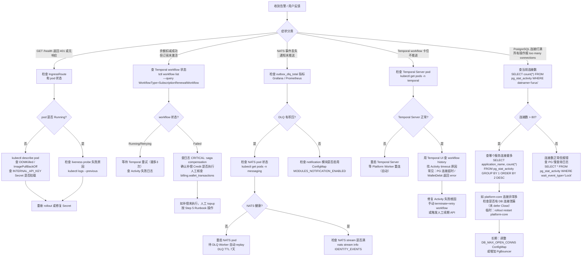

# Lurus Platform 内部手册

## 一句话定位

Lurus Platform 是全公司唯一的账号、钱包、计费、订阅、通知与邮件中台——所有产品的用户身份和资金流转必须经由它，不得绕过。它对资金零损失负责：任何扣款失败都必须回滚，不接受"扣了钱但订阅没开"的状态。技术上它是一个 Go 单体（Gin + gRPC 双协议），加上两个独立部署的子模块（notification / mail）。

## 速查

| 项目 | 值 |
|------|-----|
| 仓库 | `github.com/hanmahong5-arch/lurus-platform` |
| 源码目录 | `2l-svc-platform/` |
| 镜像 | `ghcr.io/hanmahong5-arch/lurus-platform-core:main-<sha7>` |
| 主域名 | `identity.lurus.cn` |
| HTTP 端口 | `18104` (ClusterIP `platform-core.lurus-platform.svc`) |
| gRPC 端口 | `18105` (ClusterIP 同上) |
| 命名空间 | `lurus-platform` |
| Kubernetes Deployment | `platform-core` |
| ArgoCD App | argocd 管理，auto-sync on push main |
| PostgreSQL schemas | `identity`, `billing`, `notification` |
| Redis DB | `3` (host: `redis.lurus-system.svc:6379`) |
| NATS Stream | `IDENTITY_EVENTS` |
| Temporal Workflows | `SubscriptionRenewal`, `PaymentCompletion`, `SubscriptionLifecycle`, `ExpiryScanner` |
| Temporal Namespace | 默认 (同 cluster Temporal server) |
| 关键依赖 | Zitadel (auth.lurus.cn), PostgreSQL (lurus-pg-rw.database.svc:5432), Redis, NATS, Temporal |
| 子模块 Notification | `lurus-notification.lurus-platform.svc:18900` |
| 子模块 Mail | Stalwart SMTP/JMAP + Roundcube webmail |
| 部署目标 | R1 PROD (43.226.46.164) — 已对外商业交付 |
| 前端 Apps | `login.lurus.cn` (Zitadel 自定义登录), `admin.lurus.cn` (管理后台) |

## 架构图



## 核心数据流

### 1. 钱包扣款幂等流程（HTTP 路径 + DB 原子扣款）



### 2. 订阅续费 Temporal Workflow（Saga 模式）



## 代码地图

| 路径 | 职责 |
|------|------|
| `cmd/core/main.go` | 启动入口：配置加载、依赖注入（DB/Redis/NATS/Temporal）、goroutine 编排（HTTP + gRPC + Worker + Reconciler） |
| `cmd/sms-test/main.go` | 一次性 CLI，用于线下验证 SMS 发送（不部署到 K8s） |
| `internal/domain/entity/` | 核心实体：Account, Wallet, WalletTransaction, PaymentOrder, PreAuth, Subscription, AccountEntitlement, VIP, Invoice, Refund, QRSession... |
| `internal/app/wallet_service.go` | 钱包用例：Topup / Debit / Credit / PreAuthorize / SettlePreAuth / ReleasePreAuth / CreateCheckoutSession |
| `internal/app/subscription_service.go` | 订阅生命周期：Activate / Expire / Grace / Cancel |
| `internal/app/entitlement_service.go` | 权益快照计算 + Redis 缓存（TTL 5min，ConfigMap 可调） |
| `internal/app/account_service.go` | 账号 CRUD + `UpsertByZitadelSub`（首次登录自动建账） |
| `internal/app/registration_service.go` | 注册 + Email/SMS 验证 + 推荐码奖励钩子 |
| `internal/app/reconciliation_worker.go` | 每5分钟：stale pending orders / 已付但未入账的订单扫描 |
| `internal/app/refund_service.go` | 退款：小额直接审批，大额走 QR-delegate Boss 扫码 |
| `internal/app/sms/usecase.go` | SMS 中继用例：Aliyun/Tencent 短信，最多3次重试，限速检测 |
| `internal/adapter/repo/wallet.go` | `Credit` / `Debit`：`SELECT FOR UPDATE` + SQL DECIMAL 算术，append-only 账本 |
| `internal/adapter/repo/subscription.go` | 订阅 CRUD，`GetActive` 防重复激活 |
| `internal/adapter/grpc/server.go` | gRPC `IdentityService` 实现：GetEntitlements, WalletDebit/Credit/PreAuth, UpsertAccount |
| `internal/adapter/handler/` | Gin handlers（account / wallet / subscription / qr / webhook / sms-relay / admin ...） |
| `internal/adapter/handler/qr_handler.go` | QR 登录 / 加入组织 / QR-delegate 危险操作（删账号、大额退款、OIDC App 删除） |
| `internal/adapter/payment/` | 支付提供商适配：Stripe / Alipay / WeChat / Epay / Creem / WorldFirst；主提供商熔断后自动 fallback 到 Epay |
| `internal/adapter/nats/` | NATS 发布者 + 消费者（VIP 事件） |
| `internal/pkg/auth/` | Zitadel JWKS JWT 验证 + Redis 缓存 sub→account_id（TTL 10min） |
| `internal/pkg/outbox/` | DLQ 包装：NATS 发布失败 → Redis list `outbox:dlq`（7天TTL），Prometheus 计数器 |
| `internal/pkg/idempotency/` | Webhook 幂等去重（Redis SET NX，TTL 24h） |
| `internal/temporal/workflows/subscription_renewal.go` | Saga 工作流：Debit → Activate → 补偿性 Credit（Disconnected Context 保证执行） |
| `internal/temporal/workflows/expiry_scanner.go` | 每小时扫描到期订阅，触发 ExpiryScanner |
| `internal/temporal/workflows/payment_completion.go` | 支付完成后回调处理工作流 |
| `internal/module/` | 可插拔模块注册表：notification / mail 通过 hooks 注入，不影响核心启动 |
| `internal/module/ops/` | 特权操作目录（approve_refund / delete_account / delete_oidc_app / rotate_secret），供审计看板消费 |
| `modules/notification/` | 独立子模块：WS + Email + FCM 三通道分发，NATS 消费 IDENTITY_EVENTS，Digest Worker，模板引擎 |
| `modules/mail/stalwart/` | Stalwart 部署配置（SMTP/IMAP/JMAP） |
| `modules/mail/webmail/` | Roundcube/JMAP 前端 + Worker |
| `apps/login/` | Next.js 15，Zitadel 自定义登录 UI（login.lurus.cn） |
| `apps/admin/` | Next.js 15 + shadcn/ui，管理后台（admin.lurus.cn） |
| `deploy/k8s/base/` | Deployment + Service + IngressRoute + HPA + PDB + ConfigMap + Secrets + RBAC + ServiceMonitor |
| `deploy/k8s/overlays/` | Kustomize overlays：with-notification / with-mail / full |
| `migrations/` | SQL migrations（identity + billing schema，按序号执行） |

## 部署

### 构建

```bash
# 生产构建（CGO 关闭，scratch 镜像用）
CGO_ENABLED=0 GOOS=linux go build -ldflags="-s -w" -trimpath -o app ./cmd/core

# Proto 重新生成（需要 buf CLI）
cd proto && buf generate && buf lint

# 本地开发（含 .env 加载）
go run ./cmd/core
```

### CI 流程

- 触发：push `main`，路径 `2l-svc-platform/**`
- GHA → 构建镜像 → push `ghcr.io/hanmahong5-arch/lurus-platform-core:main-<sha7>`
- ArgoCD 检测到镜像 tag 变更 → auto-sync → RollingUpdate（maxUnavailable=0，maxSurge=1）

### 镜像 tag 约定

| 环境 | Tag 格式 |
|------|----------|
| PROD | `main-<sha7>` (e.g. `main-a3f8c12`) |
| STAGE | `latest` |

deployment.yaml 中 `rollout.lurus.cn/revision` annotation 用于强制 ArgoCD 检测 `:main` tag 变更。

### 环境变量注入

- **ConfigMap** `platform-core-config`：PORT/GRPC_PORT/TZ/ENV/REDIS_ADDR/REDIS_DB/NATS_ADDR/GRACE_PERIOD_DAYS/OTEL_*/RATE_LIMIT_*/各支付 URL
- **Secret** `platform-core-secrets`：DATABASE_DSN / INTERNAL_API_KEY / ZITADEL_ISSUER + JWKS_URL + AUDIENCE + SERVICE_ACCOUNT_PAT / REDIS_PASSWORD / 各支付密钥（STRIPE / EPAY / CREEM / ALIPAY / WECHAT / WORLDFIRST）/ SMS 密钥（ALIYUN / TENCENT）/ STALWART_ADMIN_PASSWORD / SESSION_SECRET

### ArgoCD

```bash
# 查看 sync 状态
ssh root@100.98.57.55 "kubectl get applications -n argocd | grep platform"

# 手动触发 sync（auto-sync 关闭时）
ssh root@100.98.57.55 "argocd app sync lurus-platform"
```

## 运行与运维

### 健康检查端点

| 端点 | 用途 |
|------|------|
| `GET /health` | liveness + startup probe（容器内 :18104） |
| `GET /readyz` | readiness probe，主动验证 Redis + PostgreSQL 连通性 |
| `GET /metrics` | Prometheus scrape（unauthenticated，ServiceMonitor 自动发现） |

NATS **不在** readiness set 中——outbox 会降级到 Redis DLQ，NATS 断线不应摘流量。

### 关键日志（JSON structured，Loki 可搜索）

| 关键词 | 含义 |
|--------|------|
| `wallet/topup` | 充值成功，含 balance_after |
| `wallet/debit` | 扣款成功 |
| `wallet/mark-order-paid` | 支付订单翻转为 paid，did_transition=true 时才实际入账 |
| `CRITICAL: saga compensation ... failed` | Temporal 补偿失败，**立即人工介入** |
| `nats publisher init failed` | NATS 断线，事件进 Redis DLQ |
| `outbox_dlq_total` 上涨 | DLQ 有积压，需排查 NATS |
| `lurus-platform build sha=...` | 启动第一行，核对镜像版本 |

### 关键 Prometheus 指标

| 指标 | 含义 |
|------|------|
| `wallet_operations_total{type,result}` | 各类钱包操作成功/失败计数 |
| `wallet_amount_total{type}` | 各类金额累计（topup/debit/credit...） |
| `payment_order_transitions_total{from,to,order_type,method}` | 订单状态机转换 |
| `qr_delegate_confirms_total{op,result}` | 特权操作 QR 扫码确认统计 |
| `outbox_published_total` / `outbox_dlq_total` | NATS 发布健康度 |
| `http_requests_total` / `http_request_duration_seconds` | Gin 路由 HTTP 指标 |

### 重启 / 滚动更新命令

```bash
# 查看 pod 状态
ssh root@100.98.57.55 "kubectl get pods -n lurus-platform"

# 强制滚动重启（不改镜像）
ssh root@100.98.57.55 "kubectl rollout restart deployment/platform-core -n lurus-platform"

# 查看最近100行日志
ssh root@100.98.57.55 "kubectl logs -n lurus-platform deploy/platform-core --tail=100"

# 跟踪实时日志
ssh root@100.98.57.55 "kubectl logs -n lurus-platform deploy/platform-core -f"

# 查看 rollout 状态
ssh root@100.98.57.55 "kubectl rollout status deployment/platform-core -n lurus-platform"
```

## 数据契约

### gRPC 服务（:18105）— 下游消费者

`IdentityService` proto: `proto/proto/identity/v1/identity.proto`
认证：所有 RPC 需 `Authorization: Bearer <INTERNAL_API_KEY>` metadata。

| RPC | 消费者 |
|-----|--------|
| `GetEntitlements` | kova, lucrum, newapi — 查权益 |
| `WalletDebit` / `WalletCredit` | kova（LLM 调用计费）, lucrum |
| `WalletPreAuthorize` / `WalletSettlePreAuth` / `WalletReleasePreAuth` | kova streaming（预授权流控） |
| `UpsertAccount` / `GetAccountByZitadelSub` | 所有需要身份解析的服务 |
| `GetAccountOverview` | admin 后台 |

### HTTP Internal API（:18104）— 下游消费者

认证：`Authorization: Bearer <INTERNAL_API_KEY>`

| 路由 | 说明 |
|------|------|
| `POST /internal/v1/subscriptions/checkout` | 外部服务发起订阅购买（Wallet 扣款 or 外部支付） |
| `POST /internal/v1/accounts/:id/wallet/topup` | 管理员给账户充值 |
| `GET /internal/v1/accounts/:id/wallet/transactions` | 交易流水 |
| `POST /internal/v1/sms/relay` | Zitadel webhook → Aliyun/Tencent SMS 中继 |

### NATS 事件（IDENTITY_EVENTS stream）

| Subject | 发布方 | 消费方 |
|---------|--------|--------|
| `identity.subscription.activated` | Platform | notification 模块、lucrum |
| `identity.subscription.expired` | Platform | notification 模块 |
| `identity.org.member_joined` | Platform (QR confirm) | notification 模块 |
| `identity.referral.signup` | Platform | notification 模块 |
| `identity.usage.reported` | 外部服务 → Platform NATS consumer | VIPService 累计消费 |

### 核心 DB 表（按 schema）

**identity schema**

| 表 | 说明 |
|----|------|
| `identity.accounts` | 主账号表，`zitadel_sub` unique，`lurus_id` UUID |
| `identity.subscriptions` | 订阅状态机（pending/trial/active/grace/expired/cancelled/suspended） |
| `identity.account_entitlements` | 权益快照，source: subscription/admin_grant/promo |
| `identity.vip_records` | VIP 等级记录 |
| `identity.organizations` | 组织/团队 |

**billing schema**

| 表 | 说明 |
|----|------|
| `billing.wallets` | 余额 DECIMAL(14,4)，`frozen` 字段用于预授权 |
| `billing.wallet_transactions` | append-only 账本，Amount 为带符号 DECIMAL(14,4) |
| `billing.payment_orders` | 外部支付订单，`idempotency_key` unique index |
| `billing.wallet_pre_authorizations` | 预授权记录，status: active/settled/released/expired |
| `billing.redemption_codes` | 兑换码，`used_count` + `max_uses` 原子控制 |
| `billing.refunds` | 退款记录，大额走 QR boss 审批 |
| `billing.reconciliation_issues` | 对账异常记录 |

**幂等 key 设计**

| 场景 | Key |
|------|-----|
| Webhook 去重 | Redis SET NX `webhook:dedup:{provider}:{order_no}` TTL 24h |
| 支付订单 | `billing.payment_orders.idempotency_key` DB unique index |
| 通知去重 | `notif:{event_id}:{channel}` DB unique index（notification schema） |
| NATS DLQ | Redis list `outbox:dlq`，JSON 序列化 IdentityEvent，TTL 7天 |
| Zitadel sub → account_id | Redis `sub:id:{sub}` TTL 10min |

## 已知坑

1. **钱包精度 float64 参数传递**：`Wallet.Balance` 在 Go 层是 `float64`，DB 层是 `DECIMAL(14,4)`。所有余额计算在 SQL 里做（`balance - ?`），不在 Go 层做，但函数签名仍接受 `float64`。调用方传入 `0.1 + 0.2` 这类浮点值理论上有漂移风险，目前靠"SQL 算，Go 只传参数"规避，但没有显式的精度转换层。

2. **Temporal 必须先于 Platform 启动**：`lurustemporal.NewClient` 失败直接 `return error`，导致整个进程退出。Temporal server 不可用时 Platform 无法启动，连带影响所有服务的身份验证。应改为软降级但目前没有。

3. **QR Handler 双路径到 2026-06-01 才清**：`qr_handler.go:1065` 有 TODO，`T` 字段有新旧两种格式兼容路径，legacy 代码计划 6 月删但还没删，现在每次读代码需要同时理解两条路径。

4. **Ops Registry `MustRegister` 在 main 里 panic**：`ops/registry.go:65` 重复注册 op type 会 panic，是有意为之（deployer 错误，非 runtime 条件），但因为注册调用散落在 main.go 多处，重构时很容易踩。

5. **apps.yaml App Registry 对 K8s ServiceAccount 有强依赖**：`buildAppRegistryReconciler` 不在 K8s pod 里运行时静默 disable，本地开发会看到 "not in a K8s pod, reconciler disabled" 日志，容易误以为部署有问题。实际上这是正常降级。

6. **Notification 和 Mail 模块 ConfigMap 默认 disabled**：`MODULES_MAIL_ENABLED: "false"` 和 `MODULES_NOTIFICATION_ENABLED: "false"` 是 base ConfigMap 默认值，需要 overlay 覆盖才能启用。忘记换 overlay 部署就会导致账号创建后邮箱没开、通知不推送，且启动日志不会有明显错误。

7. **SMS 短信功能待 E2E 验证**：CLAUDE.md 原文 `Status: code complete — needs E2E SMS verification with a real test phone number`，代码写好了但没有真实手机号做过 E2E 测试。上线前必须验证。

8. **Subscription 表在 identity schema，Wallet 表在 billing schema**：跨 schema join 在 PostgreSQL 里可以但 GORM 需要显式声明 `TableName()`，目前 `Subscription.TableName()` 返回 `identity.subscriptions` 而 `Wallet.TableName()` 返回 `billing.wallets`。新增实体时容易忘记声明，会落到 `public` schema 造成数据分区混乱。

## 决策档案

### 为何选 Temporal 而非 cron

2025 年底前使用 cron job 驱动订阅续费，出现过"扣款成功但订阅激活失败"的资金丢失问题（cron 没有 Saga 补偿机制，数据库事务跨进程无法保证）。迁移到 Temporal 后，`SubscriptionRenewalWorkflow` 的 Step 3 失败时通过 `DisconnectedContext` 执行 Credit 补偿，Temporal Server 保证 compensation activity 最终执行。这是 P0 级别的架构变更，解决了零资金损失的核心约束。

### 为何剥离 lurus-hub（2b-svc-api）

lurus-hub 原本是 LLM 中转站，2026-04-23 从产品线移除。原因：功能与 new-api (2b-svc-newapi) 重叠，维护两套中转站成本高；所有消费者已迁移到 new-api。备份在 `D:/_backup/2b-svc-api-2026-04-23.tar.gz`。Platform 仍通过 `NewAPIProxyHandler` 为 admin 界面代理 new-api 管理 API。

### 为何双协议（HTTP + gRPC）

- HTTP :18104：面向前端、管理后台、第三方 webhook，语义清晰，Traefik IngressRoute 直接暴露
- gRPC :18105：面向内部服务（kova/lucrum），强类型契约（.proto），自动带 OTel tracing（otelgrpc），减少内部调用的序列化开销
- 两个协议共享同一套 `app/` 层，没有业务逻辑重复

### 为何支付做 fallback 链路

直接接 Alipay/WeChat 比通过 Epay 网关便宜（手续费差约 0.5%），但直连有熔断风险。`payment.Registry.SetFallback` 在主提供商 circuit open 时自动降级到 Epay，用户无感知，避免了深夜支付通道断开无法充值的问题。

### QR-delegate 模式（Phase 4）

大额退款（approve_refund）、删账号（delete_account）、删 OIDC App（delete_oidc_app）等危险操作需要"Boss 用手机扫码确认"。这解决了单管理员账号被盗后一键删数据的安全问题。每个 executor 实现 `QRDelegateExecutor` + `ops.DelegateOp` 两个接口，catalog endpoint 自动暴露到 Lutu APP 确认界面。

## TODO / Roadmap

- [ ] SMS E2E 验证（需真实手机号，CLAUDE.md 标注待验证）
- [ ] QR Handler legacy 路径清理（截止 2026-06-01）
- [ ] Temporal 软降级：Temporal 不可用时允许 Platform 启动，Subscription 续费暂停（非整体挂）
- [ ] 钱包精度：函数签名从 `float64` 改为 `string` 或 `decimal.Decimal` 类型，彻底杜绝浮点传播
- [ ] Notification + Mail overlay 自动化测试（当前 ConfigMap disabled 容易漏测）
- [ ] Reconciliation Worker 从 5 分钟改为可配置（当前硬编码）
- [ ] gRPC 服务增加 `ListSubscriptions` RPC（现在各服务要通过 HTTP 查，不优雅）
- [ ] Admin 后台支持多管理员角色（当前所有 admin 等价，无细粒度权限）

## 应急 Runbook（10 分钟版）

### 场景一：钱包扣款挂了（用户充值后余额未更新）

```bash
# 1. 查 pod 日志，搜索 wallet/mark-order-paid 和 CRITICAL
ssh root@100.98.57.55 "kubectl logs -n lurus-platform deploy/platform-core --tail=200 | grep -E 'mark-order-paid|CRITICAL|wallet'"

# 2. 查 Prometheus：payment_order_transitions_total 中 to=paid 最近是否有计数
# Grafana: https://grafana.lurus.cn

# 3. 如怀疑 webhook 幂等 key 问题（同一订单多次回调），查 Redis DLQ
ssh root@100.98.57.55 "kubectl exec -n lurus-platform deploy/platform-core -- /bin/sh -c 'redis-cli -h redis.lurus-system.svc -n 3 LLEN outbox:dlq'"

# 4. 检查 billing.payment_orders 状态
ssh root@100.98.57.55 "kubectl exec -n database deploy/postgres -- psql -U postgres -c \"SELECT order_no, status, paid_at, amount_cny FROM billing.payment_orders WHERE status='pending' ORDER BY created_at DESC LIMIT 20;\""

# 5. 如确认订单已 paid 但钱包未入账，人工触发 topup（需 INTERNAL_API_KEY）
curl -s -X POST https://identity.lurus.cn/internal/v1/accounts/{id}/wallet/topup \
  -H "Authorization: Bearer $INTERNAL_API_KEY" \
  -H "Content-Type: application/json" \
  -d '{"amount": 100.0, "order_no": "manual-fix-LO...", "description": "manual reconciliation"}'
```

### 场景二：订阅没续上（用户反馈 Pro 权益消失）

```bash
# 1. 查订阅状态
ssh root@100.98.57.55 "kubectl exec -n database deploy/postgres -- psql -U postgres -c \"SELECT id, account_id, product_id, status, expires_at, grace_until, renewal_attempts FROM identity.subscriptions WHERE account_id={account_id} ORDER BY id DESC LIMIT 5;\""

# 2. 查 Temporal workflow 历史（用 Temporal UI 或 CLI）
ssh root@100.98.57.55 "kubectl exec -n temporal deploy/temporal-frontend -- tctl workflow list --query 'WorkflowType=\"SubscriptionRenewalWorkflow\"' --pagesize 10"

# 3. 查钱包余额是否不足
ssh root@100.98.57.55 "kubectl exec -n database deploy/postgres -- psql -U postgres -c \"SELECT balance, frozen, balance-frozen AS available FROM billing.wallets WHERE account_id={account_id};\""

# 4. 余额足够但续费失败 → 查 Temporal workflow 失败原因
# 登录 Temporal UI: temporal.lurus.cn（如有）或通过 kubectl port-forward

# 5. 紧急人工续期（admin API）
curl -s -X POST https://admin.lurus.cn/admin/v1/subscriptions/{sub_id}/renew \
  -H "Authorization: Bearer <admin_jwt>"
```

### 场景三：Zitadel 挂了（全站无法登录）

```bash
# 1. 确认 Zitadel pod 状态
ssh root@100.98.57.55 "kubectl get pods -n lurus-platform | grep zitadel"
ssh root@100.98.57.55 "kubectl logs -n lurus-platform deploy/zitadel --tail=50"

# 2. Platform 本身不依赖 Zitadel 处理已登录请求（JWT 验证用 JWKS，有 Redis 缓存 1小时）
# → 已登录用户短时间内 (1h) 不受影响，新登录和 token 刷新失败

# 3. JWKS 缓存 TTL = 1h（ValidatorConfig.JWKSTTL），到期前平台功能正常
# 如需延长，临时调高 CACHE_ENTITLEMENT_TTL 并重启 pod（仅为应急，不是长期措施）

# 4. Zitadel 重启
ssh root@100.98.57.55 "kubectl rollout restart deployment/zitadel -n lurus-platform"
ssh root@100.98.57.55 "kubectl rollout status deployment/zitadel -n lurus-platform"

# 5. 确认 Platform 日志中 JWKS 刷新成功
ssh root@100.98.57.55 "kubectl logs -n lurus-platform deploy/platform-core --tail=50 | grep -i jwks"
```

### 场景四：邮件发不出（注册验证邮件 / 通知邮件失效）

```bash
# 1. 确认 Stalwart 状态
ssh root@100.98.57.55 "kubectl get pods -n mail | grep stalwart"

# 2. 检查 Platform ConfigMap 中 STALWART_ADMIN_URL 是否设置
ssh root@100.98.57.55 "kubectl get configmap platform-core-config -n lurus-platform -o yaml | grep -i stalwart"

# 3. 检查 Secret 中 STALWART_ADMIN_PASSWORD
ssh root@100.98.57.55 "kubectl get secret platform-core-secrets -n lurus-platform -o jsonpath='{.data.STALWART_ADMIN_PASSWORD}' | base64 -d"

# 4. 手动测试 Stalwart API 连通性（从 Platform pod 内）
ssh root@100.98.57.55 "kubectl exec -n lurus-platform deploy/platform-core -- wget -qO- http://stalwart.mail.svc:8080/api/health"

# 5. 查 notification 模块日志（邮件通道）
ssh root@100.98.57.55 "kubectl logs -n lurus-platform deploy/lurus-notification --tail=100 | grep -i 'email\|smtp\|send'"

# 6. 检查 NATS DLQ 中是否有积压的 notification 事件
ssh root@100.98.57.55 "kubectl exec -n lurus-platform deploy/platform-core -- /bin/sh -c 'redis-cli -h redis.lurus-system.svc -n 3 LLEN outbox:dlq'"
```

---

## 多视角速览

**终端用户视角**：Platform 是账号背后的"资金与权益引擎"。用户充值后看到的余额、购买 Pro 订阅后解锁的模型限额、扫码加入企业组织——全部由它驱动。典型场景：① 用户在 lucrum.lurus.cn 充 100 元，钱进钱包，权益快照刷新；② kova Agent 任务跑完自动按 token 扣费，余额不足则任务暂停。

**开发者视角**：核心入口是 `platform-core.lurus-platform.svc:18104`（HTTP）和 `:18105`（gRPC）。所有调用必须带 `Authorization: Bearer $INTERNAL_API_KEY`。最小接入：用 gRPC `GetEntitlements(account_id)` 取权益快照；用 `WalletDebit` 扣款并附 `idempotency_key` 防重试双扣。proto 定义在 `shared/lurus-proto-go/`。

**运维视角**：服务跑在 R1（43.226.46.164）K3s，namespace `lurus-platform`，deployment `platform-core`。健康检查 `GET /health`（liveness）和 `GET /readyz`（readiness + DB/Redis 连通）。关键告警：`outbox_dlq_total` 上涨说明 NATS 断线；`CRITICAL: saga compensation failed` 需立即人工介入；`wallet_operations_total{result="error"}` 持续上涨需查 PG 连接池。

**决策者视角**：Platform 是全公司唯一的资金可信来源，替代方案（各产品自建账户/钱包）会导致对账成本以 O(n²) 增长、资金损失无法追溯。目前已对接 kova、lucrum、newapi 三条计费链路，单点维护节省了至少 3 个服务的重复建设。

---

## 决策树：我该接 Platform 吗 / 用哪个能力



---

## 典型时序图

### lucrum → Platform 计费扣款完整链路



### newapi 按 token 计费 → Platform 预授权结算



---

## 端到端完整例子

**业务场景**：为一个新注册用户创建账户、充值、订阅 Pro、扣费并验证 NATS 事件到达。

### 前置条件

```bash
# 必须具备：
export INTERNAL_API_KEY="lurus-internal-xxxxxxxxxxxx"   # 从 platform-core-secrets 取
export PLATFORM_HTTP="https://identity.lurus.cn"        # 或集群内 http://platform-core.lurus-platform.svc:18104

# 确认 platform pod 运行正常
ssh root@100.98.57.55 "kubectl get pods -n lurus-platform -l app=platform-core"
# 期望输出：STATUS=Running，READY=1/1
```

### Step 1：创建账户（首次登录自动 upsert）

```bash
# 模拟 Zitadel OIDC 首次登录后，服务调用 UpsertAccount
curl -s -X POST "$PLATFORM_HTTP/internal/v1/accounts/upsert" \
  -H "Authorization: Bearer $INTERNAL_API_KEY" \
  -H "Content-Type: application/json" \
  -d '{
    "zitadel_sub": "231987654321000001",
    "email": "testuser@lurus.cn",
    "display_name": "测试用户"
  }'
```

**样本输出**：
```json
{
  "account_id": "acc-7f3a2e91-c4b1-4d08-9e12-aabbcc334455",
  "lurus_id": "LU-20260429-00001",
  "email": "testuser@lurus.cn",
  "created_at": "2026-04-29T08:00:00Z",
  "wallet": {
    "balance": "0.0000",
    "frozen": "0.0000"
  }
}
```

> 这证明了：zitadel_sub → account_id 映射已建立，billing.wallets 零余额账本已初始化，Redis sub:id 缓存已写入。

### Step 2：充值（模拟支付回调已确认）

```bash
curl -s -X POST "$PLATFORM_HTTP/internal/v1/accounts/acc-7f3a2e91-c4b1-4d08-9e12-aabbcc334455/wallet/topup" \
  -H "Authorization: Bearer $INTERNAL_API_KEY" \
  -H "Content-Type: application/json" \
  -d '{
    "amount": 100.00,
    "order_no": "LO-20260429-DEMO-001",
    "description": "manual topup for demo"
  }'
```

**样本输出**：
```json
{
  "tx_id": "wt-00000001",
  "balance_after": "100.0000",
  "type": "topup",
  "created_at": "2026-04-29T08:01:00Z"
}
```

> 这证明了：append-only 账本写入，balance 从 0 变为 100，操作幂等（相同 order_no 重试返回同一 tx_id）。

### Step 3：扣费（模拟 kova Agent 按调用计费）

```bash
# 使用 grpcurl 调用 gRPC WalletDebit（也可以用生成的 Go client）
grpcurl -plaintext \
  -H "authorization: Bearer $INTERNAL_API_KEY" \
  -d '{
    "account_id": "acc-7f3a2e91-c4b1-4d08-9e12-aabbcc334455",
    "amount_cny": "29.90",
    "idempotency_key": "kova:agent:job:demo-uuid-001",
    "description": "kova_agent_execution"
  }' \
  platform-core.lurus-platform.svc:18105 \
  identity.v1.IdentityService/WalletDebit
```

**样本输出**：
```json
{
  "tx_id": "wt-00000002",
  "balance_after": "70.1000",
  "idempotency_key": "kova:agent:job:demo-uuid-001"
}
```

> 这证明了：SQL DECIMAL 算术正确（100.0000 - 29.90 = 70.1000），幂等 key 已写入 Redis EX 86400，重试不双扣。

### Step 4：查余额（验证账本一致性）

```bash
curl -s "$PLATFORM_HTTP/internal/v1/accounts/acc-7f3a2e91-c4b1-4d08-9e12-aabbcc334455/wallet/transactions?limit=5" \
  -H "Authorization: Bearer $INTERNAL_API_KEY"
```

**样本输出**：
```json
{
  "transactions": [
    {
      "tx_id": "wt-00000002",
      "amount": "-29.9000",
      "type": "debit",
      "description": "kova_agent_execution",
      "balance_after": "70.1000",
      "created_at": "2026-04-29T08:02:00Z"
    },
    {
      "tx_id": "wt-00000001",
      "amount": "100.0000",
      "type": "topup",
      "description": "manual topup for demo",
      "balance_after": "100.0000",
      "created_at": "2026-04-29T08:01:00Z"
    }
  ],
  "total": 2
}
```

> 这证明了：append-only 账本顺序正确，金额加减与 balance_after 字段一致，无幻影记录。

### Step 5：验证 NATS 事件到达（用订阅激活触发事件）

```bash
# 先订阅 IDENTITY_EVENTS（用 nats CLI 或 stan-sub）
ssh root@100.98.57.55 "kubectl exec -n messaging deploy/nats -- nats sub 'identity.>' --count=3"

# 另一个终端触发订阅购买
curl -s -X POST "$PLATFORM_HTTP/internal/v1/subscriptions/checkout" \
  -H "Authorization: Bearer $INTERNAL_API_KEY" \
  -H "Content-Type: application/json" \
  -d '{
    "account_id": "acc-7f3a2e91-c4b1-4d08-9e12-aabbcc334455",
    "product_id": "kova_pro",
    "plan_id": "monthly",
    "payment_method": "wallet",
    "idempotency_key": "sub:checkout:demo-uuid-002"
  }'
```

**NATS 订阅侧样本输出**：
```
[#1] Received on "identity.subscription.activated"
{
  "account_id": "acc-7f3a2e91-c4b1-4d08-9e12-aabbcc334455",
  "sub_id": "sub-00000001",
  "product_id": "kova_pro",
  "plan_id": "monthly",
  "expires_at": "2026-05-29T08:03:00Z",
  "activated_at": "2026-04-29T08:03:00Z"
}
```

> 这证明了：NATS IDENTITY_EVENTS stream 可达，subject routing 正确，notification 模块和 lucrum 等消费方可依赖此事件触发后续流程。

---

## 最佳实践 ✓/✗

**1. 内部 API 认证**
- ✓ 所有内部服务调用使用 `Authorization: Bearer $INTERNAL_API_KEY`，从 K8s Secret 注入，不硬编码
- ✗ 将 `/internal/v1` 路由暴露到公网 IngressRoute，或在代码里写死 key 字符串
- 原因：INTERNAL_API_KEY 无 OIDC 短期 token 特性，一旦泄漏影响所有消费方；内部路由只应在 ClusterIP 层可达

**2. 钱包扣款幂等性**
- ✓ 每次 `WalletDebit` 调用带业务语义的 `idempotency_key`，格式建议 `{service}:{entity_type}:{entity_id}`，如 `kova:job:uuid-xxx`
- ✗ 网络重试时复用同一调用但不带 key，或每次生成新 key
- 原因：不带 key 的重试会双扣余额；key 设计要能从业务 ID 唯一推导，而非随机 UUID

**3. 权益查询缓存**
- ✓ 用 gRPC `GetEntitlements` 取权益快照，TTL 5min（Redis 缓存），高频场景在业务层再做本地缓存（TTL ≤ 5min）
- ✗ 直接查询 PostgreSQL `identity.subscriptions` 绕过 Platform，或轮询间隔 < 5s
- 原因：权益快照是计算结果（多订阅 + admin_grant + promo 聚合），直接查 DB 无法得到正确快照且增加 PG 压力

**4. 预授权流式计费**
- ✓ 流式/不确定金额场景使用 `WalletPreAuthorize` → 调用完成后 `WalletSettlePreAuth`，TTL 设置为任务最大预期时长 + 30s 冗余
- ✗ 用 Debit 按最大估算值一次性扣款，任务完成后再 Credit 差额退回
- 原因：Debit+Credit 双操作会在账本留下两条记录且余额变动对用户不透明；PreAuth 语义更清晰，冻结期间账本无噪音

**5. NATS 事件消费可靠性**
- ✓ 消费 `IDENTITY_EVENTS` 时配置 JetStream `AckExplicit` + `MaxDeliver=5`，处理完成后显式 Ack；失败走本地 DLQ 或告警
- ✗ 使用 Core NATS（无持久化）订阅或忽略 Ack，Pod 重启时事件静默丢失
- 原因：Platform 的 outbox 是 JetStream stream，保证 at-least-once；消费方不 Ack 会导致重复投递直到 MaxDeliver 耗尽

**6. 订阅购买幂等性**
- ✓ `POST /internal/v1/subscriptions/checkout` 每次调用携带 `idempotency_key`（来自业务层的购买 session ID），服务端 DB unique index 保证幂等
- ✗ 用户重复点击"购买"时不传 key 或前端自行去重（前端去重不可信）
- 原因：网络抖动+用户重试是常态；无 key 的并发请求会绕过业务层 check，造成重复扣款和重复订阅

**7. Temporal Workflow 不可绕过**
- ✓ 订阅续费和支付完成处理必须经由 Temporal Workflow（含补偿 Activity），不得在 cron 或 handler 层直接调用 WalletDebit + SubscriptionActivate
- ✗ 新写一个 HTTP handler 直接调 `walletService.Debit` + `subscriptionService.Activate`，跳过 Workflow
- 原因：两步操作之间的进程崩溃会造成"扣了款但未激活"的资金损失；Temporal 的 DisconnectedContext 补偿是唯一可靠的跨步骤事务保证

**8. ConfigMap overlay 验证**
- ✓ 部署含 notification/mail 的环境时，明确使用 `overlays/with-notification` 或 `overlays/full`，部署后验证 `MODULES_NOTIFICATION_ENABLED=true`
- ✗ 使用 base ConfigMap 直接部署，通知功能静默不工作，注册邮件不发送
- 原因：base ConfigMap 默认 `false` 是安全默认值（避免 base 环境意外发邮件），但容易在生产部署时漏掉

---

## 跨产品集成场景

### 场景一：newapi 按 token 消费 → Platform 钱包计费

**业务目标**：用户通过 newapi 调用大模型，按实际消耗 token 数从 Platform 钱包扣费，余额不足时拒绝请求。

**涉及产品**：[newapi](/products/newapi) / [Platform（本页）](/products/platform)



**集成代码（Go，newapi 侧）**：

```go
// internal/adapter/billing/platform_client.go
package billing

import (
    "context"
    "fmt"

    identityv1 "github.com/hanmahong5-arch/lurus-proto-go/identity/v1"
    "google.golang.org/grpc/metadata"
)

type PlatformClient struct {
    conn identityv1.IdentityServiceClient
    key  string // INTERNAL_API_KEY
}

// CheckAndDebit verifies entitlement then debits wallet for LLM usage.
// Returns ErrInsufficientBalance if wallet balance cannot cover the charge.
func (c *PlatformClient) CheckAndDebit(
    ctx context.Context,
    accountID string,
    amountCNY float64,
    idempotencyKey string,
) (*identityv1.WalletDebitResponse, error) {
    ctx = metadata.AppendToOutgoingContext(ctx, "authorization", "Bearer "+c.key)

    ent, err := c.conn.GetEntitlements(ctx, &identityv1.GetEntitlementsRequest{
        AccountId: accountID,
    })
    if err != nil {
        return nil, fmt.Errorf("get entitlements: %w", err)
    }
    if !ent.HasBalance || ent.AvailableBalance < amountCNY {
        return nil, ErrInsufficientBalance
    }

    resp, err := c.conn.WalletDebit(ctx, &identityv1.WalletDebitRequest{
        AccountId:      accountID,
        AmountCny:      fmt.Sprintf("%.4f", amountCNY),
        IdempotencyKey: idempotencyKey,
        Description:    "llm_api_usage",
    })
    if err != nil {
        return nil, fmt.Errorf("wallet debit: %w", err)
    }
    return resp, nil
}
```

**部署要点**：
- newapi 的 K8s ServiceAccount 需能解析 `platform-core.lurus-platform.svc`（同集群，无需额外 NetworkPolicy 放行，默认可达）
- `INTERNAL_API_KEY` 从 Secret `newapi-secrets` 注入，不得与 Platform 侧 Secret 共用同一 K8s 资源（审计隔离）
- 高频场景下 `GetEntitlements` 在 newapi 层本地缓存 30s，减少 gRPC 次数；Debit 不缓存

---

### 场景二：lucrum 订阅到期 → Platform 续费 → notification 推送

**业务目标**：lucrum Pro 订阅到期时，Temporal ExpiryScanner 自动触发续费 Saga；续费成功发钱包扣费通知，失败发权益到期通知。

**涉及产品**：[lucrum](/products/lucrum) / [Platform（本页）](/products/platform) / [notification](/products/platform)（Platform 子模块）



**Temporal Workflow 侧关键代码片段（Platform，已实现）**：

```go
// internal/temporal/workflows/subscription_renewal.go（简化版）

func SubscriptionRenewalWorkflow(ctx workflow.Context, input RenewalInput) error {
    // Step 1: fetch plan pricing
    var plan PlanInfo
    if err := workflow.ExecuteActivity(ctx, GetPlanByIDActivity, input.PlanID).Get(ctx, &plan); err != nil {
        return fmt.Errorf("get plan: %w", err)
    }

    // Step 2: debit wallet with Saga compensation on failure
    debitCtx := workflow.WithActivityOptions(ctx, workflow.ActivityOptions{
        StartToCloseTimeout: 30 * time.Second,
        RetryPolicy:         &temporal.RetryPolicy{MaximumAttempts: 3},
    })
    var debitOut DebitOutput
    debitErr := workflow.ExecuteActivity(debitCtx, WalletDebitActivity, WalletDebitInput{
        AccountID:      input.AccountID,
        AmountCNY:      plan.PriceCNY,
        IdempotencyKey: fmt.Sprintf("renew:%s:%d", input.SubID, input.Attempt),
    }).Get(debitCtx, &debitOut)

    if debitErr != nil {
        // Publish expired event — no money moved
        _ = workflow.ExecuteActivity(ctx, PublishNATSActivity, "identity.subscription.expired",
            map[string]any{"account_id": input.AccountID, "sub_id": input.SubID, "reason": "insufficient_balance"},
        ).Get(ctx, nil)
        return debitErr
    }

    // Step 3: activate subscription
    var activateOut ActivateOutput
    activateErr := workflow.ExecuteActivity(ctx, ActivateSubscriptionActivity, ActivateInput{
        AccountID: input.AccountID,
        SubID:     input.SubID,
        PlanID:    input.PlanID,
    }).Get(ctx, &activateOut)

    if activateErr != nil {
        // SAGA COMPENSATION: credit back using DisconnectedContext
        compensationCtx, cancel := context.WithTimeout(context.Background(), 60*time.Second)
        defer cancel()
        _ = workflow.ExecuteActivity(workflow.WithActivityOptions(
            workflow.NewDisconnectedContext(compensationCtx),
            workflow.ActivityOptions{StartToCloseTimeout: 30 * time.Second},
        ), WalletCreditActivity, CreditInput{
            AccountID:   input.AccountID,
            AmountCNY:   plan.PriceCNY,
            Description: "renewal_compensation",
        }).Get(workflow.NewDisconnectedContext(compensationCtx), nil)

        _ = workflow.ExecuteActivity(ctx, PublishNATSActivity, "identity.subscription.expired",
            map[string]any{"account_id": input.AccountID, "sub_id": input.SubID, "reason": "activation_failed"},
        ).Get(ctx, nil)
        return activateErr
    }

    // Step 4: publish success event
    return workflow.ExecuteActivity(ctx, PublishNATSActivity, "identity.subscription.activated",
        map[string]any{
            "account_id": input.AccountID,
            "sub_id":     activateOut.SubID,
            "plan_id":    input.PlanID,
            "expires_at": activateOut.ExpiresAt,
        },
    ).Get(ctx, nil)
}
```

**部署要点**：
- notification 模块需使用 `overlays/with-notification` 或 `overlays/full`；base overlay 默认关闭
- lucrum 侧只需消费 `IDENTITY_EVENTS` 中 subject `identity.subscription.*`，无需调用额外 API
- 续费失败告警：Temporal workflow failure 会触发 Prometheus `temporal_workflow_failed_total` 上涨，Grafana 告警规则建议阈值 > 5/10min

---

## 运维常见问题

### 故障诊断流程图



### 故障速查列表

**故障 1：`/healthz` 或 `/health` 返回 401 / 无响应**

- 症状：监控告警 `platform-core` liveness probe 失败，用户无法登录或服务调用报错
- 检查命令：
  ```bash
  ssh root@100.98.57.55 "kubectl get pods -n lurus-platform -l app=platform-core"
  ssh root@100.98.57.55 "kubectl describe pod -n lurus-platform <pod-name> | tail -30"
  ssh root@100.98.57.55 "kubectl logs -n lurus-platform deploy/platform-core --tail=50"
  ```
- 修复：若 `OOMKilled` → 检查 HPA 是否扩容，或临时调高 `resources.limits.memory`；若 `ImagePullBackOff` → 检查 GHCR token Secret；若进程 panic → 查日志定位 panic 堆栈，回滚到上一个镜像 tag

---

**故障 2：余额扣减成功但订阅未激活（用户已扣款，Pro 功能无法使用）**

- 症状：`billing.wallet_transactions` 有扣款记录，但 `identity.subscriptions` 无对应 active 条目；用户投诉权益未生效
- 检查命令：
  ```bash
  ssh root@100.98.57.55 "kubectl exec -n database deploy/postgres -- psql -U postgres -c \
    \"SELECT wt.amount, wt.created_at, s.status, s.expires_at \
     FROM billing.wallet_transactions wt \
     LEFT JOIN identity.subscriptions s ON wt.account_id = s.account_id \
     WHERE wt.account_id='{account_id}' ORDER BY wt.created_at DESC LIMIT 5;\""
  ssh root@100.98.57.55 "kubectl exec -n temporal deploy/temporal-frontend -- \
    tctl workflow list --query 'WorkflowType=\"SubscriptionRenewalWorkflow\" AND CloseStatus=\"Failed\"' --pagesize 5"
  ```
- 修复：若补偿 Credit 已执行（账本有对应 credit 记录），钱已退回，人工触发订阅激活；若补偿未执行，需人工 topup 补回后触发激活，并在 `doc/decisions/` 记录事故

---

**故障 3：NATS 事件丢失（通知未发送 / lucrum 未收到 subscription.activated）**

- 症状：Prometheus `outbox_dlq_total` 上涨；用户订阅成功但未收到确认邮件；lucrum 权益未刷新
- 检查命令：
  ```bash
  ssh root@100.98.57.55 "kubectl get pods -n messaging"
  ssh root@100.98.57.55 "kubectl exec -n lurus-platform deploy/platform-core -- \
    /bin/sh -c 'redis-cli -h redis.messaging.svc -n 3 LLEN outbox:dlq'"
  ssh root@100.98.57.55 "kubectl exec -n messaging deploy/nats -- \
    nats stream info IDENTITY_EVENTS"
  ```
- 修复：若 NATS pod 异常 → 重启 NATS，Platform 的 DLQ Worker 会自动 replay（TTL 7天）；若 stream 满 → 增加 `MaxBytes` 或清理过期消息；若 notification 模块未启用 → 检查 ConfigMap `MODULES_NOTIFICATION_ENABLED`

---

**故障 4：Temporal workflow 卡住不推进（订阅续费停滞）**

- 症状：ExpiryScanner 触发但 `SubscriptionRenewalWorkflow` 长时间 Running；用户订阅未续费也未发到期通知
- 检查命令：
  ```bash
  ssh root@100.98.57.55 "kubectl get pods -n temporal"
  ssh root@100.98.57.55 "kubectl logs -n lurus-platform deploy/platform-core --tail=100 | grep -i 'temporal\|workflow'"
  # 如有 Temporal UI:
  # https://temporal.lurus.cn → Workflows → SubscriptionRenewalWorkflow → Event History
  ```
- 修复：若 Temporal Server 不健康 → 重启后 Platform Worker 自动重连（Go SDK 有 backoff retry）；若 Activity timeout（常见于 PG 慢查询）→ 在 Temporal UI terminate workflow，手动触发续费；注意已知坑：Temporal 不可用时 Platform 进程会退出（待修复 TODO）

---

**故障 5：PostgreSQL 连接打满（所有数据库操作超时）**

- 症状：Platform 日志大量 `pq: sorry, too many clients already`；wallet 操作全部失败；`/readyz` 返回 503
- 检查命令：
  ```bash
  ssh root@100.98.57.55 "kubectl exec -n database deploy/postgres -- psql -U postgres -c \
    \"SELECT application_name, count(*), max(state) \
     FROM pg_stat_activity WHERE datname='lurus' GROUP BY 1 ORDER BY 2 DESC;\""
  ssh root@100.98.57.55 "kubectl exec -n database deploy/postgres -- psql -U postgres -c \
    \"SELECT count(*) FROM pg_stat_activity WHERE datname='lurus' AND wait_event_type='Lock';\""
  ```
- 修复：短期 → `kubectl rollout restart deployment/platform-core -n lurus-platform` 释放连接；检查 `DB_MAX_OPEN_CONNS` ConfigMap 是否合理（建议 ≤ 20 per replica）；如连接锁积压 → 找并 terminate 持锁查询 `SELECT pg_terminate_backend(pid) FROM pg_stat_activity WHERE wait_event_type='Lock' AND query_start < now() - interval '60s'`
