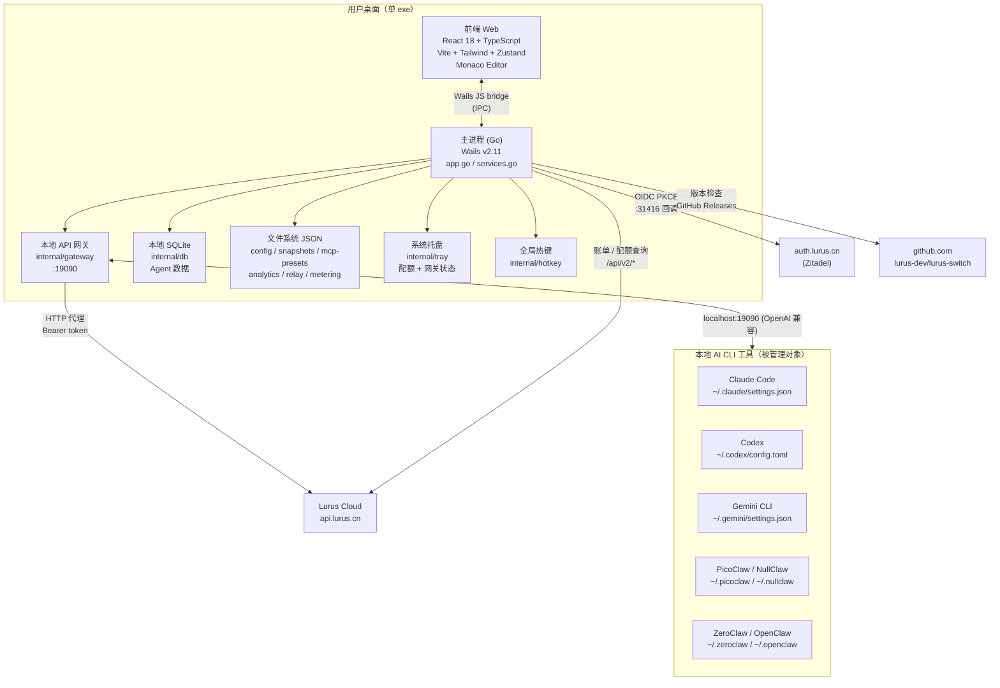
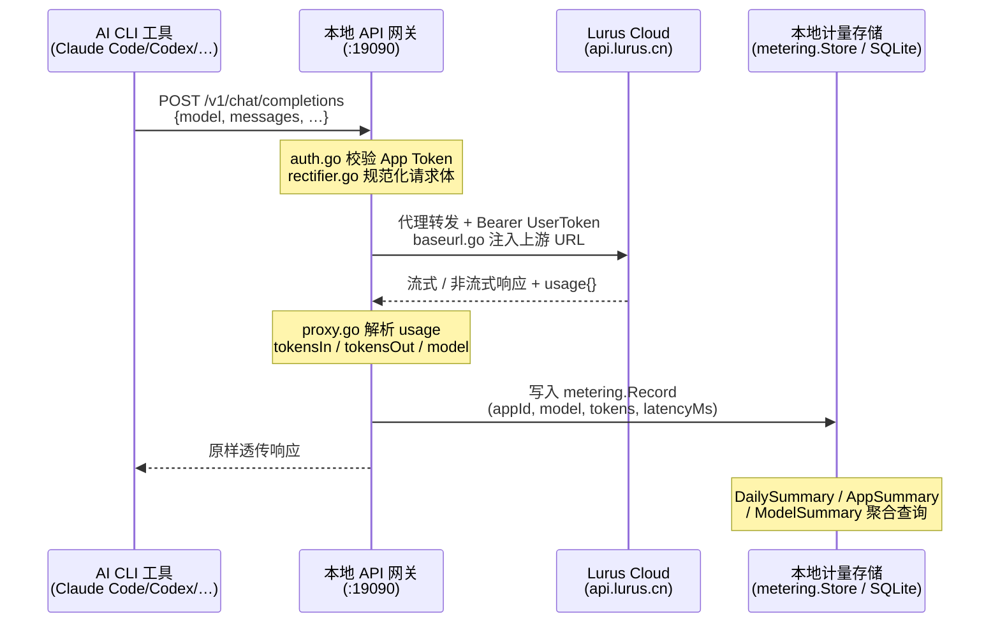
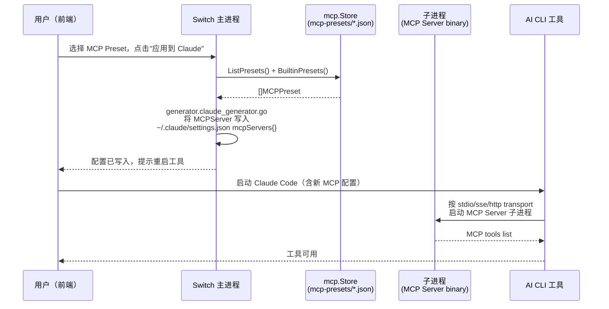

# Lurus Switch 内部手册

> 仅限内部员工查阅。包含运维细节、决策档案、未公开问题。

## 一句话定位

Lurus Switch 是一款面向开发者的桌面 AI 网关应用（Wails Go + React），统一管理本地 AI CLI 工具（Claude Code、Codex、Gemini CLI、PicoClaw、NullClaw、ZeroClaw、OpenClaw）的配置、安装与代理路由。它在本地运行一个轻量 API 网关，将工具请求转发到 Lurus Cloud（`api.lurus.cn`），并记录每一笔 Token 用量。无需 Kubernetes，单 exe 跨平台发行，是 C 端用户访问 Lurus 平台的首选桌面入口。

## 速查

| 项 | 值 |
|---|---|
| 仓库 | github.com/hanmahong5-arch/lurus-switch |
| 技术栈 | Go 1.25 + Wails v2.11 / React 18 + TypeScript + Bun |
| 发行方式 | GitHub Releases 自更新（`lurus-dev/lurus-switch`）|
| 部署目标 | 用户本机（Windows / macOS / Linux），无 K8s |
| 数据存储 | 本地 SQLite（`modernc.org/sqlite`）+ 本机文件系统 JSON |
| 关键依赖 | Lurus API Hub `api.lurus.cn/api/v2/*`，Zitadel OIDC PKCE（port 31416）|
| App 数据目录 | Windows: `%APPDATA%\lurus-switch\`，macOS: `~/Library/Application Support/lurus-switch/`，Linux: `~/.lurus-switch/` |
| 本地网关端口 | 19090（默认，可配置）|
| 版本注入 | `-ldflags "-X main.AppVersion=x.y.z"` |
| 内部环境变量 | `LURUS_SWITCH_INTERNAL_KEY`（网关令牌自动配置）|

## 架构图



## 核心数据流

### 数据流 1：用户请求 → 路由到模型 → 计费回写



### 数据流 2：MCP tool 调用



## 代码地图

| 路径 | 职责 |
|---|---|
| `main.go` | Wails 程序入口，注册 `App`，设置窗口、菜单 |
| `app.go` | Wails 生命周期（startup / shutdown），系统信息，工具安装检测 |
| `services.go` | 所有服务依赖的构造与注入（`newServices()`），懒初始化 billingClient |
| `internal/gateway/` | 本地 API 网关：HTTP 反代、请求规范化（rectifier）、fallback 逻辑、App Token 鉴权、metering 写入 |
| `internal/metering/` | 本地计量存储：`Record`（单次调用）、`DailySummary`、`AppSummary`、`ModelSummary`、`InsightsRaw` |
| `internal/serverctl/` | 嵌入式网关进程管理（legacy newapi 二进制，端口 19090，SQLite `newapi.db`）|
| `internal/mcp/` | MCP Preset 持久化（`mcp-presets/*.json`）+ 5 个内置 preset（filesystem、github、memory、sequential-thinking、postgres）|
| `internal/config/` | 各工具配置模型（claude/codex/gemini/picoclaw/nullclaw/zeroclaw/openclaw）|
| `internal/generator/` | 各工具配置文件生成器（JSON/TOML/Markdown）|
| `internal/installer/` | 工具安装管理（bun/npm/cargo 等运行时依赖）|
| `internal/packager/` | 配置打包为可执行文件（bun compile、rust binary、node pkg）|
| `internal/snapshot/` | 配置快照（Take / List / Restore / Diff，auto-save 上限 20 个）|
| `internal/promptlib/` | Prompt 模板库（本地存储）|
| `internal/analytics/` | 用户行为事件记录（JSONL，`analytics.jsonl`）|
| `internal/billing/` | Lurus Cloud 账单客户端（`/api/v2/user/info`、充值、订阅、兑换码）|
| `internal/relay/` | Relay 端点管理（lurus / third_party / custom），含健康检查 latency |
| `internal/auth/` | Zitadel OIDC PKCE 会话（AES-GCM 加密 token，存 `auth.enc`）|
| `internal/updater/` | 自更新（GitHub Releases），Windows BAT 延迟替换，校验文件 checksum |
| `internal/envmgr/` | API Key 扫描与更新（跨工具，脱敏显示 `xxxx****`）|
| `internal/toolhealth/` | 工具配置健康检查（green / yellow / red）|
| `internal/proxydetect/` | 系统代理自动检测（环境变量 + 系统注册表）|
| `internal/agent/` | Agent 实例管理（SQLite 持久化，process.Monitor 跟踪）|
| `internal/db/` | SQLite 数据库（`modernc.org/sqlite`，CGO-free）|
| `internal/tray/` | 系统托盘（配额百分比 badge + 网关运行状态）|
| `internal/hotkey/` | 全局热键（`golang.design/x/hotkey`，quick-switch + show-window）|
| `internal/gy/` | GY 产品套件启动器（web/service/desktop 三类，含 lurus-creator 查找与下载）|
| `frontend/src/pages/` | React 页面（Dashboard、ToolConfig、Billing、Relay、NewGateway、Agents、MCP 等 ~25 页）|
| `frontend/src/stores/` | Zustand 状态管理 |

## 部署（桌面应用发行）

Switch 不部署到 K8s，通过 GitHub Releases 发行。

### 构建命令

```bash
# 安装依赖
cd frontend && bun install && cd ..

# 开发热重载（Wails DevServer）
wails dev

# 生产构建 → build/bin/lurus-switch.exe（Windows）
wails build

# Debug 构建（含 DevTools）
wails build -debug

# 后端单元测试
go test -v ./...

# 前端测试
cd frontend && bun run test:run

# 完整测试套件（PowerShell）
./tests/run-tests.ps1
```

### CI 发布流程（lurus-dev/lurus-switch）

1. push tag `v*.*.*` 触发 GitHub Actions
2. 交叉编译：`wails build` for Windows x64、macOS arm64、Linux x64
3. 产物上传到 GitHub Release
4. Switch 客户端在 `startup()` 阶段后台调用 `refreshManifest()`，拉取 `toolmanifest` 获取最新版本信息
5. `SelfUpdater.CheckUpdate()` 对比版本号，有更新时通知前端；用户确认后调用 `ApplyUpdate()`
6. Windows 使用 `.update.bat` 延迟替换（因运行中 exe 被锁），替换完毕自动重启

### 版本注入

```bash
wails build -ldflags "-X main.AppVersion=1.2.3"
```

### 签名（已知坑见下文）

macOS 需 Developer ID + Notarization，Windows 需代码签名证书。自动更新流程依赖签名可信，否则 Gatekeeper / SmartScreen 会拦截替换后的 exe。

## 运行与配置

### 数据文件布局

```
%APPDATA%\lurus-switch\          （Windows）
├── app-settings.json            # 应用全局设置
├── proxy.json                   # Proxy / Relay 设置（APIEndpoint、UserToken）
├── auth.enc                     # AES-GCM 加密的 OIDC 令牌
├── analytics.jsonl              # 本地行为事件日志（JSONL）
├── snapshots/                   # 配置快照（按工具分目录）
│   ├── claude/
│   └── codex/
├── mcp-presets/                 # MCP Server preset（user-*.json）
├── prompts/                     # Prompt 模板库
├── relay/                       # Relay 端点配置
├── metering/                    # 本地 Token 计量（SQLite）
├── server/                      # 嵌入式网关（legacy）
│   ├── config.json
│   ├── .env
│   └── newapi.db                # 网关本地 SQLite
└── switch.db                    # Agent 数据（SQLite）
```

### 工具配置文件位置

| 工具 | 配置路径 |
|---|---|
| Claude Code | `~/.claude/settings.json` |
| Codex | `~/.codex/config.toml` |
| Gemini CLI | `~/.gemini/settings.json` |
| PicoClaw | `~/.picoclaw/config.json` |
| NullClaw | `~/.nullclaw/config.json` |
| ZeroClaw | `~/.zeroclaw/config.toml` |
| OpenClaw | `~/.openclaw/openclaw.json` |

### 认证优先级

Token 注入到 billingClient 的优先级：

1. **OIDC session gateway token**：Zitadel PKCE 登录后，AES-GCM 加密存储于 `auth.enc`，启动时自动加载
2. **手动 UserToken**：用户在 Proxy Settings 页面粘贴的 Bearer token

### 本地 API 网关

Switch 在本地运行一个轻量 HTTP 代理（`internal/gateway`），默认监听 `:19090`。工具将 `ANTHROPIC_BASE_URL` 或 `OPENAI_BASE_URL` 指向 `http://localhost:19090`，Switch 负责：

- 鉴权（App Token 校验，`internal/gateway/auth.go`）
- 请求体规范化（`rectifier.go`：统一 model 字段、清理 unsupported 参数）
- 上游 URL 注入（`baseurl.go`）
- Fallback 逻辑（`fallback.go`：主链路超时/限速后自动切换备用 upstream）
- 响应透传 + usage 解析 → metering 写入

#### 嵌入式 newapi 网关（legacy）

`internal/serverctl` 管理一个可选的 newapi 二进制子进程（下载自 GitHub Releases，存于 `%APPDATA%\lurus-switch\server\`），提供完整的 New-API 管理界面（GatewayPage 等）。健康检查路径：`GET /api/status`，启动超时 30 秒，shutdown 超时 10 秒。两套网关架构并存，新架构（`gateway.Server`）优先，legacy（`serverctl.Manager`）向后兼容。

## MCP 服务器管理

### 内置 Preset

| ID | 名称 | Transport | 描述 |
|---|---|---|---|
| `builtin-filesystem` | Filesystem | stdio | 本地文件读写 |
| `builtin-github` | GitHub | stdio | 仓库 / PR / Issue 访问（需 `GITHUB_PERSONAL_ACCESS_TOKEN`）|
| `builtin-memory` | Memory | stdio | AI 持久化 KV 记忆 |
| `builtin-sequential-thinking` | Sequential Thinking | stdio | 结构化推理 |
| `builtin-postgres` | PostgreSQL | stdio | 只读 PG 数据库访问 |

### 用户自定义 Preset

存储位置：`%APPDATA%\lurus-switch\mcp-presets\user-<hex8>.json`

MCPServer 支持三种 transport：
- `stdio`：最常见，`command + args + env` 启动子进程
- `sse`：Server-Sent Events，填 `url` 字段
- `http`：HTTP streaming，填 `url` 字段

### 应用 MCP 配置到工具

Switch 通过各工具的 generator（如 `claude_generator.go`）将 MCPServer 定义写入工具配置文件的 `mcpServers` 字段。写入后需重启对应工具才能生效。

> 注意：MCP Server 子进程由工具本身（如 Claude Code）启动和管理，Switch 不直接 spawn MCP 进程，仅负责配置写入。

## 成本监控与 Token 统计

### 本地计量层（`internal/metering`）

每次通过网关的 API 调用都会写入 `metering.Record`：

| 字段 | 说明 |
|---|---|
| `AppID` | 来源应用标识（注册在 `appreg.Registry`）|
| `Model` | 实际服务模型名 |
| `TokensIn` | 输入 token 数（从响应 usage 字段解析）|
| `TokensOut` | 输出 token 数 |
| `LatencyMs` | 端到端延迟 |
| `CachedHit` | 是否命中上游缓存 |
| `StatusCode` | HTTP 状态码 |

### 聚合视图

| 类型 | 字段 |
|---|---|
| `DailySummary` | 按天汇总：totalCalls、tokensIn/Out、cacheHits |
| `AppSummary` | 按 App 汇总 |
| `ModelSummary` | 按模型汇总 |
| `InsightsRaw` | 含 rateLimitEvents（429 计数）、errorEvents（5xx 计数）、avgLatencyMs |

### 云端配额同步

`billing.Client` 定期调用 `GET /api/v2/user/info` 获取 `Quota`、`UsedQuota`、`RemainingQuota`、`DailyQuota`、`DailyUsed`。系统托盘显示配额使用百分比，超阈值时 badge 变色。前端 BillingPage 提供充值（`CreateTopUp`）、订阅（`Subscribe`/`CancelSubscription`）、兑换码（`RedeemCode`）入口。

## 自动更新机制

```
SelfUpdater.CheckUpdate()
  └── GitHubChecker → GET https://api.github.com/repos/lurus-dev/lurus-switch/releases/latest
        └── 比较 tagName vs AppVersion（semver 字符串对比）
              ├── 有更新 → UpdateInfo{DownloadURL, LatestVersion}
              └── 离线 → UpdateAvailable=false，不阻塞启动

SelfUpdater.ApplyUpdate()
  ├── downloadFile(DownloadURL, currentExe+".new")
  ├── VerifyFileChecksum(checksum from release)        # 完整性校验
  ├── Windows: 写 .update.bat → cmd /c start /b
  │              bat: timeout 2s → del old → move new → start → del bat
  └── Unix: chmod 755 → os.Rename → exec.Command → os.Exit(0)
```

## 工具健康检查（`internal/toolhealth`）

`CheckAll()` 对所有已知工具执行静态配置校验，返回三级状态：

| 状态 | 含义 |
|---|---|
| `green` | 配置文件存在且关键字段完整 |
| `yellow` | 配置存在但关键字段缺失（如 API Key 为空）|
| `red` | 配置文件不存在或格式错误 |

具体规则：Claude 检查 `ANTHROPIC_API_KEY` 或 `ANTHROPIC_BASE_URL`；Codex 检查 `model` 字段；Gemini 检查 `model.name`；PicoClaw/NullClaw 检查 `model_list` 条目的 `api_base` 和 `model_name`。

## 已知坑（内部专属）

1. **`app.go` God Object（S1.2 计划拆分）**：所有 Wails 绑定方法都挂在 `App` 上，导致文件超长。新增功能请先在 `services.go` 中注册服务，再在 `app.go` 中添加最薄的 Wails 方法代理。

2. **Wails 跨平台 Build**：Windows 需安装 WebView2，macOS 需 Xcode Command Line Tools。CI 需要矩阵 build（3 个 runner）。Windows CGO 模式 Wails 强制使用，但 `modernc.org/sqlite` 是纯 Go 实现（CGO-free），两者不冲突。

3. **自动更新签名**：Windows 自更新使用 `.update.bat` 脚本，SmartScreen 会对未签名二进制显示警告。macOS Gatekeeper 会拦截未公证的替换文件。当前测试构建未签名，**生产发布必须配置代码签名证书**。

4. **MCP Server 子进程管理**：Switch 写入 MCP 配置后，MCP Server 由工具（如 Claude Code）以 stdio 子进程启动。如果 MCP Server 进程崩溃或卡死，由工具负责处理，Switch 无法直接感知。排查入口：查看工具自身日志或 `process.Monitor`。

5. **成本统计精度**：`tokensIn/Out` 依赖上游响应体中的 `usage` 字段，流式响应（SSE）中 usage 通常在最后一个 chunk。如果连接中断，usage 可能丢失，导致计量记录不完整。`InsightsRaw.RateLimitEvents` 只计数 HTTP 429，不覆盖应用层速率限制。

6. **本地 SQLite 数据迁移**：`internal/db` 使用 `modernc.org/sqlite`（纯 Go），schema 版本升级时需谨慎处理迁移。当前无自动 migrate 框架，DDL 变更需手动处理或在 `db.Open()` 中增加版本检查。Agent 数据（`switch.db`）和网关计量（`metering`）存储分离，迁移时需分别处理。

7. **OIDC 令牌刷新**：`auth.enc` 中的 OIDC token 过期后需重新登录。当前无后台静默刷新，token 过期会导致 billingClient 失效，触发 `resetBillingClient()` 后回退到手动 UserToken。

8. **系统代理检测（Windows）**：`internal/proxydetect/system_windows.go` 读取注册表 `HKCU\Software\Microsoft\Windows\CurrentVersion\Internet Settings`，需注意 PAC 脚本代理暂不支持。

9. **matchesPlatformAsset 只检查 Windows x64**：`github_checker.go` 中 `matchesPlatformAsset` 仅匹配 `windows` + `x64/amd64`，macOS / Linux 自动更新下载 URL 回退到 release HTML URL，需要用户手动下载。

## 决策档案

| 时间 | 决策 | 理由 |
|---|---|---|
| 2025-Q3 | 选 Wails v2 而非 Electron | 单 exe 发行，内存占用更低，Go 后端复用现有工具链 |
| 2025-Q3 | 本地 SQLite 使用 `modernc.org/sqlite`（纯 Go）| 避免 CGO 跨平台编译复杂性；Wails 本身已强制 CGO，但 DB 层保持独立 |
| 2025-Q4 | 双网关架构（`gateway.Server` + `serverctl.Manager` legacy）| 新架构渐进替换，旧 newapi 二进制提供完整管理 UI，新架构专注计量与代理 |
| 2026-Q1 | OIDC PKCE 认证（Zitadel，port 31416）| 统一 Lurus 平台身份，无需用户手动管理 API Key；gateway token 自动注入 |
| 2026-Q1 | analytics 用 JSONL 而非 SQLite | 写入简单（append-only），无需 schema，方便日志轮转；Agent 数据才上 SQLite |

## TODO / Roadmap

- [ ] S1.2：拆分 `app.go` God Object，按模块拆出 Wails handler 层
- [ ] macOS / Linux 自动更新下载支持（`matchesPlatformAsset` 扩展）
- [ ] macOS 代码签名 + Notarization CI 流程
- [ ] MCP Server 进程存活监控（Switch 主动 ping stdio server）
- [ ] 成本统计：流式响应 usage 丢失时的补偿机制（延迟轮询 upstream）
- [ ] SQLite schema 版本管理（自动 migrate）
- [ ] OIDC token 后台静默刷新
- [ ] analytics.jsonl 日志轮转（按大小或日期）

## 应急 Runbook（10 分钟版）

### App 启动崩溃

Switch 是桌面应用，无 K8s，崩溃时：

```bash
# 1. 查看 stderr 日志（Wails 开发模式会输出到终端）
# 生产模式日志输出到 app-data 目录下（如有 log 文件）

# 2. 检查 app-data 目录是否可写
ls %APPDATA%\lurus-switch\

# 3. 检查 SQLite 是否损坏（见"本地数据损坏"章节）

# 4. 启动时 warnings 会打印到 stderr：
# "Warning: config store: ..."
# "Warning: database: ..."
# 按提示逐一排查

# 5. 万能修复：备份 app-data 目录后删除，让 app 重新初始化
mv %APPDATA%\lurus-switch %APPDATA%\lurus-switch.bak
# 重新启动 Switch，所有状态重置为默认
```

### 模型不响应（工具调用超时）

```bash
# 1. 确认本地网关在运行
# 前端 NewGatewayPage 查看 gateway status
# 或检查 app-data/server/ 下是否有 newapi.db

# 2. 测试本地网关健康
curl http://localhost:19090/api/status

# 3. 检查上游连通性
curl -H "Authorization: Bearer <UserToken>" https://api.lurus.cn/api/v2/user/info

# 4. 检查工具配置中 base URL 是否指向本地网关
cat ~/.claude/settings.json | grep -i "base_url\|ANTHROPIC_BASE_URL"

# 5. 检查配额是否耗尽
# 前端 BillingPage → 配额剩余
# 或 curl https://api.lurus.cn/api/v2/user/info

# 6. 检查 relay 健康（RelayPage）
# 切换到备用 relay endpoint

# 7. 工具健康检查（前端 ToolConfigPage 或命令行）
# Switch 执行 toolhealth.CheckAll() 并在 dashboard 显示
```

### 本地数据损坏

```bash
# SQLite 损坏（switch.db 或 newapi.db）
# 症状：app 启动打印 "database: ..." warning，Agent / Gateway 功能异常

# 方案 A：仅重置损坏的 db（Agent 数据丢失，其余配置保留）
del %APPDATA%\lurus-switch\switch.db
del %APPDATA%\lurus-switch\server\newapi.db
# 重启 Switch，db 会重新创建

# 方案 B：完整重置（所有本地状态清零）
mv %APPDATA%\lurus-switch %APPDATA%\lurus-switch.bak-<date>
# 重启 Switch

# JSON 文件损坏（config / snapshot / mcp-presets）
# 直接删除对应文件，Switch 会以默认值重建
del %APPDATA%\lurus-switch\app-settings.json
del %APPDATA%\lurus-switch\proxy.json
```

### MCP Server 卡死

```bash
# MCP Server 由 AI CLI 工具管理，Switch 不直接控制进程
# 排查步骤：

# 1. 在任务管理器 / Activity Monitor 找到 MCP 进程（如 node, npx）
# 2. 强制终止该进程
taskkill /F /IM node.exe   # Windows，注意会终止所有 node 进程

# 3. 重启 AI CLI 工具（如 Claude Code）

# 4. 如果某个 MCP Server preset 持续导致问题，从 Switch 中删除该 preset：
# 前端 ToolConfigPage → MCP 管理 → 删除 preset
# 或手动删除文件：
del "%APPDATA%\lurus-switch\mcp-presets\user-<hex8>.json"

# 5. 如果内置 preset 有问题（如 builtin-filesystem 路径不当）
# 在 Switch 前端重新配置 args（如修改 /tmp 为实际工作目录）
```

### 自动更新失败

```bash
# Windows：.update.bat 执行失败
# 症状：Switch 退出后没有重启，或启动的是旧版本

# 1. 检查 %APPDATA% 或 exe 目录下是否有 .update.bat 残留
dir "C:\Program Files\lurus-switch\*.bat"
# 手动删除残留 bat 文件

# 2. 检查 .new 文件是否存在（下载成功但替换失败）
dir "C:\Program Files\lurus-switch\*.new"
# 手动 rename：del lurus-switch.exe && ren lurus-switch.exe.new lurus-switch.exe

# 3. 手动下载最新版本
# https://github.com/lurus-dev/lurus-switch/releases/latest
# 替换 exe 文件，重新启动

# 4. 检查 checksum 校验失败原因（网络截断导致文件不完整）
# 重新触发更新：Settings → 检查更新
```
