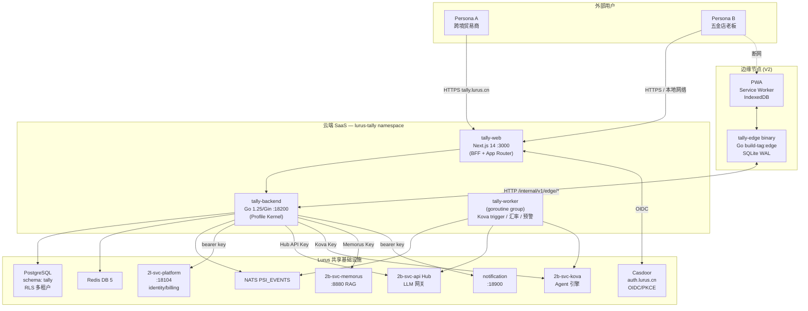
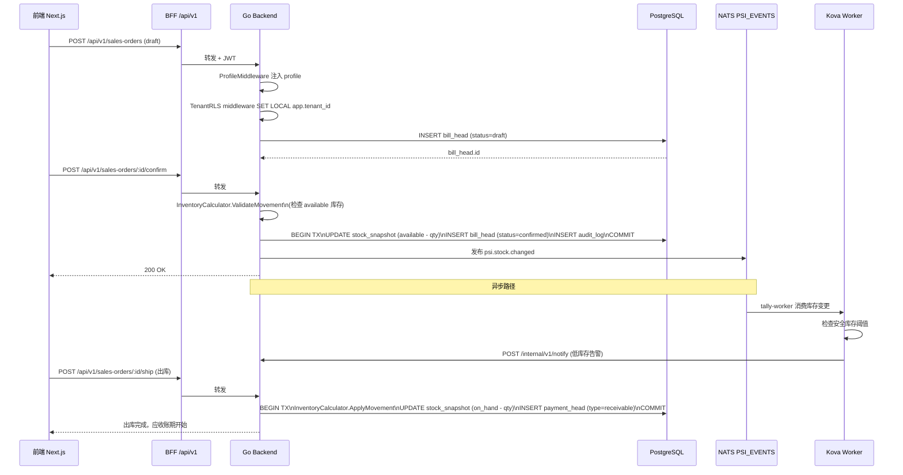
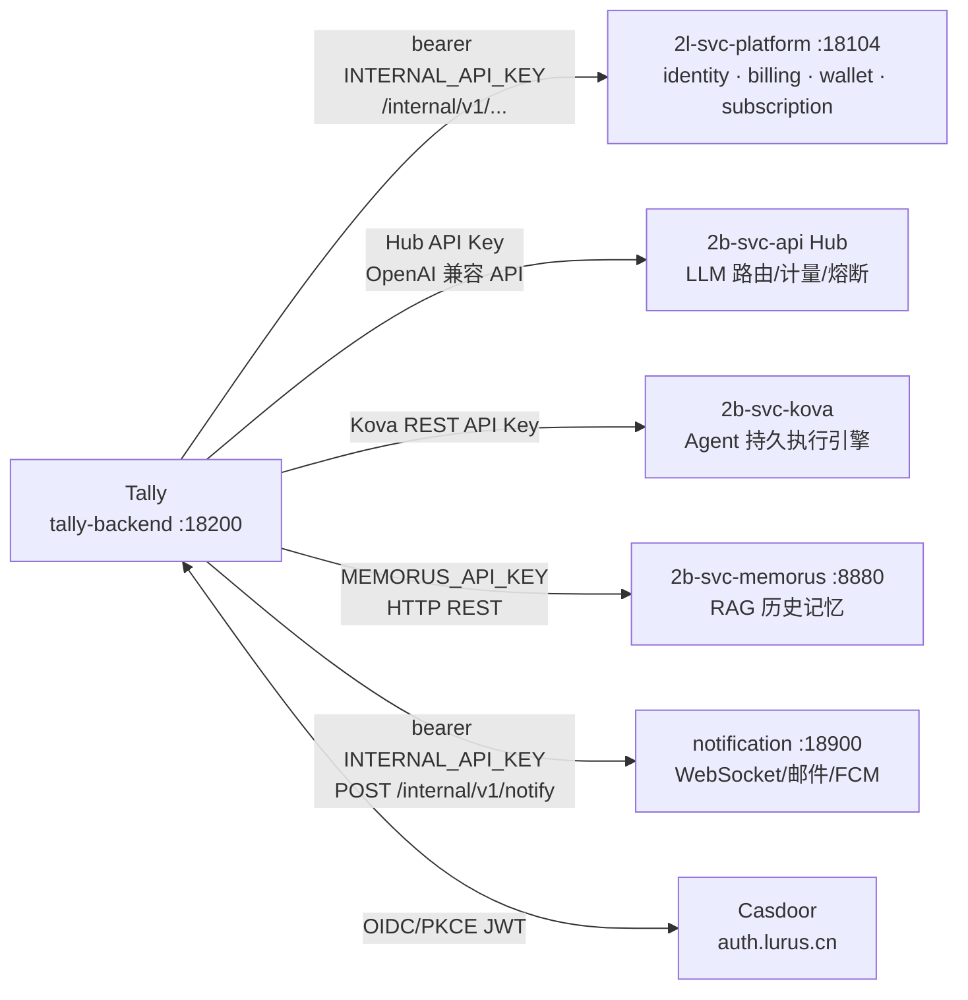
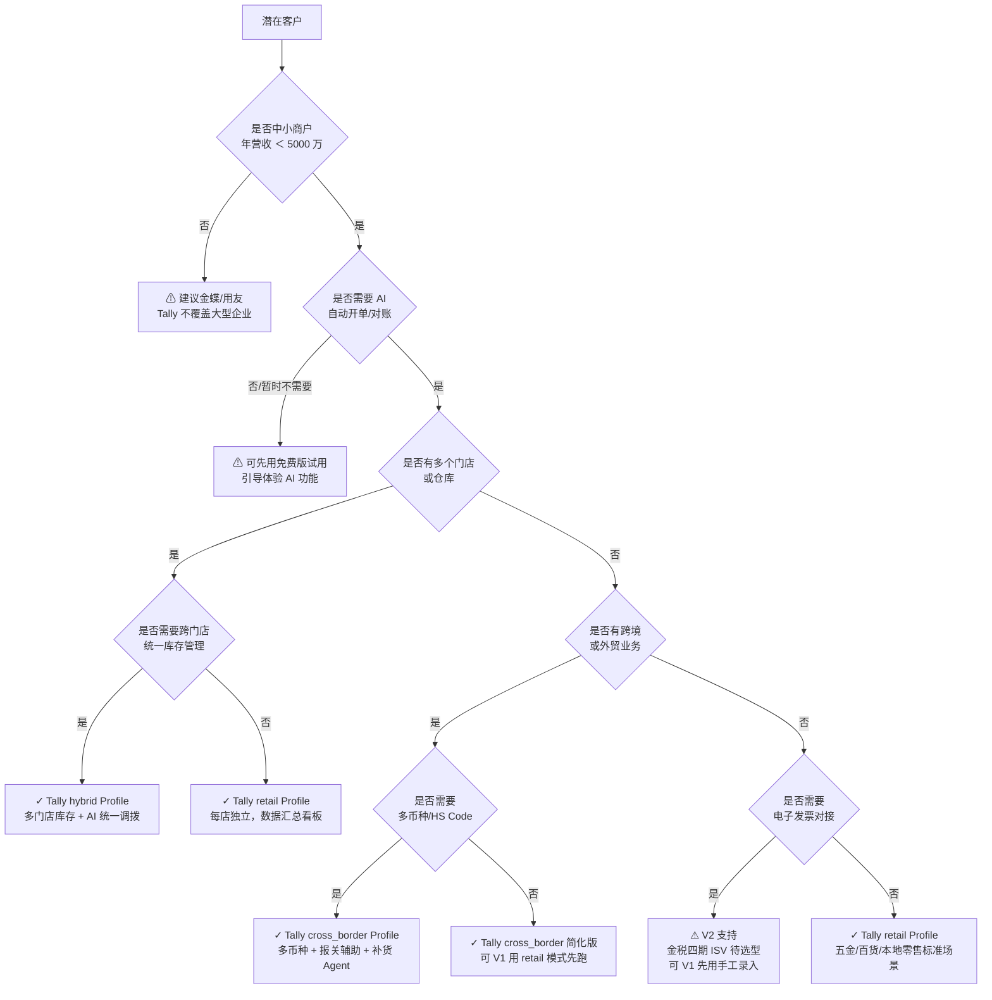
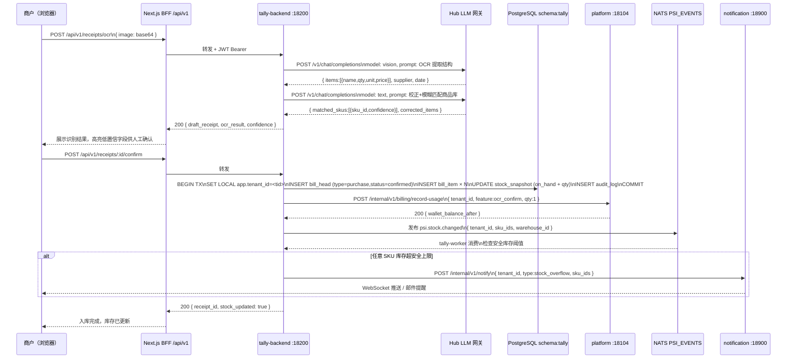
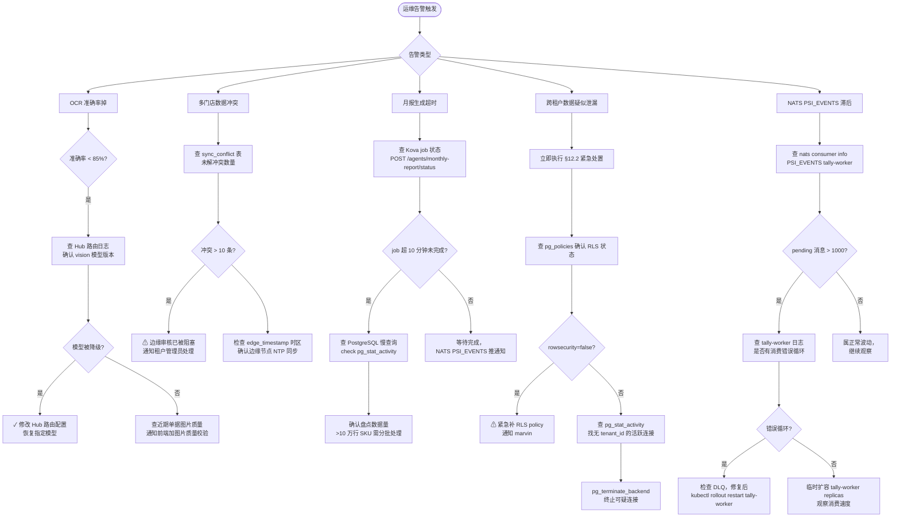

# Lurus Tally 内部员工手册

<div class="lurus-callout lurus-callout--tip"><span class="lurus-callout__icon"><Icon name="check-circle" :size="18"/></span><div><p class="lurus-callout__title">2026-05-28 状态更新</p><div class="lurus-callout__body">stage（R6），Epic 1 done，Billing 待 R6 部署；tally-mcp 仍 alpha。</div></div></div>

<div class="lurus-callout lurus-callout--info"><span class="lurus-callout__icon"><Icon name="lock" :size="18"/></span><div><p class="lurus-callout__title">仅限内部</p><div class="lurus-callout__body">仅限内部员工查阅。包含运维细节、决策档案、已知坑、未公开风险。</div></div></div>

<p><span class="lurus-tag">P0</span> <span class="lurus-tag lurus-tag--muted">beta · stage</span> <RiskBadge flag="wip" /></p>

<div class="lurus-stat-strip">
  <div class="lurus-stat"><span class="lurus-stat__value">18200</span><span class="lurus-stat__label">后端端口</span></div>
  <div class="lurus-stat"><span class="lurus-stat__value">12</span><span class="lurus-stat__label">Migration head</span></div>
  <div class="lurus-stat"><span class="lurus-stat__value">6</span><span class="lurus-stat__label">复用 Platform 能力</span></div>
  <div class="lurus-stat"><span class="lurus-stat__value">3</span><span class="lurus-stat__label">行业 Profile</span></div>
</div>

---

## 一句话定位

Lurus Tally 是一款 AI-native 智能进销存 SaaS，通过**行业 Profile 机制**用一套代码同时服务"跨境贸易商"和"五金店老板"两个极端场景。它深度复用 Lurus Platform 已有的 identity / billing / llm-inference / memory / agent-execution / notification 六大能力，目标是让传统进销存软件在 AI 时代失去存在理由。

产品属于 Platform 产品组（P0）。订阅收入、AI 调用量、客户数据全部纳入 Platform 产品线统一管理。

---

## 速查

| 项 | 值 |
|---|---|
| 仓库 | github.com/hanmahong5-arch/lurus-tally（待创建） |
| 镜像（后端）| `ghcr.io/hanmahong5-arch/lurus-tally-backend:main-<sha7>` |
| 镜像（前端）| `ghcr.io/hanmahong5-arch/lurus-tally-web:main-<sha7>` |
| 域名 prod | tally.lurus.cn |
| 域名 stage | tally-stage.lurus.cn |
| 端口 | 后端 18200，前端 3000（Next.js） |
| 命名空间 | `lurus-tally` |
| DB schema | `tally`（lurus-pg-rw） |
| Redis DB | 5 |
| NATS stream | `PSI_EVENTS` |
| Migration head | 12（27 张表 + 1 MV + 11 RLS policies）；计划扩展到 migration 000021 |
| 关键依赖 | platform :18104 · Hub · Kova · Memorus :8880 · notification :18900 · Casdoor |
| 部署目标 | Stage → R6（43.226.38.244）；Prod → R1（100.98.57.55，满足毕业门槛后） |
| 源码目录 | `2b-svc-psi/` |

---

## 章节目录

1. [产品定位与 Persona](#1-产品定位与-persona)
2. [架构全景](#2-架构全景)
3. [行业 Profile 机制](#3-行业-profile-机制)
4. [数据模型与多租户 RLS](#4-数据模型与多租户-rls)
5. [库存计算引擎](#5-库存计算引擎)
6. [6 大 Platform 能力集成](#6-6-大-platform-能力集成)
7. [代码借鉴与许可证策略](#7-代码借鉴与许可证策略)
8. [MVP 范围与 Defer 清单](#8-mvp-范围与-defer-清单)
9. [部署策略与上线门槛](#9-部署策略与上线门槛)
10. [代码地图](#10-代码地图)
11. [已知坑与待定选型](#11-已知坑与待定选型)
12. [应急 Runbook](#12-应急-runbook)

---

## 1. 产品定位与 Persona

### 1.1 双场景双 Persona

Tally 不是"两套产品"，而是通过 **Profile 机制**切换同一套代码的 UI 布局、默认值、工作流节点和 AI 提示词模板。

| 维度 | Persona A — 跨境贸易商（cross_border） | Persona B — 五金/本地零售（retail） |
|---|---|---|
| 典型规模 | 10-200 人；抖店 + 批发双渠道 | 1-5 人；夫妻店 |
| SKU 数 | 千级，标准化条码 | 万级长尾，多数无条码 |
| 计量单位 | 件/箱/托；标准换算 | 件+斤+米+散装混用 |
| 单笔耗时 | 分钟到小时（拣货+审核+发货） | 5-30 秒（柜台直接交易） |
| 核心 AI 痛点 | 跨境补货预测、动态定价、多渠道分配 | 规格模糊匹配、熟客记忆、日报整理 |
| 断网需求 | 无（默认在线） | 必须支持（PWA 离线，V2 实现） |
| 付费容忍 | ¥500-5000/月 | ¥99-300/年或买断 |

第三种 Profile：`hybrid`（跨境+零售混营企业），UI 密度介于两者之间，功能并集展示，高级字段折叠。

### 1.2 差异化护城河

- **⌘K Command Palette**：所有高频操作 100ms 内可触达，无需记菜单路径
- **AI 助手 Drawer**：右侧侧滑 Drawer，流式返回自然语言查询结果（"老张欠了多少？"→实时表格+分析）
- **Kova 补货 Agent**：每日 09:00 运行，基于历史销量+库存水位+lead time 生成补货建议卡片，用户一键采纳跳转预填采购单
- **多渠道库存分配**：V1 预留 `channel_id` 模型，V2 对接抖店/拼多多 OAuth
- **金税四期 AI 巡检**：V2，ISV 选型待定

### 1.3 六个月成功指标（MVP）

| 指标 | 目标 |
|---|---|
| Lighthouse CB 客户 | ≥ 3（M3 内部 dogfood） |
| Lighthouse 零售客户 | ≥ 5（M3 五金/百货） |
| Stage 付费客户总计 | ≥ 30（M6 MVP β） |
| AI 助手日活查询 | ≥ 每用户 2 次/天 |
| 补货建议采纳率 | ≥ 40% |
| 零售首次上手时间 | < 5 分钟 |
| 跨境首次开单时间 | < 10 分钟 |
| 月客户留存率 | ≥ 85% |

---

## 2. 架构全景

### 2.1 系统拓扑



### 2.2 核心数据流：销售单 → 出库 → 应收



### 2.3 认证与多租户注入链路

每个请求经过三层中间件，顺序不可颠倒：

```
请求 → [JWT 验证 auth middleware]
      → [TenantRLS middleware: SET LOCAL app.tenant_id=&lt;from JWT&gt;]
      → [ProfileMiddleware: 查 tenant_profile 表（5min TTL 缓存），注入 ctx]
      → [Handler]
```

RLS 在 PostgreSQL 侧自动过滤，Go 层无需在任何查询里手写 `WHERE tenant_id=?`。

---

## 3. 行业 Profile 机制

### 3.1 架构设计原则

Profile 只影响展示层和行为规则，不分叉 API URL，不分叉业务逻辑代码路径。

| 影响范围 | 说明 |
|---|---|
| UI 渲染 | 字段/模块可见性，通过前端 `useProfile().isEnabled(feature)` 控制 |
| 字段默认值 | measurement_strategy、货币、税率、必填字段集合 |
| 业务规则 | 库存计算策略（FIFO/WAC）、审批流（零售跳过）、单据类型 |
| AI 提示词模板 | cross_border 和 retail 各有独立查询类型分支 |
| 不影响 | DB 核心表结构、RBAC 权限、RLS 隔离粒度 |

### 3.2 Profile 存储

```sql
-- migration 000013
-- tally.tenant_profile — 每个租户一行
profile_type     VARCHAR(20)  -- 'cross_border' | 'retail' | 'hybrid'
inventory_method VARCHAR(20)  -- 'fifo' | 'wac' | 'by_weight' | 'batch' | 'bulk_merged'
custom_overrides JSONB        -- {"default_tax_rate":0.13,"enable_pos":true,...}
```

### 3.3 Go 侧 ProfileResolver

`internal/app/profile/resolver.go` 实现 `Profile` interface，含五个方法：`Type()`、`InventoryMethod()`、`IsEnabled(feature)`、`RequiredBillFields()`、`UIFeatures()`。使用 `sync.Map` 内存缓存（TTL 5min），避免每次请求查库。

ProfileMiddleware 挂载在所有已认证路由，顺序：auth → tenant_rls → profile → handler。

### 3.4 Profile 切换规则

- 租户创建后 **90 天内**可免费切换一次，切换不删数据
- 90 天后切换走订阅变更流程
- 切换仅改 `tenant_profile.profile_type`，所有历史数据保持不变

---

## 4. 数据模型与多租户 RLS

### 4.1 总体说明

- **DB 连接**：`lurus-pg-rw.database.svc:5432`，schema: `tally`
- **金额精度硬约束**：所有货币字段 `NUMERIC(18,4)`，汇率 `NUMERIC(20,8)`，Go 侧全程 `github.com/shopspring/decimal`，禁止 `float64`
- **库存数量存储单位**：统一 base_unit，换算在应用层完成，不在数据库触发器

### 4.2 RLS 标准模板

```sql
ALTER TABLE tally.<table> ENABLE ROW LEVEL SECURITY;
CREATE POLICY <table>_rls ON tally.<table>
    USING (tenant_id = current_setting('app.tenant_id')::UUID);
```

`current_setting('app.tenant_id')` 未设置时 PostgreSQL 抛异常，不会静默返回全表数据。

### 4.3 Migration 路线图

| Migration | 内容 | 状态 |
|---|---|---|
| 000001–000012 | 27 张表 + 1 MV + 11 RLS（v1 骨架） | 已完成 |
| 000013 | `tenant_profile` + RLS | 待实施 |
| 000014 | `unit_def` + `product_unit` + RLS | 待实施 |
| 000015 | `product` 加 `measurement_strategy`、`default_unit_id`、`attributes` 列 + GIN 索引 | 待实施 |
| 000016 | `bill_head`/`bill_item`/`payment_head` 各加 4 列（origin/sync_status/edge_node_id/edge_timestamp） | 待实施 |
| 000017 | `edge_node` 表 + RLS + `bill_head` FK | 待实施 |
| 000018 | `sync_conflict` 表 + RLS | 待实施 |
| 000019 | `currency` + `exchange_rate` + partner/bill_head 多币种字段 | 待实施 |
| 000020 | GIN 索引补建（attributes / custom_overrides / settings） | 待实施 |
| 000021 | 补全所有漏出 RLS policy | 待实施 |

### 4.4 核心表关系速查

```
tenant (1) ──── (1) tenant_profile
tenant (1) ──── (N) partner (供应商/客户)
tenant (1) ──── (N) warehouse
tenant (1) ──── (N) product (SPU)
product  (1) ──── (N) product_sku (SKU)
product_sku (N) ──── (N) product_unit (多单位换算)
bill_head (1) ──── (N) bill_item        ← 核心单据
bill_head (N) ──── (N) payment_head     ← 应收/应付
product_sku ──── stock_snapshot (实时库存快照，唯一写入入口: InventoryCalculator)
```

### 4.5 商品计量策略（measurement_strategy）

| 策略 | 场景 | 示例 |
|---|---|---|
| `individual` | 标准件计数（默认） | 手机、服装 |
| `weight` | 散装称重 | 螺丝散装（克/斤/千克） |
| `length` | 按长度出售 | 钢管（米）、电缆 |
| `volume` | 按体积出售 | 液体（升） |
| `batch` | 批次+有效期（FEFO） | 食品、医药 |
| `serial` | 序列号追踪（贵重品） | 手机 IMEI、设备 SN |

`alt_units` JSONB 支持最多 5 个换算单位，例：`[{"unit":"斤","ratio":500},{"unit":"千克","ratio":1000}]`。

### 4.6 离线字段约束（V1 建立，V2 使用）

所有单据主表在 V1 必须包含以下字段，不允许 V2 破坏性变更：

```sql
origin        VARCHAR(10)   -- 'cloud' | 'edge'
sync_status   VARCHAR(20)   -- 'synced' | 'pending' | 'conflict'
edge_node_id  UUID          -- FK → edge_node.id（可 NULL）
edge_timestamp TIMESTAMPTZ  -- 边缘节点本地 UTC 时间戳，用于冲突裁决
```

---

## 5. 库存计算引擎

### 5.1 Strategy Pattern 设计

所有库存变动（采购入库、销售出库、调拨、盘点差异）必须通过 `InventoryCalculator.ApplyMovement` 接口，**禁止直接 UPDATE stock_snapshot**。

```
InventoryCalculator interface
├── WACCalculator     — 移动加权平均（retail/hybrid 默认）
├── FIFOCalculator    — 先进先出，依赖 stock_lot 批次队列（cross_border 默认）
├── ByWeightCalculator — 散装称重，精度 0.001kg（measurement_strategy=weight）
├── BatchCalculator   — 批次独立追踪，FEFO（measurement_strategy=batch）
└── BulkMergedCalculator — 同规格散装跨批次合并（measurement_strategy=bulk_merged）
```

Calculator 选择由 `calculator_factory.go` 根据 `Profile.InventoryMethod()` + `product.measurement_strategy` 两维度决定，handler 层无感知。

### 5.2 六状态库存模型（借鉴 GreaterWMS）

```
在手 (on_hand)
  ├── 可用 (available) = on_hand - 预占
  ├── 预占 (reserved)  — 已确认销售单，未出库
  └── 冻结 (frozen)    — 盘点中锁定
在途 (in_transit)       — 已提交采购单，货未到仓
损坏 (damaged)          — 入库时发现破损
```

### 5.3 WAC 公式

```
new_avg_cost = (current_on_hand × current_avg_cost + new_qty × new_price)
               / (current_on_hand + new_qty)
```

出库时以当前 avg_cost 计算出库成本，无需遍历历史流水（jshERP 的做法会随数据量劣化，Tally 改为维护快照）。

---

## 6. 6 大 Platform 能力集成



| 能力 | 提供者 | Tally 使用方式 | 节省建设成本估算 |
|---|---|---|---|
| identity | 2l-svc-platform :18104 | 账户/钱包/订阅/权益，`/internal/v1/*` bearer key | 6-12 个月 |
| billing | platform（同上）| 进销存订阅 + AI 调用按量计费 | 含在 identity |
| llm-inference | Hub（api.lurus.cn）| 所有 LLM 调用走 Hub，Hub 负责路由/计量/熔断 | 3-6 个月 |
| memory | Memorus :8880 | retail：记录客户购买历史；cross_border：B2B 采购偏好 RAG | 3-6 个月 |
| agent-execution | Kova REST :3002 | 补货 Agent、滞销预警 Agent 注册与触发 | 6-9 个月 |
| notification | notification :18900 | 库存预警、补货建议、单据状态推送 | 1 个月 |
| auth | Casdoor (auth.lurus.cn) | OIDC/PKCE，Next.js BFF callback，JWT 验证 | 2-3 个月 |

### 6.1 Kova 补货 Agent 工作流

```
每日 09:00 UTC (tally-worker)
  → 读 stock_snapshot (on_hand < safety_stock × 1.5)
  → 按 profile_type 选分析模板:
      cross_border: 近 90 天销量 + lead_time + 季节性系数
      retail:       近 30 天出货 + 当前库存水位（简化）
  → POST kova-rest /agents/replenishment/trigger
  → Kova 执行 Agent，结果写回 agent_recommendations 表
  → 发布 psi.recommendation.created 到 NATS
  → tally-worker 消费 → POST notification /internal/v1/notify
  → 前端 Dashboard 待办卡片出现
```

V1 限制：Agent 只做建议，不自动提交采购单。用户"采纳"后跳转预填采购单，需手动确认。

### 6.2 Memorus 客户记忆（retail 场景）

每次出货时向 Memorus 写入：`customer_id + product_list + qty + date`。AI Drawer 查询"老张上次买什么"时从 Memorus 检索最近 10 次购买记录，返回前 3 条高置信命中。

### 6.3 Hub 自然语言查询

**跨境专属**：多币种应收汇总、HS Code 缺失预警、清关状态追踪
**零售专属**：熟客欠款、规格模糊匹配、日营业额日报
**共享**：库存状态、低库存预警、滞销商品、月报生成

V1 边界：AI 不直接执行任何写操作，只建议+跳转预填表单。

### 6.4 计费分层

- 基础订阅通过 Platform 订阅体系（月付/年付），Tally 调 `/internal/v1/subscribe`
- AI 调用按量计费：每次 Hub LLM 调用、Kova Agent 执行均计量；超出套餐扣钱包余额
- retail Profile：年付低价套餐（¥99-300/年）
- cross_border Profile：月付中高价套餐（¥500-5000/月）

---

## 7. 代码借鉴与许可证策略

### 7.1 许可证白名单（可借鉴）

| 项目 | License | 借鉴内容 |
|---|---|---|
| **jshERP** | Apache-2.0 | 核心单据模型（bill_head/bill_item 通用主-子表抽象）、RBAC、审计日志 schema；jshERP 的 `depot_head + depot_item` 是验证过的极简设计，直接转换为 PostgreSQL DDL |
| **GreaterWMS** | Apache-2.0 | WMS 六状态库存模型、ASN/货位/拣货单 schema，补充 jshERP 缺少的仓储模块 |
| **Apache OFBiz** | Apache-2.0 | 设计模式参考（Product/SKU 分层、多单位换算思路），不抄代码只参考概念 |
| **MedusaJS v2** | MIT | 前端 Headless inventory 架构参考，`/pos` 路由独立渲染模式借鉴 |
| **shadcn/ui + Radix** | MIT | UI 组件库（Command Palette、Sheet、Table、Form） |

**合规要求**：所有衍生代码需保留原 LICENSE 文件，汇总在 `THIRD_PARTY_LICENSES/`，README 有致谢段落。

### 7.2 许可证红榜（永久禁止引入）

| 项目/类别 | 禁止原因 |
|---|---|
| **GPL-2.0 / GPL-3.0** 系列（赤龙ERP、盒木ERP、点可云、ERPNext） | GPL 具有传染性，引入后整个项目须开源，与商业 SaaS 模式根本冲突 |
| **LGPL-3.0**（Odoo Community） | LGPL 动态链接在 SaaS 部署模式下存在合规争议，风险不可接受 |
| **JeecgBoot 附加禁制** | 原始 Apache 许可证之上附加了"禁止用于竞品开发"条款，进销存正是竞品，违反即构成侵权 |
| **Vendure v3+** | v3 改为 GPL + 商业授权双轨，GPL 传染性问题同上 |
| **Finer 进销存** | Apache 基础上附加禁制条款，与 JeecgBoot 同类问题 |
| **AGPL 系列** | 网络使用也算分发，SaaS 部署必须开源全部源码，商业不可行 |

> 规则：引入任何第三方库前必须查 LICENSE 文件原文，不得仅凭 GitHub 标签判断。附加条款比主许可证危险。

---

## 8. MVP 范围与 Defer 清单

### 8.1 V1 包含（双 Profile Web SaaS）

- cross_border + retail Profile 基础流程（进货/出货/库存/财务台账）
- Profile 机制：DB 默认值 + UI 布局切换 + AI 提示词模板
- 商品模型：measurement_strategy + alt_units + attributes JSONB + origin/sync_status 字段
- POS 模式（retail，Web 端，**无离线**）
- Hub 自然语言查询（双 Profile 各自查询模板）
- Kova 补货 Agent V1（建议级，双 Profile 分别触发）
- 多币种字段预留（cross_border 场景手工录入，V1 不做汇率自动更新）
- Platform 订阅接入（Story 10.1 已完成，待部署）

### 8.2 Defer V2

| 功能 | Defer 原因 |
|---|---|
| PWA 离线模式（IndexedDB + Service Worker）| 技术复杂度高，需独立验证离线/同步/冲突解决 |
| 边缘节点 Backend（tally-edge binary）| 同上；SQLite vs PostgreSQL 兼容需充分测试 |
| 离线同步与冲突解决 UI | 依赖边缘节点完成 |
| 多币种汇率自动更新（接入 PBoC/ExchangeRate-API）| V1 汇率滞后 ≤24h 需人工操作，可接受 |
| 汇兑损益计算和报表 | 依赖汇率自动化 |
| 金税四期 ISV 对接 | ISV 选型未定（航信/百望云/诺诺），需先完成选型 |
| 多渠道库存 API 同步（抖店/拼多多）| 需 OAuth 接入，V1 先留 channel_id 字段 |

### 8.3 永远不做

生产 BOM/MES、HR/工资/考勤、CRM 销售过程管理、区块链/NFT、总账科目/凭证（引导至金蝶/用友）、独立移动 APP（响应式 Web + PWA 替代）、零售会员积分（V3 评估）。

---

## 9. 部署策略与上线门槛

### 9.1 环境对应

| 环境 | 服务器 | 域名 | 准入条件 |
|---|---|---|---|
| Stage | R6 `43.226.38.244`（三丰云 32c/32G/300G SSD） | tally-stage.lurus.cn | CI 全绿 + 无 mock 数据 |
| Prod | R1 `100.98.57.55`（三丰云 16c/32G 50Mbps） | tally.lurus.cn | 见 §9.2 毕业门槛 |

### 9.2 R1 Prod 毕业门槛（三个缺一不可）

<div class="lurus-callout lurus-callout--key"><span class="lurus-callout__icon"><Icon name="shield-check" :size="18"/></span><div><p class="lurus-callout__title">三个门槛缺一不可</p><div class="lurus-callout__body"><ul><li><strong>Stage 稳定运行 ≥ 30 天</strong>，无数据事故，无 P1/P2 级 Bug 积压</li><li><strong>≥ 5 个早期客户验证</strong>，其中至少 2 个是真实付费客户</li><li><strong>零数据安全事故</strong>：无 RLS 绕过记录，无跨租户数据泄露</li></ul></div></div></div>

1. **Stage 稳定运行 ≥ 30 天**，无数据事故，无 P1/P2 级 Bug 积压
2. **≥ 5 个早期客户验证**，其中至少 2 个是真实付费客户
3. **零 数据安全事故**：无 RLS 绕过记录，无跨租户数据泄露

```bash
# Stage 部署检查
ssh root@43.226.38.244 "kubectl get pods -n lurus-tally"
ssh root@43.226.38.244 "kubectl rollout history deployment/tally-backend -n lurus-tally"
```

### 9.3 CI/CD 流程

```
push main
  ↓
GitHub Actions .github/workflows/ci.yaml
  → go test -race ./...（26 packages）
  → golangci-lint run
  → bun run typecheck && bun run lint
  → bun next build
  ↓
.github/workflows/release.yaml
  → docker build → ghcr.io/hanmahong5-arch/lurus-tally-backend:main-<sha7>
  → docker build web → ghcr.io/hanmahong5-arch/lurus-tally-web:main-<sha7>
  ↓
ArgoCD auto-sync → lurus-tally namespace
```

### 9.4 关键环境变量

| 变量 | 用途 | 缺失时行为 |
|---|---|---|
| `DATABASE_DSN` | PostgreSQL 连接 | 启动 fail-fast |
| `REDIS_URL` | Redis DB 5 | 启动 fail-fast |
| `NATS_URL` | NATS JetStream | 启动 fail-fast |
| `PLATFORM_BASE_URL` | 默认 `http://platform-core.lurus-platform.svc:18104` | 空时 billing 路由返回 501 |
| `PLATFORM_INTERNAL_KEY` | Platform bearer key | 空时 billing 路由返回 501 |
| `HUB_API_KEY` | Hub LLM 网关 | 空时 AI 功能返回 503 |
| `KOVA_API_KEY` | Kova Agent 引擎 | 空时 Agent 功能返回 503 |
| `MEMORUS_API_KEY` | Memorus RAG | 空时 memory 功能降级 |
| `EXCHANGE_RATE_API_KEY` | 汇率 API（cross_border）| 空时保留最近有效汇率 |
| `EDGE_API_KEY_SECRET` | 边缘节点 HMAC secret | 空时边缘同步拒绝 |

---

## 10. 代码地图

### 10.1 后端目录

| 路径 | 职责 |
|---|---|
| `cmd/server/main.go` | 入口：config → DI → lifecycle → signal → shutdown |
| `internal/lifecycle/` | App struct、Start/Stop |
| `internal/pkg/config/` | 环境变量加载 + 启动期校验 |
| `internal/pkg/logger/` | JSON 结构化日志（log/slog） |
| `internal/domain/entity/` | 领域实体（Go struct 映射 DB 表） |
| `internal/app/profile/resolver.go` | ProfileResolver + sync.Map 缓存 |
| `internal/app/stock/calculator*.go` | 库存策略实现（WAC/FIFO/Weight/Batch/Bulk） |
| `internal/app/stock/calculator_factory.go` | Profile + measurement_strategy → 选策略 |
| `internal/app/edge/sync_handler.go` | 云端接收边缘上传同步记录 |
| `internal/app/finance/fx_rate_job.go` | 汇率定时拉取（每日 09:00 UTC） |
| `internal/adapter/middleware/profile.go` | ProfileMiddleware（Story 2.1 wire-up TODO） |
| `internal/adapter/handler/v1/` | REST API handlers（billing/profile/unit_def/edge_node/customs） |
| `internal/adapter/pos/pos_handler.go` | POS 收银（retail profile，build tag: pos） |
| `internal/adapter/scale/serial_scale.go` | 称重秤串口（build tag: scale，edge only） |
| `internal/pkg/unitconv/converter.go` | 多单位换算工具（ToBase / FromBase） |
| `migrations/` | golang-migrate 迁移文件 |
| `migrations/edge/` | 边缘 SQLite 专属 migration（与云端不混用） |
| `deploy/k8s/base/` | K8s 基础 manifests |
| `deploy/k8s/overlays/stage\|prod/` | Kustomize 覆盖层 |

### 10.2 前端目录（web/）

| 路径 | 职责 |
|---|---|
| `app/(auth)/` | Casdoor OIDC callback、登录页 |
| `app/(dashboard)/` | 主应用路由 |
| `app/(dashboard)/pos/page.tsx` | POS 收银台（retail profile） |
| `app/(dashboard)/sync-conflicts/` | 离线冲突裁决（V2） |
| `app/(dashboard)/edge-nodes/` | 边缘节点管理 |
| `app/api/` | BFF API 路由（代理到 Go backend） |
| `stores/profile-store.ts` | Zustand profile 状态，`useProfile()` hook |
| `components/` | shadcn/ui 组件 + 自定义业务组件 |
| `middleware.ts` | Next.js 中间件（JWT 验证 + 路由守卫） |

### 10.3 当前已知 TODO

| 位置 | 内容 |
|---|---|
| `internal/adapter/handler/health/handler.go:37` | readiness probe 缺 DB ping，目前只检查服务自身 |
| `internal/adapter/middleware/profile.go:38` | Story 2.1 ProfileMiddleware wire-up 待完成 |

---

## 11. 已知坑与待定选型

### 11.1 Planning 阶段未定选型

| 待定项 | 状态 | 预计解决时机 |
|---|---|---|
| **金税四期 ISV** | 未选型（航信/百望云/诺诺三选一）| V2 规划启动时（M4）；接口已预留 |
| **pgvector 扩展** | 未确认 lurus-pg-rw 是否已安装（retail AI 模糊匹配 V2 依赖）| Architecture 确认阶段 |
| **POS 路由方案** | 独立路由 `/pos` 还是主 Layout 特殊状态（影响代码隔离）| Epic 3 开始前 |
| **边缘 Binary 部署格式** | Docker Compose 还是单二进制 + SQLite（零售店主 IT 能力决定）| M4 V2 规划 |
| **汇率 API 选型** | fixer.io vs ExchangeRate-API，费用/精度对比 | M4 |
| **hybrid profile UI 密度** | 手动选择还是自动切换 | M3 Lighthouse 客户访谈后 |
| **retail AI 模糊匹配 V1** | pg_trgm 够用还是必须上 embedding（延迟 < 200ms 要求）| M2 PoC 测试 |
| **计费分层 Plan 设计** | retail ¥99/年和 cross_border ¥500/月 是否共用同一 Plan ID | 客户付费意愿访谈后 |

### 11.2 RLS 性能风险

**问题**：`current_setting('app.tenant_id')` 在每次行扫描时调用，高并发下（如大表全扫）会有 CPU 开销。

**缓解**：
1. ProfileResolver 内存缓存（TTL 5min）避免每请求查 `tenant_profile` 表
2. 所有列表查询加 `LIMIT`/分页，禁止无条件全表扫描
3. 生产 pgbench 测试：50 并发租户 × 1000 SKU 场景验证 P95 < 200ms

**监控**：`pg_stat_user_tables` 中关注 `seq_scan` 增长；`EXPLAIN ANALYZE` 任何慢查询。

### 11.3 modernc/sqlite 与 PostgreSQL 行为差异（边缘 V2）

边缘 binary 使用 `modernc.org/sqlite`（CGO_ENABLED=0 纯 Go），与云端 PostgreSQL 行为差异：
- SQLite 无 RLS（边缘单租户，固定 tenant_id，本身不需要）
- SQLite `NUMERIC` 存储为 REAL（注意精度，所有金额字段需在应用层使用 decimal.Decimal 处理）
- 单元测试可以用 SQLite，**集成测试必须用 PostgreSQL**（CI testcontainers-go）

### 11.4 离线冲突积压风险

若用户长期不处理 sync_conflict 表的冲突记录，新的边缘单据审核会被阻塞（超 10 条未解冲突则拒绝新的边缘审核）。Dashboard 需要红色 Badge 强提示，SOP 见 §12.3。

### 11.5 Repo 未创建

`hanmahong5-arch/lurus-tally` 仓库尚未创建，CI 流水线和 GHCR 镜像推送均无法运行。需用户授权后由管理员手动创建并设 GHCR packages 为 Public。

### 11.6 Billing 待验证 E2E

Story 10.1 billing 集成代码已完成（`/api/v1/billing/{overview,subscribe}`），测试通过。但真实 platform 容器 E2E（migration 025 apply + INTERNAL_API_KEY 写入 tally-secrets + R6 STAGE 部署）尚未验证，标注 `待部署`。

---

## 12. 应急 Runbook

### 12.1 服务挂了（通用）

```bash
# 1. 查 Pod 状态
ssh root@100.98.57.55 "kubectl get pods -n lurus-tally"

# 2. 查最近 200 行日志（JSON 结构化）
ssh root@100.98.57.55 "kubectl logs -n lurus-tally deploy/tally-backend --tail=200"
ssh root@100.98.57.55 "kubectl logs -n lurus-tally deploy/tally-web --tail=100"

# 3. 查 events
ssh root@100.98.57.55 "kubectl describe pod -n lurus-tally <pod-name>"

# 4. 重启
ssh root@100.98.57.55 "kubectl rollout restart deployment/tally-backend -n lurus-tally"
ssh root@100.98.57.55 "kubectl rollout restart deployment/tally-web -n lurus-tally"

# 5. 回滚（改 manifest tag 后 push，ArgoCD 自动 sync）
# 或手动: argocd app rollback lurus-tally
```

### 12.2 多租户隔离失败（RLS 可能 bypass）

<div class="lurus-callout lurus-callout--danger"><span class="lurus-callout__icon"><Icon name="shield" :size="18"/></span><div><p class="lurus-callout__title">数据安全事件 — 最高优先级</p><div class="lurus-callout__body"><strong>症状</strong>：某用户看到了其他租户的商品/单据；或 API 返回了超出预期的数据量。一经怀疑，<strong>不论是否确认真实泄露，立即通知 marvin</strong>。</div></div></div>

**紧急处置**：

```bash
# 1. 立即确认是否有真实数据泄露
ssh root@100.98.57.55 "kubectl exec -n lurus-tally deploy/tally-backend -- \
  psql $DATABASE_DSN -c \
  \"SELECT tenant_id, count(*) FROM tally.bill_head GROUP BY tenant_id ORDER BY count DESC LIMIT 10;\""

# 2. 检查 RLS 是否 ENABLED
ssh root@100.98.57.55 "kubectl exec -n lurus-tally deploy/tally-backend -- \
  psql $DATABASE_DSN -c \
  \"SELECT tablename, rowsecurity FROM pg_tables WHERE schemaname='tally';\""

# 3. 如果某表 rowsecurity=false，立即补 RLS
# ALTER TABLE tally.<table> ENABLE ROW LEVEL SECURITY;
# (需 DBA 账户权限)

# 4. 查审计日志（谁触发了跨租户请求）
# SELECT * FROM tally.audit_log WHERE created_at > now() - interval '1 hour'
# ORDER BY created_at DESC LIMIT 100;
```

**排查 RLS bypass 根因**：
- `SET LOCAL app.tenant_id` 是否在事务外执行（应用层 bug）
- `TenantRLS` middleware 是否挂载在所有认证路由（漏挂）
- `edge-sync handler` 是否使用了 `SET LOCAL`（唯一非标准路径）
- superuser 身份连接会绕过 RLS（检查连接池用户权限）

**上报**：立即通知 marvin，不论是否确认真实泄露。

### 12.3 数据写错了（错误单据/库存数量异常）

```bash
# 1. 查审计日志（操作记录）
psql $DATABASE_DSN -c \
  "SELECT user_id, action, resource_id, created_at, detail
   FROM tally.audit_log
   WHERE created_at > now() - interval '2 hours'
   AND action IN ('bill_confirm','bill_ship','stock_adjust')
   ORDER BY created_at DESC LIMIT 50;"

# 2. 不允许直接 UPDATE 业务表，必须走红冲（反冲单据）
# POST /api/v1/sales-orders/:id/reverse  — 生成红字出库单，库存恢复
# POST /api/v1/purchase-orders/:id/reverse — 生成红字入库单，库存反冲

# 3. 如果库存数量与单据流水不一致（需 DBA 介入）
# SELECT sum(qty) FROM tally.bill_item WHERE product_id=X AND bill_type='out';
# 与 tally.stock_snapshot.on_hand 对比

# 4. 数据备份位置: MinIO pg-backups-v2
# 恢复联系: marvin
```

### 12.4 RLS bypass 深度排查

```sql
-- 连接到 PostgreSQL（需 DBA 权限）
-- 检查哪些会话没有正确设置 app.tenant_id
SELECT pid, usename, application_name,
       current_setting('app.tenant_id', true) AS tenant_id,
       state, query
FROM pg_stat_activity
WHERE datname = 'lurus'
  AND current_setting('app.tenant_id', true) IS NULL
  AND state != 'idle';

-- 检查 RLS policy 是否生效
SELECT schemaname, tablename, policyname, permissive, roles, qual
FROM pg_policies
WHERE schemaname = 'tally'
ORDER BY tablename;
```

如发现 `current_setting` 为 NULL 的活跃连接在读写 `tally` schema 数据，立即终止连接并告警：

```sql
SELECT pg_terminate_backend(pid)
FROM pg_stat_activity
WHERE pid IN (<suspicious_pids>);
```

### 12.5 离线冲突积压超限

**症状**：边缘租户报告无法审核新单据；`sync_conflict` 表未解冲突 > 10 条。

```bash
# 查询未解冲突数量
psql $DATABASE_DSN -c \
  "SELECT tenant_id, count(*) FROM tally.sync_conflict
   WHERE resolved = false GROUP BY tenant_id;"

# 通知对应租户管理员进入 /app/sync-conflicts/ 页面处理
# 如租户无响应，联系 marvin 评估是否需要人工代为裁决
```

### 12.6 Kova Agent 补货建议未出现

```bash
# 1. 查 tally-worker 日志
kubectl logs -n lurus-tally deploy/tally-worker --tail=100 | grep -i "replenishment\|kova\|error"

# 2. 检查 agent_recommendations 表
psql $DATABASE_DSN -c \
  "SELECT tenant_id, status, created_at FROM tally.agent_recommendations
   ORDER BY created_at DESC LIMIT 20;"

# 3. 检查 Kova 服务健康
curl -s http://kova-rest.lurus-kova.svc:3002/health

# 4. 检查 NATS PSI_EVENTS 消费情况
# nats consumer info PSI_EVENTS tally-worker
```

---

*文档版本：1.0 | 创建：2026-04-28 | 状态：stage（beta）（PRD/Architecture 已完成，代码骨架已跑通）*
*下次审阅触发条件：Epic 2 (RLS 多租户) 完成后，或任何多租户安全相关变更后*

---

## 多视角速览

### 用户视角

中小商户的进销存日常操作可以高度自动化：拍张单据照片，AI 自动识别商品、数量、金额并生成入库/出货单；月底盘点时 AI 自动比对账面库存与实盘差异，标记异常 SKU；账期到期前自动提醒应收/应付。五金店老板不需要学习复杂操作，开门就用，关门看日报。跨境贸易商可以用自然语言查询"本月哪批货利润最低"，一键获得分析结果。

### 开发者视角

后端 Go 1.25 + Gin，域名 `tally.lurus.cn`，命名空间 `lurus-tally`，端口 18200。前端 Next.js 14 App Router，BFF 层代理所有 `/api/v1/*` 请求到 Go 后端。数据层：PostgreSQL schema `tally`（RLS 多租户）、Redis DB 5（缓存/分布式锁）、NATS stream `PSI_EVENTS`（异步事件）。Tally 不重建账户/计费/LLM/记忆能力，全部通过 `INTERNAL_API_KEY` 调用 `2l-svc-platform :18104`（计费/订阅）、Hub（LLM 推理）、`2b-svc-memorus :8880`（客户偏好 RAG）。OCR 走 Hub 路由到多模态模型，结果经 LLM 二次校正后才写入单据。

### 运维视角

R1（100.98.57.55）生产环境，命名空间 `lurus-tally`。关键依赖：PostgreSQL `lurus-pg-rw.database.svc:5432` schema `tally`、Redis DB 5、NATS stream `PSI_EVENTS`、Platform :18104、Memorus :8880、notification :18900。健康检查：`/healthz`（liveness）、`/readyz`（readiness，含 DB ping）。监控告警覆盖：OCR 识别准确率、NATS 消费延迟、月报生成耗时、跨租户 RLS 审计（平台监控走 Netdata，见 [/ops/observability](/ops/observability)）。Stage 在 R6（43.226.38.244），毕业标准见 §9.2。

### 决策者视角

Tally 定位于替代金蝶/管家婆的 AI 时代进销存：传统软件需要人工录入，Tally 用 AI 自动开单；传统软件按功能点卖 license，Tally 按订阅+AI 用量计费，零售商 ¥99/年起，跨境贸易商 ¥500–5000/月。AI 优势体现在三个层面：① 拍照自动建档，降低录入门槛；② 每日补货建议，减少库存积压；③ 自然语言查账，替代复杂报表。多端覆盖：Web SaaS（PC + 响应式手机浏览器）V1，PWA 离线 V2，不做独立 App。

---

## 决策树：哪些客户适合 Tally



---

## 典型时序图

商户拍照单据 → AI 解析 → 生成入库单 → 平台计费 → 事件通知：



---

## 端到端完整例子

### 场景：新商户从开通到 AI 月度异常预警全流程

**第一步：开通 Tally 订阅**

商户在 `tally.lurus.cn` 注册，Casdoor OIDC 完成身份验证后，系统自动调用 Platform 创建租户并激活免费试用：

```go
// tally-backend: internal/app/billing/activate.go
func (s *Service) ActivateTrial(ctx context.Context, tenantID uuid.UUID) error {
    req := &platform.SubscribeRequest{
        TenantID:  tenantID.String(),
        PlanID:    "tally-trial-30d",
        Source:    "tally-signup",
    }
    resp, err := s.platformClient.Subscribe(ctx, req)
    if err != nil {
        return fmt.Errorf("activate trial: %w", err)
    }
    // store subscription_id for later billing checks
    return s.repo.SaveSubscription(ctx, tenantID, resp.SubscriptionID)
}
```

**第二步：录入商品目录**

商户通过前端 `⌘K` 快速创建商品，或批量导入 CSV：

```typescript
// tally-web: components/product/quick-create-dialog.tsx
export function QuickCreateDialog() {
  const { profile } = useProfile()
  const form = useForm<ProductFormValues>({
    defaultValues: {
      measurementStrategy: profile.type === 'retail' ? 'individual' : 'individual',
      currency: profile.type === 'cross_border' ? 'USD' : 'CNY',
    },
  })

  async function onSubmit(values: ProductFormValues) {
    const res = await fetch('/api/v1/products', {
      method: 'POST',
      headers: { 'Content-Type': 'application/json' },
      body: JSON.stringify({
        name: values.name,
        sku_code: values.skuCode,
        measurement_strategy: values.measurementStrategy,
        // unit: 五金店常见散装螺丝用 weight 策略
        alt_units: values.altUnits,
        cost_price: values.costPrice,   // Decimal string, e.g. "12.5000"
        sell_price: values.sellPrice,
      }),
    })
    if (!res.ok) throw new Error(await res.text())
  }
  // ...
}
```

真实数据样例（五金店螺丝）：

```json
{
  "sku_id": "01HZ3K8WQXP4T6RVNMC5BDEF",
  "name": "不锈钢内六角螺丝 M4×20",
  "sku_code": "SS-M4-20",
  "measurement_strategy": "weight",
  "base_unit": "克",
  "alt_units": [
    {"unit": "百粒", "ratio": "1530.0000"},
    {"unit": "千克", "ratio": "1000.0000"}
  ],
  "cost_price": "0.0580",
  "sell_price": "0.0820",
  "stock_snapshot": {
    "on_hand": "45600.000",
    "available": "45600.000",
    "reserved": "0.000",
    "unit": "克"
  }
}
```

**第三步：AI 拍照入库**

商户拍摄供货商送货单照片，POST 到 `/api/v1/receipts/ocr`。Hub 路由到 vision 模型提取结构化数据，Go 后端二次校正后返回可编辑草稿。商户确认后触发库存更新（见上方时序图）。

**第四步：销售开单**

```bash
# 真实 API 调用示例
curl -X POST https://tally.lurus.cn/api/v1/sales-orders \
  -H "Authorization: Bearer <oidc_access_token>" \
  -H "Content-Type: application/json" \
  -d '{
    "customer_id": "01HZ3KPARTNER001",
    "items": [
      {
        "sku_id": "01HZ3K8WQXP4T6RVNMC5BDEF",
        "qty": "15300.000",
        "unit": "克",
        "unit_price": "0.0820",
        "amount": "1254.6000"
      }
    ],
    "payment_term_days": 30,
    "currency": "CNY"
  }'

# 响应
{
  "order_id": "01HZ3KSALES20001",
  "status": "draft",
  "total_amount": "1254.6000",
  "tax_amount": "163.0980",
  "receivable_due": "2026-05-29"
}
```

**第五步：月底盘点（异步 workflow）**

盘点由 Kova Agent 异步执行，不阻塞主线程：

```go
// tally-backend: internal/app/stocktake/service.go
func (s *Service) StartStocktake(ctx context.Context, tenantID uuid.UUID, warehouseID uuid.UUID) (*Stocktake, error) {
    // 1. 冻结仓库：将 on_hand 全量 → frozen，禁止新出库
    if err := s.calculator.FreezeWarehouse(ctx, tenantID, warehouseID); err != nil {
        return nil, fmt.Errorf("freeze warehouse: %w", err)
    }
    // 2. 提交 Kova Agent job（异步，不 block）
    jobID, err := s.kovaClient.TriggerAgent(ctx, &kova.TriggerRequest{
        AgentID:  "tally-stocktake-diff",
        TenantID: tenantID.String(),
        Payload:  map[string]any{"warehouse_id": warehouseID},
    })
    if err != nil {
        return nil, fmt.Errorf("trigger kova stocktake: %w", err)
    }
    return s.repo.CreateStocktake(ctx, tenantID, warehouseID, jobID)
}
```

**第六步：AI 异常预警（人工复核，不自动调账）**

盘点完成后 NATS 消费 `psi.stocktake.completed`，分析差异 > 阈值的 SKU，推送告警卡片：

```
⚠ 月度盘点异常预警（2026-04-30）
━━━━━━━━━━━━━━━━━━━━━━━━
仓库：主仓
异常 SKU：3 种

· 不锈钢内六角螺丝 M4×20
  账面：45,600 克  实盘：43,200 克  差异：-2,400 克 (-5.3%)
  AI 判断：超出自然损耗范围，建议人工核查近 7 日出库单

· 304 不锈钢圆头螺丝 M6×30
  账面：28,000 克  实盘：29,500 克  差异：+1,500 克 (+5.4%)
  AI 判断：可能有未录入入库单，建议核查供应商送货记录

[查看详情] [暂存差异单] [驳回本次盘点]

注意：AI 预警仅供参考，所有差异调整需人工确认后方可生效。
```

---

## 最佳实践 ✓/✗

| # | ✓ 推荐做法 | ✗ 禁止做法 | 原因 |
|---|---|---|---|
| 1 | ✓ 单据图片先走 OCR 提取结构，再用 LLM 校正+匹配商品库 | ✗ 直接让 LLM "看图写入库单" | 纯 LLM 视觉输出不稳定，数字/单位幻觉率高；OCR 先保结构，LLM 再补语义 |
| 2 | ✓ 所有数量、金额、汇率字段用 `NUMERIC(18,4)` + Go `decimal.Decimal` | ✗ 使用 `float64` / `float32` | 浮点精度问题在进销存场景直接导致账目误差，¥0.01 积累会引起财务纠纷 |
| 3 | ✓ 多门店各自分配独立 `tenant_id`，用 Platform 的企业账号体系做上级聚合 | ✗ 多门店共享同一 `tenant_id`、用 `store_id` 字段区分 | 共享 tenant 会导致 RLS 策略失效，门店间数据完全可互访，等于无隔离 |
| 4 | ✓ 月底盘点、月报生成、补货 Agent 全部走异步 Kova workflow，结果通过 NATS `PSI_EVENTS` 回传 | ✗ 在 HTTP 请求处理链中同步执行盘点/月报 | 数据量大时同步执行超时（> 30s），nginx 断连导致状态不一致；异步可重试 |
| 5 | ✓ AI 异常预警（库存差异/欠款逾期/滞销）统一走"建议+人工复核"流程，操作需人工点确认 | ✗ AI 检测到差异后自动调账或自动写红冲单 | 进销存数据直接关联财务；自动调账出错后追溯困难，且可能触发连锁错误 |
| 6 | ✓ 客户数据按 `tenant_id` 分租户，敏感字段（手机号/地址/账期）在应用层加密存储 | ✗ 多租户混存同一表且只靠应用层 `WHERE tenant_id=?` 隔离 | 应用层漏洞（如 SQL 注入、参数污染）会直接导致跨租户数据泄漏；RLS 是独立的安全层 |
| 7 | ✓ 散装商品（螺丝/粮食/布匹）启用 `measurement_strategy=weight`，存储 base_unit 克/毫升，换算在应用层 | ✗ 在数据库存储"斤"/"公斤"混合单位，靠约定换算 | 单位不统一导致库存数字对不上，盘点永远有差异；标准化 base_unit 是唯一正解 |
| 8 | ✓ 跨租户查询（如平台级统计）走独立 DBA 账户，不走普通应用账户 | ✗ 用 `SET app.tenant_id` 为空或超级用户身份绕过 RLS 做跨租户统计 | 超级用户绕过 RLS 的查询不受策略保护，一旦 SQL 有误可能全表泄漏 |

---

## 跨产品集成场景

### ① Tally + Platform（订阅/计费）

Tally 所有涉及钱的操作均通过 Platform `2l-svc-platform :18104` 的内部 API 完成，使用 `INTERNAL_API_KEY` Bearer 鉴权，不自持计费逻辑。

**典型集成点**：

| 场景 | Tally 调用 | Platform 端点 |
|---|---|---|
| 新商户开通试用 | 注册后自动 | `POST /internal/v1/subscriptions` |
| 试用到期升级付费 | 前端跳转付费页 | `GET /internal/v1/checkout-url` |
| AI 功能按量扣费 | OCR 确认/LLM 查询后 | `POST /internal/v1/billing/record-usage` |
| 查询剩余 AI 配额 | 渲染 AI 功能按钮前 | `GET /internal/v1/entitlements/{tenantId}` |
| 订阅过期降级 | Platform webhook 推送 | Tally 监听 `IDENTITY_EVENTS` 中 `subscription.expired` |

**注意事项**：
- Tally 不存储支付凭证，仅存储 Platform 返回的 `subscription_id`
- AI 调用计量在 Hub 层已有一份，Platform 层再记一份用于对账；两者以 Platform 为准
- 订阅变更事件通过 NATS `IDENTITY_EVENTS` 推送给 tally-worker，不做轮询

### ② Tally + MemX（商家偏好/常用商品记忆）

Memorus (`2b-svc-memorus :8880`) 为 Tally 提供两类 RAG 记忆能力：

**零售场景 — 熟客购买偏好**：

```
触发时机：每次出货单确认（psi.bill.shipped）
写入内容：customer_id + product_list + qty_list + date + store_id
检索时机：AI Drawer 用户输入"老张上次买什么"
检索方式：POST /v1/memories/search { user_id: customer_id, query: "上次购买记录" }
返回：最近 10 次购买，前 3 条高置信命中，展示商品名+数量+日期
```

**跨境场景 — B2B 采购偏好**：

```
触发时机：采购单确认（psi.purchase.confirmed）
写入内容：supplier_id + product_category + qty_range + price_range + lead_time + date
检索时机：Kova 补货 Agent 生成建议时，召回该供应商历史采购模式
检索方式：POST /v1/memories/search { user_id: supplier_id, query: "历史采购规律" }
返回：供应商供货稳定性评估 + 建议采购周期
```

**集成约束**：
- Memorus 写入用 `MEMORUS_API_KEY`，同一租户的客户 ID 作为 `user_id` 命名空间
- MemX 数据不跨租户共享，Tally 在写入时携带 `metadata.tenant_id` 标记
- 检索失败时降级：返回空列表 + 提示"暂无历史记录"，不影响主流程

---

## 运维常见问题



---

appended 251 lines, 4 mermaid charts to tally.md
