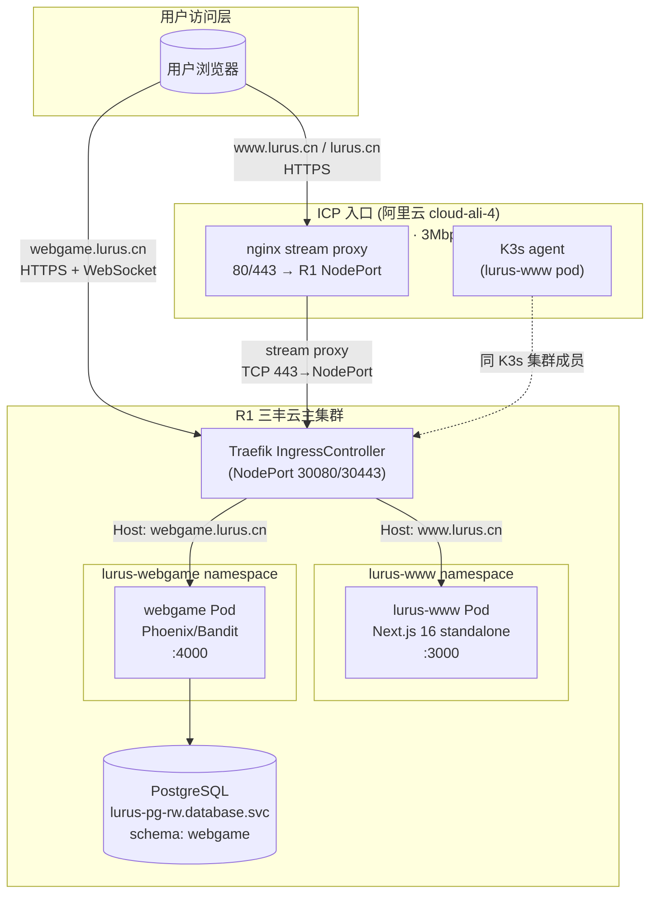
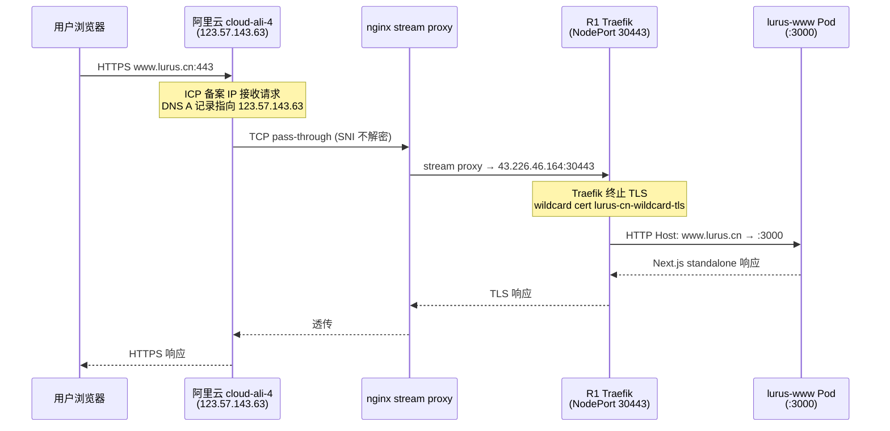
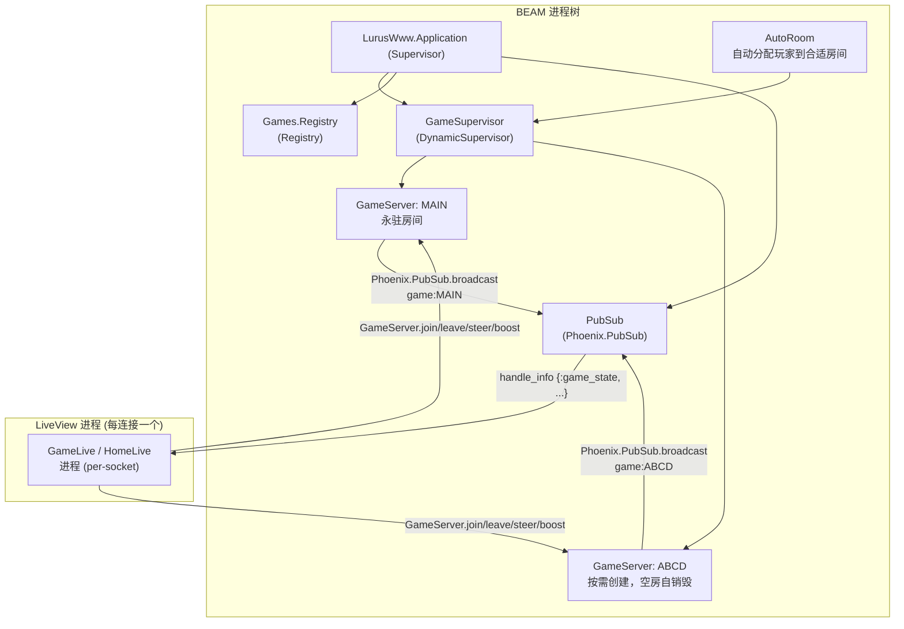
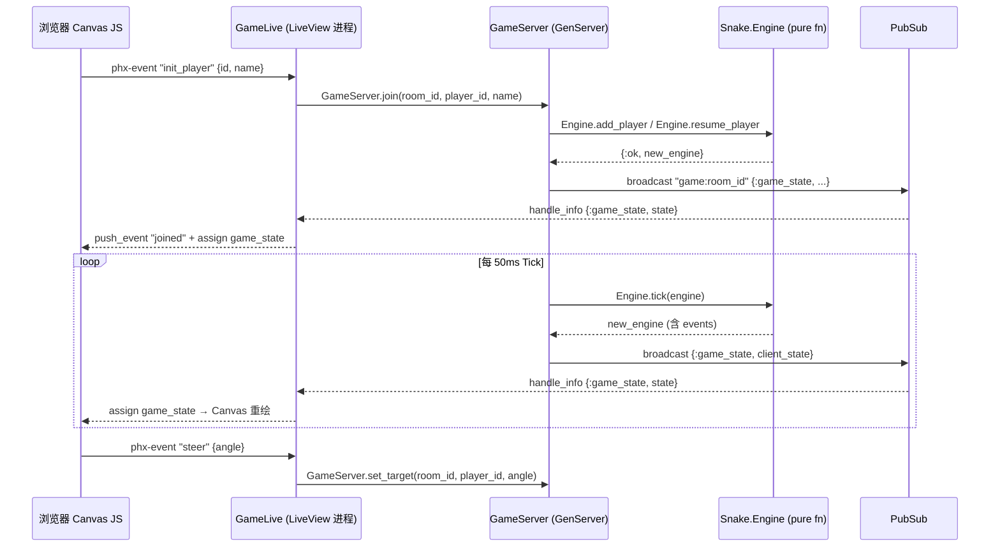

# Web 内部手册

> 仅限内部员工查阅。包含运维细节、决策档案、未公开问题。

## 一句话定位

Web 产品组下辖两个独立服务，共用一个代码仓库（历史原因）。
**lurus-www** 是 Lurus 的公司营销主页，承载品牌认知和用户转化；流量入口是阿里云 ICP 备案节点，经 nginx stream 转发至 R1 Traefik，最终落到 Next.js 16 Pod。
**lurus-webgame** 是从原 Phoenix 官网转型而来的实时多人蛇形对战游戏，借助 Elixir/Phoenix LiveView 的长连接能力实现 50ms tick 的游戏同步，部署在 R1 master 节点，与 Traefik 同机。

两者共享 `shared/lurus_phoenix`（`deps_local/lurus_phoenix/`），提供 OIDC 集成、API 代理、HealthPlug 等基础设施能力。

---

## 速查

| 项 | lurus-www (Next.js) | lurus-webgame (Phoenix) |
|---|---|---|
| 仓库 | github.com/hanmahong5-arch/lurus-www (dir: `2c-bs-www-next`) | github.com/hanmahong5-arch/lurus-www (dir: `2c-bs-www-phoenix`) |
| 镜像 | `ghcr.io/hanmahong5-arch/2c-bs-www-next:main-<sha7>` | `ghcr.io/hanmahong5-arch/webgame:latest` |
| 域名 | `www.lurus.cn` / `lurus.cn` (301→www) | `webgame.lurus.cn` |
| 端口 | 3000 | 4000 |
| 命名空间 | `lurus-www` | `lurus-webgame` |
| 数据存储 | 无状态 (纯静态渲染) | PG schema `webgame`（player_scores） |
| 关键依赖 | 无后端依赖（外链 api/auth/docs） | Platform identity (Zitadel OAuth)、PostgreSQL lurus-pg-rw |
| 部署节点 | cloud-ali-4-2c2g (Aliyun, ICP 备案节点) | cloud-ubuntu-1-16c32g (R1 master, 与 Traefik 同机) |
| ICP 备案 | 是（阿里云备案 IP 123.57.143.63） | 否（直接走三丰云 43.226.46.164） |
| 部署策略 | Recreate (ResourceQuota 只允许 1 Pod) | RollingUpdate (maxSurge=1, maxUnavailable=0) |
| imagePullPolicy | IfNotPresent | Always (`:latest` 可变 tag 强制必须) |

---

## 架构总览



---

# Part 1: WWW（Next.js 16）

## 技术栈

| 层 | 选型 |
|---|---|
| 框架 | Next.js 16 (App Router, React 19) |
| 样式 | Tailwind CSS 4 |
| 动效 | Framer Motion 12 + CSS View Transitions (experimental) |
| 语言 | TypeScript 5 |
| 运行时 | Bun |
| 渲染模式 | standalone 输出，SSR + 静态混合 |
| 容器 | scratch/alpine 多阶段，rootfs read-only |

## 页面路由

| 路由 | 内容 |
|---|---|
| `/` | Hero + Persona Router + Features + Architecture + Comparison + Products + CTA |
| `/platform` | Platform 产品组：Hub / Billing / Memorus + 架构概览 |
| `/lucrum` | AI 量化交易落地页 |
| `/kova` | AI Agent 引擎落地页 |
| `/pricing` | 定价层级 + 模型价格表 + FAQ |
| `/download` | 桌面工具：Switch + Creator |
| `/about` | 公司愿景 |
| `/solutions` | 按用户画像分类的解决方案 |
| `/blog` | 产品 changelog |
| `/privacy` / `/terms` | 法律页面 |

## 代码地图

| 路径 | 职责 |
|---|---|
| `src/app/layout.tsx` | Root layout (Header + Footer) |
| `src/app/template.tsx` | ViewTransition 页面切换包装器 |
| `src/app/loading.tsx` | 全局加载骨架屏 |
| `src/components/hero.tsx` | 首页 Hero：代码 Demo + 粒子网络 Canvas |
| `src/components/persona-router.tsx` | "我是…" 画像选择 → 产品路径引导 |
| `src/components/related-products.tsx` | 图驱动跨产品推荐 |
| `src/components/architecture-visual.tsx` | SVG 架构图 + 数据流脉冲动效 |
| `src/lib/ecosystem.ts` | 产品关系图（7 产品, 8 关系边, 4 用户画像） |
| `src/lib/motion.ts` | 共享 Framer Motion 预设（fadeInUp / staggerChild / heroEntry） |
| `deploy/k8s/deployment.yaml` | K8s Deployment，nodeSelector: `lurus.cn/role=www-gateway` |
| `deploy/k8s/ingressroute.yaml` | Traefik IngressRoute，含 lurus.cn→www 永久重定向 |

## ICP 流量路径详解



**关键约束**:
- `www.lurus.cn` / `lurus.cn` 的 DNS A 记录必须指向阿里云 `123.57.143.63`（ICP 备案要求）
- nginx 使用 **TCP stream 模式**（非 HTTP 反代），不解密 TLS，SNI 由 Traefik 处理
- lurus-www Pod 必须调度到 `cloud-ali-4-2c2g` 节点（nodeSelector `lurus.cn/role=www-gateway`），该节点同时是 K3s agent
- 阿里云出口 **3Mbps 带宽上限**，高并发下有瓶颈风险

## 设计系统

- Dark theme: 背景 `#0a0a0f`，品牌金 `--color-ochre: #c8a24e`
- CSS primitives: `.card` / `.pill` / `.text-gradient-gold` / `.glow-ochre` / `.grid-bg` / `.gradient-mesh` / `.noise`
- 视觉特效: `Aurora`（3层渐变气泡）/ `ParticleNetwork`（Canvas金粒子）/ `FloatingShapes`（SVG几何体）/ `AnimatedCounter`（数字滚动）
- 页面切换: CSS View Transitions（experimental，需 Next.js `viewTransition: true`）

## CI/CD（WWW）

```
push main → check (lint + build) → docker build → GHCR push
         → deploy job: sed 更新 deploy/k8s/deployment.yaml 中镜像 tag
         → commit "deploy: update image tag to main-<sha7>"
         → ArgoCD auto-sync → cloud-ali-4 K3s rollout (Recreate)
```

- 镜像 tag 格式: `main-<sha7>`（同 GHCR 同步 `latest` tag）
- 包可见性: CI 尝试将 GHCR 包设为 public（供阿里云节点拉取，无需认证）
- paths-ignore: `deploy/**` / `README.md` / `CLAUDE.md` 变更不触发构建

## 环境变量

lurus-www 无环境变量依赖（所有外链硬编码为 `api.lurus.cn` / `auth.lurus.cn` / `docs.lurus.cn`）。

---

# Part 2: Webgame（Phoenix LiveView）

## 转型背景（2026-04 决策）

原仓库 `2c-bs-www-phoenix` 是 Lurus 公司官网的 Phoenix LiveView 版本（2026-04 迭代中），后决策：
- **官网 (www)** 回归 Next.js（更适合静态营销站 + SEO），迁到 `2c-bs-www-next`
- **Phoenix 代码库** 转型为多人实时游戏（WebSocket/PubSub 的天然优势），保留仓库名沿用

当前 `2c-bs-www-phoenix` = **webgame 专属**，历史仓库名已与产品职责解耦。

## 技术栈

| 层 | 选型 |
|---|---|
| 语言 | Elixir 1.17 + OTP 27 |
| 框架 | Phoenix 1.7 + LiveView 1.0 |
| HTTP 服务器 | Bandit (替代 Cowboy) |
| 前端 | Tailwind CSS 4 + esbuild + Canvas API (JS hook) |
| 数据库 | PostgreSQL (schema: webgame, 表: player_scores) |
| 测试 | ExUnit + lazy_html (LV 1.1+ 要求) + Playwright E2E |
| Lint | Credo --strict + mix format |
| 共享库 | `deps_local/lurus_phoenix`（OIDC / HealthPlug / ApiProxy） |

## 游戏设计

- 风格: Slither.io + RPG 进化系统
- 玩法: 吃食物升级 → 解锁道具 → 撞击其他蛇获得击杀积分
- 竞技场: 2400×1600 虚拟像素
- Tick 速率: 50ms（约 20 FPS 服务端物理）
- 最大玩家/房间: 20（含 Bot）
- Bot 管理: 有人类玩家时自动补充至 `@bot_target_total = 4`，无人类时清空

## 进程架构



## LiveView 数据流



**重连机制**:
- LiveView 断线重连后触发 `connected?(socket)` 分支重新 `subscribe`
- 重连 ID 优先级: localStorage → form hidden field → generate new
- 重连到已存在 player_id → `Engine.resume_player`（保留分数/等级），禁止 `gen_id()` 重试

## 代码地图

| 路径 | 职责 |
|---|---|
| `lib/lurus_www/games/game_server.ex` | per-room GenServer，tick loop，Bot 管理，Idle 超时 |
| `lib/lurus_www/games/game_supervisor.ex` | DynamicSupervisor，按需创建/销毁房间 |
| `lib/lurus_www/games/snake/engine.ex` | 纯函数游戏引擎（物理/碰撞/升级/道具/事件） |
| `lib/lurus_www/scores/` | player_scores 持久化（玩家死亡时异步写入） |
| `lib/lurus_www_web/live/home_live.ex` | 主页：昵称输入 + PLAY 按钮（零摩擦） |
| `lib/lurus_www_web/live/game_live.ex` | 游戏页：加入/转向/加速/重生/道具事件处理 |
| `lib/lurus_www_web/live/creator_live.ex` | 预留：皮肤/房间编辑器（未完成） |
| `assets/` | JS Hooks（Canvas 渲染器）+ Tailwind |
| `deps_local/lurus_phoenix/` | 共享：OIDC / HealthPlug / ApiProxy |
| `deploy/k8s/deployment.yaml` | nodeSelector: `cloud-ubuntu-1-16c32g`，terminationGraceSeconds=15 |
| `deploy/k8s/ingress.yaml` | Traefik IngressRoute `webgame.lurus.cn` |

## CI/CD（Webgame）

```
push main → test (ExUnit) → build (Elixir mix release)
         → docker build → GHCR push :latest + :main-<sha7>
         → ArgoCD auto-sync (imagePullPolicy: Always 确保拉取新 latest)
         → webgame Pod rollout restart on R1
```

**注意**: test job 和 build job 并行，build **不等** test 通过（`if: github.event_name == 'push'`）。生产部署不受测试失败阻断，测试仅作可见性报告。这是已知风险，后续应改为串行依赖。

## 环境变量

| 变量 | 来源 | 说明 |
|---|---|---|
| `SECRET_KEY_BASE` | Secret `webgame-secret` | 64+ hex，Phoenix session/token 签名 |
| `PHX_HOST` | 硬编码 `webgame.lurus.cn` | LiveView WebSocket host + CORS |
| `PORT` | 硬编码 `4000` | Bandit 监听端口 |
| `DATABASE_URL` | 硬编码（含密码） | PG `webgame` schema，**明文在 manifest 中** |
| `ZITADEL_CLIENT_ID` | Secret `webgame-secret` | OIDC 登录（可选，当前可无账号匿名玩） |
| `ZITADEL_ISSUER` | 硬编码 `https://auth.lurus.cn` | — |
| `CHAT_ENABLED` | `false` | 聊天功能关闭 |
| `RELEASE_TMP` | `/tmp` | BEAM release 临时目录（rootfs 只读时必须指向 emptyDir） |

---

## 已知坑（内部专属）

### WWW 专属

1. **ICP 备案续期时间窗**: 阿里云 ICP 备案到期前 ~60 天需续期，期间若未完成，`www.lurus.cn` 会被运营商/阿里云直接重置为 HTTP 307 跳转至 ICP 核验页（`icp.pppf.com.cn`）。续期需要提前监控，备案 ID 在阿里云控制台。

2. **3Mbps 带宽吃紧**: 阿里云 cloud-ali-4 出口仅 3Mbps，首屏 JS bundle 较大时（Framer Motion + particle Canvas）会出现加载慢，尤其在同时有多用户访问时。临时缓解：CDN 分流（当前未接入），或减少 bundle size。

3. **nginx stream → Traefik 链路调试难**: nginx 做 TCP pass-through，不记录 HTTP 日志；Traefik 的访问日志在 R1 上。调试 502 必须两端联查：阿里云 nginx `access.log`（TCP 层）+ R1 Traefik access logs + lurus-www Pod logs。

4. **Recreate 策略导致短暂停服**: deployment.yaml 使用 `Recreate`（ResourceQuota 仅允许 1 Pod），更新时有秒级中断窗口。

5. **GHCR 包可见性**: CI 尝试将包设为 public 供阿里云节点拉取。若 GITHUB_TOKEN 无权限，会 `continue-on-error: true` 静默失败，此时阿里云节点需要独立配置 imagePullSecrets。

### Webgame 专属

6. **BadBooleanError**: Phoenix LiveView 模板中禁用 `and`/`or`/`not`，必须用 `&&`/`||`/`!`。每次升级 LV 版本后需全库检查。

7. **TDZ ReferenceError (Canvas)**: Canvas `draw()` 函数体内 `const` 声明必须在首次使用前（作用域提升不适用 const）。CI 目前无 JS 类型检查，靠运行时发现。

8. **playerId 漂移**: 多 tab 或 LiveView 重连场景下 player_id 可能来自三路 fallback（localStorage / form hidden / joined event），以服务端最新推送的 `my_id` 为准覆盖客户端状态。

9. **Tick try/rescue 是护盾**: `Engine.tick` 崩溃若不被 rescue，会冻结整个房间所有玩家（GenServer 崩溃需重启才能恢复）。现有 try/rescue 保留旧 state 继续 tick，但崩溃不上报 Sentry/告警，当前只有 Logger.error 日志。

10. **`latest` tag + imagePullPolicy 耦合**: webgame 使用 `:latest` 可变 tag，**必须** 配合 `imagePullPolicy: Always`，否则 kubelet 缓存让 CI bump 永远不到达新 Pod。已在 manifest 中正确配置，但手动 patch 时容易误改。

11. **LiveView 重连风暴**: 服务滚动更新时所有在线玩家同时重连，PubSub 订阅和 GameServer.join 并发峰值可能使 GenServer 消息队列积压。当前 `terminationGracePeriodSeconds: 15` 给 BEAM 时间广播断线通知，但大量玩家同时重连仍可能短暂 lag。

12. **DATABASE_URL 明文**: deployment.yaml 中 `DATABASE_URL` 直接包含用户名密码，未引用 Secret。需迁移到 `secretKeyRef`。

13. **Build 不等 Test**: CI 中 test 和 build 并行，test 失败不阻断生产部署（见 CI/CD 章节）。

14. **`fatten` 截断历史**: 早期版本通过截断 body 实现"胖化"，导致视觉冻结感。已改为 `girth_for_level/1` 平滑派生，无截断。切勿恢复旧逻辑。

15. **freeze/slowmo 道具已永久删除**: 曾经存在跨玩家干扰道具（冻结/减速），因对受害者无警告、无反制窗口，被视为 bug。已从 `@powerup_types` 移除，不可恢复，类似机制需要重新设计（受害者警告 + 反制窗口 + 自愿进入）。

---

## 决策档案

| 时间 | 决策 | 理由 |
|---|---|---|
| 2026-04 | www 从 Phoenix 回归 Next.js 16 | 营销站需要更好的 SEO + 静态优化，Phoenix 的 LiveView 优势在此无用武之地 |
| 2026-04 | Phoenix 代码库转型 webgame | WebSocket/PubSub 天然适合实时游戏，零摩擦利用现有 Elixir 基础设施 |
| 2026-04 | www pod 绑定阿里云节点 | ICP 备案要求网站服务必须运行在备案主体对应的阿里云 ECS 上 |
| 2026-04 | webgame 绑定 R1 master | 与 Traefik 同机，WebSocket 长连接无需经过额外跳转，延迟最低 |
| 2026-04 | 删除 freeze/slowmo 道具 | 跨玩家干扰无反制机制，玩家无法区分 bug 与设计，用户体验破坏性大 |
| 2026-04 | Tick try/rescue 保留旧 state | 单 tick 崩溃不应冻结整个房间，降级策略优于快速失败 |
| 2026-04 | gameserver `:latest` tag | 持续迭代阶段，不做 sha7 pin，依赖 `imagePullPolicy: Always` 保证更新到达 |

---

## TODO / Roadmap

- [ ] DATABASE_URL 迁移到 K8s Secret (`secretKeyRef`) — 高优，安全风险
- [ ] webgame CI: test job 设为 build 的前置依赖（阻断不通过测试的部署）
- [ ] 接入 Prometheus + Grafana 的 webgame telemetry（`:webgame.game.*` 指标已就位，未配 scrape）
- [ ] Tick 崩溃上报 Sentry（当前只有 Logger.error）
- [ ] `creator_live.ex` 皮肤/房间编辑器完成实现
- [ ] www 接入 CDN 缓解阿里云 3Mbps 带宽瓶颈
- [ ] ICP 备案续期提醒自动化（当前全靠人肉监控）
- [ ] lurus-www Recreate → RollingUpdate（需要 ResourceQuota 扩容）

---

## 应急 Runbook（10 分钟版）

### ICP 入口挂（www.lurus.cn 无法访问）

1. 确认 DNS 解析是否正常（应指向 `123.57.143.63`）：
   ```bash
   dig www.lurus.cn +short
   # 期望: 123.57.143.63
   ```

2. 检查是否被 ICP 拦截（返回 307 跳 icp.pppf.com.cn）：
   ```bash
   curl -I https://www.lurus.cn
   # 若 Location: icp.pppf.com.cn → ICP 备案问题，联系阿里云
   ```

3. 检查阿里云节点 nginx 状态（需要阿里云节点 SSH 权限）：
   ```bash
   # 无直接 SSH，通过 K3s 节点操作
   ssh root@100.98.57.55 "kubectl get node cloud-ali-4-2c2g"
   ssh root@100.98.57.55 "kubectl get pods -n lurus-www"
   ssh root@100.98.57.55 "kubectl logs -n lurus-www deploy/lurus-www --tail=100"
   ```

4. 强制重启 lurus-www Pod：
   ```bash
   ssh root@100.98.57.55 "kubectl rollout restart deployment/lurus-www -n lurus-www"
   ssh root@100.98.57.55 "kubectl rollout status deployment/lurus-www -n lurus-www --timeout=60s"
   ```

5. 若节点本身下线（cloud-ali-4 not ready），需登录阿里云控制台重启 ECS。

---

### Next.js 502 Bad Gateway

```bash
# 1. 检查 Pod 状态
ssh root@100.98.57.55 "kubectl get pods -n lurus-www -o wide"

# 2. 查看 Pod 日志
ssh root@100.98.57.55 "kubectl logs -n lurus-www deploy/lurus-www --tail=200"

# 3. 检查 Traefik 访问日志是否报错
ssh root@100.98.57.55 "kubectl logs -n kube-system deploy/traefik --tail=100 | grep www"

# 4. 若 Pod CrashLoopBackOff — 检查镜像是否存在
ssh root@100.98.57.55 "kubectl describe pod -n lurus-www <pod-name>"

# 5. 回滚到上一个已知好镜像（改 manifest + commit + push）
# 找到上一个 sha7: git log deploy/k8s/deployment.yaml
# 修改 deploy/k8s/deployment.yaml 中 image tag，commit + push → ArgoCD auto-sync
```

---

### Phoenix/webgame 崩溃或游戏卡死

```bash
# 1. 检查 Pod
ssh root@100.98.57.55 "kubectl get pods -n lurus-webgame"
ssh root@100.98.57.55 "kubectl logs -n lurus-webgame deploy/webgame --tail=300"

# 2. 查找 tick 崩溃日志
ssh root@100.98.57.55 "kubectl logs -n lurus-webgame deploy/webgame --tail=500 | grep 'engine tick crashed'"

# 3. 强制重启（所有在线玩家断连，游戏状态丢失）
ssh root@100.98.57.55 "kubectl rollout restart deployment/webgame -n lurus-webgame"

# 4. 等待新 Pod 就绪（健康检查: GET /health）
ssh root@100.98.57.55 "kubectl rollout status deployment/webgame -n lurus-webgame --timeout=60s"
```

**注意**: webgame 游戏状态全在内存，重启即清零。player_scores 已异步持久化到 PG，不丢。

---

### LiveView 重连风暴（大量玩家同时掉线重连）

症状: CPU 短暂飙升，websocket 连接握手堆积，游戏 lag 明显。

```bash
# 监控 Pod 资源
ssh root@100.98.57.55 "kubectl top pod -n lurus-webgame"

# 检查 PubSub 队列（无直接指标，看 Pod CPU/Memory 趋势）
ssh root@100.98.57.55 "kubectl logs -n lurus-webgame deploy/webgame --tail=100 | grep -i 'join\|subscribe'"
```

缓解: 等待 BEAM 消化积压（通常 30s 内恢复）。若持续超过 2 分钟，考虑 rollout restart。

---

### DNS 切换（紧急）

**场景**: 阿里云节点故障，需临时绕过 ICP 入口直接访问三丰云。

**风险**: 绕过 ICP 备案入口可能违反工信部规定，仅在紧急且短暂场景下使用。

```bash
# 将 www.lurus.cn DNS A 记录临时改为三丰云 43.226.46.164
# 通过 DNS 服务商控制台操作（非代码操作）
# TTL 建议改为 60s 降低缓存时间

# 恢复时改回 123.57.143.63
```

---

### 回滚

**lurus-www（Next.js）**:
```bash
# 找到上一个好 tag
git -C 2c-bs-www-next log --oneline deploy/k8s/deployment.yaml | head -5
# 修改 deploy/k8s/deployment.yaml image tag → commit + push → ArgoCD sync
```

**webgame（Phoenix）**:
```bash
# webgame 使用 :latest，无法按 tag 回滚
# 需要触发上一个版本的 CI 重新 push :latest，或手动 docker tag + push
ssh root@100.98.57.55 "kubectl rollout undo deployment/webgame -n lurus-webgame"
# 注意: rollout undo 回到上一个 rs，但若 imagePullPolicy:Always + :latest 已更新，可能拉到新镜像
```
