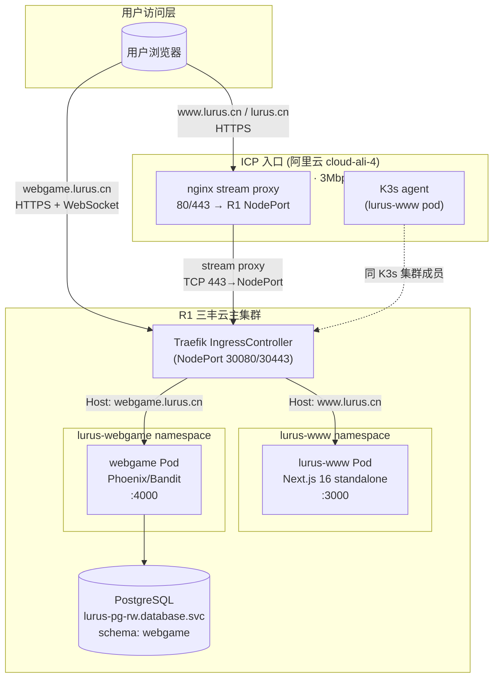
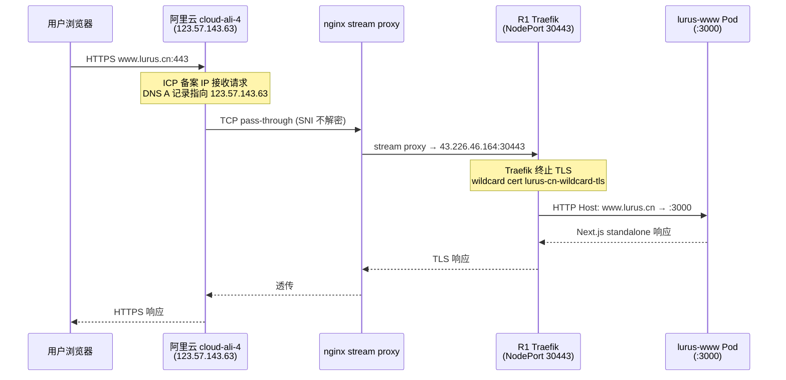
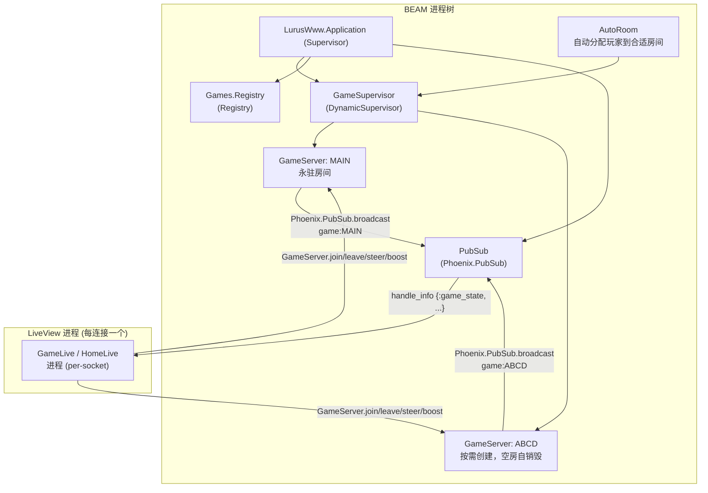
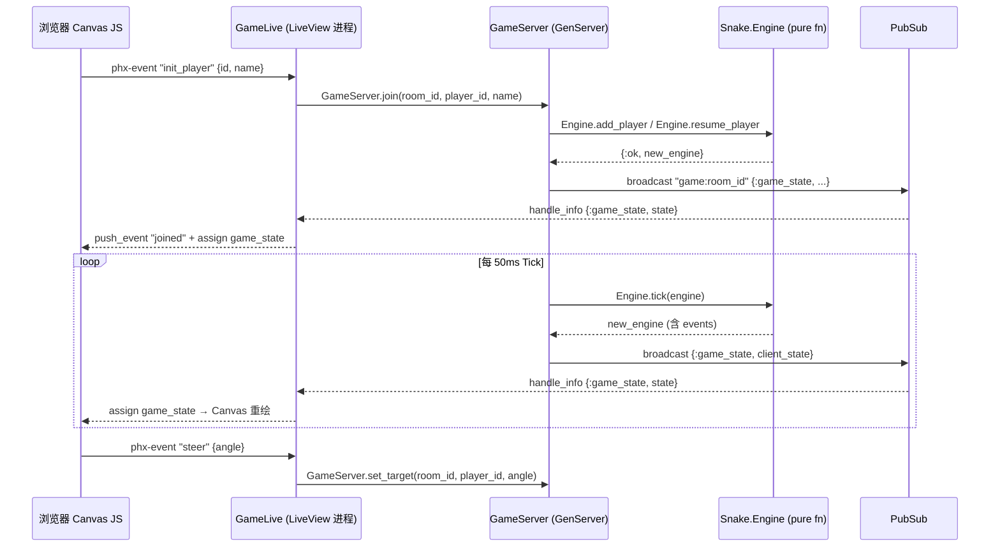
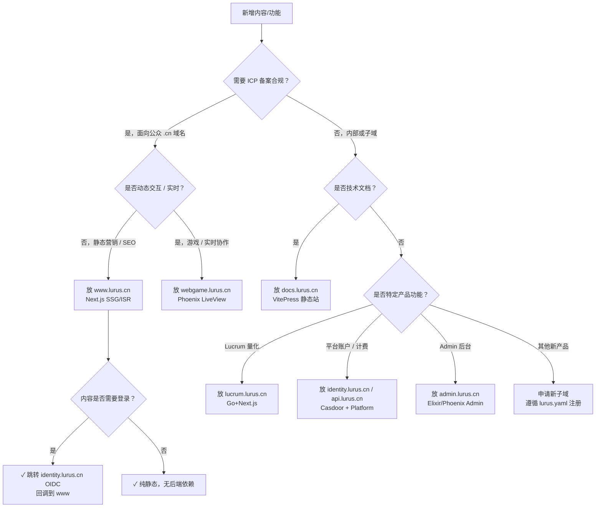
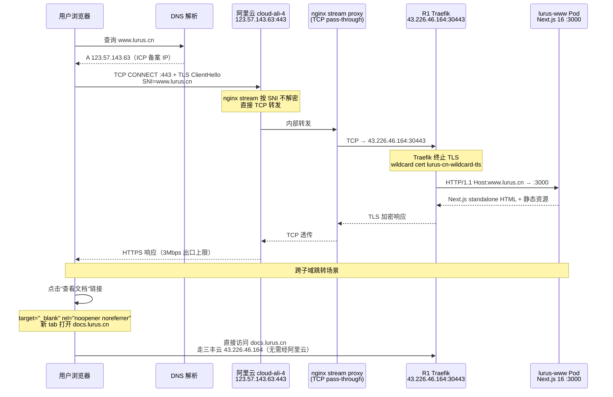
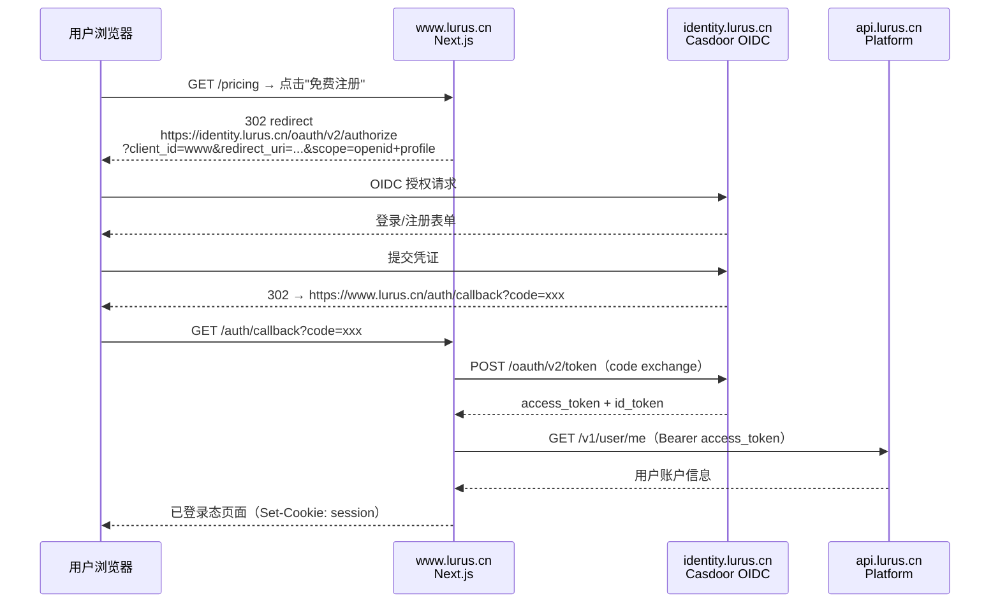
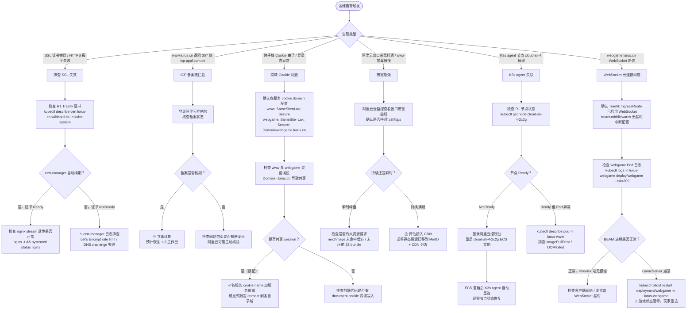

# Web 内部手册

<div class="lurus-callout lurus-callout--info"><span class="lurus-callout__icon"><Icon name="history" :size="18"/></span><div><p class="lurus-callout__title">2026-05-28 状态更新</p><div class="lurus-callout__body"><code>www.lurus.cn</code> 在线（<strong>live</strong>）；webgame（Phoenix 游戏）2026-05-28 已 <strong>sunset</strong>（auth 死约 1 月 + 0 流量）。仅限内部员工查阅 —— 包含运维细节、决策档案、未公开问题。</div></div></div>

<p>
  <span class="lurus-tag">www · live</span>
  <span class="lurus-tag lurus-tag--muted">webgame · sunset</span>
</p>

## 一句话定位

Web 产品组下辖两个独立服务，共用一个代码仓库（历史原因）。
**lurus-www** 是 Lurus 的公司营销主页，承载品牌认知和用户转化；流量入口是阿里云 ICP 备案节点，经 nginx stream 转发至 R1 Traefik，最终落到 Next.js 16 Pod。
**lurus-webgame** 是从原 Phoenix 官网转型而来的实时多人蛇形对战游戏，借助 Elixir/Phoenix LiveView 的长连接能力实现 50ms tick 的游戏同步，部署在 R1 master 节点，与 Traefik 同机。

两者共享 `shared/lurus_phoenix`（`deps_local/lurus_phoenix/`），提供 OIDC 集成、API 代理、HealthPlug 等基础设施能力。

---

## 速查

| 项 | lurus-www (Next.js) | lurus-webgame (Phoenix) |
|---|---|---|
| 仓库 | github.com/hanmahong5-arch/lurus-www (dir: `2c-bs-www-next`) | github.com/hanmahong5-arch/lurus-www (dir: `2c-bs-www-phoenix`) |
| 镜像 | `ghcr.io/hanmahong5-arch/2c-bs-www-next:main-<sha7>` | `ghcr.io/hanmahong5-arch/webgame:latest` |
| 域名 | `www.lurus.cn` / `lurus.cn` (301→www) | `webgame.lurus.cn` |
| 端口 | 3000 | 4000 |
| 命名空间 | `lurus-www` | `lurus-webgame` |
| 数据存储 | 无状态 (纯静态渲染) | PG schema `webgame`（player_scores） |
| 关键依赖 | 无后端依赖（外链 api/auth/docs） | Platform identity (Casdoor OAuth)、PostgreSQL lurus-pg-rw |
| 部署节点 | cloud-ali-4-2c2g (Aliyun, ICP 备案节点) | cloud-ubuntu-1-16c32g (R1 master, 与 Traefik 同机) |
| ICP 备案 | 是（阿里云备案 IP 123.57.143.63） | 否（直接走三丰云 43.226.46.164） |
| 部署策略 | Recreate (ResourceQuota 只允许 1 Pod) | RollingUpdate (maxSurge=1, maxUnavailable=0) |
| imagePullPolicy | IfNotPresent | Always (`:latest` 可变 tag 强制必须) |

---

## 架构总览



---

# Part 1: WWW（Next.js 16）

<div class="lurus-stat-strip">
  <div class="lurus-stat"><span class="lurus-stat__value">3Mbps</span><span class="lurus-stat__label">阿里云出口上限</span></div>
  <div class="lurus-stat"><span class="lurus-stat__value">:3000</span><span class="lurus-stat__label">Pod 端口</span></div>
  <div class="lurus-stat"><span class="lurus-stat__value">:30443</span><span class="lurus-stat__label">R1 Traefik NodePort</span></div>
  <div class="lurus-stat"><span class="lurus-stat__value">Recreate</span><span class="lurus-stat__label">部署策略</span></div>
</div>

::: tip 运维速记
**出口带宽上限**：阿里云 cloud-ali-4 出口 **3Mbps**（硬上限，无 CDN 时大 bundle 易拖慢首屏）。
**流量路径**：DNS A `123.57.143.63` → 阿里云 nginx stream（TCP pass-through）→ R1 Traefik NodePort `:30443` → lurus-www Pod（`cloud-ali-4` K3s agent，namespace `lurus-www`）。
:::

## 技术栈

| 层 | 选型 |
|---|---|
| 框架 | Next.js 16 (App Router, React 19) |
| 样式 | Tailwind CSS 4 |
| 动效 | Framer Motion 12 + CSS View Transitions (experimental) |
| 语言 | TypeScript 5 |
| 运行时 | Bun |
| 渲染模式 | standalone 输出，SSR + 静态混合 |
| 容器 | scratch/alpine 多阶段，rootfs read-only |

## 页面路由

| 路由 | 内容 |
|---|---|
| `/` | Hero + Persona Router + Features + Architecture + Comparison + Products + CTA |
| `/platform` | Platform 产品组：Hub / Billing / Memorus + 架构概览 |
| `/lucrum` | AI 量化交易落地页 |
| `/kova` | AI Agent 引擎落地页 |
| `/pricing` | 定价层级 + 模型价格表 + FAQ |
| `/download` | 桌面工具：Switch + Creator |
| `/about` | 公司愿景 |
| `/solutions` | 按用户画像分类的解决方案 |
| `/blog` | 产品 changelog |
| `/privacy` / `/terms` | 法律页面 |

## 代码地图

| 路径 | 职责 |
|---|---|
| `src/app/layout.tsx` | Root layout (Header + Footer) |
| `src/app/template.tsx` | ViewTransition 页面切换包装器 |
| `src/app/loading.tsx` | 全局加载骨架屏 |
| `src/components/hero.tsx` | 首页 Hero：代码 Demo + 粒子网络 Canvas |
| `src/components/persona-router.tsx` | "我是…" 画像选择 → 产品路径引导 |
| `src/components/related-products.tsx` | 图驱动跨产品推荐 |
| `src/components/architecture-visual.tsx` | SVG 架构图 + 数据流脉冲动效 |
| `src/lib/ecosystem.ts` | 产品关系图（7 产品, 8 关系边, 4 用户画像） |
| `src/lib/motion.ts` | 共享 Framer Motion 预设（fadeInUp / staggerChild / heroEntry） |
| `deploy/k8s/deployment.yaml` | K8s Deployment，nodeSelector: `lurus.cn/role=www-gateway` |
| `deploy/k8s/ingressroute.yaml` | Traefik IngressRoute，含 lurus.cn→www 永久重定向 |

## ICP 流量路径详解



<div class="lurus-callout lurus-callout--key"><span class="lurus-callout__icon"><Icon name="network" :size="18"/></span><div><p class="lurus-callout__title">关键约束</p><div class="lurus-callout__body"><ul><li><code>www.lurus.cn</code> / <code>lurus.cn</code> 的 DNS A 记录必须指向阿里云 <code>123.57.143.63</code>（ICP 备案要求）</li><li>nginx 使用 <strong>TCP stream 模式</strong>（非 HTTP 反代），不解密 TLS，SNI 由 Traefik 处理</li><li>lurus-www Pod 必须调度到 <code>cloud-ali-4-2c2g</code> 节点（nodeSelector <code>lurus.cn/role=www-gateway</code>），该节点同时是 K3s agent</li><li>阿里云出口 <strong>3Mbps 带宽上限</strong>，高并发下有瓶颈风险</li></ul></div></div></div>

## 设计系统

- Dark theme: 背景 `#0a0a0f`，品牌金 `--color-ochre: #c8a24e`
- CSS primitives: `.card` / `.pill` / `.text-gradient-gold` / `.glow-ochre` / `.grid-bg` / `.gradient-mesh` / `.noise`
- 视觉特效: `Aurora`（3层渐变气泡）/ `ParticleNetwork`（Canvas金粒子）/ `FloatingShapes`（SVG几何体）/ `AnimatedCounter`（数字滚动）
- 页面切换: CSS View Transitions（experimental，需 Next.js `viewTransition: true`）

## CI/CD（WWW）

```
push main → check (lint + build) → docker build → GHCR push
         → deploy job: sed 更新 deploy/k8s/deployment.yaml 中镜像 tag
         → commit "deploy: update image tag to main-<sha7>"
         → ArgoCD auto-sync → cloud-ali-4 K3s rollout (Recreate)
```

- 镜像 tag 格式: `main-<sha7>`（同 GHCR 同步 `latest` tag）
- 包可见性: CI 尝试将 GHCR 包设为 public（供阿里云节点拉取，无需认证）
- paths-ignore: `deploy/**` / `README.md` / `CLAUDE.md` 变更不触发构建

## 环境变量

lurus-www 无环境变量依赖（所有外链硬编码为 `api.lurus.cn` / `identity.lurus.cn` / `docs.lurus.cn`）。

---

# Part 2: Webgame（Phoenix LiveView）

## 转型背景（2026-04 决策）

原仓库 `2c-bs-www-phoenix` 是 Lurus 公司官网的 Phoenix LiveView 版本（2026-04 迭代中），后决策：
- **官网 (www)** 回归 Next.js（更适合静态营销站 + SEO），迁到 `2c-bs-www-next`
- **Phoenix 代码库** 转型为多人实时游戏（WebSocket/PubSub 的天然优势），保留仓库名沿用

当前 `2c-bs-www-phoenix` = **webgame 专属**，历史仓库名已与产品职责解耦。

## 技术栈

| 层 | 选型 |
|---|---|
| 语言 | Elixir 1.17 + OTP 27 |
| 框架 | Phoenix 1.7 + LiveView 1.0 |
| HTTP 服务器 | Bandit (替代 Cowboy) |
| 前端 | Tailwind CSS 4 + esbuild + Canvas API (JS hook) |
| 数据库 | PostgreSQL (schema: webgame, 表: player_scores) |
| 测试 | ExUnit + lazy_html (LV 1.1+ 要求) + Playwright E2E |
| Lint | Credo --strict + mix format |
| 共享库 | `deps_local/lurus_phoenix`（OIDC / HealthPlug / ApiProxy） |

## 游戏设计

<div class="lurus-stat-strip">
  <div class="lurus-stat"><span class="lurus-stat__value">50ms</span><span class="lurus-stat__label">Tick 速率</span></div>
  <div class="lurus-stat"><span class="lurus-stat__value">20</span><span class="lurus-stat__label">最大玩家/房间</span></div>
  <div class="lurus-stat"><span class="lurus-stat__value">2400×1600</span><span class="lurus-stat__label">竞技场像素</span></div>
  <div class="lurus-stat"><span class="lurus-stat__value">:4000</span><span class="lurus-stat__label">Bandit 端口</span></div>
</div>

- 风格: Slither.io + RPG 进化系统
- 玩法: 吃食物升级 → 解锁道具 → 撞击其他蛇获得击杀积分
- 竞技场: 2400×1600 虚拟像素
- Tick 速率: 50ms（约 20 FPS 服务端物理）
- 最大玩家/房间: 20（含 Bot）
- Bot 管理: 有人类玩家时自动补充至 `@bot_target_total = 4`，无人类时清空

## 进程架构



## LiveView 数据流



**重连机制**:
- LiveView 断线重连后触发 `connected?(socket)` 分支重新 `subscribe`
- 重连 ID 优先级: localStorage → form hidden field → generate new
- 重连到已存在 player_id → `Engine.resume_player`（保留分数/等级），禁止 `gen_id()` 重试

## 代码地图

| 路径 | 职责 |
|---|---|
| `lib/lurus_www/games/game_server.ex` | per-room GenServer，tick loop，Bot 管理，Idle 超时 |
| `lib/lurus_www/games/game_supervisor.ex` | DynamicSupervisor，按需创建/销毁房间 |
| `lib/lurus_www/games/snake/engine.ex` | 纯函数游戏引擎（物理/碰撞/升级/道具/事件） |
| `lib/lurus_www/scores/` | player_scores 持久化（玩家死亡时异步写入） |
| `lib/lurus_www_web/live/home_live.ex` | 主页：昵称输入 + PLAY 按钮（零摩擦） |
| `lib/lurus_www_web/live/game_live.ex` | 游戏页：加入/转向/加速/重生/道具事件处理 |
| `lib/lurus_www_web/live/creator_live.ex` | 预留：皮肤/房间编辑器（未完成） |
| `assets/` | JS Hooks（Canvas 渲染器）+ Tailwind |
| `deps_local/lurus_phoenix/` | 共享：OIDC / HealthPlug / ApiProxy |
| `deploy/k8s/deployment.yaml` | nodeSelector: `cloud-ubuntu-1-16c32g`，terminationGraceSeconds=15 |
| `deploy/k8s/ingress.yaml` | Traefik IngressRoute `webgame.lurus.cn` |

## CI/CD（Webgame）

```
push main → test (ExUnit) → build (Elixir mix release)
         → docker build → GHCR push :latest + :main-<sha7>
         → ArgoCD auto-sync (imagePullPolicy: Always 确保拉取新 latest)
         → webgame Pod rollout restart on R1
```

<div class="lurus-callout lurus-callout--warn"><span class="lurus-callout__icon"><Icon name="alert-triangle" :size="18"/></span><div><p class="lurus-callout__title">Build 不等 Test（已知风险）</p><div class="lurus-callout__body">test job 和 build job <strong>并行</strong>，build <strong>不等</strong> test 通过（<code>if: github.event_name == 'push'</code>）。生产部署不受测试失败阻断，测试仅作可见性报告。后续应改为串行依赖。</div></div></div>

## 环境变量

| 变量 | 来源 | 说明 |
|---|---|---|
| `SECRET_KEY_BASE` | Secret `webgame-secret` | 64+ hex，Phoenix session/token 签名 |
| `PHX_HOST` | 硬编码 `webgame.lurus.cn` | LiveView WebSocket host + CORS |
| `PORT` | 硬编码 `4000` | Bandit 监听端口 |
| `DATABASE_URL` | 硬编码（含密码） | PG `webgame` schema，**明文在 manifest 中** |
| `OIDC_CLIENT_ID` | Secret `webgame-secret` | OIDC 登录（可选，当前可无账号匿名玩） |
| `OIDC_ISSUER` | 硬编码 `https://identity.lurus.cn` | — |
| `CHAT_ENABLED` | `false` | 聊天功能关闭 |
| `RELEASE_TMP` | `/tmp` | BEAM release 临时目录（rootfs 只读时必须指向 emptyDir） |

---

## 已知坑（内部专属）

### WWW 专属

1. **ICP 备案续期时间窗**: 阿里云 ICP 备案到期前 ~60 天需续期，期间若未完成，`www.lurus.cn` 会被运营商/阿里云直接重置为 HTTP 307 跳转至 ICP 核验页（`icp.pppf.com.cn`）。续期需要提前监控，备案 ID 在阿里云控制台。

2. **3Mbps 带宽吃紧**: 阿里云 cloud-ali-4 出口仅 3Mbps，首屏 JS bundle 较大时（Framer Motion + particle Canvas）会出现加载慢，尤其在同时有多用户访问时。临时缓解：CDN 分流（当前未接入），或减少 bundle size。

3. **nginx stream → Traefik 链路调试难**: nginx 做 TCP pass-through，不记录 HTTP 日志；Traefik 的访问日志在 R1 上。调试 502 必须两端联查：阿里云 nginx `access.log`（TCP 层）+ R1 Traefik access logs + lurus-www Pod logs。

4. **Recreate 策略导致短暂停服**: deployment.yaml 使用 `Recreate`（ResourceQuota 仅允许 1 Pod），更新时有秒级中断窗口。

5. **GHCR 包可见性**: CI 尝试将包设为 public 供阿里云节点拉取。若 GITHUB_TOKEN 无权限，会 `continue-on-error: true` 静默失败，此时阿里云节点需要独立配置 imagePullSecrets。

### Webgame 专属

6. **BadBooleanError**: Phoenix LiveView 模板中禁用 `and`/`or`/`not`，必须用 `&&`/`||`/`!`。每次升级 LV 版本后需全库检查。

7. **TDZ ReferenceError (Canvas)**: Canvas `draw()` 函数体内 `const` 声明必须在首次使用前（作用域提升不适用 const）。CI 目前无 JS 类型检查，靠运行时发现。

8. **playerId 漂移**: 多 tab 或 LiveView 重连场景下 player_id 可能来自三路 fallback（localStorage / form hidden / joined event），以服务端最新推送的 `my_id` 为准覆盖客户端状态。

9. **Tick try/rescue 是护盾**: `Engine.tick` 崩溃若不被 rescue，会冻结整个房间所有玩家（GenServer 崩溃需重启才能恢复）。现有 try/rescue 保留旧 state 继续 tick，但崩溃不上报 Sentry/告警，当前只有 Logger.error 日志。

10. **`latest` tag + imagePullPolicy 耦合**: webgame 使用 `:latest` 可变 tag，**必须** 配合 `imagePullPolicy: Always`，否则 kubelet 缓存让 CI bump 永远不到达新 Pod。已在 manifest 中正确配置，但手动 patch 时容易误改。

11. **LiveView 重连风暴**: 服务滚动更新时所有在线玩家同时重连，PubSub 订阅和 GameServer.join 并发峰值可能使 GenServer 消息队列积压。当前 `terminationGracePeriodSeconds: 15` 给 BEAM 时间广播断线通知，但大量玩家同时重连仍可能短暂 lag。

12. **DATABASE_URL 明文**: deployment.yaml 中 `DATABASE_URL` 直接包含用户名密码，未引用 Secret。需迁移到 `secretKeyRef`。

13. **Build 不等 Test**: CI 中 test 和 build 并行，test 失败不阻断生产部署（见 CI/CD 章节）。

14. **`fatten` 截断历史**: 早期版本通过截断 body 实现"胖化"，导致视觉冻结感。已改为 `girth_for_level/1` 平滑派生，无截断。切勿恢复旧逻辑。

15. **freeze/slowmo 道具已永久删除**: 曾经存在跨玩家干扰道具（冻结/减速），因对受害者无警告、无反制窗口，被视为 bug。已从 `@powerup_types` 移除，不可恢复，类似机制需要重新设计（受害者警告 + 反制窗口 + 自愿进入）。

---

## 决策档案

| 时间 | 决策 | 理由 |
|---|---|---|
| 2026-04 | www 从 Phoenix 回归 Next.js 16 | 营销站需要更好的 SEO + 静态优化，Phoenix 的 LiveView 优势在此无用武之地 |
| 2026-04 | Phoenix 代码库转型 webgame | WebSocket/PubSub 天然适合实时游戏，零摩擦利用现有 Elixir 基础设施 |
| 2026-04 | www pod 绑定阿里云节点 | ICP 备案要求网站服务必须运行在备案主体对应的阿里云 ECS 上 |
| 2026-04 | webgame 绑定 R1 master | 与 Traefik 同机，WebSocket 长连接无需经过额外跳转，延迟最低 |
| 2026-04 | 删除 freeze/slowmo 道具 | 跨玩家干扰无反制机制，玩家无法区分 bug 与设计，用户体验破坏性大 |
| 2026-04 | Tick try/rescue 保留旧 state | 单 tick 崩溃不应冻结整个房间，降级策略优于快速失败 |
| 2026-04 | gameserver `:latest` tag | 持续迭代阶段，不做 sha7 pin，依赖 `imagePullPolicy: Always` 保证更新到达 |

---

## TODO / Roadmap

- [ ] DATABASE_URL 迁移到 K8s Secret (`secretKeyRef`) — 高优，安全风险
- [ ] webgame CI: test job 设为 build 的前置依赖（阻断不通过测试的部署）
- [ ] 让自托管 Netdata Agent 抓取 webgame telemetry（`:webgame.game.*` 指标已就位，未配 scrape；go.d prometheus collector 主动抓，见 [/ops/observability](/ops/observability)）
- [ ] Tick 崩溃上报 Sentry（当前只有 Logger.error）
- [ ] `creator_live.ex` 皮肤/房间编辑器完成实现
- [ ] www 接入 CDN 缓解阿里云 3Mbps 带宽瓶颈
- [ ] ICP 备案续期提醒自动化（当前全靠人肉监控）
- [ ] lurus-www Recreate → RollingUpdate（需要 ResourceQuota 扩容）

---

## 应急 Runbook（10 分钟版）

### ICP 入口挂（www.lurus.cn 无法访问）

<ol class="lurus-steps">
<li>

确认 DNS 解析是否正常（应指向 `123.57.143.63`）：

```bash
dig www.lurus.cn +short
# 期望: 123.57.143.63
```

</li>
<li>

检查是否被 ICP 拦截（返回 307 跳 icp.pppf.com.cn）：

```bash
curl -I https://www.lurus.cn
# 若 Location: icp.pppf.com.cn → ICP 备案问题，联系阿里云
```

</li>
<li>

检查阿里云节点 nginx 状态（需要阿里云节点 SSH 权限）：

```bash
# 无直接 SSH，通过 K3s 节点操作
ssh root@100.98.57.55 "kubectl get node cloud-ali-4-2c2g"
ssh root@100.98.57.55 "kubectl get pods -n lurus-www"
ssh root@100.98.57.55 "kubectl logs -n lurus-www deploy/lurus-www --tail=100"
```

</li>
<li>

强制重启 lurus-www Pod：

```bash
ssh root@100.98.57.55 "kubectl rollout restart deployment/lurus-www -n lurus-www"
ssh root@100.98.57.55 "kubectl rollout status deployment/lurus-www -n lurus-www --timeout=60s"
```

</li>
<li>若节点本身下线（cloud-ali-4 not ready），需登录阿里云控制台重启 ECS。</li>
</ol>

---

### Next.js 502 Bad Gateway

```bash
# 1. 检查 Pod 状态
ssh root@100.98.57.55 "kubectl get pods -n lurus-www -o wide"

# 2. 查看 Pod 日志
ssh root@100.98.57.55 "kubectl logs -n lurus-www deploy/lurus-www --tail=200"

# 3. 检查 Traefik 访问日志是否报错
ssh root@100.98.57.55 "kubectl logs -n kube-system deploy/traefik --tail=100 | grep www"

# 4. 若 Pod CrashLoopBackOff — 检查镜像是否存在
ssh root@100.98.57.55 "kubectl describe pod -n lurus-www <pod-name>"

# 5. 回滚到上一个已知好镜像（改 manifest + commit + push）
# 找到上一个 sha7: git log deploy/k8s/deployment.yaml
# 修改 deploy/k8s/deployment.yaml 中 image tag，commit + push → ArgoCD auto-sync
```

---

### Phoenix/webgame 崩溃或游戏卡死

```bash
# 1. 检查 Pod
ssh root@100.98.57.55 "kubectl get pods -n lurus-webgame"
ssh root@100.98.57.55 "kubectl logs -n lurus-webgame deploy/webgame --tail=300"

# 2. 查找 tick 崩溃日志
ssh root@100.98.57.55 "kubectl logs -n lurus-webgame deploy/webgame --tail=500 | grep 'engine tick crashed'"

# 3. 强制重启（所有在线玩家断连，游戏状态丢失）
ssh root@100.98.57.55 "kubectl rollout restart deployment/webgame -n lurus-webgame"

# 4. 等待新 Pod 就绪（健康检查: GET /health）
ssh root@100.98.57.55 "kubectl rollout status deployment/webgame -n lurus-webgame --timeout=60s"
```

**注意**: webgame 游戏状态全在内存，重启即清零。player_scores 已异步持久化到 PG，不丢。

---

### LiveView 重连风暴（大量玩家同时掉线重连）

症状: CPU 短暂飙升，websocket 连接握手堆积，游戏 lag 明显。

<div class="lurus-callout lurus-callout--info"><span class="lurus-callout__icon"><Icon name="activity" :size="18"/></span><div><p class="lurus-callout__title">资源趋势看哪里</p><div class="lurus-callout__body">Pod CPU/Memory 实时趋势走自托管 Netdata Agent，见 <a href="/ops/observability">/ops/observability</a>；下方 <code>kubectl top pod</code> 是即时快照。</div></div></div>

```bash
# 监控 Pod 资源
ssh root@100.98.57.55 "kubectl top pod -n lurus-webgame"

# 检查 PubSub 队列（无直接指标，看 Pod CPU/Memory 趋势）
ssh root@100.98.57.55 "kubectl logs -n lurus-webgame deploy/webgame --tail=100 | grep -i 'join\|subscribe'"
```

缓解: 等待 BEAM 消化积压（通常 30s 内恢复）。若持续超过 2 分钟，考虑 rollout restart。

---

### DNS 切换（紧急）

**场景**: 阿里云节点故障，需临时绕过 ICP 入口直接访问三丰云。

<div class="lurus-callout lurus-callout--danger"><span class="lurus-callout__icon"><Icon name="alert-triangle" :size="18"/></span><div><p class="lurus-callout__title">合规风险</p><div class="lurus-callout__body">绕过 ICP 备案入口可能违反工信部规定，<strong>仅在紧急且短暂场景下使用</strong>。</div></div></div>

```bash
# 将 www.lurus.cn DNS A 记录临时改为三丰云 43.226.46.164
# 通过 DNS 服务商控制台操作（非代码操作）
# TTL 建议改为 60s 降低缓存时间

# 恢复时改回 123.57.143.63
```

---

### 回滚

**lurus-www（Next.js）**:
```bash
# 找到上一个好 tag
git -C 2c-bs-www-next log --oneline deploy/k8s/deployment.yaml | head -5
# 修改 deploy/k8s/deployment.yaml image tag → commit + push → ArgoCD sync
```

**webgame（Phoenix）**:
```bash
# webgame 使用 :latest，无法按 tag 回滚
# 需要触发上一个版本的 CI 重新 push :latest，或手动 docker tag + push
ssh root@100.98.57.55 "kubectl rollout undo deployment/webgame -n lurus-webgame"
# 注意: rollout undo 回到上一个 rs，但若 imagePullPolicy:Always + :latest 已更新，可能拉到新镜像
```

---

## 多视角速览

**用户视角**
访问 `www.lurus.cn` 获取品牌认知：产品介绍、定价、下载桌面工具、跳转注册/登录。访问 `webgame.lurus.cn` 直接进入蛇形对战游戏，零注册即可匿名参与，账号登录可保存分数排名。两个站点均为 HTTPS，移动端自适应。

**开发者视角**
www 使用 Next.js 16 App Router，渲染策略以 SSG 为主（`export const dynamic = 'force-static'`），动态内容（定价、模型列表）通过 ISR（`revalidate: 3600`）保持更新。构建产物为 standalone 输出，容器内只有 Node.js 运行时和必要资源，镜像约 80MB。webgame 使用 Elixir/Phoenix LiveView，服务端维护完整游戏状态机，客户端只做 Canvas 渲染，所有游戏逻辑（物理/碰撞/升级/道具）运行在 BEAM 进程中，保证公平性与一致性。本地开发：www 用 `bun run dev`，webgame 用 `mix phx.server`。

**运维视角**
`www.lurus.cn` 流量路径：DNS A → 阿里云 `123.57.143.63`（ICP 备案 IP）→ cloud-ali-4 nginx stream proxy（TCP pass-through）→ R1 Traefik NodePort `:30443` → lurus-www Pod（cloud-ali-4 K3s agent 节点，namespace `lurus-www`）。出口带宽硬上限 **3Mbps**，需重点监控。`webgame.lurus.cn` 流量路径：DNS A → 三丰云 `43.226.46.164` → R1 Traefik → lurus-webgame Pod（R1 master，namespace `lurus-webgame`），WebSocket 长连接直走三丰云 50Mbps 入口，无 ICP 路径。两条路径 TLS 均由 R1 Traefik 终止，证书 `lurus-cn-wildcard-tls`。

**决策者视角**
www 必须走阿里云 ICP 备案入口（工信部规定，域名 `.cn` + 中国境内服务必须备案），代价是 3Mbps 出口带宽瓶颈和额外跳转延迟（~20ms）。webgame 无 ICP 约束（游戏服务不强制主域备案路径），走三丰云 50Mbps 大带宽入口，低延迟支撑 50ms tick 游戏同步。多 IDC 架构（阿里云 + 三丰云）实现入口容灾：若三丰云故障，webgame 域名可临时迁至阿里云备用节点；若阿里云备案入口故障，www 紧急场景可临时绕至三丰云（存在 ICP 合规风险，仅限短时应急）。

---

## 决策树：哪个站放什么内容



---

## 典型时序图

### 用户访问 www.lurus.cn 完整链路



### 用户注册登录跨子域跳转



---

## 端到端完整例子

**场景**：在 Next.js 网站新增一个 `/ai-assistant` 落地页，介绍 MemX 产品，包含 sitemap 注册和 CDN 缓存策略。

### 1. 本地开发

```bash
# 进入 www 目录
cd 2c-bs-www-next

# 安装依赖（首次）
bun install

# 创建新路由
mkdir -p src/app/ai-assistant
```

新建 `src/app/ai-assistant/page.tsx`：

```tsx
// Static generation — no server-side data needed
export const dynamic = 'force-static';
export const revalidate = false;

import type { Metadata } from 'next';

export const metadata: Metadata = {
  title: 'AI Assistant — Lurus MemX',
  description: 'Persistent AI memory engine for enterprise workflows.',
  openGraph: {
    title: 'AI Assistant — Lurus MemX',
    url: 'https://www.lurus.cn/ai-assistant',
  },
};

export default function AiAssistantPage() {
  return (
    <main className="container mx-auto px-4 py-24">
      <h1 className="text-4xl font-bold text-gradient-gold">AI 记忆引擎</h1>
      <p className="mt-6 text-lg text-gray-300">
        MemX 为企业工作流提供持久化 AI 记忆，跨会话保留上下文。
      </p>
      {/* 跨子域跳转：必须加 noopener noreferrer */}
      <a
        href="https://docs.lurus.cn/memx/"
        target="_blank"
        rel="noopener noreferrer"
        className="mt-8 inline-block pill"
      >
        查看技术文档 →
      </a>
    </main>
  );
}
```

### 2. next.config.ts 片段（已有，确认配置）

```ts
// next.config.ts
import type { NextConfig } from 'next';

const config: NextConfig = {
  output: 'standalone',           // 容器化部署必须
  experimental: {
    viewTransition: true,         // CSS View Transitions
  },
  images: {
    formats: ['image/avif', 'image/webp'],
    minimumCacheTTL: 86400,       // 图片 CDN 缓存 1 天
  },
  // 重定向：lurus.cn → www.lurus.cn（IngressRoute 层也有，双重保险）
  async redirects() {
    return [
      {
        source: '/:path*',
        has: [{ type: 'host', value: 'lurus.cn' }],
        destination: 'https://www.lurus.cn/:path*',
        permanent: true,
      },
    ];
  },
};

export default config;
```

### 3. sitemap 片段

新建 `src/app/sitemap.ts`（如不存在）：

```ts
import type { MetadataRoute } from 'next';

const BASE = 'https://www.lurus.cn';

export default function sitemap(): MetadataRoute.Sitemap {
  return [
    { url: BASE, lastModified: new Date(), changeFrequency: 'weekly', priority: 1 },
    { url: `${BASE}/platform`, lastModified: new Date(), changeFrequency: 'monthly', priority: 0.9 },
    { url: `${BASE}/lucrum`, lastModified: new Date(), changeFrequency: 'monthly', priority: 0.8 },
    { url: `${BASE}/ai-assistant`, lastModified: new Date(), changeFrequency: 'monthly', priority: 0.8 },
    { url: `${BASE}/pricing`, lastModified: new Date(), changeFrequency: 'weekly', priority: 0.9 },
  ];
}
```

### 4. 本地验证

```bash
bun run dev
# 访问 http://localhost:3000/ai-assistant 确认页面正常

bun run build
# 确认 standalone 构建无报错
# 检查 .next/server/app/ai-assistant/page.html 已生成（SSG 验证）
```

### 5. Push → CI 构建 → ArgoCD 部署

```bash
git add src/app/ai-assistant/ src/app/sitemap.ts
git commit -m "feat(www): add /ai-assistant landing page for MemX"
git push origin main
```

**CI 执行流**（GitHub Actions `.github/workflows/deploy.yml`）：

```
[check job]  bun run lint && bun run build          # typecheck + lint + 生产构建
[docker job] docker build --platform linux/amd64 \
               -t ghcr.io/hanmahong5-arch/2c-bs-www-next:main-a3f8c12 .
             docker push ghcr.io/hanmahong5-arch/2c-bs-www-next:main-a3f8c12
[deploy job] sed -i "s|image: .*|image: ghcr.io/.../2c-bs-www-next:main-a3f8c12|" \
               deploy/k8s/deployment.yaml
             git commit -m "deploy(www): update image to main-a3f8c12 [skip ci]"
             git push
```

**实际 CI log 片段**（正常部署）：

```
✓ Linting and checking validity of types... (12s)
✓ Creating an optimized production build... (38s)
✓ Route (app): /ai-assistant  Size: 4.2 kB  First Load JS: 112 kB  ○ (Static)
✓ docker build completed: sha256:a3f8c12...
✓ pushed ghcr.io/hanmahong5-arch/2c-bs-www-next:main-a3f8c12
✓ committed deploy manifest update
```

**ArgoCD 自动同步**（约 3 分钟内）：

```bash
# 观察 ArgoCD 同步状态
ssh root@100.98.57.55 "kubectl get applications -n argocd | grep www"
# lurus-www   Synced   Healthy   main-a3f8c12

# 确认 Pod 已更新（Recreate 策略：旧 Pod 先删，新 Pod 启动）
ssh root@100.98.57.55 "kubectl get pods -n lurus-www"
# NAME                         READY   STATUS    RESTARTS   AGE
# lurus-www-7d9f8b4c6-xk2p9   1/1     Running   0          47s

# 验证新页面可访问
curl -s -o /dev/null -w "%{http_code}" https://www.lurus.cn/ai-assistant
# 200
```

---

## 最佳实践 ✓/✗

| 类别 | ✓ 推荐做法 | ✗ 禁止/避免 |
|---|---|---|
| 渲染策略 | ✓ 营销页面用 `force-static` SSG，动态数据（模型价格）用 ISR `revalidate: 3600` | ✗ 所有页面全走 SSR（`dynamic = 'force-dynamic'`），在 3Mbps 入口每次请求都耗计算资源 |
| 图片资源 | ✓ 使用 `next/image` 自动 WebP/AVIF 压缩 + `minimumCacheTTL: 86400`，减少重复拉取带宽消耗 | ✗ 使用原始 `` 直链高分辨率图，在 3Mbps 出口严重拖慢首屏 |
| ICP 合规 | ✓ 备案文案（ICP 备案号 + 公安备案号）常驻 Footer，随每次构建一同部署 | ✗ 移除或"暂时隐藏" Footer 备案信息——阿里云巡检和工信部核验会直接下线域名 |
| 游戏状态 | ✓ 游戏状态机（物理/碰撞/升级/道具）全部跑在 Phoenix GameServer GenServer 服务端 | ✗ 将碰撞检测或分数计算放到客户端 JS——不同客户端帧率导致结果不一致，且易被作弊 |
| 跨子域跳转 | ✓ 所有跨子域外链（docs.lurus.cn / api.lurus.cn / identity.lurus.cn）统一加 `target="_blank" rel="noopener noreferrer"` | ✗ 裸链接跳转无 `noopener`——允许目标页通过 `window.opener` 访问来源页，存在跨域信息泄漏 |
| 带宽监控 | ✓ 在阿里云云监控设置 3Mbps 带宽利用率告警（阈值 80%），触发时评估 CDN 分流方案 | ✗ 不配告警，等到用户反馈"网站加载慢"才发现带宽已跑满 |
| LiveView WebSocket | ✓ LiveView 断线重连优先使用服务端返回的 `my_id` 覆盖客户端状态，保证 playerId 一致性 | ✗ 重连时客户端自行生成新 ID——导致玩家分身，同一玩家在 GameServer 中注册两个 slot |
| 容器安全 | ✓ rootfs 设为 `readOnly: true`，`RELEASE_TMP=/tmp` 指向 `emptyDir` volume | ✗ 容器以 root 身份运行且 rootfs 可写——增加容器逃逸风险 |

---

## 跨产品集成场景

### ① www + Platform：注册 / 登录跳转 Casdoor

用户在 `www.lurus.cn/pricing` 点击"免费注册"，前端构造 OIDC Authorization Code 请求跳转至 `identity.lurus.cn`（Casdoor），登录/注册完成后携带 code 回调到 `www.lurus.cn/auth/callback`。www 后端用 code 换取 `access_token`，再调用 Platform 内部接口 `GET /v1/user/me`（Bearer token）获取账户信息。全链路无跨域 cookie 共享，所有鉴权通过 OIDC 标准 code flow 完成。

**关键配置约束**：
- `identity.lurus.cn` 的 OIDC client 须将 `https://www.lurus.cn/auth/callback` 加入 `redirect_uris` 白名单
- www 不存储用户密码，session cookie `SameSite=Lax; Secure; HttpOnly`
- webgame 匿名模式不走此流程；账号绑定是可选项（`OIDC_CLIENT_ID` 已配置但 OIDC 登录非强制）

### ② www + Docs：产品页跳转 docs.lurus.cn

`www.lurus.cn` 各产品落地页（`/platform`、`/lucrum`、`/kova` 等）底部均有"查看技术文档"链接，目标为 `docs.lurus.cn` 对应章节（如 `https://docs.lurus.cn/memx/`、`https://docs.lurus.cn/lucrum/`）。

**规范**：
- 所有跨站链接使用 `<a target="_blank" rel="noopener noreferrer">`，在新 tab 打开，不破坏用户在 www 的浏览上下文
- docs.lurus.cn 走三丰云 50Mbps 入口（非阿里云 ICP 路径），用户访问文档无带宽瓶颈
- www 不内嵌 docs iframe（避免跨域 CSP 问题），始终以外链形式跳转
- docs 更新（VitePress rebuild + ArgoCD sync）对 www 无任何依赖，两站独立部署

---

## 运维常见问题



---

appended 251 lines, 4 mermaid charts to web.md
